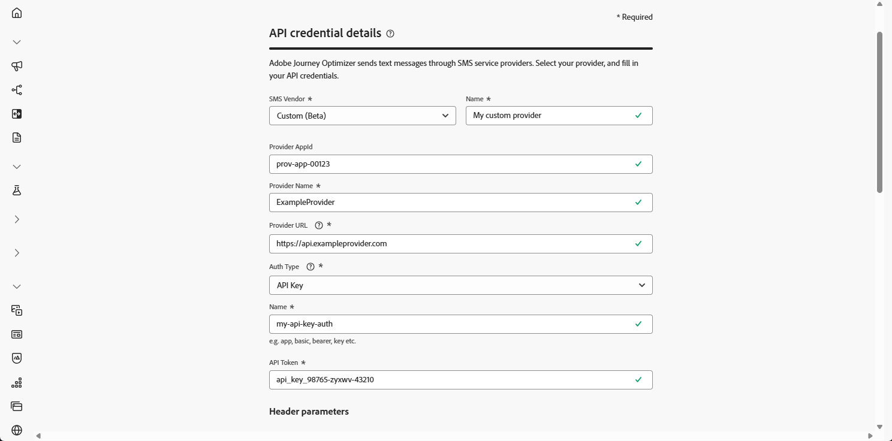
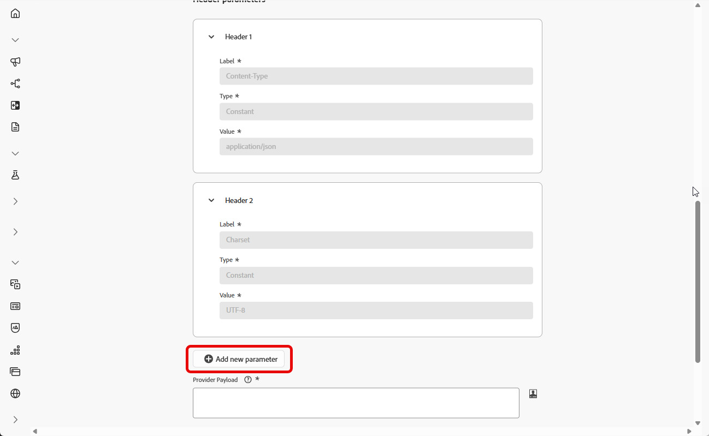
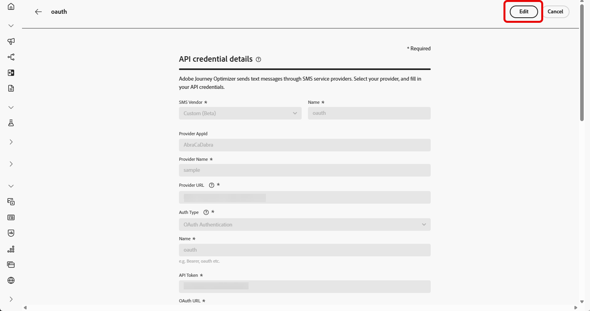
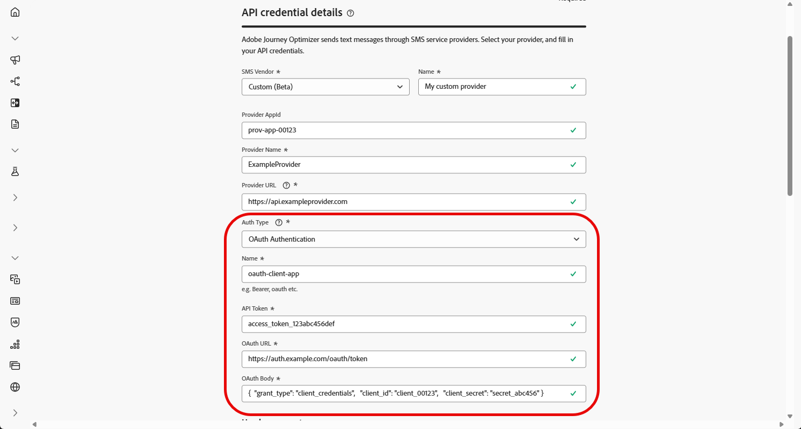

# Konfigurieren eines benutzerdefinierten Anbieters {#sms-configuration-custom}

>[!BEGINSHADEBOX]

**Auf dieser Seite** Erfahren Sie, wie Sie einen benutzerdefinierten Messaging-Anbieter in Adobe Journey Optimizer integrieren können, indem Sie API-Anmeldeinformationen erstellen, eine Authentifizierungsmethode auswählen und Kopfzeilen, Payloads und eingehende Einstellungen konfigurieren, um SMS- und RCS-Nachrichten zu senden.

>[!ENDSHADEBOX]

>[!CONTEXTUALHELP]
>id="ajo_admin_sms_api_byop_provider_url"
>title="Anbieter-URL"
>abstract="Geben Sie die URL des externen APIs an, zu dem eine Verbindung hergestellt werden soll. Diese URL dient als Endpunkt für den Zugriff auf die API-Funktionen."

>[!CONTEXTUALHELP]
>id="ajo_admin_sms_api_byop_header_parameters"
>title="Header-Parameter"
>abstract="Geben Sie Label, Typ und Wert zusätzlicher Header an, um eine ordnungsgemäße Authentifizierung, Inhaltsformatierung und effektive API-Kommunikation zu ermöglichen. "

>[!CONTEXTUALHELP]
>id="ajo_admin_sms_api_byop_provider_payload"
>title="Anbieter-Payload"
>abstract="Geben Sie die Anfrage-Payload an, um sicherzustellen, dass die richtigen Daten zur Verarbeitung und Antworterstellung gesendet werden."

>[!CONTEXTUALHELP]
>id="ajo_admin_sms_api_byop_response_msg_id_extractor"
>title="Anbieter-Payload"
>abstract="Gibt an, wie Journey Optimizer eine eindeutige Nachrichten-ID aus der Versandantwort Ihres Anbieters extrahiert.  Feldübereinstimmung: Geben Sie den Feldnamen ein (z. B. „messageId“). AJO durchsucht die Antwort und gibt den ersten übereinstimmenden Wert zurück.  Punktnotation: Geben Sie den Pfad zum Feld ein (z. B. „messages.0.id“). Verwenden Sie numerische Segmente für Arrays. Kein $-Präfix.  Lassen Sie das Feld leer, wenn Ihr Anbieter stattdessen die Übergabe eines Callback-Datenfelds unterstützt."

Diese Funktion ermöglicht es Ihnen, Ihre eigenen Messaging-Anbieter zu integrieren und zu konfigurieren, und bietet Flexibilität über die Standardanbieter (Sinch, Twilio und Infobip) hinaus. Dies ermöglicht die nahtlose Erstellung, Bereitstellung, Berichterstellung und Einverständnisverwaltung für mobile Nachrichten.

Über die Konfiguration benutzerdefinierter Anbieter können Sie Messaging-Services von Drittanbietern direkt in Journey Optimizer verbinden, Nachrichten-Payloads für dynamische Inhalte anpassen und Opt-in-/Opt-out-Voreinstellungen verwalten, um Compliance über SMS- und RCS-Kanäle hinweg sicherzustellen.

Gehen Sie wie folgt vor, um Ihren benutzerdefinierten Anbieter zu konfigurieren:

1. [Erstellen von API-Anmeldedaten](#api-credential)
1. [Erstellen eines Webhook](mobile-webhook.md)
1. [Erstellen einer Kanalkonfiguration](mobile-configuration-surface.md)
1. [Erstellen einer Journey oder Kampagne mit der SMS-Kanalaktion](create-mobile-message.md)

## Erstellen von API-Anmeldedaten {#api-credential}

>[!CONTEXTUALHELP]
>id="ajo_admin_sms_api_byop_channel_type"
>title="Kanaltyp"
>abstract="Optional. Klassifizieren Sie Nachrichten, die mit diesen benutzerdefinierten SMS-Provider-Anmeldedaten gesendet werden, z. B. SMS oder RCS. Journey Optimizer schreibt den Wert in XDM-Erlebnisereignisse, damit Sie einen Bericht erstellen und den Versand nach Kanal verfolgen können."

>[!CONTEXTUALHELP]
>id="ajo_admin_sms_webhook_require_auth"
>title="Authentifizierung"
>abstract="Wenn diese Option aktiviert ist, werden nur über Adobe IMS authentifizierte Anfragen akzeptiert. Aufrufer müssen ein gültiges OAuth-Token enthalten, wenn sie Daten an diesen Endpunkt senden."

Gehen Sie wie folgt vor, um eine Nachricht in Journey Optimizer mit einem benutzerdefinierten Provider zu senden, der von Adobe vorkonfiguriert nicht verfügbar ist (z. B. Sinch, Infobip, Twilio):

1. Navigieren Sie in der linken Leiste zu **[!UICONTROL Administration]** `>` **[!UICONTROL Kanäle]**, wählen Sie das Menü **[!UICONTROL API-Anmeldedaten]** unter **[!UICONTROL SMS-Einstellungen]** aus und klicken Sie auf die Schaltfläche **[!UICONTROL Neue API-Anmeldedaten erstellen]**.

   

1. Konfigurieren Sie Ihre SMS-API-Anmeldedaten wie unten beschrieben:

   * **[!UICONTROL SMS-Anbieter]**: Benutzerdefiniert.

   * **[!UICONTROL Name]**: Geben Sie einen Namen für Ihre API-Anmeldedaten ein.

   * **[!UICONTROL Anbieter-App-ID]**: Geben Sie die von Ihrem SMS-Anbieter bereitgestellte Anwendungs-ID ein.

   * **[!UICONTROL Anbietername]**: Geben Sie den Namen Ihres SMS-Anbieters ein.

   * **[!UICONTROL Anbieter-URL]**: Geben Sie die URL Ihres SMS-Anbieters ein.

   * **[!UICONTROL Kanaltyp]**: Optional. Geben Sie an, für welchen mobilen Kanal diese Anmeldedaten stehen, d. h. SMS, RCS oder MMS.

   * **[!UICONTROL Authentifizierungstyp]**: Wählen Sie Ihren Autorisierungstyp aus und [füllen Sie die entsprechenden Felder](#auth-options) je nach der ausgewählten Authentifizierungsmethode aus.

     

1. Aktivieren Sie die Option **[!UICONTROL mTLS-Unterstützung]**, um sicherzustellen, dass sich sowohl der Client als auch der Server gegenseitig authentifizieren, bevor eine sichere Verbindung hergestellt wird.

   Um nur mTLS zu verwenden, wählen Sie die Option **[!UICONTROL Keine Authentifizierung]** aus der Dropdown-Liste **[!UICONTROL Authentifizierungstyp]** aus und aktivieren Sie dann die **[!UICONTROL mTLS-Unterstützung]**.

   Beachten Sie, dass TLS nur für den SMS-Provider-Endpunkt (Nachrichtenversand) gilt. Der OAuth-Token-Endpunkt darf keine TLS verwenden. Stellen Sie vor dem Testen sicher, dass mTLS für den Token-Endpunkt deaktiviert ist.

   >[!IMPORTANT]
   >
   >Konfigurieren Sie den SMS-Sendeendpunkt so, dass er der Adobe Experience Platform-Zertifikatskette vertraut, indem Sie das öffentliche Zertifikat von der [MTLS Public Certificate API](https://experienceleague.adobe.com/de/docs/experience-platform/data-governance/mtls-api/public-certificate-endpoint) herunterladen und dem Server-Trust Store hinzufügen (erwartete Client-KN: `ajo-sms.aep-mtls.adobe.com`). Andernfalls lässt Journey Optimizer das Client-Zertifikat aus und die SMS-Bereitstellung schlägt fehl.

1. Klicken Sie im Abschnitt **[!UICONTROL Header]** auf **[!UICONTROL Neuen Parameter hinzufügen]**, um die HTTP-Header der Anfragenachricht anzugeben, die an den externen Service gesendet werden soll.

   Die Header-Felder **Inhaltstyp** und **Charset** werden standardmäßig festgelegt und können nicht gelöscht werden.

   

1. Fügen Sie Ihre **[!UICONTROL Anbieter-Payload]** hinzu, um Ihre Anfrage-Payloads zu validieren und anzupassen.

   Bei RCS-Nachrichten wird diese Payload später beim [Gestalten des Inhalts](create-mobile-message.md#sms-content) verwendet.

   >[!NOTE]
   >
   >Beim Konfigurieren eines benutzerdefinierten SMS-Anbieters mit einfacher oder Bearer-Authentifizierung müssen Sie den `authOption`-Parameter in die JSON-Payload einbeziehen. Außerdem muss die **Anbieter-Payload** auf die Vorlagenvariablen `{{fromNumber}}`, `{{toNumber}}` und `{{message}}` verweisen.

1. Wählen Sie **[!UICONTROL Benutzerdefinierten Datensatz für eingehende]** verwenden) aus, um die eingehenden SMS dieser Berechtigung an einen vorab erstellten Datensatz weiterzuleiten, den Sie aus der Dropdown-Liste auswählen. [Erfahren Sie mehr über die Verwendung eines benutzerdefinierten Datensatzes für eingehende Keywords](custom-dataset-inbound-keywords.md)

   >[!NOTE]
   >
   >Das Datensatzschema muss **[!UICONTROL XDM ExperienceEvent]** sein und mindestens die folgenden Feldergruppen enthalten:
   >* Adobe CJM ExperienceEvent - Details zur Nachrichteninteraktion
   >* Adobe CJM ExperienceEvent - Details zur Nachrichtenausführung
   >* Adobe CJM ExperienceEvent - Details zum Nachrichtenprofil
   >
   >Das Schema und der Datensatz müssen für das Profil aktiviert sein.

1. Wenn Sie die Konfiguration Ihrer API-Anmeldedaten abgeschlossen haben, klicken Sie auf **[!UICONTROL Senden]**.

1. Klicken Sie im Menü **[!UICONTROL API-Anmeldedaten]** auf den , um Ihre API-Anmeldedaten zu löschen.

   

1. Um vorhandene Anmeldedaten zu ändern, suchen Sie die gewünschten API-Anmeldedaten und klicken Sie auf die Option **[!UICONTROL Bearbeiten]**, um die erforderlichen Änderungen vorzunehmen.

   

1. Klicken Sie anhand Ihrer bestehenden API-Anmeldedaten auf **[!UICONTROL SMS-Verbindung überprüfen]**, um Ihre SMS-API-Anmeldedaten zu testen und zu überprüfen, indem Sie eine Beispielnachricht an ein bestimmtes Gerät senden.

1. Füllen Sie die Felder **Anzahl** und **Nachricht** aus und klicken Sie auf **[!UICONTROL Verbindung überprüfen]**.

   >[!IMPORTANT]
   >
   >Die Nachricht muss so strukturiert sein, dass sie mit dem Payload-Format des Anbieters übereinstimmt.

   

Nachdem Sie Ihre API-Anmeldedaten erstellt und konfiguriert haben, müssen Sie jetzt [die eingehenden Webhook-Einstellungen](#webhook) für SMS-Nachrichten erstellen.

### Authentifizierungsoptionen für benutzerdefinierte SMS-Anbieter {#auth-options}

>[!CONTEXTUALHELP]
>id="ajo_admin_sms_api_byop_auth_type"
>title="Authentifizierungstyp"
>abstract="Geben Sie die Authentifizierungsmethode an, die für den Zugriff auf das API erforderlich ist. Dadurch wird eine sichere und autorisierte Kommunikation mit dem externen Dienst sichergestellt."

>[!BEGINTABS]

>[!TAB API-Schlüssel]

Nachdem Sie Ihre API-Anmeldedaten erstellt haben, füllen Sie die Felder aus, die für die API-Schlüsselauthentifizierung erforderlich sind:

* **[!UICONTROL Name]**: Geben Sie einen Namen für Ihre API-Schlüsselkonfiguration ein.
* **[!UICONTROL API-Token]**: Geben Sie das von Ihrem SMS-Anbieter bereitgestellte API-Token ein.

>[!TAB MAC-Authentifizierung]

Nachdem Sie Ihre API-Anmeldedaten erstellt haben, füllen Sie die Felder aus, die für die MAC-Authentifizierung erforderlich sind:

* **[!UICONTROL Name]**: Geben Sie einen Namen für Ihre MAC-Authentifizierungskonfiguration ein.
* **[!UICONTROL API-Token]**: Geben Sie das von Ihrem SMS-Anbieter bereitgestellte API-Token ein.
* **[!UICONTROL API-Geheimschlüssel]**: Geben Sie den von Ihrem SMS-Anbieter bereitgestellten API-Geheimschlüssel ein. Dieser Schlüssel wird verwendet, um den MAC (Nachrichtenauthentifizierungs-Code) für eine sichere Kommunikation zu generieren.
* **[!UICONTROL Hash-Format für Mac-Autorisierung]**: Wählen Sie das Hash-Format für die MAC-Authentifizierung.

>[!TAB OAuth 2-Authentifizierung]

Nachdem Sie Ihre API-Anmeldedaten erstellt haben, füllen Sie die Felder aus, die für die OAuth-Authentifizierung erforderlich sind:

* **[!UICONTROL Name]**: Geben Sie einen Namen für Ihre OAuth-Authentifizierungskonfiguration ein.

* **[!UICONTROL API-Token]**: Geben Sie das von Ihrem SMS-Anbieter bereitgestellte API-Token ein.

* **[!UICONTROL OAuth-URL]**: Geben Sie die URL zum Abrufen des OAuth-Tokens ein.

* **[!UICONTROL OAuth-Text]**: Stellen Sie den OAuth-Anfragetext im JSON-Format bereit, einschließlich Parametern wie `grant_type`, `client_id` und `client_secret`.

Journey Optimizer aktualisiert OAuth-Token dynamisch nach Ablauf des benutzerdefinierten SMS-Connectors.

>[!TAB JWT-Authentifizierung]

Nachdem Sie Ihre API-Anmeldedaten erstellt haben, füllen Sie die Felder aus, die für die JWT-Authentifizierung erforderlich sind:

* **[!UICONTROL Name]**: Geben Sie einen Namen für Ihre JWT-Authentifizierungskonfiguration ein.

* **[!UICONTROL API-Token]**: Geben Sie das von Ihrem SMS-Anbieter bereitgestellte API-Token ein.

* **[!UICONTROL JWT-Payload]**: Geben Sie die JSON-Payload ein, die die für das JWT erforderlichen Ansprüche enthält, z. B. Aussteller, Betreff, Zielgruppe und Gültigkeit.

>[!ENDTABS]

## Anleitungsvideo {#video}

>[!VIDEO](https://video.tv.adobe.com/v/3431625)

