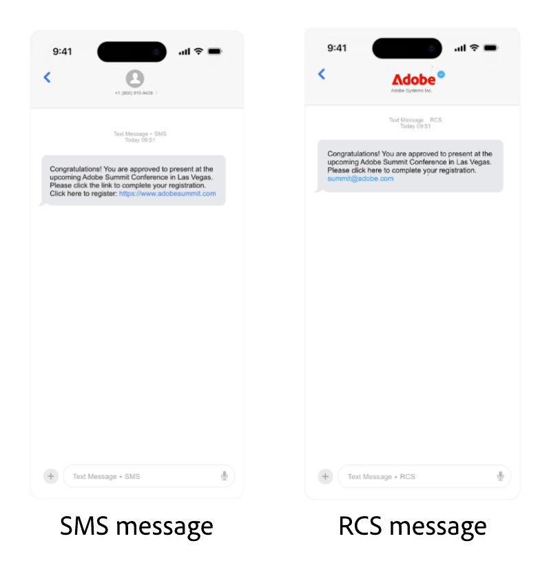

# Konfigurieren des Sinch-Anbieters {#sms-configuration-sinch}

Wenn Sie den Sinch-Anbieter mit Journey Optimizer verwenden, können Sie zwischen drei verschiedenen Optionen wählen:

* **SMS-Konfiguration**: Richten Sie Ihre Sinch-API-Anmeldedaten ein, um nahtlos SMS-Nachrichten zu versenden.

* **MMS-Konfiguration**: Konfigurieren Sie für Multimedia Messaging (MMS) Ihre Sinch-MMS-API-Anmeldedaten. Beachten Sie, dass das Tracking und Beantworten von eingehenden Nachrichten über die SMS-Konfiguration erfolgt. Die MMS-Einrichtung ist nur für den ausgehenden Versand der MMS-Nachricht vorgesehen.

* **RCS-Konfiguration**: Richten Sie Ihre Sinch-API-Anmeldedaten ein, um nahtlos RCS-Nachrichten zu versenden.

Gehen Sie wie folgt vor, um Ihren Sinch-Provider zu konfigurieren:

1. [Erstellen von API-Anmeldedaten](#create-api)
1. [Erstellen eines Webhook](mobile-webhook.md)
1. [Erstellen einer Kanalkonfiguration](mobile-configuration-surface.md)
1. [Erstellen einer Journey oder Kampagne mit der SMS-Kanalaktion](create-mobile-message.md)

## Konfigurieren von API-Anmeldedaten für SMS{#create-api}

Gehen Sie wie folgt vor, um Ihren Sinch-Anbieter zum Senden von SMS-Nachrichten und MMS in Journey Optimizer zu konfigurieren:

1. Navigieren Sie in der linken Leiste zu **[!UICONTROL Administration]** > **[!UICONTROL Kanäle]** `>` **[!UICONTROL SMS-Einstellungen]** und wählen Sie das Menü **[!UICONTROL API-Anmeldedaten]**. Klicken Sie auf die Schaltfläche **[!UICONTROL Neue API-Anmeldedaten erstellen]**.

1. Konfigurieren Sie Ihre SMS-API-Anmeldedaten wie unten beschrieben:

   +++ Liste der SMS-Anmeldedaten für die Konfiguration

   | Konfigurationsfelder | Beschreibung |
   |---|---|
   | SMS-Anbieter | Sinch |
   | Name | Wählen Sie einen Namen für Ihre API-Anmeldedaten. |
   | Service-ID und API-Token | Rufen Sie die API-Seite auf. Sie finden Ihre Anmeldedaten auf der Registerkarte „SMS“. Weitere Informationen finden Sie in der [Sinch-Dokumentation](https://developers.sinch.com/docs/sms/getting-started/){target="_blank"}. |
   | Eingehende Nummer | Fügen Sie Ihre eindeutige eingehende Nummer oder Ihren eindeutigen Kurz-Code hinzu. Auf diese Weise können Sie dieselben API-Anmeldedaten für verschiedene Sandboxes verwenden, von denen jede über eine eigene eingehende Zahl oder einen eigenen Kurz-Code verfügt. |
   | Überschreibungs-URL | Geben Sie Ihre benutzerdefinierte URL ein, um die Standard-Endpunkte für SMS-Versandberichte, Feedback-Daten, eingehende Nachrichten oder Ereignisbenachrichtigungen zu ersetzen. Sinch sendet alle relevanten Aktualisierungen an diese URL anstelle der vordefinierten. |

   +++

<!--
1. Choose how user consent should be tracked for messaging:

    * **[!UICONTROL Sender short code]**: Inbound keyword consent is keyed to your **sender short code** only. Use when one inbound number is enough to represent consent.

    * **[!UICONTROL Sender short code + profile number]**: Consent is keyed to the **sender short code** and the profile **mobile number**. Use when profiles can have several numbers, or when opt-in/out must apply per sender and recipient pair.
-->

1. Wählen Sie **[!UICONTROL Benutzerdefinierten Datensatz für eingehende]** verwenden) aus, um die eingehenden SMS dieser Berechtigung an einen vorab erstellten Datensatz weiterzuleiten, den Sie aus der Dropdown-Liste auswählen. [Erfahren Sie mehr über die Verwendung eines benutzerdefinierten Datensatzes für eingehende Keywords](../mobile/custom-dataset-inbound-keywords.md)

   >[!NOTE]
   >
   >Das Datensatzschema muss **[!UICONTROL XDM ExperienceEvent]** sein und mindestens die folgenden Feldergruppen enthalten:
   >* Adobe CJM ExperienceEvent - Details zur Nachrichteninteraktion
   >* Adobe CJM ExperienceEvent - Details zur Nachrichtenausführung
   >* Adobe CJM ExperienceEvent - Details zum Nachrichtenprofil
   >
   >Das Schema und der Datensatz müssen für das Profil aktiviert sein.

1. Wenn Sie die Konfiguration Ihrer API-Anmeldedaten abgeschlossen haben, klicken Sie auf **[!UICONTROL Senden]**.

1. Klicken Sie im Menü **[!UICONTROL API-Anmeldedaten]** auf das Papierkorbsymbol, um Ihre API-Anmeldedaten zu löschen.

1. Um vorhandene Anmeldedaten zu ändern, suchen Sie die gewünschten API-Anmeldedaten und klicken Sie auf die Option **[!UICONTROL Bearbeiten]**, um die erforderlichen Änderungen vorzunehmen.

1. Klicken Sie anhand Ihrer bestehenden API-Anmeldedaten auf **[!UICONTROL SMS-Verbindung überprüfen]**, um Ihre SMS-API-Anmeldedaten zu testen und zu überprüfen, indem Sie eine Beispielnachricht an ein bestimmtes Gerät senden.

1. Füllen Sie die Felder **Anzahl** und **Nachricht** aus und klicken Sie auf **[!UICONTROL Verbindung überprüfen]**.

   >[!IMPORTANT]
   >
   >Die Nachricht muss so strukturiert sein, dass sie mit dem Payload-Format des Anbieters übereinstimmt.

   

Nachdem Sie Ihre API-Anmeldedaten erstellt und konfiguriert haben, müssen Sie jetzt [Ihren Webhook](mobile-webhook.md) und eine Kanalkonfiguration für Ihre RCS-Nachrichten erstellen. [Weitere Informationen](mobile-configuration-surface.md)

## Konfigurieren von API-Anmeldedaten für MMS{#sinch-mms}

>[!IMPORTANT]
>
> Neben der MMS-Einrichtung müssen Sie auch Sinch-API-Anmeldedaten speziell für das Tracking eingehender Nachrichten und die Verwaltung von Zustimmungsanfragen erstellen.

Gehen Sie wie folgt vor, um Sinch MMS mit Journey Optimizer für das Senden von MMS zu konfigurieren:

1. Navigieren Sie in der linken Leiste zu **[!UICONTROL Administration]** > **[!UICONTROL Kanäle]** `>` **[!UICONTROL SMS-Einstellungen]** und wählen Sie das Menü **[!UICONTROL API-Anmeldedaten]**. Klicken Sie auf die Schaltfläche **[!UICONTROL Neue API-Anmeldedaten erstellen]**.

1. Konfigurieren Sie Ihre MMS-API-Anmeldedaten, wie unten beschrieben.

   * **[!UICONTROL SMS-Anbieter]**: Sinch MMS.

   * **[!UICONTROL Name]**: Geben Sie einen Namen für Ihre API-Anmeldeinformationen ein.

   * **[!UICONTROL Projekt-ID]**, **[!UICONTROL App-ID]** und **[!UICONTROL API-Token]**: Führen Sie die folgenden Schritte aus, um Ihre MMS-API-Anmeldeinformationen zu erfassen.

      * Für **[!UICONTROL Projekt-ID]** und **[!UICONTROL App-ID]**: Greifen Sie auf die Seite [Überblick über die Konversations-API](https://dashboard.sinch.com/convapi/overview) Ihres Sinch-Projekts in Ihrem Sinch-Dashboard zu.
      * Für **[!UICONTROL API-Token]**: Rufen Sie die [Zugriffsschlüssel](https://community.sinch.com/t5/Customer-Dashboard/Sinch-Access-Keys/ta-p/12638) für Ihr Sinch-Pojekt auf und generieren Sie einen **Base64-API-Token** aus den **Zugriffsschlüsseln** Ihres Sinch-Projekts.

1. Wenn Sie die Konfiguration Ihrer API-Anmeldedaten abgeschlossen haben, klicken Sie auf **[!UICONTROL Senden]**.

1. Klicken Sie im Menü **[!UICONTROL API-Anmeldedaten]** auf das Papierkorbsymbol, um Ihre API-Anmeldedaten zu löschen.

1. Um vorhandene Anmeldedaten zu ändern, suchen Sie die gewünschten API-Anmeldedaten und klicken Sie auf die Option **[!UICONTROL Bearbeiten]**, um die erforderlichen Änderungen vorzunehmen.

Nachdem Sie Ihre API-Anmeldedaten erstellt und konfiguriert haben, müssen Sie jetzt [Ihren Webhook](mobile-webhook.md) und eine Kanalkonfiguration für Ihre RCS-Nachrichten erstellen. [Weitere Informationen](mobile-configuration-surface.md)

## Konfigurieren der API-Anmeldedaten für RCS

<!---->

RCS-Messaging (Rich Communication Services) wird in Journey Optimizer über Sinch unterstützt und ermöglicht den Versand von einfachen Nachrichten unter Verwendung verifizierter Geschäftsprofile mit Branding-Elementen wie Logos und Absendenamen.

Für das native RCS-Authoring ist Sinch RCS erforderlich. Twilio, Infobip und andere Anbieter müssen eine [benutzerdefinierte Anbieterintegration“ ](mobile-configuration-custom.md).

Beachten Sie, dass Nachrichten automatisch über SMS gesendet werden, wenn das Gerät des Profils RCS nicht unterstützt oder über RCS vorübergehend unerreichbar ist.

Gehen Sie wie folgt vor, um Sinch RCS für das Senden von RCS mit Journey Optimizer zu konfigurieren:

1. Navigieren Sie in der linken Leiste zu **[!UICONTROL Administration]** > **[!UICONTROL Kanäle]** `>` **[!UICONTROL SMS-Einstellungen]** und wählen Sie das Menü **[!UICONTROL API-Anmeldedaten]**. Klicken Sie auf die Schaltfläche **[!UICONTROL Neue API-Anmeldedaten erstellen]**.

1. Konfigurieren Sie Ihre RCS API-Anmeldedaten wie unten beschrieben:

   * **[!UICONTROL SMS-Anbieter]**: Sinch RCS.

   * **[!UICONTROL Name]**: Geben Sie einen Namen für Ihre API-Anmeldeinformationen ein.

   * **[!UICONTROL Projekt-ID]**, **[!UICONTROL App-ID]** und **[!UICONTROL API-Token]**: Geben Sie die Projekt-ID, die App-ID und das API-Token aus Ihrem Sinch RCS-Konto ein.

   * **[!UICONTROL Serviceplan-ID]**: Geben Sie die Serviceplan-ID ein, die mit Ihrem Sinch-Konto verknüpft ist.

   * **[!UICONTROL SMS-API-Token]**: Geben Sie das SMS-API-Token aus Ihrem Sinch-Konto ein.

   

1. Optional können Sie die Option **[!UICONTROL Benutzerdefinierten Datensatz für eingehende]** verwenden) aktivieren, um eingehende RCS-Nachrichten in einem benutzerdefinierten Datensatz zu speichern. [Weitere Informationen](../mobile/custom-dataset-inbound-keywords.md)

1. Legen Sie das **[!UICONTROL API-Ratenlimit (Anfragen pro Sekunde)]** fest, um die maximale Anzahl von API-Aufrufen pro Sekunde zu begrenzen, verwenden Sie den empfohlenen Wert Ihres Anbieters, um Einschränkungen zu vermeiden, oder belassen Sie ihn bei 0 für unbegrenzte Anfragen.

1. Wenn Sie die Konfiguration Ihrer API-Anmeldedaten abgeschlossen haben, klicken Sie auf **[!UICONTROL Senden]**.

1. Klicken Sie im Menü **[!UICONTROL API-Anmeldedaten]** auf das Papierkorbsymbol, um Ihre API-Anmeldedaten zu löschen.

1. Um vorhandene Anmeldedaten zu ändern, suchen Sie die gewünschten API-Anmeldedaten und klicken Sie auf die Option **[!UICONTROL Bearbeiten]**, um die erforderlichen Änderungen vorzunehmen.

Nachdem Sie Ihre API-Anmeldedaten erstellt und konfiguriert haben, müssen Sie jetzt [Ihren Webhook](mobile-webhook.md) und eine Kanalkonfiguration für Ihre RCS-Nachrichten erstellen. [Weitere Informationen](mobile-configuration-surface.md)

<!--
### Basic RCS Messages

>[!AVAILABILITY]
>
> Basic RCS messages is only available upon Adobe RCS add-on offering.

1. **Set up your branded RCS agent**

    Create a branded RCS agent in the Sinch Dashboard. [Learn more on branded RCS agent](https://community.sinch.com/t5/RCS/Getting-Started-with-RCS-using-Conversation-API/ta-p/17844)

1. **Set up your [Custom API credentials](mobile-configuration-custom.md)**
    
    Once your RCS agent is approved, you need to set up your Sinch API credentials, which include your access key, secret, and service plan ID. These credentials will be used by Journey Optimizer to authenticate and send messages through Sinch's platform.

1. **Create a [channel configuration](mobile-configuration-surface.md) for your RCS messages**

    Configure a channel surface in Journey Optimizer by linking your Sinch credentials and defining the messaging parameters. This setup enables you to compose and send RCS messages from Journey Optimizer.

1. **Create and personalize your [SMS message](../mobile/create-mobile-message.md)**

    Your messages automatically falls back to SMS when the profile's device does not support RCS or is temporarily unreachable via RCS.
-->

