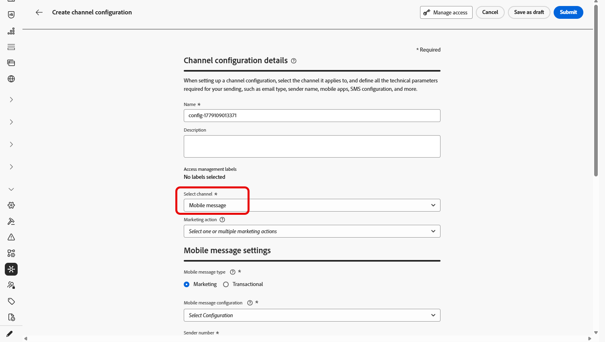
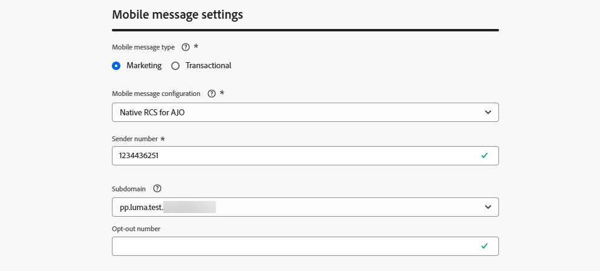
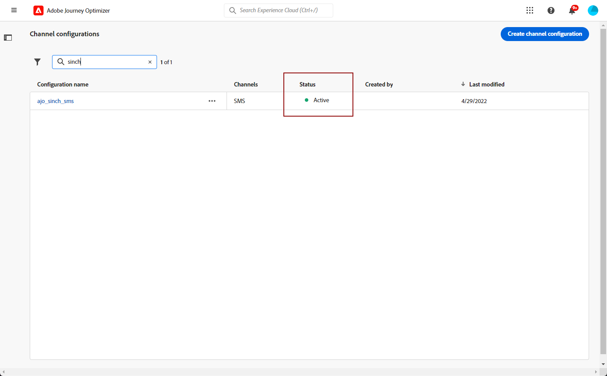

# Erstellen einer Mobilnachrichtenkonfiguration {#message-preset-sms}

>[!BEGINSHADEBOX]

**Auf dieser Seite** Erfahren Sie, wie Sie eine Mobile-Message-Channel-Konfiguration in Adobe Journey Optimizer erstellen, indem Sie die Felder Nachrichtentyp, Mobile-Konfiguration, Absendernummer, Subdomain und Ausführung festlegen, um SMS-, RCS- und MMS-Nachrichten zu senden.

>[!ENDSHADEBOX]

>[!CONTEXTUALHELP]
>id="ajo_admin_surface_sms_type"
>title="Bestimmen der Nachrichtenkategorie"
>abstract="Wählen Sie über diese Konfiguration die Art der Mobilnachrichten aus: Marketing für Werbenachrichten, die die Zustimmung der Benutzenden erfordern, oder Transaktionsnachrichten für nicht-kommerzielle Nachrichten, wie z. B. das Zurücksetzen eines Passworts."
>additional-url="https://experienceleague.adobe.com/docs/journey-optimizer/using/privacy/consent/opt-out.html?lang=de#sms-opt-out-management" text="Abmeldung von Marketing-Mobilnachrichten"

Nachdem der Mobile-Nachrichtenkanal konfiguriert wurde, müssen Sie eine Kanalkonfiguration erstellen, um SMS-, RCS- und MMS-Nachrichten von **[!DNL Journey Optimizer]** aus senden zu können.

Gehen Sie wie folgt vor, um eine Kanalkonfiguration zu erstellen:

1. Navigieren Sie in der linken Leiste zu **[!UICONTROL Administration]** > **[!UICONTROL Kanäle]** und wählen Sie **[!UICONTROL Allgemeine Einstellungen]** > **[!UICONTROL Kanalkonfigurationen]**. Klicken Sie auf die Schaltfläche **[!UICONTROL Kanalkonfiguration erstellen]**.

   

1. Geben Sie einen Namen und eine Beschreibung (optional) für die Konfiguration ein und wählen Sie dann den Mobile-Kanal aus.

   

   >[!NOTE]
   >
   > Namen müssen mit einem Buchstaben (A–Z) beginnen. Ein Name darf nur alphanumerische Zeichen enthalten. Sie können auch die Zeichen Unterstrich `_`, Punkt `.` und Bindestrich `-` verwenden.

1. Wählen Sie den **[!UICONTROL SMS-Typ]** für diese Konfiguration aus:

   * **[!UICONTROL Marketing]**: für Werbenachrichten, für die das Einverständnis des Benutzers erforderlich ist.
   * **[!UICONTROL Transaktion]**: für nicht-kommerzielle Nachrichten wie Bestellbestätigungen, Zurücksetzen des Kennworts oder Versandaktualisierungen.

   >[!CAUTION]
   >
   >**Transaktions**-Nachrichten können an Profile gesendet werden, die sich von Marketing-Nachrichten abgemeldet haben, jedoch nur in bestimmten Kontexten.

   {width=80%}

1. Wählen Sie die **[!UICONTROL Mobile-Konfiguration]** aus, um sie mit der Konfiguration zu verknüpfen.

   Weiterführende Informationen zur Konfiguration Ihrer Umgebung für den Versand von Nachrichten an Mobilgeräte finden Sie [diesem Abschnitt](#create-api).

1. Geben Sie die **[!UICONTROL Absendernummer]** ein, die Sie für Ihre Sendungen verwenden möchten.

1. Wenn Sie die URL-Verkürzungsfunktion in Ihren Mobile-Nachrichten verwenden möchten, wählen Sie ein Element aus der Liste **[!UICONTROL Subdomain]** aus.

   >[!NOTE]
   >
   >Um eine Subdomain auswählen zu können, müssen Sie zuvor mindestens eine SMS/RCS/MMS-Subdomain konfiguriert haben. [Weitere Informationen](mobile-subdomains.md)

1. Verwenden Sie im Abschnitt **[!UICONTROL Ausführungsdimension]** das Feld **[!UICONTROL SMS-Ausführung]**, um unter den Profilattributen die Telefonnummer auszuwählen, die Sie vorrangig verwenden möchten, wenn mehrere Zahlen in der Datenbank verfügbar sind. [Weitere Informationen](../configuration/primary-email-addresses.md#override-execution-address-channel-config)

   >[!NOTE]
   >
   >Standardmäßig verwendet [!DNL Journey Optimizer] die in den [allgemeinen Einstellungen](../configuration/primary-email-addresses.md) der Sandbox-Ebene angegebene Telefonnummer. Durch die Aktualisierung dieses Felds wird der Standardwert für die Journeys und Kampagnen überschrieben, die diese Konfiguration verwenden.

1. Wählen Sie **[!UICONTROL Benutzerdefinierten Datensatz für eingehende]** verwenden) aus, um die eingehenden SMS dieser Berechtigung an einen vorab erstellten Datensatz weiterzuleiten, den Sie aus der Dropdown-Liste auswählen. [Erfahren Sie mehr über die Verwendung eines benutzerdefinierten Datensatzes für eingehende Keywords](custom-dataset-inbound-keywords.md)

   >[!NOTE]
   >
   >Das Datensatzschema muss **[!UICONTROL XDM ExperienceEvent]** sein und mindestens die folgenden Feldergruppen enthalten:
   >* Adobe CJM ExperienceEvent - Details zur Nachrichteninteraktion
   >* Adobe CJM ExperienceEvent - Details zur Nachrichtenausführung
   >* Adobe CJM ExperienceEvent - Details zum Nachrichtenprofil
   >
   >Das Schema und der Datensatz müssen für das Profil aktiviert sein.

1. Nachdem alle Parameter konfiguriert wurden, klicken Sie zur Bestätigung auf **[!UICONTROL Senden]**. Sie können die Kanalkonfiguration auch als Entwurf speichern und ihre Konfiguration später fortsetzen.

   

1. Nachdem die Kanalkonfiguration erstellt wurde, wird sie in der Liste mit dem Status **[!UICONTROL Verarbeitung läuft]** angezeigt.

   >[!NOTE]
   >
   >In [diesem Abschnitt](../configuration/channel-surfaces.md) erfahren Sie mehr über die möglichen Fehlerursachen, wenn die Prüfungen nicht erfolgreich sind.

1. Sobald die Prüfungen erfolgreich abgeschlossen sind, erhält die Kanalkonfiguration den Status **[!UICONTROL Aktiv]**. Sie kann nun zum Versand von Nachrichten verwendet werden.

   

Sie können jetzt mit Journey Optimizer Mobile-Nachrichten senden.
