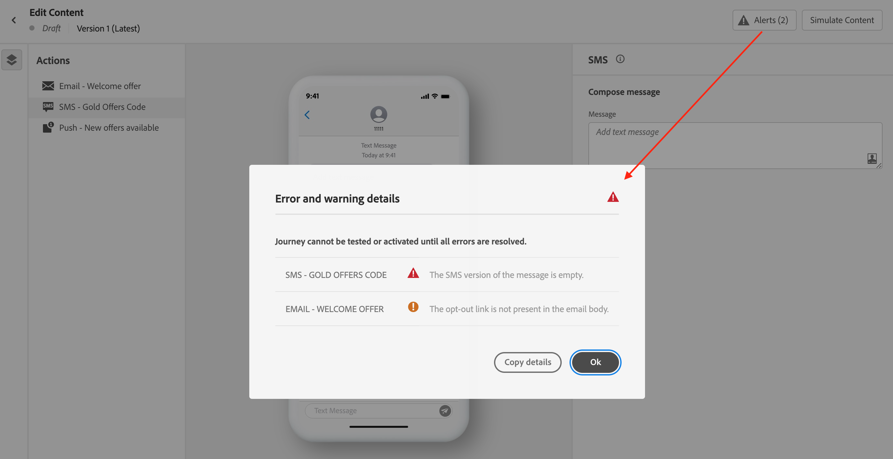

# Mobiltelefon-Nachricht überprüfen und senden {#send-sms}

## Mobile-Nachricht in der Vorschau anzeigen {#preview-sms}

Sobald der Nachrichteninhalt definiert wurde, können Sie mithilfe von Testprofilen oder Beispieleingabedaten (aus einer CSV- oder JSON-Datei hochgeladen oder manuell hinzugefügt) eine Vorschau des Inhalts anzeigen. Wenn Sie personalisierte Inhalte eingefügt haben, können Sie überprüfen, wie diese Inhalte in der Nachricht angezeigt werden.

Klicken Sie dazu auf **[!UICONTROL Inhalt simulieren]** und überprüfen Sie dann die Nachricht mithilfe der Testprofildaten.

Detaillierte Informationen zur Vorschau und zum Test des Inhalts finden Sie im Abschnitt [Content-Management](../content-management/preview-test.md).

### Zeichenkodierung und Beschränkungen {#sms-character-limits}

Beim Zugriff auf das Menü **[!UICONTROL Inhalt simulieren]** wird eine Zeichenanzahl angezeigt, um die Planung und Verwaltung Ihrer Mobile-Nachrichten zu unterstützen.

Journey Optimizer verwendet UTF-8-Kodierung im SMS-Editor, sodass Sie Doppel-Byte- oder Unicode-Zeichen eingeben oder einfügen können. Diese Zeichen werden dann zum Versand an den Dienstleister übermittelt. Die meisten SMS-Anbieter verwenden für Standardnachrichten eine GSM-7-Bit-Kodierung mit einer Beschränkung auf 160 Zeichen und wechseln zu UTF-16 (UCS-2), wenn Nicht-GSM-Zeichen erkannt werden. Dann gilt eine Beschränkung auf 70 Zeichen.

Beachten Sie, dass die Zeichenanzahl keine Varianten widerspiegelt, die durch dynamische Personalisierung oder Nicht-GSM-7-Bit-Sonderzeichen eingeführt wurden.

>[!IMPORTANT]
>
>Das Reporting zum Journey Optimizer-SMS-Versand berücksichtigt keine verketteten Nachrichten oder dynamische Personalisierung. Daher spiegelt es möglicherweise nicht die tatsächliche Anzahl der vom Anbieter gesendeten Nachrichten wider. Detaillierte Informationen zu Nutzung und Abrechnung erhalten Sie vom Adobe-Support.
>
>Best Practices zur Minimierung von hohen SMS-Rechnungen finden Sie unter [Best Practices für SMS zur Zeichenoptimierung](mobile-cost-optimization.md).

## Validieren Ihres Inhalts {#sms-validate}

>[!NOTE]
>
> Um die Zustellbarkeit zu verbessern, verwenden Sie die Telefonnummern in den vom Anbieter unterstützten Formaten. Beispielsweise unterstützen Twilio und Sinch nur Telefonnummern im E.164-Format.

Sie müssen die Warnmeldungen im oberen Bereich des Editors überprüfen. Einige davon sind einfache Warnungen, aber andere können Sie daran hindern, die Nachricht zu senden. Es gibt zwei Arten von Warnungen: Warnungen und Fehler.

* **Warnhinweise** geben Hinweise auf Empfehlungen und zeigen Best Practices. Beispielsweise wird eine Warnmeldung angezeigt, wenn Ihre Mobile-Nachricht leer ist oder wenn Zeichenbeschränkungen bei dynamischen Inhalten überschritten werden können.

  **Zeichenbeschränkungen:** 160 Zeichen pro Segment (GSM 7-Bit), 70 Zeichen für Unicode/Emojis, bis zu 1500 Zeichen insgesamt.

* **Fehler** hindern Sie daran, die Journey zu testen oder zu aktivieren oder die Kampagne zu veröffentlichen, bis sie behoben sind. Eine Fehlermeldung warnt Sie zum Beispiel, wenn die Betreffzeile fehlt.

Der Warnhinweis **Die maximale Zeichenanzahl für SMS-Text wurde überschritten“** kann auch dann angezeigt werden, wenn Ihre simulierte Nachricht kürzer ist, da die Validierung die **maximal mögliche Länge)** berechnet, indem alle bedingten Verzweigungen, Personalisierungsfelder und dynamischen Inhalte am längsten ausgewertet werden.

Bei der Validierung wird die maximale Länge für alle möglichen Profildaten berechnet, während bei der Simulation die tatsächliche Ausgabe für ein Testprofil angezeigt wird.

## Mobiltelefon-Nachrichten senden {#sms-send}

>[!IMPORTANT]
>
> Wenn für Ihre Kampagne eine Validierungsrichtlinie gilt, müssen Sie eine Validierung anfordern, um Ihre Mobile-Nachrichten senden zu können. [Weitere Informationen](../test-approve/gs-approval.md)

Wenn Ihre Mobile-Nachricht fertig ist, konfigurieren Sie Ihre [Journey](../building-journeys/journey-gs.md) oder [Kampagne](../campaigns/create-campaign.md), um sie zu versenden.

**Verwandte Themen**

* [Konfigurieren des SMS-Kanals](mobile-configuration.md)
* [SMS-/RCS-/MMS-Berichte](../reports/journey-global-report-cja-sms.md)
* [Erstellen einer Mobile-Nachricht](create-mobile-message.md)
* [Hinzufügen einer Nachricht zu einer Journey](../building-journeys/journey-action.md)
