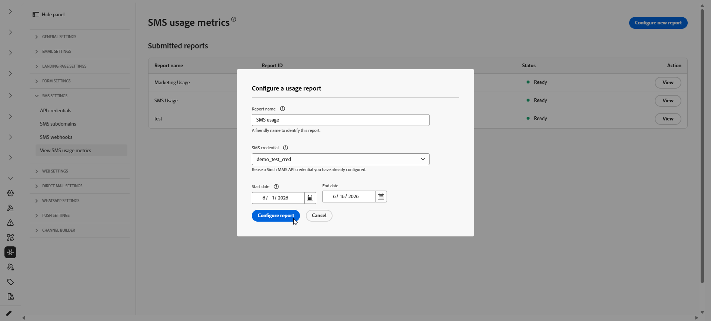

# Generieren eines SMS-Nutzungsberichts {#sms-usage-report}

>[!CONTEXTUALHELP]
>id="ajo_admin_sms_usage_metrics"
>title="SMS-Nutzungsmetriken"
>abstract="Generieren Sie SMS-Nutzungsberichte zur Abstimmung des Nachrichtenvolumens mit der Rechnungsstellung des Anbieters. In den Berichten werden die Zahlen der auf Mobilgeräten eingehenden (MT) und von Mobilgeräten ausgehenden (MO) Anrufe für jede Kurzwahlnummer oder Telefonnummer aufgeführt, aggregiert nach Tagen."

>[!BEGINSHADEBOX]

**Auf dieser Seite:** Generieren Sie SMS-Nutzungsberichte in Adobe Journey Optimizer, um die Anzahl der mit einem Mobilgerät beendeten (MT) und von einem Mobilgerät stammenden (MO) Konten mit der Rechnungsstellung des Anbieters abzustimmen, indem Sie eine Sinch MMS-API-Berechtigung und eine herunterladbare CSV-Ausgabe verwenden.

>[!ENDSHADEBOX]

SMS-Nutzungsmetriken sind verfügbar, wenn Sie SMS über Adobe Journey Optimizer erwerben. Berichte fassen den Sende- und Empfangs-Traffic nach Kurzwahlnummer oder Telefonnummer zusammengefasst nach Tag der letzten **90 Tage**.

Um Nutzungsmetriken anzuzeigen, muss ein Administrator:

1. [Erstellen einer Sinch-MMS-API](mobile-configuration-sinch.md#sinch-mms)Berechtigung, die nur zum Abrufen von Nutzungsdaten von Sinch verwendet wird.

   Für Nutzungsberichte ist eine API-Berechtigung erforderlich, wobei **[!UICONTROL SMS-Anbieter]** auf &quot;**MMS“**. Diese Berechtigung verbindet Journey Optimizer mit Sinch, damit Nutzungsdaten abgerufen werden können. Sie ist getrennt von den Sinch-Anmeldeinformationen, die zum Senden von SMS- oder MMS-Nachrichten verwendet werden, obwohl die Feldwerte aus demselben Sinch-Projekt stammen.

1. [Konfigurieren und Abrufen eines SMS-Nutzungsberichts](#configure-sms-usage-report).

Für diese Schritte ist die Berechtigung **[!UICONTROL SMS-Einstellungen verwalten]** erforderlich. [Erfahren Sie mehr über Berechtigungen](../administration/high-low-permissions.md#administration-permissions).

## Konfigurieren und Anzeigen von SMS-Nutzungsberichten {#configure-sms-usage-report}

>[!CONTEXTUALHELP]
>id="ajo_admin_sms_usage_report_name"
>title="Berichtsname"
>abstract="Geben Sie ein Label ein, das Ihnen dabei hilft, diesen Bericht später in der Liste zu erkennen, z. B. „Abrechnungsprüfung Mai 2026“."

>[!CONTEXTUALHELP]
>id="ajo_admin_sms_usage_credential"
>title="SMS-Anmeldedaten"
>abstract="Wählen Sie die Sinch API-Anmeldedaten aus, deren Sende- und Empfangs-Traffic in diesem Bericht angezeigt werden soll. Um Anmeldeinformationen hinzuzufügen oder zu aktualisieren, gehen Sie zu **Administration** > **Kanäle** > **API-Anmeldedaten** und wählen Sie dann **SMS-Anbieter** > **Sinch MMS** aus."

>[!CONTEXTUALHELP]
>id="ajo_admin_sms_usage_start_date"
>title="Startdatum"
>abstract="Erster Tag des Datumsbereichs, der in den Bericht aufgenommen werden soll. Nutzungsdaten sind nur für die letzten 90 Tage verfügbar."

Die SMS-Nutzungsberichte enthalten die Anzahl der MOs (Mobile-Origated) und MTs (Mobile-Terminated) per Kurzwahlnummer, um die Abstimmung zwischen den Abrechnungs- und Messaging-Aktivitäten der Anbieter in Journey Optimizer zu unterstützen.

1. Navigieren Sie in der linken Leiste zu **[!UICONTROL Administration]** > **[!UICONTROL Kanäle]** > **[!UICONTROL SMS-Einstellungen]**.

1. Rufen Sie das Menü **[!UICONTROL SMS-Nutzungsmetriken anzeigen]** auf und klicken Sie dann auf **[!UICONTROL Neuen Bericht konfigurieren]**.

   

1. Konfigurieren des Berichts:

   * **[!UICONTROL Berichtsname]**: Geben Sie einen Titel ein, der Ihnen bei der Erkennung Ihres Berichts hilft.
   * **[!UICONTROL SMS-Anmeldeinformationen]**: Wählen Sie die **Sinch MMS** API-Anmeldeinformationen aus, die Sie zuvor für Ihre SMS-Nutzungsberichte erstellt haben.
   * **[!UICONTROL Startdatum]** und **[!UICONTROL Enddatum]**: Legen Sie den Datumsbereich für den Bericht fest. Nutzungsdaten sind nur für die letzten 90 Tage verfügbar.

     

1. Klicken Sie **[!UICONTROL Bericht konfigurieren]**, um die Anfrage zu senden.

1. Suchen Sie in **[!UICONTROL Liste „Gesendete]**&quot; den konfigurierten Bericht und klicken Sie auf **[!UICONTROL Bericht abrufen]**.

   Der Status ändert sich in **Ausstehend** während der Bericht generiert wird.

1. Sobald Ihr Berichtsstatus auf „bereit **[!UICONTROL aktualisiert wurde,]** Sie auf **[!UICONTROL Anzeigen]**, um den Bericht zu öffnen. Der Bericht umfasst:

   * **Nutzungszusammenfassung**: Gesamtzahl der Nachrichten mit Ursprung auf Mobilgeräten (MO) und mit Beendigung auf Mobilgeräten (MT) für die ausgewählten Datumsangaben, aufgeschlüsselt nach Kurzwahlnummern.

   * **Tägliches SMS-Volumen**: SMS-Volumen nach Tag, aufgeschlüsselt nach Kurzwahlnummern.

     

1. Um den Bericht zu exportieren, klicken Sie auf **[!UICONTROL CSV herunterladen]**. Journey Optimizer lädt eine CSV-Datei für den angezeigten Bericht herunter.
