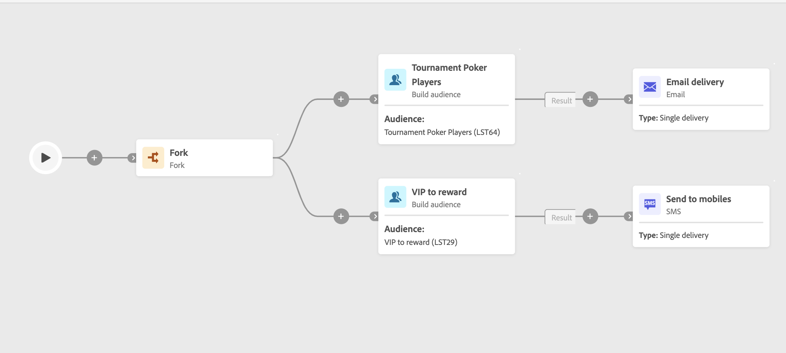

# Zielgruppe erstellen {#build-audience}

>[!CONTEXTUALHELP]
>id="ajo_orchestration_build_audience"
>title="Aktivität „Zielgruppe erstellen“"
>abstract="Mit **Aktivität** Zielgruppe aufbauen“ können Sie die Zielgruppe definieren, die in die orchestrierte Kampagne eintritt. Beim Senden von Nachrichten im Rahmen einer orchestrierten Kampagne wird die Nachrichtenzielgruppe nicht in der Kanalaktivität, sondern in der Aktivität **Zielgruppe aufbauen** definiert."

Die Aktivität **Zielgruppe erstellen** ist eine Aktivität zur **Zielgruppenbestimmung**. Mit dieser Aktivität können Sie die Audience definieren, die in die orchestrierte Kampagne eintritt. Beim Senden von Nachrichten im Rahmen einer orchestrierten Kampagne wird die Nachrichtenzielgruppe nicht in der Kanalaktivität, sondern in der Aktivität **Zielgruppe aufbauen** definiert.

Zur Definition der Zielgruppenpopulation haben Sie folgende Möglichkeiten:

* Wählen Sie eine Adobe Experience Platform-Zielgruppe aus.
* Erstellen Sie mit dem Abfrage-Modeler eine neue Zielgruppe, indem Sie Filterkriterien definieren und kombinieren.

>[!NOTE]
>
>Zielgruppen, die aus einer Datei geladen wurden, können nicht mit der Aktivität „Zielgruppe erstellen“ angesprochen werden. Dazu müssen Sie eine Aktivität „Datei laden **und** eine Aktivität **Abstimmung“**.

<!--
The **Build audience** activity can be placed at the beginning of the workflow or after any other activity. Any activity can be placed after the **Build audience**.
-->

## Konfigurieren der Aktivität „Zielgruppe erstellen“ {#build-audience-configuration}

>[!CONTEXTUALHELP]
>id="ajo_orchestration_build_audience_audienceselector"
>title="Zielgruppe"
>abstract="Wählen Sie Ihre Zielgruppe auf die gleiche Weise aus wie beim Entwerfen eines neuen Versands."

Führen Sie die folgenden Schritte aus, um die Aktivität **Zielgruppe erstellen** zu konfigurieren:

1. Fügen Sie die Aktivität **Zielgruppe erstellen** hinzu.
1. Definieren Sie einen Titel.
1. Definieren Sie die Art der Zielgruppe: **Eigene erstellen** oder **Zielgruppe lesen**.
1. Konfigurieren Sie Ihre Zielgruppe anhand der Schritte in den unten stehenden Registerkarten.

>[!BEGINTABS]

>[!TAB Eigene erstellen (Abfrage)]

Gehen Sie wie folgt vor, um Ihre eigene Abfrage zu erstellen:

1. Wählen Sie **Eigene erstellen (Abfrage)** aus.
1. Wählen Sie die **Zielgruppendimension**. Die Zielgruppendimension ermöglicht die Bestimmung der vom Vorgang betroffenen Population: Empfängerinnen und Empfänger, Vertragsbegünstigte, Benutzerinnen und Benutzer, Abonnentinnen und Abonnenten usw. Standardmäßig wird die Zielgruppe aus den Empfängerinnen und Empfängern ausgewählt.
1. Klicken Sie auf **Weiter**.
1. Verwenden Sie den Abfrage-Modellierer, um Ihre Abfrage zu definieren, genauso wie Sie beim Entwerfen einer neuen E-Mail eine Zielgruppe erstellen.

>[!TAB Zielgruppe lesen]

Gehen Sie wie folgt vor, um eine vorhandene Zielgruppe auszuwählen:

1. Wählen Sie **Zielgruppe lesen** aus.
1. Klicken Sie auf **Weiter**.
1. Wählen Sie Ihre Zielgruppe auf die gleiche Weise aus wie beim Entwerfen eines neuen Versands.

>[!ENDTABS]

## Beispiele{#build-audience-examples}

Im Folgenden finden Sie ein Beispiel für eine orchestrierte Kampagne mit zwei Aktivitäten **Zielgruppe aufbauen**. Die erste Version richtet sich an die Zielgruppe derjenigen, die Poker spielen, gefolgt von einem E-Mail-Versand. Die zweite Version ist die Zielgruppe der VIP-Kundinnen und -Kunden, gefolgt von einem SMS-Versand.

