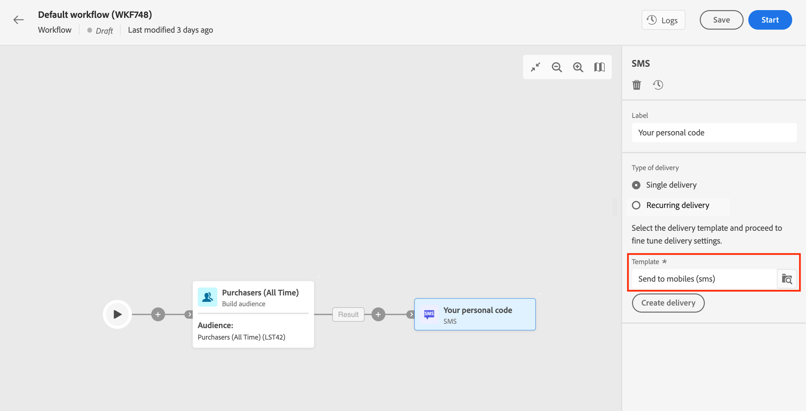

# Kanalaktivitäten {#channel}

Adobe Journey Optimizer ermöglicht die Automatisierung und Ausführung von Marketing-Kampagnen über eingehende und ausgehende Kanäle hinweg. Sie können Kanalaktivitäten in der mehrstufigen Kampagnen-Arbeitsfläche kombinieren, um kanalübergreifende mehrstufige Kampagnen zu erstellen, mit denen basierend auf dem Kundenverhalten und den Daten Trigger erstellt werden können. Unterstützte Kanäle sind auf [dieser Seite](../../channels/gs-channels.md) aufgeführt.

Sie können beispielsweise eine Begrüßungs-E-Mail-Kampagne erstellen, die eine Reihe von Nachrichten über verschiedene Kanäle wie E-Mail, SMS, Push-Benachrichtigungen und Briefpost enthält. Sie können auch eine Folge-E-Mail senden, nachdem eine Kundin oder ein Kunde einen Kauf getätigt hat, oder eine personalisierte Geburtstagsnachricht per SMS an eine Kundin bzw. einen Kunden senden.

Mithilfe von Kanalaktivitäten können Sie umfassende und personalisierte Kampagnen erstellen, die Kundinnen und Kunden über mehrere Touchpoints hinweg ansprechen, und Konversionen fördern.

## Voraussetzungen {#channel-activity-prereq}

Beginnen Sie mit der Erstellung Ihrer mehrstufigen Kampagne mit den relevanten Aktivitäten:

* Bevor Sie eine Kanalaktivität einfügen, müssen Sie die Zielgruppe definieren. Die Audience ist die Hauptzielgruppe Ihres Versands: die Profile, die die Nachrichten erhalten.

* Um einen wiederkehrenden Versand durchzuführen, starten Sie Ihre mehrstufige Kampagne mit einer **Planung**-Aktivität. Sie können die Aktivität **Planung** auch für einmalige Einzelsendungen verwenden, um für diese Sendungen das Kontaktdatum festzulegen. Dieses Kontaktdatum kann auch in den Versandeinstellungen festgelegt werden. Weitere Informationen finden Sie in [diesem Abschnitt](scheduler.md).

## Konfigurieren einer Kanalaktivität {#create-a-delivery-in-a-workflow}

>[!CONTEXTUALHELP]
>id="ajo_orchestration_email"
>title="E-Mail-Aktivität"
>abstract="Die E-Mail-Aktivität ermöglicht den Versand von E-Mails innerhalb der mehrstufigen Kampagne, sowohl für einmalige als auch für wiederkehrende Nachrichten. Sie dient dazu, den Versand von E-Mails an eine innerhalb derselben mehrstufigen Kampagne berechnete Zielgruppe zu automatisieren. Sie können Kanalaktivitäten in einer mehrstufigen Kampagnenarbeitsfläche kombinieren, um kanalübergreifende Kampagnen zu erstellen, mit denen basierend auf Kundenverhalten und Daten Aktionen ausgelöst werden können."

>[!CONTEXTUALHELP]
>id="ajo_orchestration_sms"
>title="SMS-Aktivität"
>abstract="Die SMS-Aktivität ermöglicht den Versand von SMS innerhalb der mehrstufigen Kampagne, sowohl für einmalige als auch für wiederkehrende Nachrichten. Sie dient dazu, den Versand von SMS an eine innerhalb derselben mehrstufigen Kampagne berechnete Zielgruppe zu automatisieren. Sie können Kanalaktivitäten in der mehrstufigen Kampagnenarbeitsfläche kombinieren, um kanalübergreifende Kampagnen zu erstellen, mit denen basierend auf Kundenverhalten und Daten Aktionen ausgelöst werden können."

>[!CONTEXTUALHELP]
>id="ajo_orchestration_push_ios"
>title="Push-iOS-Aktivität"
>abstract="Die Push-iOS-Aktivität ermöglicht den Versand von iOS-Push-Benachrichtungen innerhalb der mehrstufigen Kampagne. Dies ermöglicht den Versand einmaliger und wiederkehrender mehrstufiger Kampagnen und automatisiert so den Versand von iOS-Push-Benachrichtigungen an eine vordefinierte Zielgruppe innerhalb desselben Workflows. Sie können Kanalaktivitäten in der Workflow-Arbeitsfläche kombinieren, um kanalübergreifende Workflows zu erstellen, mit denen je nach Kundenverhalten und -daten Aktionen ausgelöst werden können."

>[!CONTEXTUALHELP]
>id="ajo_orchestration_push_android"
>title="Push-Android-Aktivität"
>abstract="Die Push-Android-Aktivität ermöglicht den Versand von Android-Push-Benachrichtungen innerhalb der mehrstufigen Kampagne. Dies ermöglicht den Versand einmaliger und wiederkehrender Nachrichten und automatisiert so den Versand von Android-Push-Benachrichtigungen an eine vordefinierte Zielgruppe innerhalb derselben mehrstufigen Kampagne. Sie können Kanalaktivitäten in der mehrstufigen Kampagnenarbeitsfläche kombinieren, um kanalübergreifende Kampagnen zu erstellen, mit denen basierend auf Kundenverhalten und Daten Aktionen ausgelöst werden können."

>[!CONTEXTUALHELP]
>id="ajo_orchestration_directmail"
>title="Aktivität „Direkt-Mail“"
>abstract="Die Aktivität „Direkt-Mail“ erleichtert den Direkt-Mail-Versand innerhalb der mehrstufigen Kampagne und ermöglicht sowohl einmalige als auch wiederkehrende Nachrichten. Sie dient dazu, das Generieren der von Direkt-Mail-Dienstleistern benötigten Extraktionsdatei zu automatisieren. Sie können Kanalaktivitäten in der mehrstufigen Kampagnenarbeitsfläche kombinieren, um kanalübergreifende Kampagnen zu erstellen, mit denen basierend auf Kundenverhalten und Daten Aktionen ausgelöst werden können."

Gehen Sie wie folgt vor, um einen Versand im Kontext einer mehrstufigen Kampagne einzurichten:

1. Fügen Sie eine Kanalaktivität hinzu: **[!UICONTROL E-Mail]**, **[!UICONTROL SMS]**, **[!UICONTROL Push-Benachrichtigung (Android)]**, **[!UICONTROL Push-Benachrichtigung (iOS)]** oder **[!UICONTROL Briefpost]**.

1. Wählen Sie den **Versandtyp** aus: einmalig oder wiederkehrend.

   * Ein **Einzelversand** ist ein einmaliger Versand, der nur einmal verschickt wird, z. B. eine E-Mail zum „Black Friday“.
   * Ein **Wiederkehrender Versand** wird entsprechend der Ausführungshäufigkeit, die in der Aktivität [Planung](scheduler.md) definiert ist, mehrfach verschickt. Bei jeder Ausführung der mehrstufigen Kampagne wird die Zielgruppe neu berechnet und der Versand an die aktualisierte Zielgruppe mit den aktualisierten Inhalten gesendet. Dabei kann es sich um einen wöchentlichen Newsletter oder eine wiederkehrende Geburtstags-E-Mail handeln.

1. Wählen Sie eine **Versandvorlage** aus. Vorlagen sind vorkonfigurierte, kanalspezifische Versandeinstellungen. Für jeden Kanal ist eine integrierte Vorlage verfügbar, die standardmäßig vorausgefüllt ist.

   

   Sie können die Vorlage im linken Bereich zur Konfiguration der Kanalaktivität auswählen. Wenn die zuvor ausgewählte Zielgruppe nicht mit dem Kanal kompatibel ist, können Sie keine Vorlage auswählen. Um dies zu beheben, aktualisieren Sie die Aktivität **Zielgruppe aufbauen**, um eine Zielgruppe mit dem richtigen Zielgruppen-Mapping auszuwählen.

1. Klicken Sie auf **Versand erstellen**. Sie können dann Ihre Nachrichteneinstellungen und den Inhalt so wie einen eigenständigen Versand definieren. Sie können den Inhalt auch testen und simulieren.

1. Navigieren Sie zurück zu Ihrem Workflow. Entscheiden Sie, ob Sie den Workflow **Ausgehende Transition erzeugen** fortsetzen möchten, um eine Transition nach der Kanalaktivität hinzuzufügen.

1. Klicken Sie **Starten** um Ihre mehrstufige Kampagne zu starten.

   Standardmäßig erfolgt der Trigger einer mehrstufigen Kampagne in die Vorbereitungsphase der Nachricht, ohne dass die Nachricht sofort gesendet wird.

1. Öffnen Sie die Kanalaktivität, um den Versand über die Schaltfläche **Überprüfen und senden** zu bestätigen.

1. Klicken Sie im Versand-Dashboard auf **Senden**.

## Beispiele {#cross-channel-workflow-sample}

Im Folgenden finden Sie ein Beispiel einer kanalübergreifenden mehrstufigen Kampagne mit einer Segmentierung und zwei Sendungen. Die mehrstufige Kampagne richtet sich an alle Kunden, die in Paris leben und sich für Kaffeemaschinen interessieren. Innerhalb dieser Population wird eine E-Mail an die regulären Kundinnen und Kunden und eine SMS an diejenigen mit VIP-Status gesendet.

<!--
description, which use case you can perform (common other activities that you can link before of after the activity)

how to add and configure the activity

example of a configured activity within a workflow
The Email delivery activity allows you to configure the sending an email in a workflow. 

-->

Sie können auch eine wiederkehrende mehrstufige Kampagne erstellen, um an jedem ersten Tag des Monats um 20 Uhr eine personalisierte SMS an alle in Paris lebenden Kunden zu senden.

<!-- Scheduled emails available?

This can be a single send email and sent just once, or it can be a recurring email.
* Single send emails are standard emails, sent once.
* Recurring emails allow you to send the same email multiple times to different targets over a defined period. You can aggregate the deliveries per period in order to get reports that correspond to your needs.

When linked to a scheduler, you can define recurring emails.
Email recipients are defined upstream of the activity in the same workflow, via an Audience targeting activity.

-->

<!--The message preparation is triggered according to the workflow execution parameters. From the message dashboard, you can select whether to request or not a manual confirmation to send the message (required by default). You can start the workflow manually or place a scheduler activity in the workflow to automate execution.-->
