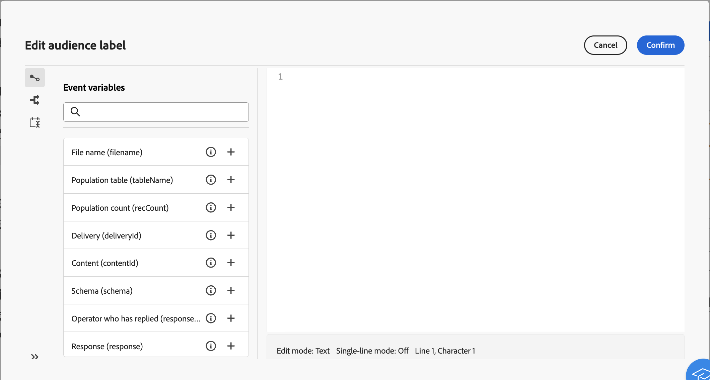

# Arbeiten mit Ereignisvariablen {#event-variables}

Einige orchestrierte Kampagnenaktivitäten ermöglichen es Ihnen, im Ausdruckseditor Skripte zu bearbeiten, um bestimmte Aktionen durchzuführen, z. B. das Abrufen von Daten aus vorherigen Aktivitäten, die Erstellung von Bedingungen oder die Berechnung von Dateinamen basierend auf Ereignisvariablen.

## Was sind Ereignisvariablen? {#scripting}

Skripte, die im Kontext einer orchestrierten Kampagne ausgeführt werden, greifen auf eine Reihe zusätzlicher globaler **Objekte**, wie die orchestrierte Kampagne selbst, die ausgeführt wird (`ìnstance`), ihre verschiedenen Aufgaben (`task`) oder die Ereignisse, die eine bestimmte Aufgabe aktiviert haben (`event`).

Jedem **Objekt**-Typ ist eine Kategorie von **Variablen** zugeordnet, die im Ausdruckseditor bei der Bearbeitung von Skripten in Aktivitäten wie **[!UICONTROL JavaScript-Code]** oder **[!UICONTROL Test]** verwendet werden können.

* **Instanzvariablen** (`instance.vars.xxx`) sind mit globalen Variablen vergleichbar. Sie werden von allen Aktivitäten geteilt.
* **Task-Variablen** (`task.vars.xxx`) sind vergleichbar mit lokalen Variablen. Sie werden nur von der aktuellen Aufgabe verwendet. Diese Variablen werden von persistenten Aktivitäten verwendet, um Daten aufzubewahren, und werden manchmal genutzt, um Daten zwischen den verschiedenen Skripten derselben Aktivität auszutauschen.
* **Ereignisvariablen** (`vars.xxx`) ermöglichen den Datenaustausch zwischen den elementaren Aufgaben eines koordinierten Kampagnenprozesses. Diese Variablen werden von der Aufgabe übergeben, die die in Bearbeitung befindliche Aufgabe aktiviert hat. Sie werden dann an die folgenden Aktivitäten weitergeleitet. **Ereignisvariablen** sind die am häufigsten verwendeten Variablen und sind Instanzvariablen vorzuziehen.

## Nutzung von Ereignisvariablen im Ausdruckseditor {#expression-editor}

Vordefinierte Ereignisvariablen stehen im linken Bereich des Ausdruckseditors zur Verfügung. Sie können auch neue erstellen, indem Sie eine neue Variable in Ihrem Code initialisieren.

Zusätzlich zu diesen Ereignisvariablen können Sie auch das Menü **[!UICONTROL Bedingungen]** im linken Bereich nutzen, um Bedingungen zu erstellen, und das Menü **[!UICONTROL Aktuelles Datum hinzufügen]**, um Funktionen zur Datumsformatierung zu verwenden.
