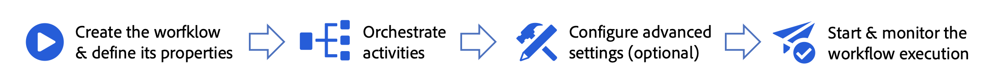

# Grundprinzipien {#ms-campaign-creation}

>[!CONTEXTUALHELP]
>id="ajo_targeting_workflow_list"
>title="Mehrstufige Kampagne"
>abstract="Auf diesem Bildschirm können Sie auf die vollständige Liste der mehrstufigen Kampagnen zugreifen, ihren aktuellen Status sowie das letzte/nächste Ausführungsdatum überprüfen und eine neue mehrstufige Kampagne erstellen."

Mit Adobe Journey Optimizer können Sie mehrstufige Kampagnen in eine visuelle Arbeitsfläche integrieren, um kanalübergreifende Prozesse wie Segmentierung, Kampagnenausführung und Dateiverarbeitung zu entwerfen.

## Was verbirgt sich in einer mehrstufigen Kampagne? {#gs-ms-campaign-inside}

Die mehrstufige Kampagnen-Arbeitsfläche ist eine Darstellung dessen, was passieren soll. Es beschreibt die verschiedenen Aufgaben, die ausgeführt und miteinander verknüpft werden sollen.

{zoomable="yes"} {zoomable="yes"}

Jede mehrstufige Kampagne enthält:

* **Aktivitäten**: Eine Aktivität ist eine Aufgabe, die ausgeführt werden soll. Die verschiedenen verfügbaren Aktivitäten werden im Diagramm durch Symbole dargestellt. Jede Aktivität verfügt über bestimmte Eigenschaften sowie andere Eigenschaften, die für alle Aktivitäten gelten.

  In einem mehrstufigen Kampagnendiagramm kann eine bestimmte Aktivität mehrere Aufgaben auslösen, insbesondere wenn eine Schleife oder wiederkehrende Aktionen vorliegen.

* **Transitionen**: Transitionen verknüpfen eine Quellaktivität mit einer Zielaktivität und definieren deren Sequenz.

* **Arbeitstabellen**: Die Arbeitstabelle enthält alle von der Transition übermittelten Informationen. Jede mehrstufige Kampagne verwendet mehrere Arbeitstabellen. Die in diesen Tabellen übermittelten Daten können während des gesamten Lebenszyklus einer mehrstufigen Kampagne verwendet werden.

## Wichtige Schritte zum Erstellen einer mehrstufigen Kampagne {#gs-ms-campaign-steps}

Die wichtigsten Schritte zum Erstellen einer mehrstufigen Kampagne sind:

{zoomable="yes"}

## Zugriff auf mehrstufige Kampagnen

Navigieren **[!UICONTROL im Menü]** zur Registerkarte Mehrstufige Kampagnen, um auf die vollständige Liste der mehrstufigen Kampagnen zuzugreifen.

Jede mehrstufige Kampagne in der Liste zeigt Informationen über ihren aktuellen [Status](#status), das letzte Mal, wann sie ausgeführt oder geändert wurde, sowie das Datum und die Uhrzeit der nächsten geplanten Ausführung an.

Sie können die angezeigten Spalten anpassen, indem Sie auf das Symbol **[!UICONTROL Spalte für ein benutzerdefiniertes Layout konfigurieren]** in der oberen rechten Ecke der Liste klicken. Auf diese Weise können Sie zusätzliche Informationen zur Liste hinzufügen, z. B. die letzte fehlerhafte Aktivität für jede mehrstufige Kampagne oder die angewendete Zielgruppendimension.

Darüber hinaus stehen eine Suchleiste und Filter zur Verfügung, um die Suche innerhalb der Liste zu erleichtern. Sie können beispielsweise die mehrstufigen Kampagnen so filtern, dass nur die Kampagnen angezeigt werden, die zu einer Kampagne gehören oder innerhalb eines bestimmten Datumsbereichs verarbeitet wurden.

Um eine mehrstufige Kampagne zu duplizieren oder zu löschen, klicken Sie auf die Schaltfläche mit den Auslassungspunkten und wählen Sie **[!UICONTROL Duplizieren]** oder **[!UICONTROL Löschen]**.

>[!NOTE]
>
>Wenn eine mehrstufige Kampagne ausgeführt wird, können Sie sie duplizieren, jedoch nicht löschen.

## Status und Lebenszyklus {#status}

Kampagnen können mehrere Status aufweisen:

* **[!UICONTROL Entwurf]**: Die mehrstufige Kampagne wurde erstellt und gespeichert.
* **[!UICONTROL In Bearbeitung]**: Die mehrstufige Kampagne wird derzeit ausgeführt.
* **[!UICONTROL Beendet]**: Die mehrstufige Kampagnenausführung ist abgeschlossen.
* **[!UICONTROL Ausgesetzt]**: Die mehrstufige Kampagne wurde angehalten.
* **[!UICONTROL Fehlerhaft]**: Bei der mehrstufigen Kampagne ist ein Fehler aufgetreten. Öffnen Sie die mehrstufige Kampagne und greifen Sie auf die Protokolle und Aufgaben zu, um den Fehler zu identifizieren und zu beheben.

## Erstellen einer Abfrage

## Personalization-Richtlinien
