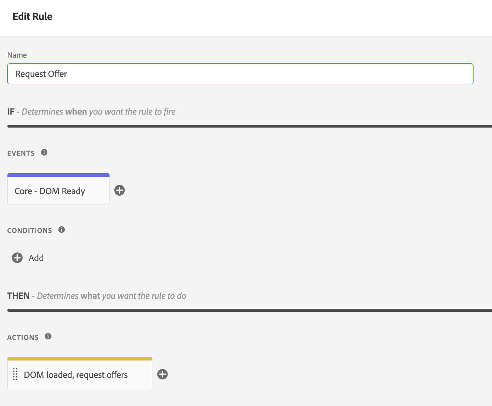

# Bereitstellen von Angeboten mithilfe der Edge Decisioning-API {#edge-decisioning-api}

## Erste Schritte und Voraussetzungen {#edge-overview-and-prerequisites}

Das [Adobe Experience Platform Web SDK](https://experienceleague.adobe.com/docs/experience-platform/edge/home.html?lang=de) ist eine Client-seitige JavaScript-Bibliothek, die es Kunden von Adobe Experience Cloud ermöglicht, über das Adobe Experience Platform Edge Network mit den verschiedenen Services in Experience Cloud zu interagieren.

Mit dem Experience Platform Web SDK können Sie Personalisierungslösungen, einschließlich Entscheidungs-Management, bei Adobe abfragen, sodass Sie personalisierte Angebote abrufen und rendern können, die Sie mithilfe von APIs oder der Angebotsbibliothek erstellt haben. Weitere Informationen zu Datensätzen finden Sie in der Dokumentation zum [Erstellen eines Angebots](../../get-started/starting-offer-decisioning.md).

Es gibt zwei Möglichkeiten, Entscheidungs-Management mit dem [Platform Web SDK](https://experienceleague.adobe.com/docs/experience-platform/edge/home.html?lang=de) zu implementieren. Eine Methode richtet sich an Entwickler und erfordert Website- und Programmierkenntnisse. Die andere Methode besteht darin, die Adobe Experience Platform-Benutzeroberfläche zum Einrichten von Angeboten zu verwenden. Hierfür ist nur ein kleines Script erforderlich, das in der Kopfzeile der HTML-Seite referenziert werden muss.

Weitere Informationen zur Bereitstellung personalisierter Angebote mit dem Adobe Experience Platform Web SDK finden Sie in der Adobe Experience Platform-Dokumentation zu [Entscheidungs-Management](https://experienceleague.adobe.com/docs/experience-platform/edge/personalization/offer-decisioning/offer-decisioning-overview.html?lang=de).

## Adobe Experience Platform Web SDK {#aep-web-sdk}

Das Platform Web SDK ersetzt die folgenden SDKs:

* Visitor.js
* AppMeasurement.js
* AT.js
* DIL.js

Das SDK ist keine Kombination dieser Bibliotheken und ist eine völlig neue Implementierung. Um das SDK zu nutzen, gehen Sie wie folgt vor:

1. Stellen Sie sicher, dass Ihr Unternehmen über die entsprechenden Berechtigungen zur Verwendung des SDK verfügt und Sie die Berechtigungen richtig konfiguriert haben.

   <!-- For more detailed instructions, refer to the documentation on using the [Adobe Experience Platform Web SDK](). -->

1. [Konfigurieren Sie Ihren Datenstrom](https://experienceleague.adobe.com/docs/experience-platform/edge/fundamentals/datastreams.html?lang=de) auf der Registerkarte „Datenerfassung“ in Ihrem Konto in Adobe Experience Cloud.

1. Installieren Sie das SDK. Hierfür gibt es mehrere Methoden, die auf der Seite [Installieren des SDK](https://experienceleague.adobe.com/docs/experience-platform/edge/fundamentals/installing-the-sdk.html?lang=de) erläutert werden. Im Folgenden werden alle verfügbaren Implementierungsmethoden beschrieben.

Damit Sie das SDK verwenden können, muss ein [Schema](../../../data/get-started-schemas.md) vorhanden und ein [Datenstrom](../../../data/get-started-datasets.md) definiert worden sein.

<!-- ****TODO - Configure schema**** -->

Um Angebote zu personalisieren, müssen Sie Ihre Personalisierung/Profile separat konfigurieren.

<!-- Refer to the [doc](www.link.com) for detailed instructions.  -->

Führen Sie einen der beiden folgenden Schritte aus, um das SDK für Entscheidungs-Management zu konfigurieren:

## Option 1: Installieren Sie die Tag-Erweiterung und -Implementierung mithilfe von Adobe Experience Platform Launch

Diese Option ist benutzerfreundlicher für Personen, die über weniger Programmiererfahrung verfügen.

1. [Erstellen Sie eine Tag-Eigenschaft](https://experienceleague.adobe.com/docs/experience-platform/tags/admin/companies-and-properties.html?lang=de)

1. [Fügen Sie den Einbettungs-Code hinzu](https://experienceleague.adobe.com/docs/core-services-learn/implementing-in-websites-with-launch/configure-launch/launch-add-embed.html?lang=de)

1. Installieren und konfigurieren Sie die Web SDK-Erweiterung von Adobe Experience Platform mit dem von Ihnen erstellten Datenstrom, indem Sie die Konfiguration aus der Dropdown-Liste „Datenstrom“ auswählen. Weitere Informationen zu Datensätzen finden Sie in der Dokumentation zu [Erweiterungen](https://experienceleague.adobe.com/docs/experience-platform/tags/ui/extensions/overview.html?lang=de).

   

   .

1. Erstellen Sie die erforderlichen [Datenelemente](https://experienceleague.adobe.com/docs/experience-platform/tags/ui/data-elements.html?lang=de). Sie müssen zumindest eine Platform Web SDK Identity Map und ein Platform Web SDK XDM Object-Datenelement erstellen.

   

   

1. Erstellen Sie Ihre [Regeln](https://experienceleague.adobe.com/docs/experience-platform/tags/ui/rules.html?lang=de):

   Fügen Sie eine Aktion „Ereignis senden“ des Platform Web SDK hinzu und geben Sie bei der Konfiguration dieser Aktion die relevanten Entscheidungsumfänge an.

   

   

1. [Erstellen und veröffentlichen](https://experienceleague.adobe.com/docs/experience-platform/tags/publish/libraries.html?lang=de) Sie eine Bibliothek mit allen relevanten Regeln, Datenelementen und Erweiterungen, die Sie konfiguriert haben.

## Option 2: Manuelle Implementierung mit der vordefinierten eigenständigen Version

Im Folgenden finden Sie die erforderlichen Schritte zur Verwendung von Entscheidungs-Management mithilfe der vordefinierten eigenständigen Installation des Web SDK. In dieser Anleitung wird davon ausgegangen, dass es sich um Ihre erste Implementierung des SDK handelt, sodass möglicherweise nicht alle Schritte auf Sie zutreffen. Diese Anleitung setzt auch ein gewisses Maß an Entwicklerkenntnissen voraus.

Fügen Sie das folgende JavaScript-Snippet von „Option 2: Die vordefinierte eigenständige Version“ auf [dieser Seite](https://experienceleague.adobe.com/docs/experience-platform/edge/fundamentals/installing-the-sdk.html?lang=de) in den `<head>`-Abschnitt Ihrer HTML-Seite ein.

```
javascript
    <script>
        !function(n,o){o.forEach(function(o){n[o]||((n.__alloyNS=n.__alloyNS||
        []).push(o),n[o]=function(){var u=arguments;return new Promise(
        function(i,l){n[o].q.push([i,l,u])})},n[o].q=[])})}
        (window,["alloy"]);
    </script>
    <script src="https://cdn1.adoberesources.net/alloy/2.6.4/alloy.js" async></script>
```

Sie benötigen zwei IDs von Ihrem Adobe-Konto, um die SDK-Konfiguration einzurichten: Ihre edgeConfigId und Ihre orgId. Die edgeConfigId entspricht Ihrer Datenstrom-ID, die Sie im Rahmen des Kapitels „Voraussetzungen“ konfiguriert haben sollten.

Um Ihre edgeConfigID/Datenstrom-ID zu finden, gehen Sie zu „Datenerfassung“ und wählen Sie Ihren Datenstrom aus. Um Ihre orgId zu finden, gehen Sie zu Ihrem Profil.

Konfigurieren Sie das SDK in JavaScript entsprechend den Anweisungen auf dieser Seite. Bei der Konfiguration verwenden Sie stets Ihre edgeConfigId und orgId. In der Dokumentation wird auch beschrieben, welche optionalen Parameter für Ihre Konfiguration vorhanden sind. Ihre endgültige Konfiguration könnte in etwa so aussehen:

```
javascript
    alloy("configure", {
        "edgeConfigId": "12345678-0ABC-DEF-GHIJ-KLMNOPQRSTUV",                            
        "orgId":"ABCDEFGHIJKLMNOPQRSTUVW@AdobeOrg",
        "debugEnabled": true,
        "edgeDomain": "edge.adobedc.net",
        "clickCollectionEnabled": true,
        "idMigrationEnabled": true,
        "thirdPartyCookiesEnabled": true,
        "defaultConsent":"in"  
    });
```

Installieren Sie die Debugger-Erweiterung für Chrome, um sie zur Fehlerbehebung zu verwenden. Sie finden Sie hier: <https://chrome.google.com/webstore/detail/adobe-experience-platform/bfnnokhpnncpkdmbokanobigaccjkpob>

Melden Sie sich anschließend über den Debugger bei Ihrem Konto an. Gehen Sie dann zu den Protokollen und stellen Sie sicher, dass Sie mit dem richtigen Arbeitsbereich verbunden sind. Kopieren Sie nun die base64-kodierte Version des Entscheidungsumfangs in Ihrem Angebot.

Fügen Sie beim Bearbeiten Ihrer Website das Script mit der Konfiguration und der `sendEvent`-Funktion ein, um den Entscheidungsumfang an Adobe zu senden.

**Beispiel**:

```
javascript
    alloy("sendEvent", {
        "decisionScopes": 
        [
        "eyJ4ZG06YWN0aXZpdHlJZCI6Inhjb3JlOm9mZmVyLWFjdGl2aXR5OjE0ZWE4MDhhZjJjZDM1NzQiLCJ4ZG06cGxhY2VtZW50SWQiOiJ4Y29yZTpvZmZlci1wbGFjZW1lbnQ6MTRjNGFmZDI2OTXXXXXXXXXX"
        ]
    });
```

Im Folgenden finden Sie ein Beispiel für die Handhabung der Antwort:

```
javascript
    alloy("sendEvent", {
        "decisionScopes":
        [
        "eyJ4ZG06YWN0aXZpdHlJZCI6Inhjb3JlOm9mZmVyLWFjdGl2aXR5OjE0ZWE4MDhhZjJjZDM1NzQiLCJ4ZG06cGxhY2VtZW50SWQiOiJ4Y29yZTpvZmZlci1wbGFjZW1lbnQ6MTRjNGFmZDI2OTXXXXXXXXXX"
        ]
    }).then(function(result) {
        Object.entries(result).forEach(([key, value]) => {
            console.log(key, value);
        });
    });
```

Sie können den Debugger verwenden, um sicherzustellen, dass Sie erfolgreich eine Verbindung zum Edge-Netzwerk hergestellt haben.

>[!NOTE]
>
>Wenn Sie in den Protokollen keine Verbindung zum Edge-Netzwerk sehen, müssen Sie möglicherweise Ihren Werbeblocker deaktivieren.

Sehen Sie dazu nach, wie Sie Ihr Angebot erstellt und welche Formatierung Sie verwendet haben. Je nach den Kriterien, die in der Entscheidung erfüllt werden, wird ein Angebot mit den Informationen zurückgegeben, die Sie beim Erstellen des Angebots in Adobe Experience Platform angegeben haben.

In diesem Beispiel sieht der JSON-Code, der zurückgegeben werden soll, folgendermaßen aus:

```
json
{
   "name":"ABC Test",
   "description":"This is a test offer", 
   "link":"https://sampletesting.online/",
   "image":"https://sample-demo-URL.png"
}
```

Verarbeiten Sie das Antwortobjekt und parsen Sie die benötigten Daten. Da Sie mehrere Entscheidungsumfänge in einem `sendEvent`-Aufruf senden können, sieht Ihre Antwort möglicherweise etwas anders aus.

```
json
    {
        "id": "abrxgl843d913",
        "scope": "eyJ4ZG06YWN0aXZpdHlJZCI6Inhjb3JlOm9mZmVyLWFjdGl2aXR5OjE0ZWE4MDhhZjJjZDM1NzQiLCJ4ZG06cGxhY2VtZW50SWQiOiJ4Y29yZTpvZmZlci1wbGFjZW1lbnQ6MTRjNGFmZDI2OTVlNWRmOSJ9",
        "items": 
        [
            {
                "id": "xcore:fallback-offer:14ea7f1ea26ebd0a",
                "etag": "1",
                "schema": "https://ns.adobe.com/experience/offer-management/content-component-json",
                "data": {
                    "id": "xcore:fallback-offer:14ea7f1ea26ebd0a",
                    "format": "application/json",
                    "language": [
                        "en-us"
                    ],
                    "content": "{\"name\":\"ABC Test\",\"description\":\"This is a test offer\", \"link\":\"https://sampletesting.online/\",\"image\":\"https://sample-demo-URL.png\"}"
                }
            }
        ]
    }
]
}
```

```
json
{
    "propositions": 
    [
    {
        "renderAttempted": false,
        "id": "e15ecb09-993e-4b66-93d8-0a4c77e3d913",
        "scope": "eyJ4ZG06YWN0aXZpdHlJZCI6Inhjb3JlOm9mZmVyLWFjdGl2aXR5OjE0ZWE4MDhhZjJjZDM1NzQiLCJ4ZG06cGxhY2VtZW50SWQiOiJ4Y29yZTpvZmZlci1wbGFjZW1lbnQ6MTRjNGFmZDI2OTVlNWRmOSJ9",
        "items": 
        [
            {
                "id": "xcore:fallback-offer:14ea7f1ea26ebd0a",
                "etag": "1",
                "schema": "https://ns.adobe.com/experience/offer-management/content-component-json",
                "data": {
                    "id": "xcore:fallback-offer:14ea7f1ea26ebd0a",
                    "format": "application/json",
                    "language": [
                        "en-us"
                    ],
                    "content": "{\"name\":\"Claire Hubacek Test\",\"description\":\"This is a test offer\", \"link\":\"https://sampletesting.online/\",\"image\":\"https://sample-demo-URL.png\"}"
                }
            }
        ]
    }
    ]
}
```

In diesem Beispiel war der Pfad, der zur Verarbeitung und Verwendung der angebotsspezifischen Details auf der Web-Seite erforderlich war: `result['decisions'][0]['items'][0]['data']['content']`

So legen Sie die JS-Variablen fest:

```
javascript
const offer = JSON.parse(result['decisions'][0]['items'][0]['data']['content']);

let offerURL = offer['link'];
let offerDescription = offer['description'];
let offerImageURL = offer['image'];

document.getElementById("offerDescription").innerHTML = offerDescription;
document.getElementById('offerImage').src = offerImageURL;
```

<!--## Limitations

Some offer constraints are currently not supported with the mobile Experience Edge workflows, for example Capping. The Capping field value specifies the number of times an offer can be presented across all users. For more details, see [Add constraints to an offer](../../offer-library/add-constraints.md#capping).-->
