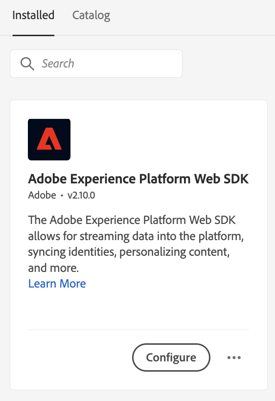

# Bereitstellung von Angeboten mithilfe der Edge Decisioning-API {#edge-decisioning-api}

## Erste Schritte und Voraussetzungen {#edge-overview-and-prerequisites}

Die [Adobe Experience Platform Web SDK](https://experienceleague.adobe.com/docs/experience-platform/edge/home.html#video-overview) ist eine Client-seitige JavaScript-Bibliothek, mit der Adobe Experience Cloud-Kunden über das Experience Platform Edge Network mit den verschiedenen Diensten in Experience Cloud interagieren können.

Das Experience Platform Web SDK unterstützt die Abfrage der Personalisierungslösungen bei Adobe, einschließlich der Entscheidungsverwaltung, damit Sie personalisierte Angebote abrufen und rendern können, die Sie mithilfe von APIs oder der Angebotsbibliothek erstellt haben. Weitere Informationen finden Sie in der Dokumentation unter [Erstellen eines Angebots](../../get-started/starting-offer-decisioning.md).

Es gibt zwei Möglichkeiten, die Entscheidungsverwaltung mit der [Platform Web SDK](https://experienceleague.adobe.com/docs/experience-platform/edge/home.html#video-overview). Eine Methode ist auf Entwickler ausgerichtet und erfordert Kenntnisse über Websites und Programmierung. Die andere Möglichkeit besteht darin, die Benutzeroberfläche von Adobe Experience Platform zum Einrichten von Angeboten zu verwenden, für die nur ein kleines Skript erforderlich ist, das im Header der HTML-Seite referenziert werden muss.

Weitere Informationen finden Sie in der Dokumentation unter [Entscheidungsmanagement](https://experienceleague.adobe.com/docs/experience-platform/edge/personalization/offer-decisioning/offer-decisioning-overview.html?lang=en#enabling-offer-decisioning) für weitere Informationen zur Bereitstellung personalisierter Angebote mit dem Adobe Experience Platform Web SDK.

>[!NOTE]
>
>Die Verwendung von Decision Management im Adobe Experience Platform Web SDK ist nur für eine Reihe von Organisationen verfügbar (eingeschränkte Verfügbarkeit). Wenn Sie diese Funktion nutzen möchten, wenden Sie sich an Ihren Adobe-Kundenbetreuer.

## Adobe Experience Platform Web SDK {#aep-web-sdk}

Das Platform Web SDK ersetzt die folgenden SDKs:

* Visitor.js
* AppMeasurement.js
* AT.js
* DIL.js

Das SDK hat diese Bibliotheken nicht kombiniert und ist eine neue Implementierung von Grund auf. Gehen Sie dazu wie folgt vor:

1. Stellen Sie sicher, dass Ihr Unternehmen über die entsprechenden Berechtigungen zur Verwendung des SDK verfügt und Sie die Berechtigungen richtig konfiguriert haben.

   <!-- For more detailed instructions, refer to the documentation on using the [Adobe Experience Platform Web SDK](). -->

1. [Konfigurieren Ihres Datenspeichers](https://experienceleague.adobe.com/docs/experience-platform/edge/fundamentals/datastreams.html?lang=en) auf der Registerkarte Datenerfassung in Ihrem Konto in der Adobe Experience Cloud.

1. Installieren Sie das SDK. Es gibt mehrere Methoden, dies zu tun, die auf der Seite [SDK-Seite installieren](https://experienceleague.adobe.com/docs/experience-platform/edge/fundamentals/installing-the-sdk.html?lang=en). Diese Seite wird mit den verschiedenen Implementierungsmethoden fortgesetzt.

Um das SDK verwenden zu können, müssen Sie über eine [schema](../../../data/get-started-schemas.md) und [datastream](../../../data/get-started-datasets.md) definiert wurde.

<!-- ****TODO - Configure schema**** -->

Um Angebote zu personalisieren, müssen Sie Ihre Personalisierung/Profile separat konfigurieren.

<!-- Refer to the [doc](www.link.com) for detailed instructions.  -->

Gehen Sie wie folgt vor, um das SDK für die Entscheidungsverwaltung zu konfigurieren:

## Option 1 - Installieren der Tag-Erweiterung und -Implementierung mithilfe von Launch

Diese Option ist benutzerfreundlicher für Personen, die weniger Programmierung haben.

1. [Tag-Eigenschaft erstellen](https://experienceleague.adobe.com/docs/experience-platform/tags/admin/companies-and-properties.html?lang=en)

1. [Hinzufügen des Einbettungscodes](https://experienceleague.adobe.com/docs/core-services-learn/implementing-in-websites-with-launch/configure-launch/launch-add-embed.html?lang=en)

1. Installieren und konfigurieren Sie die Adobe Experience Platform Web SDK-Erweiterung mit dem von Ihnen erstellten Datastream, indem Sie die Konfiguration aus der Dropdown-Liste &quot;Datastream&quot;auswählen. Weitere Informationen finden Sie in der Dokumentation unter [Erweiterungen](https://experienceleague.adobe.com/docs/experience-platform/tags/ui/extensions/overview.html?lang=en).

   

   

1. Erstellen Sie die erforderlichen [Datenelemente](https://experienceleague.adobe.com/docs/experience-platform/tags/ui/data-elements.html?lang=en). Sie müssen mindestens eine Platform Web SDK Identity Map und ein Platform Web SDK XDM Object -Datenelement erstellen.

   

   

1. Erstellen Sie Ihre [Regeln](https://experienceleague.adobe.com/docs/experience-platform/tags/ui/rules.html?lang=en):

   Fügen Sie die Aktion &quot;Ereignis senden&quot;des Platform Web SDK hinzu und fügen Sie die relevanten decisionScopes zur Konfiguration dieser Aktion hinzu.

   

   

1. [Erstellen und veröffentlichen](https://experienceleague.adobe.com/docs/experience-platform/tags/publish/libraries.html?lang=en) eine Bibliothek mit allen relevanten Regeln, Datenelementen und Erweiterungen, die Sie konfiguriert haben.

## Option 2 - Manuelle Implementierung mit der vordefinierten eigenständigen Version

Im Folgenden finden Sie die Schritte, die zur Verwendung der Entscheidungsverwaltung mithilfe der vordefinierten eigenständigen Installation des Web SDK erforderlich sind. In diesem Handbuch wird davon ausgegangen, dass es sich um Ihre erste Implementierung des SDK handelt, sodass alle Schritte möglicherweise nicht auf Sie zutreffen. In diesem Handbuch wird auch von einigen Entwicklungserfahrungen ausgegangen.

Fügen Sie das folgende JavaScript-Snippet aus Option 2 ein: Die vordefinierte eigenständige Version auf [diese Seite](https://experienceleague.adobe.com/docs/experience-platform/edge/fundamentals/installing-the-sdk.html?lang=en) im `<head>` auf Ihrer HTML-Seite.

```
javascript
    <script>
        !function(n,o){o.forEach(function(o){n[o]||((n.__alloyNS=n.__alloyNS||
        []).push(o),n[o]=function(){var u=arguments;return new Promise(
        function(i,l){n[o].q.push([i,l,u])})},n[o].q=[])})}
        (window,["alloy"]);
    </script>
    <script src="https://cdn1.adoberesources.net/alloy/2.6.4/alloy.js" async></script>
```

Sie benötigen zwei IDs aus Ihrem Adobe-Konto, um die SDK-Konfiguration einzurichten - Ihre edgeConfigId und Ihre orgId. Die edgeConfigId entspricht Ihrer Datastream-ID, die Sie in den Voraussetzungen konfiguriert haben sollten.

Um Ihre edgeConfigID/datastream-ID zu finden, gehen Sie zur Datenerfassung und wählen Sie Ihren Datastream aus. Um Ihre orgId zu finden, gehen Sie zu Ihrem Profil.

Konfigurieren Sie das SDK in JavaScript entsprechend den Anweisungen auf dieser Seite. Sie verwenden immer Ihre edgeConfigId und orgId in der Konfigurationsfunktion. In der Dokumentation wird auch beschrieben, welche optionalen Parameter für Ihre Konfiguration vorhanden sind. Ihre endgültige Konfiguration könnte in etwa so aussehen:

```
javascript
    alloy("configure", {
        "edgeConfigId": "12345678-0ABC-DEF-GHIJ-KLMNOPQRSTUV",                            
        "orgId":"ABCDEFGHIJKLMNOPQRSTUVW@AdobeOrg",
        "debugEnabled": true,
        "edgeDomain": "edge.adobedc.net",
        "clickCollectionEnabled": true,
        "idMigrationEnabled": true,
        "thirdPartyCookiesEnabled": true,
        "defaultConsent":"in"  
    });
```

Installieren Sie die Chrome-Erweiterung &quot;Debugger&quot;, um sie mit dem Debugging zu verwenden. Das finden Sie hier: <https://chrome.google.com/webstore/detail/adobe-experience-platform/bfnnokhpnncpkdmbokanobigaccjkpob>

Melden Sie sich anschließend im Debugger bei Ihrem Konto an. Gehen Sie dann zu Protokolle und stellen Sie sicher, dass Sie mit dem richtigen Arbeitsbereich verbunden sind. Kopieren Sie nun die base64-kodierte Version des Entscheidungsumfangs aus Ihrem Angebot.

Schließen Sie beim Bearbeiten Ihrer Website das Skript mit der Konfiguration und dem `sendEvent` -Funktion, um den Entscheidungsbereich an Adobe zu senden.

**Beispiel**:

```
javascript
    alloy("sendEvent", {
        "decisionScopes": 
        [
        "eyJ4ZG06YWN0aXZpdHlJZCI6Inhjb3JlOm9mZmVyLWFjdGl2aXR5OjE0ZWE4MDhhZjJjZDM1NzQiLCJ4ZG06cGxhY2VtZW50SWQiOiJ4Y29yZTpvZmZlci1wbGFjZW1lbnQ6MTRjNGFmZDI2OTXXXXXXXXXX"
        ]
    });
```

Im Folgenden finden Sie ein Beispiel für die Handhabung der Antwort:

```
javascript
    alloy("sendEvent", {
        "decisionScopes":
        [
        "eyJ4ZG06YWN0aXZpdHlJZCI6Inhjb3JlOm9mZmVyLWFjdGl2aXR5OjE0ZWE4MDhhZjJjZDM1NzQiLCJ4ZG06cGxhY2VtZW50SWQiOiJ4Y29yZTpvZmZlci1wbGFjZW1lbnQ6MTRjNGFmZDI2OTXXXXXXXXXX"
        ]
    }).then(function(result) {
        Object.entries(result).forEach(([key, value]) => {
            console.log(key, value);
        });
    });
```

Sie können den Debugger verwenden, um sicherzustellen, dass Sie erfolgreich eine Verbindung zum Edge-Netzwerk hergestellt haben.

>[!NOTE]
>
>Wenn Sie keine Verbindung zum Edge in den Protokollen sehen, müssen Sie möglicherweise Ihren Anzeigenblocker deaktivieren.

Erfahren Sie mehr über die Erstellung Ihres Angebots und die verwendete Formatierung. Basierend auf den Kriterien, die in der Entscheidung erfüllt sind, erhalten Sie ein Angebot mit den Informationen, die Sie bei der Erstellung in Adobe Experience Platform angegeben haben.

In diesem Beispiel lautet die zurückzugebende JSON:

```
json
{
   "name":"ABC Test",
   "description":"This is a test offer", 
   "link":"https://sampletesting.online/",
   "image":"https://sample-demo-URL.png"
}
```

Verarbeiten Sie das Antwortobjekt und analysieren Sie die benötigten Daten. So können Sie mehrere Entscheidungsbereiche in einem `sendEvent` -Aufruf verwenden, sieht Ihre Antwort möglicherweise etwas anders aus.

```
json
    {
        "id": "abrxgl843d913",
        "scope": "eyJ4ZG06YWN0aXZpdHlJZCI6Inhjb3JlOm9mZmVyLWFjdGl2aXR5OjE0ZWE4MDhhZjJjZDM1NzQiLCJ4ZG06cGxhY2VtZW50SWQiOiJ4Y29yZTpvZmZlci1wbGFjZW1lbnQ6MTRjNGFmZDI2OTVlNWRmOSJ9",
        "items": 
        [
            {
                "id": "xcore:fallback-offer:14ea7f1ea26ebd0a",
                "etag": "1",
                "schema": "https://ns.adobe.com/experience/offer-management/content-component-json",
                "data": {
                    "id": "xcore:fallback-offer:14ea7f1ea26ebd0a",
                    "format": "application/json",
                    "language": [
                        "en-us"
                    ],
                    "content": "{\"name\":\"ABC Test\",\"description\":\"This is a test offer\", \"link\":\"https://sampletesting.online/\",\"image\":\"https://sample-demo-URL.png\"}"
                }
            }
        ]
    }
]
}
```

```
json
{
    "propositions": 
    [
    {
        "renderAttempted": false,
        "id": "e15ecb09-993e-4b66-93d8-0a4c77e3d913",
        "scope": "eyJ4ZG06YWN0aXZpdHlJZCI6Inhjb3JlOm9mZmVyLWFjdGl2aXR5OjE0ZWE4MDhhZjJjZDM1NzQiLCJ4ZG06cGxhY2VtZW50SWQiOiJ4Y29yZTpvZmZlci1wbGFjZW1lbnQ6MTRjNGFmZDI2OTVlNWRmOSJ9",
        "items": 
        [
            {
                "id": "xcore:fallback-offer:14ea7f1ea26ebd0a",
                "etag": "1",
                "schema": "https://ns.adobe.com/experience/offer-management/content-component-json",
                "data": {
                    "id": "xcore:fallback-offer:14ea7f1ea26ebd0a",
                    "format": "application/json",
                    "language": [
                        "en-us"
                    ],
                    "content": "{\"name\":\"Claire Hubacek Test\",\"description\":\"This is a test offer\", \"link\":\"https://sampletesting.online/\",\"image\":\"https://sample-demo-URL.png\"}"
                }
            }
        ]
    }
    ]
}
```

In diesem Beispiel war der Pfad, der zur Verarbeitung und Verwendung der angebotspezifischen Details auf der Webseite erforderlich war: `result['decisions'][0]['items'][0]['data']['content']`

So legen Sie die JS-Variablen fest:

```
javascript
const offer = JSON.parse(result['decisions'][0]['items'][0]['data']['content']);

let offerURL = offer['link'];
let offerDescription = offer['description'];
let offerImageURL = offer['image'];

document.getElementById("offerDescription").innerHTML = offerDescription;
document.getElementById('offerImage').src = offerImageURL;
```

## Einschränkungen

Einige Angebotsbegrenzungen werden derzeit nicht von den mobilen Experience Edge-Workflows unterstützt, z. B. Capping. Der Wert des Felds Begrenzung gibt an, wie oft ein Angebot für alle Benutzer angezeigt werden kann. Weitere Informationen finden Sie unter [Hinzufügen von Einschränkungen zu Angeboten](../../offer-library/add-constraints.md#capping).
