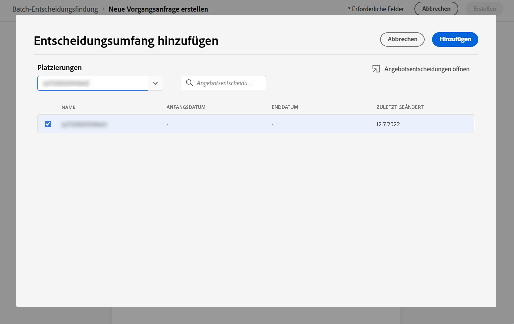

# Batch-Entscheidungsfindung {#deliver}

## Erste Schritte mit der Batch-Entscheidung {#start}

Mit Journey Optimizer können Sie Angebotsentscheidungen an alle Profile in einem bestimmten Adobe Experience Platform-Segment senden.

Dazu müssen Sie in Journey Optimizer eine Auftragsanfrage erstellen, die Informationen zum Zielsegment und zur zu verwendenden Angebotsentscheidung enthält. Der Angebotsinhalt für jedes Profil im Segment wird dann in einem Adobe Experience Platform-Datensatz platziert, wo er für benutzerdefinierte Batch-Workflows verfügbar ist.

Die Batch-Bereitstellung kann auch über APIs durchgeführt werden. Weitere Informationen hierzu finden Sie im Abschnitt [Dokumentation zur Batch Decisioning API](api-reference/offer-delivery-api/batch-decisioning-api.md).

## Voraussetzungen {#prerequisites}

Bevor Sie eine Auftragsanfrage konfigurieren, stellen Sie sicher, dass Sie Folgendes erstellt haben:

* **Datensatz** in Adobe Experience Platform. Dieser Datensatz wird verwendet, um das Entscheidungsergebnis mithilfe des Schemas &quot;ODE DecisionEvents&quot;zu speichern. Weitere Informationen finden Sie unter [Datensatzdokumentation](https://experienceleague.adobe.com/docs/experience-platform/catalog/datasets/overview.html).

* **Ein Segment** in Adobe Experience Platform. Das Segment sollte ausgewertet und dann aktualisiert werden. Erfahren Sie, wie Sie die Bewertung der Segmentmitgliedschaft im Abschnitt aktualisieren. [Dokumentation zum Segmentierungsdienst](http://www.adobe.com/go/segmentation-overview-en)

   >[!NOTE]
   >
   >Ein Batch-Auftrag wird nicht vom Profil-Snapshot ausgeführt, der einmal täglich ausgeführt wird. Die Stapelentscheidung begrenzt die Häufigkeit und lädt immer Profile aus der letzten Momentaufnahme.

* **Entscheidung** in Adobe Journey Optimizer. [Erfahren Sie, wie Sie eine Entscheidung erstellen](offer-activities/create-offer-activities.md)

<!-- in API doc, remove these info and add ref here-->

## Auftragsanfrage erstellen

Gehen Sie wie folgt vor, um eine neue Auftragsanfrage zu erstellen.

1. Im **[!UICONTROL Offers]** öffnen Sie das Menü **[!UICONTROL Batch decisioning]** und klicken Sie auf **[!UICONTROL Create request]**.

   

1. Benennen Sie Ihre Auftragsanfrage und wählen Sie dann den Datensatz aus, in den die Auftragsdaten gesendet werden sollen.

1. Wählen Sie das Adobe Experience Platform-Segment als Ziel aus.

1. Wählen Sie einen oder mehrere Entscheidungsbereiche für Angebote aus, die Sie zum Übermitteln von Angeboten an das Segment verwenden möchten:
   1. Wählen Sie eine Platzierung aus der Liste aus.
   1. Die für die ausgewählte Platzierung verfügbaren Entscheidungen werden angezeigt. Wählen Sie die Entscheidung Ihrer Wahl aus und klicken Sie auf **[!UICONTROL Add]**.
   1. Wiederholen Sie den Vorgang, um beliebig viele Entscheidungsbereiche hinzuzufügen.

   

1. Standardmäßig wird für jedes Profil ein Angebot des Entscheidungsbereichs zurückgegeben. Sie können die Anzahl der zurückgegebenen Angebote mithilfe der Variablen **[!UICONTROL Request offer per profile]** -Option. Wenn Sie beispielsweise &quot;2&quot;auswählen, werden für den ausgewählten Entscheidungsbereich die besten 2 Angebote angezeigt.

   >[!NOTE]
   >
   >Sie können bis zu 30 Angebote pro Entscheidungsbereich anfordern.

1. Wenn Sie den Angebotsinhalt in den Datensatz einbeziehen möchten, können Sie die **[!UICONTROL Include content]** aktiviert. Diese Option ist standardmäßig deaktiviert.

1. Klicken **[!UICONTROL Create]** , um die Auftragsanfrage auszuführen.

## Überwachen von Batch-Aufträgen

Alle angeforderten Batch-Aufträge können über die **[!UICONTROL Batch decisioning]** Registerkarte. Darüber hinaus stehen Such- und Filterwerkzeuge zur Verfügung, mit denen Sie die Liste verfeinern können.

### Status von Auftragsanfragen

Nachdem eine Auftragsanfrage erstellt wurde, durchläuft der Batch-Auftrag mehrere Status:

>[!NOTE]
>
>Um sicherzustellen, dass Sie die neuesten Informationen zum Status einer Auftragsanfrage erhalten, verwenden Sie die Suchschaltfläche neben dem Auftrag, um ihn zu aktualisieren.

1. **[!UICONTROL Queued]**: Die Auftragsanfrage wurde erstellt und in die Verarbeitungswarteschlange eingereiht. Pro Datensatz können bis zu 5 Batch-Aufträge gleichzeitig ausgeführt werden. Alle anderen Batch-Anforderungen mit demselben Ausgabedatensatz werden der Warteschlange hinzugefügt. Ein in die Warteschlange gestellter Auftrag wird zur Verarbeitung aufgenommen, sobald der vorherige Auftrag abgeschlossen ist.
1. **[!UICONTROL Processing]**: Die Auftragsanfrage wird verarbeitet
1. **[!UICONTROL Ingesting]**: Die Auftragsanfrage wurde ausgeführt, Ergebnisdaten werden im ausgewählten Datensatz erfasst,
1. **[!UICONTROL Completed]**: Die Auftragsanfrage wurde ausgeführt und die Ergebnisdaten werden jetzt im ausgewählten Datensatz gespeichert.

   >[!NOTE]
   >
   >Sie können auf den Datensatz zugreifen, in dem Ergebnisse eines Auftrags gespeichert werden, indem Sie in der Auftragsliste auf dessen Namen klicken.

Wenn während der Ausführung der Auftragsanfrage ein Fehler auftritt, wird die **[!UICONTROL Error]** Status. Versuchen Sie, den Batch-Auftrag zu duplizieren, um eine neue Anforderung zu erstellen. [Erfahren Sie, wie Sie einen Batch-Auftrag duplizieren](#duplicate)

### Verarbeitungszeit für Batch-Aufträge

Die End-to-End-Zeit für jeden Batch-Auftrag ist die Dauer von dem Zeitpunkt, zu dem die Arbeitslast erstellt wird, bis zu dem Zeitpunkt, zu dem das Entscheidungsergebnis im Ausgabedatensatz verfügbar ist.

Die Segmentgröße ist der Hauptfaktor, der sich auf die End-to-End-Batch-Entscheidungszeit auswirkt. Wenn für das infrage kommende Angebot eine globale Frequenzbegrenzung aktiviert ist, dauert die Stapelentscheidung länger, bis sie abgeschlossen ist. Nachstehend finden Sie einige Näherungen der End-to-End-Verarbeitungszeit für die jeweiligen Segmentgrößen, sowohl mit als auch ohne Frequenzlimitierung für förderfähige Angebote:

Mit aktivierter Frequenzbegrenzung für geeignete Angebote:

| Segmentgröße | End-to-End-Verarbeitungszeit |
|--------------|----------------------------|
| 10.000 Profile oder weniger | 7 Minuten |
| 1 Million Profile oder weniger | 30 Minuten |
| 15 Millionen Profile oder weniger | 50 Minuten |

Ohne Frequenzlimitierung für förderfähige Angebote:

| Segmentgröße | End-to-End-Verarbeitungszeit |
|--------------|----------------------------|
| 10.000 Profile oder weniger | 6 Minuten |
| 1 Million Profile oder weniger | 8 Minuten |
| 15 Millionen Profile oder weniger | 16 Minuten |

## Auftragsanfrage duplizieren {#duplicate}

Sie können die Informationen eines vorhandenen Auftrags wiederverwenden, um eine neue Anforderung zu erstellen.

Klicken Sie dazu auf das Symbol Duplizieren, bearbeiten Sie bei Bedarf die Auftragsinformationen und klicken Sie auf **[!UICONTROL Create]** , um die neue Anforderung zu erstellen.

