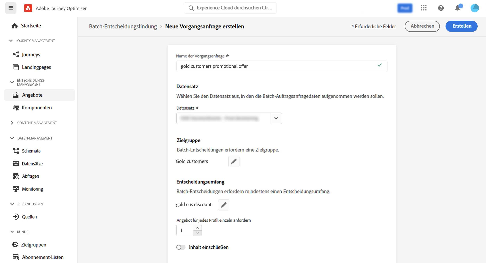

# Batch-Entscheidungsfindung {#deliver}

>[!TIP]
>
>Decisioning, [!DNL Adobe Journey Optimizer] neue Entscheidungsfunktion, ist jetzt über die Code-basierten Erlebnis-, E-Mail-, SMS- und Push-Kanäle verfügbar! [Weitere Informationen](../experience-decisioning/gs-experience-decisioning.md)

## Erste Schritte mit der Batch-Entscheidungsfindung {#start}

Mit Journey Optimizer können Sie Angebotsentscheidungen an alle Profile in einer bestimmten Adobe Experience Platform-Zielgruppe senden.

Dazu müssen Sie in Journey Optimizer eine Auftragsanfrage erstellen, die Informationen zur gewünschten Zielgruppe und zur zu verwendenden Angebotsentscheidung enthält. Der Angebotsinhalt für jedes Profil in der Zielgruppe wird daraufhin in einen Adobe Experience Platform-Datensatz platziert, über den er für benutzerdefinierte Batch-Workflows zur Verfügung steht.

Die Batch-Bereitstellung kann auch über APIs durchgeführt werden. Weitere Informationen hierzu finden Sie in der [Dokumentation zur Batch Decisioning-API](api-reference/offer-delivery-api/batch-decisioning-api.md).

## Voraussetzungen {#prerequisites}

Bevor Sie eine Auftragsanfrage konfigurieren, stellen Sie sicher, dass Sie Folgendes erstellt haben:

* **Einen Datensatz** in Adobe Experience Platform. Dieser Datensatz wird verwendet, um das Entscheidungsergebnis mithilfe des Schemas „ODE DecisionEvents“ zu speichern. Weitere Informationen finden Sie in der [Dokumentation zu Datensätzen](https://experienceleague.adobe.com/docs/experience-platform/catalog/datasets/overview.html?lang=de).

* **Eine Zielgruppe** in Adobe Experience Platform. Die Zielgruppe sollte ausgewertet und dann aktualisiert werden. Informationen zum Aktualisieren der Auswertung der Zielgruppenzugehörigkeit finden Sie in der [Dokumentation zum Segmentierungs-Service](https://www.adobe.com/go/segmentation-overview-en_de).

  >[!NOTE]
  >
  >Ein Batch-Auftrag wird auf Basis eines Profil-Snapshots ausgeführt, der einmal täglich erfolgt. Batch Decisioning begrenzt die Häufigkeit und lädt Profile immer aus dem neuesten Snapshot. Nach der Erstellung einer Zielgruppe müssen Sie mit einer Wartezeit von bis zu 24 Stunden rechnen, bevor Sie die Batch Decisioning-API verwenden können.

* **Eine Entscheidung** in Adobe Journey Optimizer. [Erfahren Sie, wie Sie eine Entscheidung erstellen können](offer-activities/create-offer-activities.md)

<!-- in API doc, remove these info and add ref here-->

## Erstellen einer Auftragsanfrage

Gehen Sie wie folgt vor, um eine neue Auftragsanfrage zu erstellen.

1. Öffnen Sie im Menü **[!UICONTROL Angebote]** die Registerkarte **[!UICONTROL Batch-Entscheidung]** und klicken Sie auf **[!UICONTROL Anfrage erstellen]**.

   

1. Benennen Sie Ihre Auftragsanfrage und wählen Sie dann den Datensatz aus, in den die Auftragsdaten gesendet werden sollen.

1. Wählen Sie die gewünschte Adobe Experience Platform-Zielgruppe aus.

1. Wählen Sie mindestens einen Angebotsentscheidungs-Umfang aus, in dem der Zielgruppe Angebote unterbreitet werden sollen:
   1. Wählen Sie eine Platzierung aus der Liste aus.
   1. Die für die ausgewählte Platzierung verfügbaren Entscheidungen werden angezeigt. Wählen Sie die gewünschte Entscheidung aus und klicken Sie auf **[!UICONTROL Hinzufügen]**.
   1. Wiederholen Sie den Vorgang, um beliebig viele Entscheidungsumfänge hinzuzufügen.

   

1. Standardmäßig wird für jedes Profil ein Angebot des Entscheidungsumfangs zurückgegeben. Sie können die Anzahl der zurückgegebenen Angebote mit der Option **[!UICONTROL Angebot pro Profil anfragen]** anpassen. Wenn Sie beispielsweise „2“ auswählen, werden für diesen Entscheidungsumfang die besten zwei Angebote angezeigt.

   >[!NOTE]
   >
   >Sie können bis zu 30 Angebote pro Entscheidungsumfang anfragen.

1. Wenn Sie den Angebotsinhalt in den Datensatz einbeziehen möchten, aktivieren Sie die Option **[!UICONTROL Inhalt einschließen]**. Standardmäßig ist diese Option deaktiviert.

1. Klicken Sie auf **[!UICONTROL Erstellen]**, um die Auftragsanfrage auszuführen.

## Überwachen von Batch-Aufträgen

Auf alle angefragten Batch-Aufträge kann über die Registerkarte **[!UICONTROL Batch-Entscheidung]** zugegriffen werden. Darüber hinaus stehen Such- und Filterwerkzeuge zur Verfügung, mit denen Sie die Liste eingrenzen können.

### Status von Auftragsanfragen

Nachdem eine Auftragsanfrage erstellt wurde, durchläuft der Batch-Auftrag mehrere Status:

>[!NOTE]
>
>Um sicherzustellen, dass Sie die neuesten Informationen zum Status einer Auftragsanfrage erhalten, können Sie diese über die Schaltfläche mit den Auslassungspunkten neben dem Auftrag aktualisieren.

1. **[!UICONTROL In Warteschlange]**: Die Auftragsanfrage wurde erstellt und in die Verarbeitungswarteschlange eingereiht. Pro Datensatz können bis zu 5 Batch-Aufträge gleichzeitig ausgeführt werden. Alle anderen Batch-Anfragen mit demselben Ausgabedatensatz werden der Warteschlange hinzugefügt. Ein in die Warteschlange gestellter Auftrag wird zur Verarbeitung aufgenommen, sobald der vorherige Auftrag abgeschlossen ist.
1. **[!UICONTROL Verarbeitung läuft]**: Die Auftragsanfrage wird verarbeitet
1. **[!UICONTROL Aufnahme]**: Die Auftragsanfrage wurde ausgeführt, Ergebnisdaten werden in den ausgewählten Datensatz aufgenommen.
1. **[!UICONTROL Abgeschlossen]**: Die Auftragsanfrage wurde ausgeführt und die Ergebnisdaten sind jetzt im ausgewählten Datensatz gespeichert.

   >[!NOTE]
   >
   >Sie können auf den Datensatz zugreifen, in dem Ergebnisse eines Auftrags gespeichert werden, indem Sie in der Auftragsliste auf dessen Namen klicken.

Wenn während der Ausführung der Auftragsanfrage ein Fehler auftritt, wird der Status **[!UICONTROL Fehler]** angezeigt. Duplizieren Sie in diesem Fall den Batch-Vorgang, um eine neue Anfrage zu erstellen. [Erfahren Sie, wie Sie einen Batch-Auftrag duplizieren](#duplicate)

### Verarbeitungszeit für Batch-Aufträge

Die Gesamtzeit für jeden Batch-Auftrag ist die Dauer ab dem Zeitpunkt, an dem die Workload erstellt wird, bis zum Zeitpunkt, an dem das Entscheidungsergebnis im Ausgabedatensatz verfügbar ist.

Die Zielgruppengröße ist der Hauptfaktor, der sich auf die Gesamtzeit des Batch-Entscheidungsvorgangs auswirkt. Wenn für das geeignete Angebot eine globale Frequenzbegrenzung aktiviert ist, dauert die Batch-Entscheidung länger, bis sie abgeschlossen ist. Nachstehend finden Sie verschiedene Näherungswerte für die Gesamtverarbeitungszeit der jeweiligen Zielgruppengrößen, sowohl mit als auch ohne Frequenzbegrenzung für geeignete Angebote:

Mit aktivierter Frequenzbegrenzung für geeignete Angebote:

| Zielgruppengröße | Gesamtverarbeitungszeit |
|--------------|----------------------------|
| 10.000 Profile oder weniger | 7 Minuten |
| 1 Million Profile oder weniger | 30 Minuten |
| 15 Millionen Profile oder weniger | 50 Minuten |

Ohne Häufigkeitsbegrenzung für geeignete Angebote:

| Zielgruppengröße | Gesamtverarbeitungszeit |
|--------------|----------------------------|
| 10.000 Profile oder weniger | 6 Minuten |
| 1 Million Profile oder weniger | 8 Minuten |
| 15 Millionen Profile oder weniger | 16 Minuten |

## Duplizieren einer Auftragsanfrage {#duplicate}

Sie können die Informationen eines vorhandenen Auftrags wiederverwenden, um eine neue Anfrage zu erstellen.

Klicken Sie dazu auf das Symbol „Duplizieren“, bearbeiten Sie bei Bedarf die Auftragsinformationen und klicken Sie auf **[!UICONTROL Erstellen]**, um eine neue Anfrage zu erstellen.

