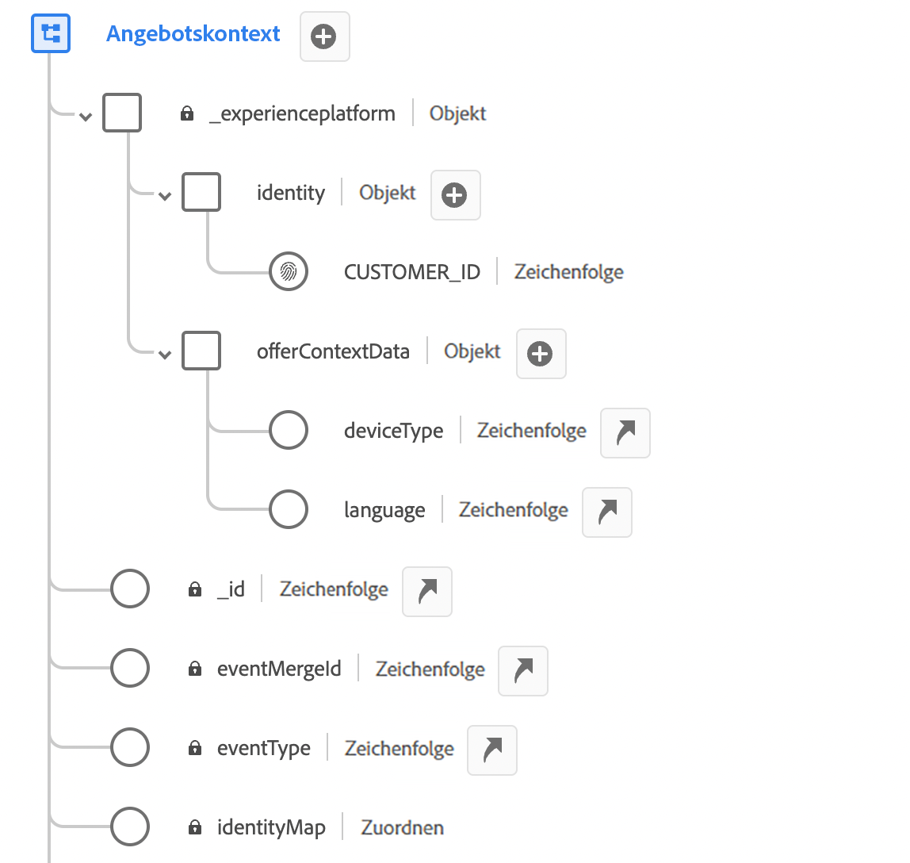
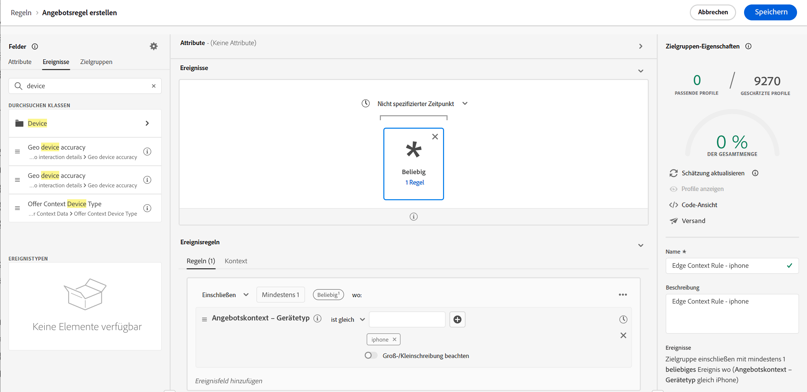
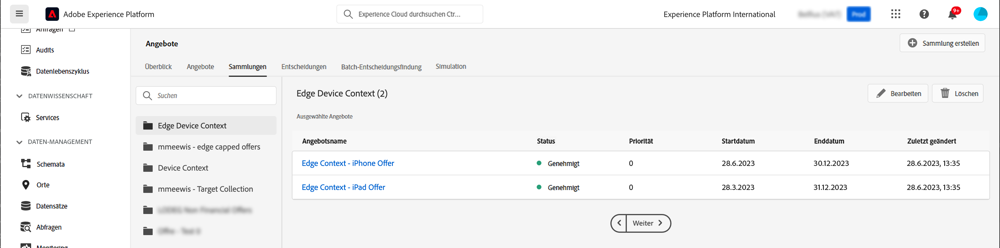
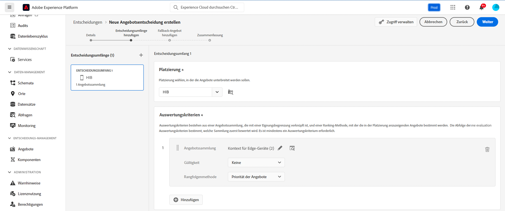
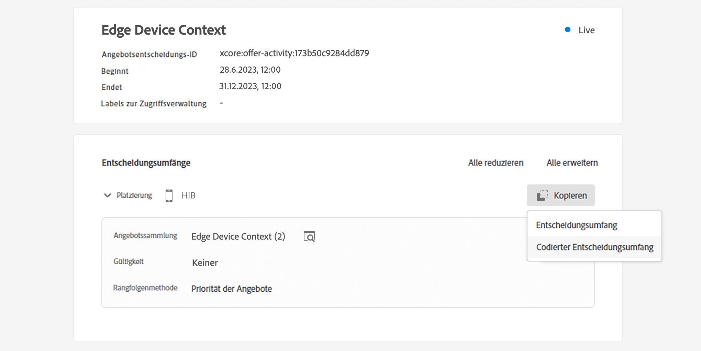

# Kontextdaten und Edge-Entscheidungsanfragen {#edge}

Dieser Abschnitt führt Sie durch die Übergabe von Kontextdaten in Edge-Entscheidungsanfragen und deren Verwendung in Eignungsregeln. Wir werden uns einen End-to-End-Anwendungsfall ansehen, der zeigt, wie Sie personalisierte Angebote basierend auf der Art der Geräte bereitstellen, die Kundinnen und Kunden verwenden.

Dieser Anwendungsfall umfasst mehrere wichtige Schritte:

1. [Voraussetzungen einrichten](#prerequisites): Stellen Sie sicher, dass alle erforderlichen Schritte ausgeführt wurden, um Kontextdaten in Ihren Anfragen zu übergeben.
1. [Kontextdaten in Eignungsregeln verwenden](#rule): Erstellen Sie Regeln, die basierend auf dem Gerätetyp des Benutzers bestimmen, welche Angebote angezeigt werden sollen.
1. [Entwerfen von gerätespezifischen Angeboten](#offers): Erstellen Sie für jeden Gerätetyp maßgeschneiderte Angebote und verknüpfen Sie sie mit den entsprechenden Regeln.
1. [Erstellen einer Angebotssammlung](#collection): Gruppieren Sie alle Angebote in einer statischen Sammlung.
1. [Entscheidung konfigurieren](#decision) : Erstellen Sie eine neue Entscheidung, die die Offer-Decisioning-Engine nutzt, um das beste Angebot auszuwählen, das Benutzenden je nach Gerätetyp unterbreitet werden kann.
1. [Kontextdaten in der Edge-Entscheidungsanfrage übergeben](#request): Kontextdaten über Ihre API-Anfrage übergeben, um die entsprechenden Angebote abzurufen und sie Benutzern zu präsentieren.

>[!BEGINSHADEBOX]

Darüber hinaus können Sie Kontextdaten auch in (Rangfolgeformeln **nutzen** Ihre **dynamisch**. Sie können beispielsweise ein einzelnes Angebot erstellen und Personalisierungsfelder verwenden, um seine Darstellung auf der Grundlage der Kontextdaten anzupassen. Zeigen Sie beispielsweise ein bestimmtes Bild an, wenn der Benutzer über ein iPhone verfügt, und ein anderes für iPad-Benutzer. Weiterführende Informationen hierzu finden Sie in diesen Abschnitten:

* [Rangfolgeformeln - Verstärken von Angeboten basierend auf Kontextdaten](../offers/ranking/create-ranking-formulas.md#context-data)
* [Personalisieren von Darstellungen basierend auf Kontextdaten](../offers/offer-library/add-representations.md#context-data)

>[!ENDSHADEBOX]

## Voraussetzungen für die Übergabe von Kontextdaten in Edge-Entscheidungsanfragen {#prerequisites}

Anstatt den Kontext in einem eher freien Format mithilfe der Decisioning-API zu übergeben, muss die Payload des Edge Decisioning-Kontexts XDM Experience Event-kompatibel sein. Dazu muss der Kontext als Teil des „XDM-Erlebnisereignisses“ definiert werden, das für die Datenerfassung verwendet wird.

1. Definieren eines Erlebnisereignis-Schemas. Für diesen Anwendungsfall wird ein Schema „Angebotskontext“ erstellt und die Felder des Angebotskontexts sind Teil einer Feldergruppe „Angebotskontext“. In Wirklichkeit würde die Feldergruppe zum Erlebnisereignisschema hinzugefügt, das für die Datenerfassung verwendet wird, die mit dem Datenstrom &quot;Edge Collection Network“ verknüpft ist.

   >[!NOTE]
   >
   >Das Erlebnisereignis-Schema des Angebotskontexts muss Teil des Profils sein, wobei ein Feld „CUSTOMER_ID“ als primäre Identität verwendet wird.

   In diesem Beispiel hat die Feldergruppe „Angebotskontext“ zwei Eigenschaften: language und deviceType. Diese Eigenschaften werden in der Ranking- und Eignungsregel des Angebots verwendet.

   {width="60%" align="center" zoomable="yes"}

   Erfahren Sie im Handbuch zum Experience-Datenmodell ([) in Adobe Experience Platform, wie Sie mit Schemas arbeiten](https://experienceleague.adobe.com/en/docs/experience-platform/xdm/home){target="_blank"}

1. Erstellen Sie einen Datensatz (hier „Angebotskontext„) und stellen Sie sicher, dass er für das Profil aktiviert ist.

1. Erstellen Sie einen neuen Datenstrom aus dem Menü **[!UICONTROL Datenerfassung]** > **[!UICONTROL Datenströme]** . Im Handbuch zu Datenströmen in Adobe Experience Platform erfahren Sie[ wie Sie einen Datenstrom erstellen und ](https://experienceleague.adobe.com/de/docs/experience-platform/datastreams/configure){target="_blank"}

   Hier haben wir einen Datenstrom „Angebotskontext“ erstellt, in dem das Ereignisschema „Angebotsinhalt“ ausgewählt ist.

   

1. Bearbeiten Sie den neu erstellten Datenstrom und wählen Sie &quot;Adobe Experience Platform&quot; als Service und „Angebotskontext“ als Ereignisdatensatz aus.

   

1. Speichern Sie den Datenstrom und kopieren Sie seine ID. Diese ID wird in Ihrem API-Anfrage-Endpunkt verwendet. [Erfahren Sie, wie Sie den API-Aufruf erstellen](#request)

   

## Verwenden von Kontextdaten in Eignungsregeln {#rules}

Erstellen Sie Eignungsregeln, die basierend auf dem Gerätetyp des Benutzers bestimmen, welche Angebote angezeigt werden sollen:



* iPhone-Geräteregel:

   * Regelname: &quot;Edge Context Rule - iPhone“
   * Konfiguration: deviceType = &#39;iphone&#39;
   * PQL-Syntax:

     ```
     select _Any1 from xEvent where _Any1._experienceplatform.offerContextData.deviceType.equals("iphone", false)
     ```

* iPad-Geräteregel:

   * Regelname: &quot;Edge Context Rule - iPad“
   * Konfiguration: deviceType = &#39;ipad&#39;
   * PQL-Syntax

     ```
     select _Any1 from xEvent where _Any1._experienceplatform.offerContextData.deviceType.equals("ipad", false)
     ```

## Angebote erstellen {#offers}

Erstellen Sie für jeden Gerätetyp ein Angebot und verknüpfen Sie es mit der entsprechenden zuvor erstellten Eignungsregel:

* Angebot für iPhone-Benutzer:

   * Angebotsname : &quot;Edge-Kontext - iPhone-Angebotsinhalt“
   * Zugeordnete Regel: &quot;Edge-Kontextregel - iPhone“

* Angebot für iPad-Benutzer:

   * Angebotsname: Edge-Kontext - iPad-Angebotsinhalt :
   * Zugeordnete Regel: &quot;Edge-Kontextregel - iPad“

Erstellen Sie außerdem ein Fallback-Angebot (hier „Kontext-Fallback-Inhalt„), das angezeigt wird, wenn keine bestimmten Gerätekriterien erfüllt sind.

## Hinzufügen von Angeboten in einer Sammlung {#collection}

Fügen Sie die zuvor erstellten Angebote zu einer statischen Sammlung mit dem Namen hier &quot;Edge Device Context“ hinzu. In dieser Sammlung wählt die Angebotsentscheidung die geeigneten Angebote aus, die Kunden unterbreitet werden sollen.



## Angebotsentscheidung erstellen {#decision}

Erstellen Sie eine neue Entscheidung, die die Offer-Decisioning-Engine nutzt, um das beste Angebot auszuwählen, das Benutzenden basierend auf ihrem Gerätetyp unterbreitet werden soll, wobei das Angebot „Kontext-Fallback“ als Fallback-Angebot ausgewählt wurde.



>[!NOTE]
>
>Darüber hinaus können Sie Kontextdaten in Rangfolgeformeln einsetzen und sie Ihrer Entscheidung zuweisen. ADD INFORMATION

## Übergeben von Kontextdaten in der Edge Decisioning-Anfrage {#request}

### Endpunkt

Verwenden Sie im Endpunkt die ID des zuvor [Datenstroms](#prerequisites).

`https://edge.adobedc.net/ee/irl1/v1/interact?configId=f3c47f2a-c484-4908-87a5-a82b55039e22`

### Payload

Im Folgenden finden Sie ein Beispiel für eine Anfrage zur Übergabe von Kontextdaten.

* Informationen über den Gerätetyp werden im `xdm:ContextData` Knoten übergeben.
* Kopieren Sie im Knoten `decisionScopes` den zuvor konfigurierten Entscheidungsumfang der [Angebotsentscheidung](#decision) und fügen Sie ihn ein.

  +++Wo der Entscheidungsumfang abgerufen werden soll

  

+++

```
{
	"events": [{
		"xdm": {
			"identityMap": {
				"customerId": [{
					"id": "0000158216",
					"authenticatedState": "authenticated",
					"primary": true
				}]
			},
			"_experienceplatform": {
				"identity": {
					"core": {
						"customerId": "0000158216"
					}
				},
                "offerContextData" : {
                    "language" : "NL",
                    "deviceType" : "iphone"
                }
			}
		}
	}],
	"query": {
		"personalization": {
			"decisionScopes": ["eyJ4ZG06YWN0aXZpdHlJZCI6Inhjb3JlOm9mZmVyLWFjdGl2aXR5OjE3M2I1MGM5Mjg0ZGQ4NzkiLCJ4ZG06cGxhY2VtZW50SWQiOiJ4Y29yZTpvZmZlci1wbGFjZW1lbnQ6MTZhMzQxZWQ4ZDYyMzc2MSJ9"]
		}
	}
}
```

### Antwort

Hier finden Sie eine Beispielantwort:

```
{
    "requestId": "14a2d3f5-a6fa-494e-b42c-cc65a845284a",
    "handle": [
        {
            "payload": [
                {
                    "id": "1eafc831-4819-4800-8e25-c9e9f0838e09",
                    "scope": "eyJ4ZG06YWN0aXZpdHlJZCI6Inhjb3JlOm9mZmVyLWFjdGl2aXR5OjE3M2I1MGM5Mjg0ZGQ4NzkiLCJ4ZG06cGxhY2VtZW50SWQiOiJ4Y29yZTpvZmZlci1wbGFjZW1lbnQ6MTZhMzQxZWQ4ZDYyMzc2MSJ9",
                    "activity": {
                        "id": "xcore:offer-activity:173b50c9284dd879",
                        "etag": "1",
                        "name": "Edge Device Context"
                    },
                    "placement": {
                        "id": "xcore:offer-placement:16a341ed8d623761",
                        "etag": "1",
                        "name": "HIB",
                        "channel": "https://ns.adobe.com/xdm/channel-types/mobile",
                        "componentType": "https://ns.adobe.com/experience/offer-management/content-component-json"
                    },
                    "items": [
                        {
                            "id": "xcore:personalized-offer:173b4e05676d87f5",
                            "etag": "3",
                            "name": "Edge Context - iPhone Offer",
                            "priority": 0,
                            "schema": "https://ns.adobe.com/experience/offer-management/content-component-json",
                            "data": {
                                "id": "xcore:personalized-offer:173b4e05676d87f5",
                                "format": "application/json",
                                "language": [
                                    "en-gb"
                                ],
                                "content": "{\n    \"name\" : \"iphone offer\"\n}"
                            }
                        }
                    ]
                }
            ],
            "type": "personalization:decisions",
            "eventIndex": 0
        },
        {
            "payload": [],
            "type": "activation:pull",
            "eventIndex": 0
        },
        {
            "payload": [],
            "type": "personalization:decisions",
            "eventIndex": 0
        },
        {
            "payload": [
                {
                    "scope": "Target",
                    "hint": "37",
                    "ttlSeconds": 1800
                },
                {
                    "scope": "AAM",
                    "hint": "6",
                    "ttlSeconds": 1800
                },
                {
                    "scope": "EdgeNetwork",
                    "hint": "irl1",
                    "ttlSeconds": 1800
                }
            ],
            "type": "locationHint:result"
        },
        {
            "payload": [
                {
                    "key": "kndctr_907075E95BF479EC0A495C73_AdobeOrg_identity",
                    "value": "CiY0MDAwMDgyMjMzNTEzNzU1OTcwMjQ0NDcyNjU1MTAyMDEwNDQ3MVIRCNnE4Y6QMRABGAEqBElSTDHwAdnE4Y6QMQ==",
                    "maxAge": 34128000
                },
                {
                    "key": "kndctr_907075E95BF479EC0A495C73_AdobeOrg_cluster",
                    "value": "irl1",
                    "maxAge": 1800
                }
            ],
            "type": "state:store"
        }
    ]
}
```
