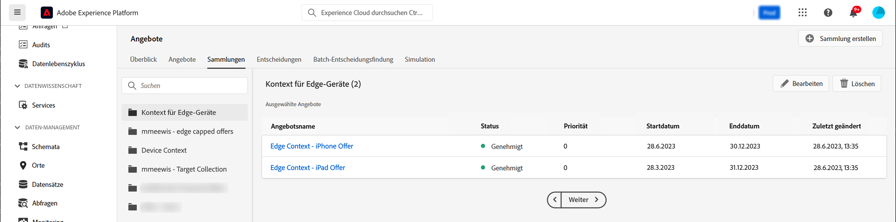

# Kontextdaten und Edge Decisioning-Anfragen {#edge}

Dieser Abschnitt erläutert das Übergeben von Kontextdaten in Edge Decisioning-Anfragen und deren Verwendung in Eignungsregeln. Es wird ein End-to-End-Anwendungsfall vorgestellt, der zeigt, wie Sie personalisierte Angebote basierend auf dem Gerätetyp bereitstellen, den Kundinnen und Kunden verwenden.

Dieser Anwendungsfall umfasst mehrere wichtige Schritte:

1. [Einrichten der Voraussetzungen](#prerequisites): Stellen Sie sicher, dass alle erforderlichen Schritte ausgeführt wurden, um Kontextdaten in Ihren Anfragen zu übergeben.
1. [Verwenden von Kontextdaten in Eignungsregeln](#rules): Erstellen Sie Regeln, die basierend auf dem Gerätetyp der Benutzenden bestimmen, welche Angebote angezeigt werden sollen.
1. [Entwerfen von gerätespezifischen Angeboten](#offers): Erstellen Sie für jeden Gerätetyp maßgeschneiderte Angebote und verknüpfen Sie sie mit den entsprechenden Regeln.
1. [Erstellen einer Angebotssammlung](#collection): Gruppieren Sie alle Angebote in einer statischen Sammlung.
1. [Konfigurieren einer Entscheidung](#decision) : Erstellen Sie eine neue Entscheidung, die die Angebotsentscheidungs-Engine nutzt, um basierend auf ihrem Gerätetyp das beste Angebot für Benutzerinnen und Benutzer auszuwählen.
1. [Übergeben von Kontextdaten in der Edge Decisioning-Anfrage](#request): Übergeben Sie Kontextdaten über die API-Anfrage, um die entsprechenden Angebote abzurufen und sie Benutzerinnen und Benutzern zu präsentieren.

>[!BEGINSHADEBOX]

Darüber hinaus können Sie Kontextdaten auch in **Rangfolgeformeln** nutzen, oder um Ihre **Angebotsdarstellungen dynamisch zu personalisieren**. Sie können beispielsweise ein einzelnes Angebot erstellen und Personalisierungsfelder verwenden, um seine Darstellung basierend auf Kontextdaten anzupassen. Zeigen Sie beispielsweise ein bestimmtes Bild für iPhone-Benutzerinnen und -Benutzer an und ein anderes für iPad-Benutzerinnen und -Benutzer. Weitere Informationen finden Sie in den folgenden Abschnitten:

* [Rangfolgeformeln – Verstärken von Angeboten basierend auf Kontextdaten](../offers/ranking/create-ranking-formulas.md#context-data)
* [Personalisieren von Darstellungen basierend auf Kontextdaten](../offers/offer-library/add-representations.md#context-data)

>[!ENDSHADEBOX]

## Voraussetzungen für die Übergabe von Kontextdaten in Edge Decisioning-Anfragen {#prerequisites}

Anstatt den Kontext in einem eher freien Format mithilfe der Decisioning-API zu übergeben, muss die Payload des Edge Decisioning-Kontexts kompatibel mit dem XDM-Erlebnisereignis sein. Dazu muss der Kontext als Teil des „XDM-Erlebnisereignisses“ definiert werden, das für die Datenerfassung verwendet wird.

1. Definieren Sie ein Erlebnisereignis-Schema. Für diesen Anwendungsfall wird ein „Angebotskontext“-Schema erstellt und die Felder des Angebotskontexts sind Teil einer „Angebotskontext“-Feldergruppe. In Wirklichkeit würde die Feldergruppe zum Erlebnisereignis-Schema hinzugefügt werden, das für die mit dem Datenstrom „Edge-Erfassungsnetzwerk“ verknüpfte Datenerfassung verwendet wird.

   >[!NOTE]
   >
   >Das Erlebnisereignis-Schema des Angebotskontexts muss Teil des Profils sein, wobei ein Feld „CUSTOMER_ID“ als primäre Identität verwendet wird.

   In diesem Beispiel weist die Feldergruppe „Angebotskontext“ zwei Eigenschaften auf: „language“ und „deviceType“. Diese Eigenschaften werden in den Rangfolge- und Eignungsregeln des Angebots verwendet.

   {width="60%" align="center" zoomable="yes"}

   Erfahren Sie im Handbuch zum Experience-Datenmodell ([) in Adobe Experience Platform, wie Sie mit Schemas arbeiten](https://experienceleague.adobe.com/de/docs/experience-platform/xdm/home){target="_blank"}

1. Erstellen Sie einen Datensatz (hier „Angebotskontext“) und stellen Sie sicher, dass er für das Profil aktiviert ist.

1. Erstellen Sie über das Menü **[!UICONTROL Datenerfassung]** > **[!UICONTROL Datenströme]** einen neuen Datenstrom. Im Handbuch zu Datenströmen in Adobe Experience Platform erfahren Sie[ wie Sie einen Datenstrom erstellen und ](https://experienceleague.adobe.com/de/docs/experience-platform/datastreams/configure){target="_blank"}

   Hier wurde ein „Angebotskontext“-Datenstrom erstellt, in dem das Ereignisschema „Angebotsinhalt“ ausgewählt ist.

   

1. Bearbeiten Sie den neu erstellten Datenstrom und wählen Sie „Adobe Experience Platform“ als Service sowie „Angebotskontext“ als Ereignisdatensatz aus.

   

1. Speichern Sie den Datenstrom und kopieren Sie seine ID. Diese ID wird im Endpunkt Ihrer API-Anfrage verwendet. [Weiter Informationen zum Erstellen des API-Aufrufs](#request)

   

## Verwenden von Kontextdaten in Eignungsregeln {#rules}

Erstellen Sie Eignungsregeln, die basierend auf dem Gerätetyp der Benutzerinnen und Benutzer bestimmen, welche Angebote angezeigt werden sollen:


* iPhone-Geräteregel:

   * Regelname: „Edge-Kontextregel – iPhone“
   * Konfiguration: deviceType = &#39;iphone&#39;
   * PQL-Syntax:

     ```
     select _Any1 from xEvent where _Any1._experienceplatform.offerContextData.deviceType.equals("iphone", false)
     ```

* iPad-Geräteregel:

   * Regelname: „Edge-Kontextregel – iPad“
   * Konfiguration: deviceType = &#39;ipad&#39;
   * PQL-Syntax

     ```
     select _Any1 from xEvent where _Any1._experienceplatform.offerContextData.deviceType.equals("ipad", false)
     ```

## Erstellen der Angebote {#offers}

Erstellen Sie für jeden Gerätetyp ein Angebot und verknüpfen Sie es mit der entsprechenden zuvor erstellten Eignungsregel:

* Angebot für iPhone-Benutzende:

   * Angebotsname: „Edge-Kontext – iPhone-Angebotsinhalt“
   * Verknüpfte Regel: „Edge-Kontextregel – iPhone“

* Angebot für iPad-Benutzende:

   * Angebotsname: Edge-Kontext – iPad-Angebotsinhalt :
   * Verknüpfte Regel: „Edge-Kontextregel – iPad“

Erstellen Sie außerdem ein Fallback-Angebot (hier „Kontext-Fallback-Inhalt“), das angezeigt wird, wenn keine bestimmten Gerätekriterien erfüllt sind.

## Hinzufügen von Angeboten in einer Sammlung {#collection}

Fügen Sie die zuvor erstellten Angebote zu einer statischen Sammlung hinzu, die hier „Edge-Gerätekontext“ heißt. In dieser Sammlung wählt die Angebotsentscheidung die geeigneten Angebote aus, die Kundinnen und Kunden unterbreitet werden sollen.



## Erstellen der Angebotsentscheidung {#decision}

Erstellen Sie eine neue Entscheidung, die die Angebotsentscheidungs-Engine nutzt, um den Benutzerinnen und Benutzern basierend auf ihrem Gerätetyp mit dem als Fallback-Angebot ausgewähltem Angebot „Kontext-Fallback“ das beste Angebot zu unterbreiten.


>[!NOTE]
>
>Darüber hinaus können Sie Kontextdaten in Rangfolgeformeln nutzen und sie Ihrer Entscheidung zuweisen. INFORMATIONEN HINZUFÜGEN

## Übergeben von Kontextdaten in der Edge Decisioning-Anfrage {#request}

### Endpunkt

Verwenden Sie im Endpunkt die ID des zuvor erstellten [Datenstroms](#prerequisites).

`https://edge.adobedc.net/ee/irl1/v1/interact?configId=f3c47f2a-c484-4908-87a5-a82b55039e22`

### Payload

Im Folgenden finden Sie ein Beispiel für eine Anfrage, die Kontextdaten übergibt.

* Informationen über den Gerätetyp werden im Knoten `xdm:ContextData` übergeben.
* Kopieren Sie im Knoten `decisionScopes` den Entscheidungsumfang der zuvor konfigurierten [Angebotsentscheidung](#decision) und fügen Sie ihn ein.

  +++Wo der Entscheidungsumfang abgerufen werden kann

  

+++

```
{
    "events": [{
        "xdm": {
            "identityMap": {
                "customerId": [{
                    "id": "0000158216",
                    "authenticatedState": "authenticated",
                    "primary": true
                }]
            },
            "_experienceplatform": {
                "identity": {
                    "core": {
                        "customerId": "0000158216"
                    }
                },
                "offerContextData" : {
                    "language" : "NL",
                    "deviceType" : "iphone"
                }
            }
        }
    }],
    "query": {
        "personalization": {
            "decisionScopes": ["eyJ4ZG06YWN0aXZpdHlJZCI6Inhjb3JlOm9mZmVyLWFjdGl2aXR5OjE3M2I1MGM5Mjg0ZGQ4NzkiLCJ4ZG06cGxhY2VtZW50SWQiOiJ4Y29yZTpvZmZlci1wbGFjZW1lbnQ6MTZhMzQxZWQ4ZDYyMzc2MSJ9"]
        }
    }
}
```

### Antwort

Im Folgenden finden Sie eine Beispielantwort:

```
{
    "requestId": "14a2d3f5-a6fa-494e-b42c-cc65a845284a",
    "handle": [
        {
            "payload": [
                {
                    "id": "1eafc831-4819-4800-8e25-c9e9f0838e09",
                    "scope": "eyJ4ZG06YWN0aXZpdHlJZCI6Inhjb3JlOm9mZmVyLWFjdGl2aXR5OjE3M2I1MGM5Mjg0ZGQ4NzkiLCJ4ZG06cGxhY2VtZW50SWQiOiJ4Y29yZTpvZmZlci1wbGFjZW1lbnQ6MTZhMzQxZWQ4ZDYyMzc2MSJ9",
                    "activity": {
                        "id": "xcore:offer-activity:173b50c9284dd879",
                        "etag": "1",
                        "name": "Edge Device Context"
                    },
                    "placement": {
                        "id": "xcore:offer-placement:16a341ed8d623761",
                        "etag": "1",
                        "name": "HIB",
                        "channel": "https://ns.adobe.com/xdm/channel-types/mobile",
                        "componentType": "https://ns.adobe.com/experience/offer-management/content-component-json"
                    },
                    "items": [
                        {
                            "id": "xcore:personalized-offer:173b4e05676d87f5",
                            "etag": "3",
                            "name": "Edge Context - iPhone Offer",
                            "priority": 0,
                            "schema": "https://ns.adobe.com/experience/offer-management/content-component-json",
                            "data": {
                                "id": "xcore:personalized-offer:173b4e05676d87f5",
                                "format": "application/json",
                                "language": [
                                    "en-gb"
                                ],
                                "content": "{\n    \"name\" : \"iphone offer\"\n}"
                            }
                        }
                    ]
                }
            ],
            "type": "personalization:decisions",
            "eventIndex": 0
        },
        {
            "payload": [],
            "type": "activation:pull",
            "eventIndex": 0
        },
        {
            "payload": [],
            "type": "personalization:decisions",
            "eventIndex": 0
        },
        {
            "payload": [
                {
                    "scope": "Target",
                    "hint": "37",
                    "ttlSeconds": 1800
                },
                {
                    "scope": "AAM",
                    "hint": "6",
                    "ttlSeconds": 1800
                },
                {
                    "scope": "EdgeNetwork",
                    "hint": "irl1",
                    "ttlSeconds": 1800
                }
            ],
            "type": "locationHint:result"
        },
        {
            "payload": [
                {
                    "key": "kndctr_907075E95BF479EC0A495C73_AdobeOrg_identity",
                    "value": "CiY0MDAwMDgyMjMzNTEzNzU1OTcwMjQ0NDcyNjU1MTAyMDEwNDQ3MVIRCNnE4Y6QMRABGAEqBElSTDHwAdnE4Y6QMQ==",
                    "maxAge": 34128000
                },
                {
                    "key": "kndctr_907075E95BF479EC0A495C73_AdobeOrg_cluster",
                    "value": "irl1",
                    "maxAge": 1800
                }
            ],
            "type": "state:store"
        }
    ]
}
```
