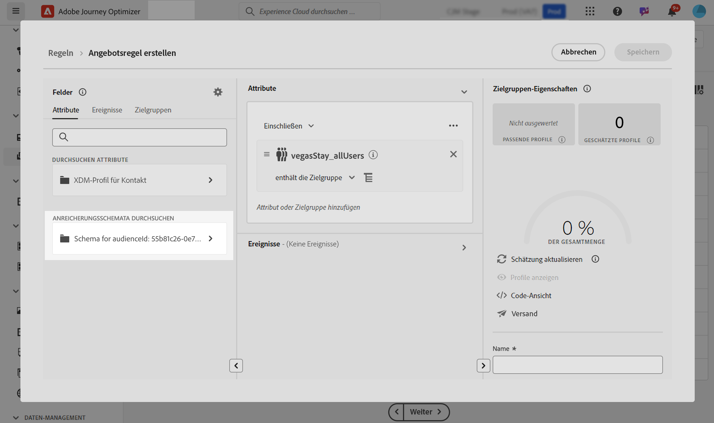

# Nutzen benutzerdefinierter Upload-Zielgruppen zur Entscheidungsfindung {#custom-upload-decisioning}

>[!TIP]
>
>Die neue Entscheidungsfindungsfunktion in [!DNL Adobe Journey Optimizer] ist jetzt über den Code-basierten Erlebniskanal und den E-Mail-Kanal verfügbar. [Weitere Informationen](../experience-decisioning/gs-experience-decisioning.md)

Mit [!DNL Journey Optimizer] können Sie Daten aus Zielgruppen, die mit benutzerdefiniertem Upload (CSV-Datei) erstellt wurden, in [!DNL Adobe Experience Platform] nutzen. Diese Daten unterstützen Ihre Entscheidungs-Management-Workflows. Dies ist besonders nützlich, wenn die Daten nicht im Profil benötigt werden, aber dennoch für Entscheidungszwecke unerlässlich sind.

Daten aus benutzerdefinierten Upload-Zielgruppen können beim Entscheidungs-Management für Folgendes genutzt werden:

1. Eignungskriterien in Angeboten und Entscheidungen
2. Personalisieren von Inhalten in Angebotsdarstellungen

Weiterführende Informationen zu benutzerdefinierten Upload-Zielgruppen finden Sie in den folgenden Abschnitten:

* [Erste Schritte mit Zielgruppen und Journey Optimizer](../audience/about-audiences.md)
* [Importieren einer Zielgruppe in Adobe Experience Platform](https://experienceleague.adobe.com/de/docs/experience-platform/segmentation/ui/audience-portal#import-audience){target="_blank"}

## Wichtige Informationen {#must-read}

* **Nur Entscheidungs-Management** - Diese Funktion wird nur im Entscheidungs-Management unterstützt, nicht in der Entscheidungsfindung (früher als „Erlebnis-Decisioning“ bezeichnet).
* **Nur Decisioning-API (Hub)** - Sie ist ausschließlich über Decisioning-API (Hub)-Anfragen verfügbar und wird von der Edge Decisioning-API oder Batch-Entscheidung nicht unterstützt.
* **Erforderliches API-Flag für Anreicherungsdaten** - Wenn Sie eine benutzerdefinierte Zielgruppe zum Hochladen (CSV) verwenden und Anreicherungsdaten in der Antwort auf die Angebotsentscheidung abrufen möchten, müssen Sie `"xdm:enrichedAudience": true` in die Payload Ihrer API-Anfrage aufnehmen. Ohne dieses Flag werden Anreicherungsattribute aus der CSV-hochgeladenen Zielgruppe nicht zurückgegeben. [Weitere Informationen zur Decisioning-API](api-reference/offer-delivery-api/decisioning-api.md)

## Verwenden einer benutzerdefinierten Upload-Zielgruppe als Eignungskriterium {#eligibilty}

Sie können eine benutzerdefinierte Upload-Zielgruppe als Eignungskriterium sowohl auf Angebots- als auch auf Entscheidungsebene verwenden. Nach dem Hinzufügen können Angebote oder Sammlungen von Angeboten anhand dieses Kriteriums von der Eignung ausgeschlossen werden. Im Folgenden finden Sie die verschiedenen Orte, an denen Sie benutzerdefinierte Zielgruppen zum Hochladen nutzen können, um die Eignung von Angeboten und Entscheidungen zu verfeinern:

* Erstellen Sie eine Entscheidungsregel mithilfe einer benutzerdefinierten Upload-Zielgruppe:

   1. Rufen Sie beim Erstellen einer Regel die Registerkarte **Zielgruppen** auf und suchen Sie in der Liste nach Ihrer CSV-Zielgruppe. Ziehen Sie die Zielgruppe in die Arbeitsfläche der Regel.
   1. Verwenden Sie die **Attribute** und navigieren Sie zu Anreicherungsschemata, die mit der ausgewählten Audience verknüpft sind. Auf diese Weise können Sie auf alle Daten aus der CSV-Datei zugreifen und sie in Ihrer Regel verwenden. [Erfahren Sie, wie Sie eine Entscheidungsregel erstellen können](../offers/offer-library/creating-decision-rules.md).
   1. Speichern Sie die Regel. Nach der Erstellung der Regel kann sie sowohl auf Angebots- als auch auf Entscheidungsebene verwendet werden, um die Eignung einzuschränken.

  

* Verwenden Sie benutzerdefinierte Upload-Zielgruppen als Angebotseinschränkung. [Hinzufügen von Begrenzungen zu einem Angebot](../offers/offer-library/add-constraints.md)

  Beim Erstellen eines Angebots können Sie im Schritt **Einschränkungen hinzufügen** eine der folgenden Aktionen ausführen:

   * Verwenden Sie die benutzerdefinierte Upload-Zielgruppe, um die Eignung eines Angebots zu definieren.
   * Wenden Sie eine Regel an, die die benutzerdefinierte Upload-Zielgruppe nutzt.

  

* Verwenden Sie benutzerdefinierte Upload-Zielgruppen auf Entscheidungsebene.

  Beim Einrichten einer Entscheidung können Sie im Schritt **Entscheidungsumfang hinzufügen** benutzerdefinierte Upload-Zielgruppen als Bewertungskriterium für eine Sammlung von Angeboten verwenden. [Erfahren Sie, wie Sie Entscheidungsumfänge definieren](../offers/offer-activities/create-offer-activities.md#add-decision-scopes).

  

## Personalisieren von Angebotsdarstellungen mit einer benutzerdefinierten Upload-Zielgruppe

Benutzerdefinierte Upload-Zielgruppen können ebenfalls verwendet werden, um den Inhalt von Angebotsdarstellungen zu personalisieren, indem auf Daten aus der CSV-Datei verwiesen wird. [Erfahren Sie, wie Sie Darstellungen zu einem Angebot hinzufügen](../offers/offer-library/add-representations.md).

Um die Attribute einer benutzerdefinierten Upload-Zielgruppe für die Personalisierung zu nutzen, müssen Sie zunächst die benutzerdefinierte Zielgruppe als Einschränkung hinzufügen. Fügen Sie hierzu beim Erstellen eines Angebots im Schritt **Einschränkungen hinzufügen** die Zielgruppe als Einschränkung hinzu oder wählen Sie eine Regel aus, die die benutzerdefinierte Upload-Zielgruppe nutzt.

Nachdem die Zielgruppe als Einschränkung hinzugefügt wurde, können Sie ihre Attribute verwenden, um den Darstellungsinhalt zu personalisieren. Rufen Sie hierzu die Registerkarte **Profilattribute** auf und suchen Sie nach der benutzerdefinierten Upload-Zielgruppe. Wählen Sie die relevanten Attribute aus der Zielgruppe aus, um den Angebotsinhalt zu personalisieren.

