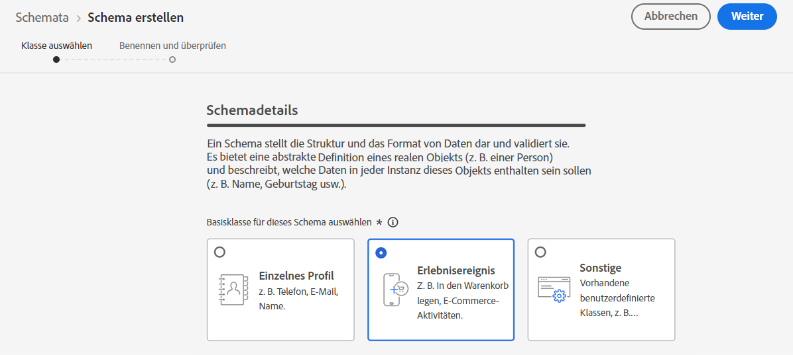
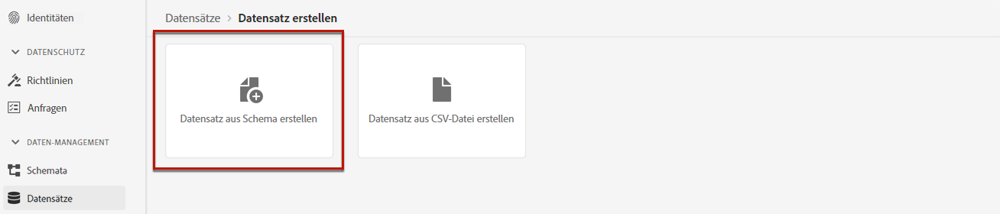

# Erstellen eines Datensatzes zum Erfassen von Ereignissen {#create-dataset}

Um Erlebnisereignisse zu erfassen, müssen Sie zunächst einen Datensatz erstellen, in dem diese Ereignisse gesendet werden.

Erstellen Sie zunächst das Schema, das in Ihrem Datensatz verwendet werden soll:

1. Wählen Sie im Menü **[!UICONTROL Daten-Management]** die Option **[!UICONTROL Schema]** aus, wechseln Sie zur Registerkarte **[!UICONTROL Durchsuchen]** und klicken Sie auf **[!UICONTROL Schema erstellen]**.

   

1. Wählen Sie **[!UICONTROL XDM ExperienceEvent]** aus.

   

   >[!NOTE]
   >
   >Weitere Informationen zu XDM-Schemata und Feldergruppen finden Sie in der [Dokumentation zur XDM-Systemübersicht](https://experienceleague.adobe.com/docs/experience-platform/xdm/home.html?lang=de){target="_blank"}.

1. Wählen Sie im Abschnitt **[!UICONTROL Feldergruppen]** auf der linken Seite **[!UICONTROL Hinzufügen]**.

   

1. Geben Sie im Feld **[!UICONTROL Suche]** „Interaktion mit Vorschlägen“ ein und wählen Sie die Feldergruppe **[!UICONTROL Erlebnisereignis – Vorschlagsinteraktionen]** aus.

   

   >[!CAUTION]
   >
   >Mit dem Schema, das in Ihrem Datensatz verwendet wird, muss die Feldergruppe **[!UICONTROL Erlebnisereignis – Vorschlagsinteraktionen]** verknüpft sein. Andernfalls können Sie es nicht in Ihrer Rangfolgestrategie verwenden.

1. Klicken Sie auf **[!UICONTROL Feldergruppen hinzufügen]**.

   

   >[!NOTE]
   >Die Feldergruppen wurden früher als Mixins bezeichnet.

1. Geben Sie einen Namen ein und speichern Sie das Schema.

>[!NOTE]
>
>Erfahren Sie mehr über das Erstellen von Schemas in [Grundlagen der Schemakomposition](https://experienceleague.adobe.com/docs/experience-platform/xdm/schema/composition.html?lang=de#understanding-schemas){target="_blank"}.

Sie können jetzt einen Datensatz unter Verwendung dieses Schemas erstellen. Gehen Sie dazu wie folgt vor:

1. Wählen Sie im Menü **[!UICONTROL Daten-Management]** die Option **[!UICONTROL Datensätze]** aus, wechseln Sie zur Registerkarte **[!UICONTROL Durchsuchen]** und klicken Sie auf **[!UICONTROL Datensatz erstellen]**.

   

1. Wählen Sie **[!UICONTROL Datensatz aus Schema erstellen]** aus.

   

1. Wählen Sie das soeben erstellte Schema aus der Liste aus.

   

1. Klicken Sie auf **[!UICONTROL Weiter]**.

1. Geben Sie im Feld **[!UICONTROL Name]** einen eindeutigen Namen für den Datensatz ein und klicken Sie auf **[!UICONTROL Beenden]**.

   

>[!NOTE]
>
>Dieser Datensatz kann jetzt ausgewählt werden, um Ereignisdaten zu erfassen, wenn [Erstellen einer Rangstrategie](#create-ranking-strategy).
