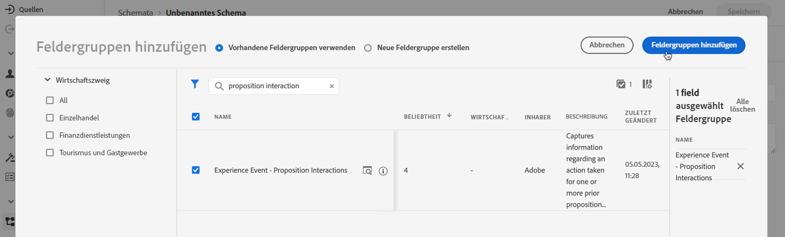

# Erstellen eines Datensatzes zum Erfassen von Ereignissen {#create-dataset}

Um Erlebnisereignisse zu erfassen, müssen Sie zunächst einen Datensatz erstellen, in dem diese Ereignisse gesendet werden.

Erstellen Sie zunächst das Schema, das in Ihrem Datensatz verwendet werden soll:

1. Aus dem **[!UICONTROL Data Management]** Menü auswählen **[!UICONTROL Schema]**.

1. Klicks **[!UICONTROL Schema erstellen]** Wählen Sie oben rechts **[!UICONTROL Erlebnisereignis]** und klicken **Nächste**.

   

   >[!NOTE]
   >
   >Weitere Informationen zu XDM-Schemata und Feldergruppen finden Sie in der [Dokumentation zur XDM-Systemübersicht](https://experienceleague.adobe.com/docs/experience-platform/xdm/home.html?lang=de){target="_blank"}.

1. Geben Sie einen Namen und eine Beschreibung für Ihr Schema ein und klicken Sie auf **Beenden**.
   

1. Wählen Sie im Abschnitt **[!UICONTROL Feldergruppen]** auf der linken Seite **[!UICONTROL Hinzufügen]**.

   

1. Geben Sie im Feld **[!UICONTROL Suche]** „Interaktion mit Vorschlägen“ ein.

1. Wählen Sie die Feldergruppe **[!UICONTROL Erlebnisereignis – Interaktionen mit Vorschlägen]** und klicken Sie auf **[!UICONTROL Feldergruppen hinzufügen]**.

   

   >[!CAUTION]
   >
   >Mit dem Schema, das in Ihrem Datensatz verwendet wird, muss die Feldergruppe **[!UICONTROL Erlebnisereignis – Vorschlagsinteraktionen]** verknüpft sein. Andernfalls können Sie es nicht in Ihrem KI-Modell verwenden.

1. Schema speichern.

>[!NOTE]
>
>Erfahren Sie mehr über das Erstellen von Schemata in [Grundlagen der Schemakomposition](https://experienceleague.adobe.com/docs/experience-platform/xdm/schema/composition.html?lang=de#understanding-schemas){target="_blank"}.

Sie können jetzt einen Datensatz unter Verwendung dieses Schemas erstellen. Gehen Sie dazu wie folgt vor:

1. Wählen Sie aus dem Menü **[!UICONTROL Daten-Management]** die Option **[!UICONTROL Datensätze]** aus und navigieren Sie zur Registerkarte **[!UICONTROL Durchsuchen]**.

1. Klicken Sie auf **[!UICONTROL Datensatz erstellen]** und wählen Sie **[!UICONTROL Datensatz aus Schema erstellen]** aus.

   

1. Wählen Sie das soeben erstellte Schema aus der Liste aus und klicken Sie auf **[!UICONTROL Weiter]**.

1. Geben Sie im Feld **[!UICONTROL Name]** einen eindeutigen Namen für den Datensatz ein und klicken Sie auf **[!UICONTROL Beenden]**.

   

>[!NOTE]
>
>Der Datensatz kann jetzt ausgewählt werden, um Ereignisdaten zu erfassen, wenn [ein KI-Modell erstellt wird](../ranking/create-ranking-strategies.md).
