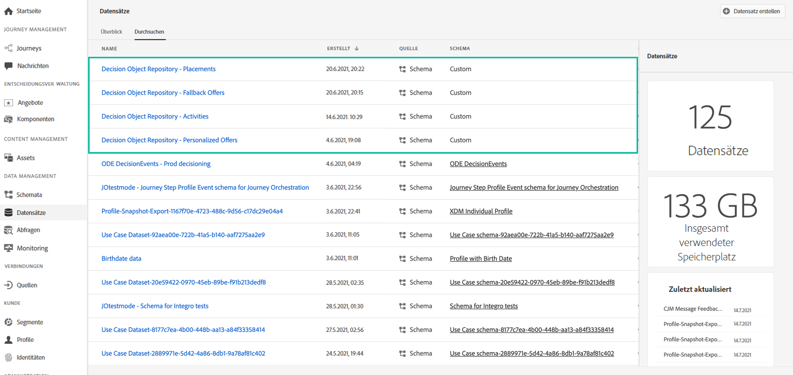
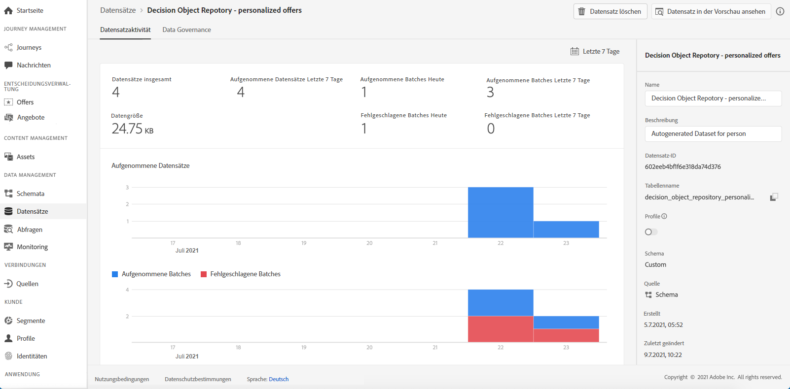
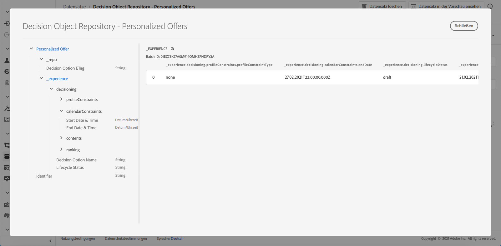

# Zugriff auf den exportierten Angebotskatalog {#access-exported-catalog}

Auf den exportierten Angebotskatalog kann im Menü **[!UICONTROL Datensätze]** von Adobe Experience Platform zugegriffen werden. Für jedes Objekt Ihrer Angebotsbibliothek wird ein Datensatz erstellt.

Klicken Sie auf einen Datensatz, um auf dessen Details zuzugreifen.

Mit der Schaltfläche **[!UICONTROL Datensatz in der Vorschau ansehen]** können Sie den letzten erfolgreichen Batch im Datensatz anzeigen. Im linken Bereich finden Sie Informationen zu den Datentypen, die exportiert wurden.

Weitere Informationen zum Durchsuchen und Verwenden von Datensätzen finden Sie in der [Dokumentation zu Datensätzen in Adobe Experience Platform](https://experienceleague.adobe.com/docs/experience-platform/catalog/datasets/user-guide.html?lang=de#getting-started).
