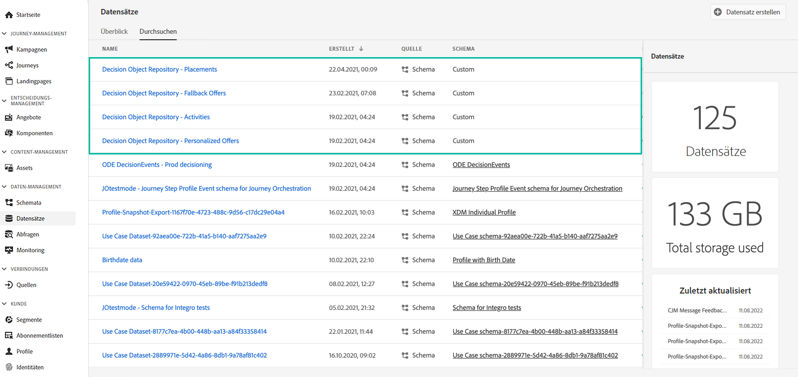
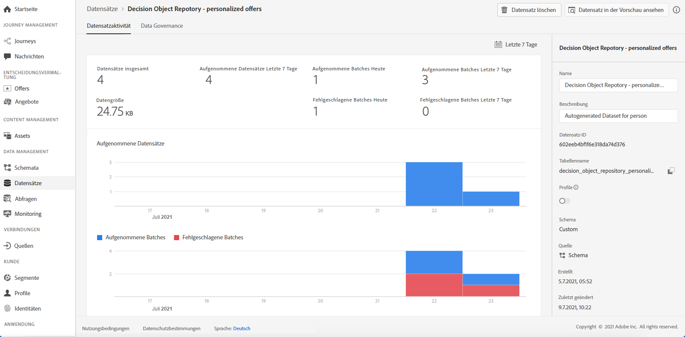

# Zugriff auf den exportierten Angebotskatalog {#access-exported-catalog}

>[!TIP]
>
>Die neue Entscheidungsfindungsfunktion in [!DNL Adobe Journey Optimizer] ist jetzt über den Code-basierten Erlebniskanal und den E-Mail-Kanal verfügbar. [Weitere Informationen](../../experience-decisioning/gs-experience-decisioning.md)

Auf den exportierten Angebotskatalog kann im Menü **[!UICONTROL Datensätze]** von Adobe Experience Platform zugegriffen werden. Für jedes Objekt Ihrer Angebotsbibliothek wird ein Datensatz erstellt.

Klicken Sie auf einen Datensatz, um auf dessen Details zuzugreifen.

Mit der Schaltfläche **[!UICONTROL Datensatz in der Vorschau ansehen]** können Sie den letzten erfolgreichen Batch im Datensatz anzeigen.

Weitere Informationen zum Durchsuchen und Verwenden von Datensätzen finden Sie auf [dieser Seite](../../data/get-started-datasets.md).
