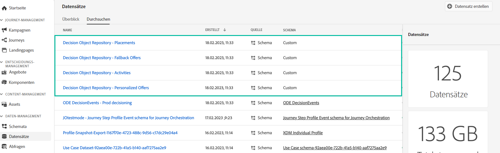

# Zugriff auf den exportierten Angebotskatalog {#access-exported-catalog}

Der exportierte Angebotskatalog ist in Adobe Experience Platform verfügbar. **[!UICONTROL Datasets]** Menü. Für jedes Objekt Ihrer Angebotsbibliothek wird ein Datensatz erstellt.

Klicken Sie auf einen Datensatz, um auf dessen Details zuzugreifen.

Die **[!UICONTROL Preview dataset]** -Schaltfläche können Sie den zuletzt erfolgreichen Batch im Datensatz anzeigen. Im linken Bereich finden Sie Informationen zu den exportierten Datentypen.

Weitere Informationen zum Durchsuchen und Verwenden von Datensätzen finden Sie unter [diese Seite](../../data/get-started-datasets.md).
