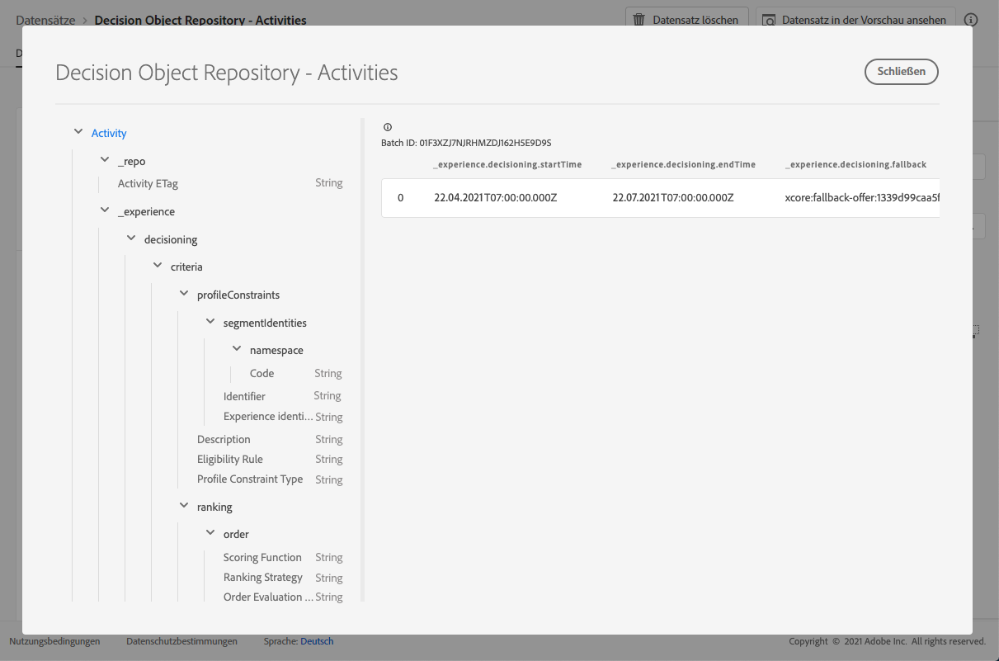

# Entscheidungsdatensatz {#decisions-dataset}

Jedes Mal, wenn ein Angebot geändert wird, wird der automatisch generierte Datensatz für Entscheidungen (früher als „Aktivitäten“ bezeichnet) aktualisiert.

Der zuletzt erfolgreiche Batch im Datensatz wird rechts angezeigt. Die hierarchische Ansicht des Schemas für den Datensatz wird im linken Bereich angezeigt.

>[!NOTE]
>
>In [diesem Abschnitt](../export-catalog/access-dataset.md) erfahren Sie, wie Sie für die einzelnen Objekte Ihrer Angebotsbibliothek auf die exportierten Datensätze zugreifen können.

Im Folgenden finden Sie eine Liste aller Felder, die im Datensatz **[!UICONTROL Entscheidungsobjekt-Repository – Entscheidungen]** (ehemals „Entscheidungsobjekt-Repository – Aktivitäten“) verwendet werden können.

<!--A decision (formerly known as offer decision) is used to control the decisioning process. It specifies the filter applied to the total inventory to narrow down offers by topic/category, the placement to narrow down the inventory to those offers that technically fit into the reserved space for the offer and specifies a fallback option should the combined constraints disqualify all available personalization offers.-->

## Kennung {#identifier}

**Feld:** _id
**Titel:** Kennung
**Beschreibung:** Eindeutige Kennung des Eintrags.
**Typ:** Zeichenfolge

## _experience {#experience}

**Feld:** _experience 
**Typ:** Objekt

### _experience > decisioning

**Feld:** decisioning
**Typ:** Objekt

#### _experience > decisioning > criteria

**Feld:** criteria
**Titel:** Kriterien 
**Beschreibung:** Definiert einen Satz von Entscheidungskriterien, wobei jedes von ihnen eine Reihe von Einschränkungen enthält.
**Typ:** Array

**_experience > decisioning > criteria > description**

**Feld:** description 
**Titel:** Beschreibung 
**Beschreibung:** Kriterienbeschreibung Wird verwendet, um für den Menschen lesbare Absichten zu vermitteln, wie oder warum dieses Kriterium konstruiert wurde und wie es sich auf die Entscheidung auswirkt.
**Typ:** Zeichenfolge

**_experience > decisioning > criteria > optionSelection**

**Feld:** optionSelection 
**Titel:** Optionsauswahl 
**Beschreibung:** Die Optionsauswahl definiert die Gültigkeit/Anwendbarkeit von Optionen in diesem Kontext.
**Typ:** Objekt

* **Beschreibung**

   **Feld:** description
   **Titel:** Beschreibung
   **Beschreibung:** Beschreibung der Optionsauswahl. Sie dient dazu, für Menschen lesbare Absichten darüber zu vermitteln, wie oder warum diese Optionsauswahl erstellt wurde und/oder welche Option passt.
   **Typ:** Zeichenfolge

* **Optionsfilter**

   **Feld:** filter
   **Titel:** Optionsfilter
   **Beschreibung:** Der Verweis auf einen Tag-basierten Filter, der Optionen anhand ihrer angehängten Tags aus einem Inventar auswählt. Der Wert ist die URI (@id) der Entscheidungsregel, auf die verwiesen wird. Siehe Schema https://ns.adobe.com/experience/decisioning/filter.
   **Typ:** Zeichenfolge

* **Profileinschränkungstyp**

   **Feld:** optionSelectionType
   **Titel:** Profileinschränkungstyp
   **Beschreibung:** Bestimmt, ob aktuell Einschränkungen festgelegt sind und wie sie ausgedrückt werden. Dies kann über eine Filterabfrage oder durch eine oder mehrere Segmentzugehörigkeiten erfolgen.
   **Typ:** Zeichenfolge
   **Mögliche Werte:** „none“ (Standard), „directList“, „filter“

* **Optionsliste**

   **Feld:** options
   **Titel:** Optionsliste
   **Beschreibung:** Eine Liste, die die Optionen direkt angibt, ohne eine Filterabfrage zu bewerten. Es kann entweder eine Optionsliste oder eine Optionsfilterregel angegeben werden.
   **Typ:** Array

   <!--Missing title under Option List? Desc = An identifier of an decision option entity. The value value refers to an `@id` property of a decision option. Type: string-->

**_experience > decisioning > criteria > placements**

**Feld:** placements 
**Titel:** Platzierungsbegrenzungen
**Beschreibung:** Die Platzierungsbegrenzung gibt an, dass dieses Kriterium nur für die aufgelisteten Platzierungen gilt. Nur wenn sich die beabsichtigte Platzierung in der Liste `xdm:placements` befindet, wird die Option ausgewählt. Andernfalls werden die gesamten Entscheidungskriterien übersprungen. Wenn die Liste „xdm:placements“ ausgelassen wird oder leer ist, wird das Kriterium für jede beabsichtigte Platzierung berücksichtigt. Die hier aufgeführten Platzierungen erzwingen implizite Kriterien für die Optionsauswahl. Eine zu berücksichtigende Option muss für die Zielplatzierung repräsentativ sein.
**Typ:** Array

* **Platzierungskennung**

   **Titel:** Platzierungskennung
   **Beschreibung:** Ein Verweis auf eine Platzierungsentität. Der Wert ist die URI (@id) der Platzierung, auf die verwiesen wird. Siehe Schema https://ns.adobe.com/experience/decisioning/placement.
   **Typ:** Zeichenfolge

**_experience > decisioning > criteria > profileConstraints**

**Feld:** profileConstraints 
**Titel:** Profilbegrenzung 
**Beschreibung:** Die Profilbegrenzung bestimmt, ob eine Option in diesem Kontext für diese Profil-ID geeignet ist. Wenn die Profileinschränkung die Werte der einzelnen Optionen nicht berücksichtigen muss, d. h. sie gegenüber den Optionen aus der Optionsauswahl invariant ist, hebt die als „false“ ausgewertete Profileinschränkung die gesamte Optionsauswahl auf. Dagegen wird eine Profileinschränkungsregel, die eine Option als Parameter akzeptiert, für jede qualifizierte Option der Optionsauswahl ausgewertet.
**Typ:** Objekt

* **_experience > decisioning > criteria > profileConstraints > Description**

   **Feld:** description
   **Titel:** Beschreibung
   **Beschreibung:** Beschreibung der Profileinschränkung. Sie dient dazu, für Menschen lesbare Absichten darüber zu vermitteln, wie oder warum diese Profileinschränkung erstellt wurde und/oder welche Option von ihr einbezogen oder ausgeschlossen wird.
   **Typ:** Zeichenfolge

* **_experience > decisioning > criteria > profileConstraints > Eligibility Rule**

   **Feld:** eligibilityRule
   **Titel:** Eignungsregel
   **Beschreibung:** Ein Verweis auf eine Entscheidungsregel, die für ein bestimmtes Profil und/oder andere vorhandene kontextbezogene XDM-Objekte als „true“ oder „false“ ausgewertet wird. Die Regel wird verwendet, um zu entscheiden, ob die Option für ein bestimmtes Profil geeignet ist. Der Wert ist die URI (@id) der Entscheidungsregel, auf die verwiesen wird. Siehe Schema https://ns.adobe.com/experience/decisioning/rule.
   **Typ:** Zeichenfolge

* **_experience > decisioning > criteria > profileConstraints > Profile Constraint Type**

   **Feld:** profileConstraintType
   **Titel:** Profileinschränkungstyp
   **Beschreibung:** Bestimmt, ob aktuell Einschränkungen festgelegt sind und wie sie ausgedrückt werden. Dies kann durch eine Regel oder durch ein oder mehrere Segmentzugehörigkeiten erfolgen.
   **Typ:** Zeichenfolge
   **Mögliche Werte:**
   * „none“ (Standard)
   * „eligibilityRule“: „Die Profileinschränkung wird als einzelne Regel ausgedrückt, die als „true“ ausgewertet werden muss, bevor die einschränkende Aktion zulässig ist.“
   * „anySegments“: „Die Profileinschränkung wird als ein oder mehrere Segmente ausgedrückt und das Profil muss zu mindestens einem dieser Segmente zugehörig sein, bevor die eingeschränkte Aktion zulässig ist.“
   * „allSegments“: „Die Profileinschränkung wird als ein oder mehrere Segmente ausgedrückt und das Profil muss zu allen diesen Segmenten zugehörig sein, bevor die eingeschränkte Aktion zulässig ist.“
   * „rules“: „Die Profileinschränkung wird als eine Reihe verschiedener Regeln ausgedrückt, z. B. Gültigkeit, Anwendbarkeit, Eignung, die alle als „true“ ausgewertet werden müssen, bevor die eingeschränkte Aktion zulässig ist.“

* **_experience > decisioning > criteria > profileConstraints > segmentIdentities**

   **Feld:** segmentIdentities
   **Titel:** Segmentkennungen
   **Beschreibung:** Kennungen der Segmente.
   **Typ:** Array

   * **ID**

      **Feld:** _id
      **Titel:** Kennung
      **Beschreibung:** Identität des Segments im betreffenden Namespace.
      **Typ:** Zeichenfolge

   * **namespace**

      **Feld:** namespace
      **Titel:** Namespace
      **Beschreibung**: Der mit dem Attribut `xid` verknüpfte Namespace.
      **Typ:** Objekt
      **Erforderlich:** „code“

      * **Code**

         **Feld:** code
         **Titel:** Code
         **Beschreibung:** Der Code ist eine von Menschen lesbare Kennung für den Namespace und kann verwendet werden, um die technische Namespace-ID anzufordern, die für die Verarbeitung von Identitätsdiagrammen verwendet wird.
         **Typ:** Zeichenfolge
   * **Erlebnis-ID**

      **Feld:** xid
      **Titel:** Erlebnis-ID
      **Beschreibung:** Falls vorhanden, stellt dieser Wert eine Namespace-übergreifende Kennung dar, die unter allen Kennungen in allen Namespaces eindeutig ist.
      **Typ:** Zeichenfolge

**_experience > decisioning > criteria > ranking**

**Feld:** ranking 
**Titel:** Ranking-Details 
**Beschreibung:** Rangfolge (Priorität) Definiert, wie die „beste Option“ angesichts des Kontexts des Entscheidungskriteriums bestimmt wird. Unter allen ausgewählten Optionen, die den Profilbegrenzungen entsprechen, entscheidet die Rangfolge über die beste oder die besten n Optionen, die vorgeschlagen werden.
**Typ: Objekt**

* **_experience > decisioning > criteria > ranking > order**

   **Feld:** order
   **Titel:** Reihenfolgenbewertung
   **Beschreibung:** Bewertung einer relativen Reihenfolge für eine oder mehrere Entscheidungsoptionen. Optionen mit höheren Ordinalzahlen werden vor Optionen mit niedrigeren Ordinalzahlen ausgewählt. Die durch diese Methode ermittelten Werte können geordnet werden, die Entfernungen zwischen ihnen können jedoch nicht gemessen werden. Außerdem können weder Summen noch Produkte berechnet werden. Der Median und der Modalwert sind die einzigen Messwerte der zentralen Tendenz, die für ordinale Daten verwendet werden können.
   **Typ:** Objekt

   * **Scoring-Funktion**

      **Feld:** function
      **Titel:** Scoring-Funktion
      **Beschreibung:** Ein Verweis auf eine Funktion, die einen numerischen Wert für diese Entscheidungsoption berechnet. Entscheidungsoptionen werden dann nach diesem Wert sortiert (nach Rang geordnet). Der Wert dieser Eigenschaft ist die URI (@id) der Funktion, die jeweils mit einer Option aufgerufen werden soll. Siehe Schema https://ns.adobe.com/experience/decisioning/function.
      **Typ:** Zeichenfolge

   * **Reihenfolgenbewertungstyp**

      **Feld:** orderEvaluationType
      **Titel:** Reihenfolgenbewertungstyp
      **Beschreibung:** Gibt an, welcher Mechanismus zur Bewertung der Reihenfolge verwendet wird: eine statische Priorität von Entscheidungsoptionen, eine Scoring-Funktion, die einen numerischen Wert für jede Option berechnet, oder eine Rangfolgestrategie, die eine Liste erhält, um eine Sortierung vorzunehmen.

      **Typ:** Zeichenfolge
      **Mögliche Werte:** „static“, „scoringFunction“, „rankingStrategy“

   * **Rangfolgestrategie**

      **Feld:** rankingStrategy
      **Titel:** Rangfolgestrategie
      **Beschreibung:** Ein Verweis auf eine Strategie, die eine Liste von Entscheidungsoptionen in eine Reihenfolge bringt. Entscheidungsoptionen werden in einer geordneten Liste zurückgegeben. Der Wert dieser Eigenschaft ist die URI (@id) der Funktion, die jeweils mit einer Option aufgerufen werden soll. Siehe Schema https://ns.adobe.com/experience/decisioning/rankingStrategy.
      **Typ:** Zeichenfolge

* **_experience > decisioning > criteria > ranking > Priority**

   **Feld:** priority
   **Titel:** Priorität
   **Beschreibung:** Die Priorität einer einzelnen Entscheidungsoption in Bezug auf alle anderen Optionen. Optionen, für die keine Reihenfolgefunktion angegeben ist, werden mithilfe dieser Eigenschaft priorisiert. Optionen mit höheren Prioritätswerten werden vor Optionen mit niedrigerer Priorität ausgewählt. Wenn zwei oder mehr qualifizierte Optionen den höchsten Prioritätswert aufweisen, wird eine nach dem Zufallsprinzip ausgewählt und für den Entscheidungsvorschlag verwendet.
   **Typ:** Integer
   **Mindestwert:** 0
   **Standardwert:** 0

#### _experience > decisioning > Activity End Date and Time

**Feld:** endTime
**Titel:** Enddatum und -zeit der Aktivität 
**Beschreibung:** Enddatum und -zeit der Entscheidung (früher als „Aktivität“ bezeichnet). Die Eigenschaft hat die Semantik der Eigenschaft „endTime“ von schema.org, die auf http://schema.org/Action definiert ist.
**Typ:** Zeichenfolge

#### _experience > decisioning > Fallback Option

**Feld:** fallback
**Titel:** Fallback-Option 
**Beschreibung:** Der Verweis auf eine Fallback-Option, die verwendet wird, wenn zur Entscheidungsfindung im Kontext dieser Entscheidung keine der regulären Optionen geeignet sind (dies geschieht in der Regel bei Anwendung von harten Einschränkungen). Der Wert ist die URI (@id) der Fallback-Option, auf die verwiesen wird.
**Typ:** Zeichenfolge

#### _experience > decisioning > Activity Name

**Feld:** name 
**Titel:** Aktivitätsname 
**Beschreibung:** Name der Entscheidung (früher als „Aktivität“ bezeichnet) der in verschiedenen Benutzeroberflächen angezeigt wird.
**Typ:** Zeichenfolge

#### _experience > decisioning > Activity Start Date and Time

**Feld:** startTime 
**Titel:** Startdatum und -zeit der Aktivität 
**Beschreibung:** Startdatum und -zeit der Entscheidung (früher als Aktivität bezeichnet). Die Eigenschaft hat die Semantik der Eigenschaft „startTime“ von schema.org, die auf http://schema.org/Action definiert ist.
**Typ:** Zeichenfolge

## _repo {#repo}

**Feld:** _repo 
**Typ:** Objekt

### _repo > Activity Etag

**Feld:** etag
**Titel:** Aktivitäts-ETag
**Beschreibung:** Die Überprüfung, bei der sich das Objekt einer Entscheidung (früher als „Aktivität“ bezeichnet) zum Zeitpunkt des Snapshots befand.
**Typ:** Zeichenfolge
