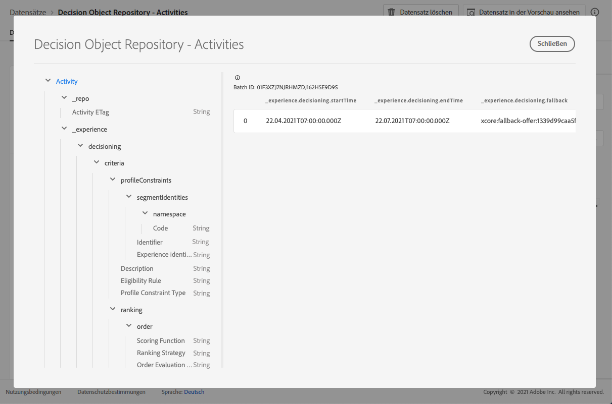

# Entscheidungsdataset {#decisions-dataset}

Bei jeder Änderung eines Angebots wird der automatisch generierte Datensatz für Entscheidungen aktualisiert.

Der letzte erfolgreiche Stapel im Datensatz wird rechts angezeigt. Die hierarchische Ansicht des Schemas für den Datensatz wird im linken Bereich angezeigt.

>[!NOTE]
>
>In [diesem Abschnitt ](../export-catalog/access-dataset.md) erfahren Sie, wie Sie auf die exportierten Datensätze für die einzelnen Objekte Ihrer Angebot-Bibliothek zugreifen.

Im Folgenden finden Sie die Liste aller Felder, die im Dataset **[!UICONTROL Decision Object Repository - Decision]** (ehemals &quot;Decision Object Repository - Aktivitäten&quot;) verwendet werden können.

<!--A decision (formerly known as offer decision) is used to control the decisioning process. It specifies the filter applied to the total inventory to narrow down offers by topic/category, the placement to narrow down the inventory to those offers that technically fit into the reserved space for the offer and specifies a fallback option should the combined constraints disqualify all available personalization offers.-->

## ID

**Feld:** _id 
**Title:** Identifier 
**Description:** Eine eindeutige Kennung für den Datensatz.
**Typ:** Zeichenfolge

## _Erlebnis

**Feld:** _experience 
**Type:** Objekt

### Entscheidungsfindung

**Feld:** Entscheidungstyp 
**:** Objekt

#### Kriterien

**Feld:** Kriterientitel 
**:** Kriterienbeschreibung:
**** Definiert einen Satz von Entscheidungskriterien, bei denen jeder eine Reihe von Einschränkungen enthält.
**Typ:** Array

* **description**

   **Feld:** Beschreibung
   **Titel:** Beschreibung
   **Beschreibung:Beschreibung des** Kriteriums. Es wird verwendet, um für Menschen verständliche Absichten darüber zu vermitteln, wie oder warum dieses Kriterium aufgebaut wurde und wie es die Entscheidung beeinflusst.
   **Typ:** Zeichenfolge

* **optionSelection**

   **Feld:** optionSelection
   **Titel:** Auswahl der Optionen
   **Beschreibung:** Die Optionsauswahl definiert die Gültigkeit/Anwendbarkeit der Optionen in diesem Kontext.
   **Typ:** Objekt

   * **Beschreibung**

      **Feld:** Beschreibung
      **Titel:** Beschreibung
      **Beschreibung:Beschreibung der** Optionsauswahl. Es wird verwendet, um für Menschen lesbare Absichten darüber zu vermitteln, wie oder warum diese Option konstruiert wurde und/oder welche Option übereinstimmt.
      **Typ:** Zeichenfolge

   * **Optionsfilter**

      **Feld:** Filter
      **Titel:** Optionsfilter
      **Beschreibung:** Der Verweis auf einen Tag-basierten Filter, der die Optionen aus einem Bestand mit den angehängten Tags abgleicht. Der Wert ist der URI (@id) der Entscheidungsregel, auf die verwiesen wird. Siehe Schema https://ns.adobe.com/experience/decisioning/filter.
      **Typ:** Zeichenfolge

   * **Profil-Beschränkungstyp**

      **Feld:** optionSelectionType
      **Titel:** Profil-Constraint-Typ
      **Beschreibung:** Bestimmt, ob Einschränkungen aktuell festgelegt sind und wie die Kontraste ausgedrückt werden. Es kann über eine Filterfunktion oder über eine oder mehrere Segmentmitgliedschaften erfolgen.
      **Typ:** Zeichenfolge
      **Mögliche Werte:** &quot;directList&quot;, &quot;filter&quot;
      **Standardwert:** &quot;none&quot;

   * **Option Liste**

      **Feld:** Optionen
      **Titel:** Option, Liste
      **Beschreibung:** Eine Liste, die die Optionen direkt angibt, ohne eine Filter-Abfrage zu bewerten. Es kann entweder eine Liste für Optionen oder eine Filterregel für Optionen angegeben werden.
      **Typ:** Array

      <!--Missing title under Option List? Desc = An identifier of an decision option entity. The value value refers to an `@id` property of a decision option. Type: string-->

* **Platzierungen**

   **Feld:** Platzierungen
   **Titel:** Platzierungsbeschränkungen
   **Beschreibung:** Die Platzierungsbeschränkung besagt, dass dieses Kriterium nur für die aufgelisteten Platzierungen gilt. Nur wenn sich die Zielplatzierung in der Liste `xdm:placements` befindet, wird die Option ausgewählt. Andernfalls werden die gesamten Entscheidungskriterien übersprungen. Wenn die Liste &quot;xdm:placements&quot;ausgelassen oder leer ist, wird das Kriterium für jede zielgerichtete Platzierung berücksichtigt. Die hier aufgeführten Platzierungen stellen implizite Kriterien für die Auswahl der Option dar. Eine zu berücksichtigende Option muss für die zielgerichtete Platzierung repräsentativ sein.
   **Typ:** Array

   * **Platzierungs-ID**

   **Titel:** Platzierungs-ID
   **Beschreibung:** Ein Verweis auf eine Platzierungsentität. Der Wert ist der URI (@id) der Platzierung, auf die verwiesen wird. Siehe Schema https://ns.adobe.com/experience/decisioning/placement.
   **Typ:** Zeichenfolge

* **profileConstraints**

   **Feld:** profileConstraints
   **Titel:** Profil-Beschränkung
   **Beschreibung:** Die Profil-Beschränkung entscheidet, ob eine Optionsauswahl in diesem Profil zur Zeit für diese ID geeignet ist. Wenn die Profil-Beschränkung die Werte der einzelnen Optionen nicht berücksichtigen muss, d. h., sie ist von den Optionen aus der Optionsauswahl ungültig, wird die gesamte Optionsauswahl durch die Profil-Beschränkung, die als &quot;false&quot;ausgewertet wird, abgebrochen. Andererseits wird eine Profil-Beschränkungsregel, die eine Option als Parameter akzeptiert, für jede qualifizierte Option der Optionsauswahl ausgewertet.
   **Typ:** Objekt

   * **Beschreibung**

      **Feld:** Beschreibung
      **Titel:** Beschreibung
      **Beschreibung:Beschreibung der** Profil-Beschränkung. Es wird verwendet, um für Menschen verständliche Absichten darüber zu vermitteln, wie oder warum diese Profil-Beschränkung aufgebaut wurde und/oder welche Option von ihr ausgeschlossen oder ausgeschlossen wird.
      **Typ:** Zeichenfolge

   * **Eignungsregel**

      **Feld:** Berechtigungsregel
      **Titel:** Eignungsregel
      **Beschreibung:** Ein Verweis auf eine Entscheidungsregel, die für ein bestimmtes Profil und/oder andere kontextuelle XDM-Objekte als &quot;true&quot;oder &quot;false&quot;ausgewertet wird. Die Regel wird verwendet, um zu entscheiden, ob die Option für ein bestimmtes Profil geeignet ist. Der Wert ist der URI (@id) der Entscheidungsregel, auf die verwiesen wird. Siehe Schema https://ns.adobe.com/experience/decisioning/rule.
      **Typ:** Zeichenfolge

   * **Profil-Beschränkungstyp**

      **Feld:** profileConstraintType
      **Titel:** Profil-Constraint-Typ
      **Beschreibung:** Bestimmt, ob Einschränkungen aktuell festgelegt sind und wie die Kontraste ausgedrückt werden. Es könnte durch eine Regel oder durch eine oder mehrere Segmentmitgliedschaften erfolgen.
      **Typ:** Zeichenfolge
      **Mögliche Werte:**
      * &quot;Keine&quot;
      * &quot;permissionRule&quot;: &quot;Die Profil-Beschränkung wird als eine einzige Regel ausgedrückt, die als &quot;true&quot;ausgewertet werden muss, bevor die eingeschränkte Aktion zulässig ist.&quot;
      * &quot;anySegments&quot;: &quot;Die Profil-Beschränkung wird als ein oder mehrere Segmente ausgedrückt und das Profil muss Mitglied von mindestens einem von ihnen sein, bevor die eingeschränkte Aktion zulässig ist.&quot;
      * &quot;allSegments&quot;: &quot;Die Profil-Beschränkung wird als ein oder mehrere Segmente ausgedrückt und das Profil muss Mitglied aller Segmente sein, bevor die eingeschränkte Aktion zulässig ist.&quot;
      * &quot;Regeln&quot;: &quot;Die Beschränkung des Profils wird als eine Reihe unterschiedlicher Regeln ausgedrückt, z. B. Förderfähigkeit, Anwendbarkeit, Eignung, die alle als &quot;true&quot;bewertet werden müssen, bevor die eingeschränkte Aktion zulässig ist.&quot;
         **Standardwert:** &quot;none&quot;
   * **Segmentkennung**

      **Feld:** segmentIdentities
      **Titel:** Segmentbezeichner
      **Beschreibung:** Bezeichner der Segmente.
      **Typ:** Array

      * **ID**

         **Feld:** _id
         **Titel:** Bezeichner
         **Beschreibung:** Segmentkennung im zugehörigen Namensraum.
         **Typ:** Zeichenfolge

      * **Namespace**

         **Feld:** Namensraum
         **Titel:** Namensraum
         **Beschreibung:** Der mit dem  `xid` Attribut verknüpfte Namensraum.
         **Typ:** Objekt
         **Erforderlich:** &quot;Code&quot;

         * **Code**

            **Feld:** Code
            **Titel:** Code
            **Beschreibung:** Der Code ist eine für Menschen lesbare Kennung für den Namensraum und kann zum Anfordern der technischen Namensraum-ID verwendet werden, die für die Verarbeitung von Identitätsdiagrammen verwendet wird.
            **Typ:** Zeichenfolge
      * **Erlebnis-ID**

         **Feld:** xid
         **Titel:** Erlebnis-ID
         **Beschreibung:** Wenn dieser Wert vorhanden ist, stellt er eine Kennung für Namensraum dar, die für alle Namensraum-Scoped-Bezeichner in allen Namensräumen eindeutig ist.
         **Typ:** Zeichenfolge

* **Ranking**

   **Feld:** Rangansicht
   **Titel:** Rangdetails
   **Beschreibung:** Rang (Priorität). Definiert, wie die \&quot;beste Option\&quot; angesichts des Kontexts des Entscheidungskriteriums bestimmt wird. Unter allen ausgewählten Optionen, die den Einschränkungen des Profils entsprechen, entscheidet die Rangliste, welche Option(n) am oberen oder oberen Ende (n) vorgeschlagen werden soll.
   **Typ:** Objekt

   * **order**

      **Feld:** Reihenfolge
      **Titel:** Auftragsauswertung
      **Beschreibung:** Bewertung einer relativen Reihenfolge einer oder mehrerer Entscheidungsoptionen. Optionen mit höheren Ordinalwerten werden über allen Optionen mit niedrigeren Ordinalwerten ausgewählt. Die durch diese Methode bestimmten Werte können bestellt werden, die Entfernungen zwischen ihnen können jedoch nicht gemessen werden und es können weder Summen noch Produkte berechnet werden. Der Median und der Modus sind die einzigen Messgrößen der zentralen Tendenz, die für Ordinaldaten verwendet werden können.
      **Typ:** Objekt

      * **Bewertungsfunktion**

         **Feld:** Funktion
         **Titel:** Bewertungsfunktion
         **Beschreibung:** Ein Verweis auf eine Funktion, die eine numerische Bewertung für diese Entscheidungsoption berechnet. Die Entscheidungsoptionen werden dann nach diesem Ergebnis geordnet (geordnet). Der Wert dieser Eigenschaft ist der URI (@id) der Funktion, die jeweils mit der Option &quot;on&quot;aufgerufen wird. Siehe Schema https://ns.adobe.com/experience/decisioning/function.
         **Typ:** Zeichenfolge

      * **Art der Auftragsauswertung**

         **Feld:** orderEvaluationType
         **Titel:** Bestellungsauswertungstyp
         **Beschreibung:** Gibt an, welcher Mechanismus zur Bewertung der Reihenfolge verwendet wird, welche statische Priorität der Entscheidungsoptionen verwendet wird, eine Bewertungsfunktion, die einen numerischen Wert für jede Option berechnet, oder eine Rangstrategie, die eine Liste zur Bestellung erhält.
         **Typ:** Zeichenfolge
         **Mögliche Werte:** &quot;static&quot;, &quot;scoringFunction&quot;, &quot;rankingStrategy&quot;

      * **Rangstrategie**

         **Feld:** Rangstrategie
         **Titel:** Rangstrategie
         **Beschreibung:** Ein Verweis auf eine Strategie, die eine Liste der Entscheidungsoption einstuft. Die Entscheidungsoptionen werden in einer bestellten Liste zurückgegeben. Der Wert dieser Eigenschaft ist der URI (@id) der Funktion, die jeweils mit der Option &quot;on&quot;aufgerufen wird. Siehe Schema https://ns.adobe.com/experience/decisioning/rankingStrategy.
         **Typ:** Zeichenfolge
   * **Priorität**

      **Feld:** Priorität
      **Titel:** Priorität
      **Beschreibung:** Die Priorität einer einzelnen Entscheidungsoption im Verhältnis zu allen anderen Optionen. Optionen, für die keine Bestellfunktion angegeben wird, werden mit dieser Eigenschaft priorisiert. Optionen mit höheren Prioritätswerten werden vor den Optionen mit niedrigerer Priorität ausgewählt. Wenn zwei oder mehr qualifizierte Optionen den höchsten Prioritätswert aufweisen, wird eine nach dem gleichen Zufallsprinzip ausgewählt und für den Entscheidungsvorschlag verwendet.
      **Typ:** integer
      **Mindestwert:** 0
      **Standardwert:** 0

#### Enddatum und -zeit der Aktivität

**Feld:** endTime 
**Title:** Aktivität End Date and Time 
**Description:** Decision End date and end time. Die Eigenschaft hat die Semantik der Eigenschaft &#39;endTime&#39; von Schema.org, die in http://schema.org/Action definiert ist.
**Typ:** Zeichenfolge

#### Fallback-Option

**Feld:** Ersatztitel 
**Titel:** Ersatzoption 
**Beschreibung:** Der Verweis auf eine Ausweichoption, die bei der Entscheidungsfindung im Kontext dieser Entscheidung verwendet wird, stellt keine der regulären Optionen dar (dies geschieht normalerweise, wenn feste Beschränkungen angewendet werden). Der Wert ist der URI (@id) der Ausweichoption, auf die verwiesen wird.
**Typ:** Zeichenfolge

#### Aktivitätsname

**Feld:** name 
**title:** Aktivität Name 
**Description:** Decision name that is displayed in different user interface.
**Typ:** Zeichenfolge

#### Datum und Uhrzeit des Beginns der Aktivität

**Feld:** startTime 
**Title:** Aktivität Beginn Date and Time 
**Description:Datum und Uhrzeit des** Beginns. Die Eigenschaft hat die Semantik der Eigenschaft &quot;startTime&quot;von Schema.org, die in http://schema.org/Action definiert ist.
**Typ:** Zeichenfolge

## _repo

**Feld:** _repo-
**Typ:** Objekt

### Aktivität ETag

**Feld:** Tag-
**Titel:** Aktivität ETag-
**Beschreibung:** Die Revision, bei der sich das Entscheidungsobjekt zum Zeitpunkt des Snapshots befand.
**Typ:** Zeichenfolge
