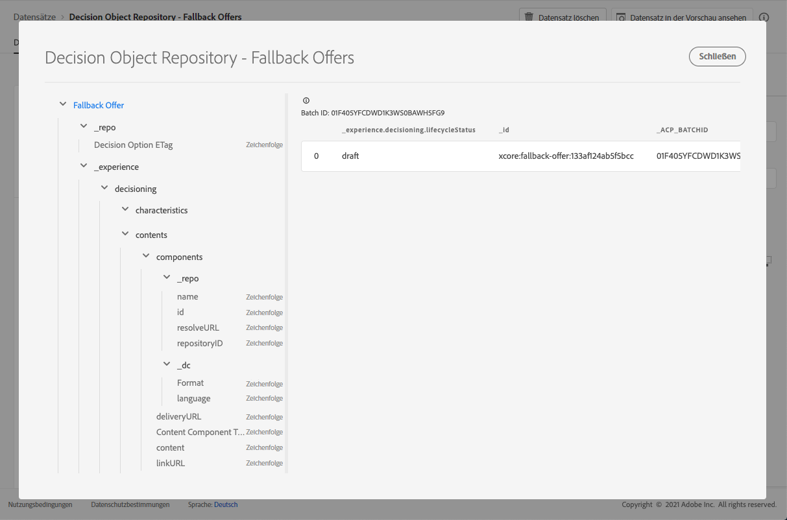

# Datensatz für Fallback-Angebote {#fallback-dataset}

Jedes Mal, wenn ein Angebot geändert wird, wird der automatisch generierte Datensatz für Fallback-Angebote aktualisiert.

Der letzte erfolgreiche Batch im Datensatz wird rechts angezeigt. Die hierarchische Ansicht des Schemas für den Datensatz wird im linken Bereich angezeigt.

>[!NOTE]
>
>In [diesem Abschnitt ](../export-catalog/access-dataset.md) erfahren Sie, wie Sie auf die exportierten Datensätze für die einzelnen Objekte Ihrer Angebotsbibliothek zugreifen.

Hier finden Sie die Liste aller Felder, die im Datensatz **[!UICONTROL Entscheidungsobjekt-Repository – Fallback-Angebote]** verwendet werden können.

## Kennung

**Feld:** _id
**Titel:** Kennung
**Beschreibung:** Eindeutige Kennung des Datensatzes.
**Typ:** Zeichenfolge

## _experience

**Feld:** _experience 
**Typ:** Objekt

### _experience > decisioning

**Feld:** decisioning
**Typ:** Objekt

#### _experience > decisioning > features

**Feld:** characteristics
**Titel:** Merkmale von Entscheidungsoptionen
**Beschreibung:** Weitere Eigenschaften oder Attribute, die zu dieser Entscheidungsoption gehören. Verschiedene Instanzen können unterschiedliche Merkmale aufweisen (Schlüssel bei der Zuordnung). Bei den Merkmalen handelt es sich um Namenswertpaare, mit denen eine Entscheidungsoption von anderen unterschieden wird. Merkmale werden als Werte für Inhalt verwendet, der diese Entscheidungsoption darstellt, sowie als Funktionen zur Analyse und Optimierung der Effektivität einer Option. Wenn jede Instanz dasselbe Attribut oder dieselbe Eigenschaft besitzt, sollte dieses Merkmal als Erweiterungsschema modelliert werden, das aus den Details der Entscheidungsoptionen abgeleitet wird.
**Typ: Objekt**

<!--Field under Characteristics without title = additionalProperties? Desc = Value of the property. Type: string-->

#### _experience > decisioning > contents

**Feld:** contents
**Titel:** Inhaltsdetails
**Beschreibung:** Inhaltselemente zur Darstellung des Entscheidungselements in verschiedenen Kontexten. Eine einzelne Entscheidungsoption kann mehrere Inhaltsvarianten haben. Inhalt ist eine Information, die sich als Teil eines (digitalen) Erlebnisses an eine Audience richtet. Inhalt wird über Kanäle für eine bestimmte Platzierung bereitgestellt.
**Typ: Array**

**_experience > decisioning > contents > components**

**Feld:** components 
**Description:** Die Komponenten des Inhalts, die die Entscheidungsoption darstellen, einschließlich aller zugehörigen Sprachvarianten. Spezifische Komponenten werden durch „dx:format“, „dc:subject“ und „dc:language“ oder eine Kombination daraus gefunden. Diese Metadaten werden verwendet, um den mit einem Angebot verknüpften Inhalt zu suchen oder darzustellen und ihn gemäß dem Platzierungsvertrag zu integrieren.
**Typ:** Array 
**erforderlich:**  &quot;_type&quot;, &quot;_dc&quot;  <!--TBC?-->

* **_experience > decisioning > contents > components > Content Component Type**

   **Feld:** _type
   **Titel:** Inhalts-Komponententyp
   **Beschreibung:** Eine Auflistung von URIs, bei der jeder Wert einem Typ zugeordnet wird, der der Inhaltskomponente zugewiesen wurde. Einige Verbraucher der Inhaltsdarstellungen erwarten, dass der Wert „@type“ ein Verweis auf das Schema ist, in dem zusätzliche Eigenschaften der Inhaltskomponente beschrieben werden.
   **Typ:** Zeichenfolge

* **_experience > decisioning > contents > components > _dc**

   **Feld:** _dc
   **Typ: Objekt**
   **Erforderlich:** „format“

   * **Format**

      **Feld:** format
      **Titel:** Format
      **Beschreibung:** Die physische oder digitale Manifestation der Ressource. Normalerweise sollte das Format den Medientyp der Ressource enthalten. Das Format kann verwendet werden, um die Software, Hardware oder andere Geräte zu ermitteln, die zum Anzeigen oder Verwenden der Ressource erforderlich sind. Es wird empfohlen, einen Wert aus einem kontrollierten Vokabular auszuwählen, z. B. aus der Liste von [Internet-Medientypen](http://www.iana.org/ assignments/media-types/), die Computer-Medienformate definieren.
      **Typ:** Zeichenfolge
      **Beispiel:** „application/vnd.adobe.photoshop“

   * **Sprache**

      **Feld:** language
      **Titel:** Sprache
      **Beschreibung:** Die Sprache oder Sprachen der Ressource. \nSprachen werden im Sprach-Code angegeben, wie in [IETF RFC 3066](https://www.ietf.org/rfc/rfc3066.txt) definiert. Dieser Standard ist Teil von BCP 47, der an anderer Stelle in XDM verwendet wird.
      **Typ: Array**
      **Beispiele:** „\n“, „pt-BR“, „es-ES“

* **_experience > decisioning > contents > components > _repo**

   **Feld:** _repo
   **Typ: Objekt**

   * **id**

      **Feld:** id
      **Beschreibung:** Eine optionale eindeutige Kennung, die auf das Asset in einem Inhalts-Repository verweist. Wenn Plattform-APIs für den Abruf der Darstellung verwendet werden, kann der Client eine weitere Eigenschaft „repo:resolveUrl“ erwarten, um das Asset abzurufen.
      **Typ:** Zeichenfolge
      **Beispiel:** „urn:aaid:sc:US:6dc33479-13ca-4b19-b25d-c805eff8a69e“

   * **name**

      **Feld:** name
      **Beschreibung:** Einige Hinweise zum Speicherort des Repositorys, in dem das externe Asset durch „repo:id“ gespeichert wird.
      **Typ:** Zeichenfolge

   * **repositoryID**

      **Feld:** repositoryID
      **Beschreibung:** Eine optionale eindeutige Kennung, die auf das Asset in einem Inhalts-Repository verweist. Wenn Plattform-APIs für den Abruf der Darstellung verwendet werden, kann der Client eine weitere Eigenschaft „repo:resolveUrl“ erwarten, um das Asset abzurufen.
      **Typ:** Zeichenfolge
      **Beispiel:** „C87932A55B06F7070A49412D@AdobeOrg“

   * **resolveURL**

      **Feld:** resolveURL
      **Beschreibung:** Ein optionaler eindeutiger Ressourcen-Locator zum Lesen des Assets in einem Inhalts-Repository. Dadurch wird der Abruf des Assets erleichtert, ohne dass der Client wissen muss, wo das Asset verwaltet wird und welche APIs aufgerufen werden müssen. Dies ist vergleichbar mit einem HAL-Link, die Semantik ist jedoch einfacher und zweckmäßiger.
      **Typ:** Zeichenfolge
      **Beispiel:** „https://plaftform.adobe.io/resolveByPath?path=&quot;/mycorp/content/projectx/fragment/prod/herobanners/banner14.html3&quot;“

* **_experience > decisioning > contents > components > content**

   **Feld:** content
   **Beschreibung:** Ein optionales Feld zum direkten Speichern von Inhalt. Anstatt auf Inhalt in einem Asset-Repository zu verweisen, kann die Komponente einfachen Inhalt direkt aufnehmen. Dieses Feld wird nicht für Assets mit zusammengesetzten, komplexen und binären Inhalten verwendet.
   **Typ:** Zeichenfolge

* **_experience > decisioning > contents > components > deliveryURL**

   **Feld:** deliveryURL
   **Beschreibung:** Ein optionaler eindeutiger Ressourcen-Locator, der das Asset über ein Content Delivery Network oder einen Service-Endpunkt abruft. Diese URL wird verwendet, um von einem User Agent aus öffentlich auf das Asset zuzugreifen.
   **Typ:** Zeichenfolge
   **Beispiel:** „https://cdn.adobe.io/content/projectx/fragment/prod/static/1232324wd32.jpeg“

* **_experience > decisioning > contents > components > linkURL**

   **Feld:** linkURL
   **Beschreibung:** Ein optionaler eindeutiger Ressourcen-Locator für Benutzerinteraktionen. Diese URL wird verwendet, um den Endbenutzer an einen User Agent zu verweisen, und kann nachverfolgt werden.
   **Typ:** Zeichenfolge
   **Beispiel:** „https://cdn.adobe.io/tracker?code=23432&amp;redirect=/content/projectx/fragment/prod/static/1232324wd32.jpeg“

**_experience > decisioning > contents > Platzierung**

**Feld:** placement 
**Title:** Placement 
**Description:** Platzierung, die einzuhalten ist. Der Wert ist der URI (@id) der Angebotsplatzierung, auf die verwiesen wird. Siehe Schema https://ns.adobe.com/experience/decisioning/placement.
**Typ:** Zeichenfolge

#### _experience > Entscheidung > Lebenszyklusstatus

**Feld:** lifecycleStatus
**Titel:** Lebenszyklus-Status 
**Beschreibung:** Der Lebenszyklus-Status ermöglicht die Ausführung von Workflows mit einem Objekt. Der Status kann sich auf die Sichtbarkeit oder Relevanz eines Objekts auswirken. Statusänderungen werden von den Clients oder Services gesteuert, die die Objekte verwenden.
**Typ:** Zeichenfolge 
**Mögliche Werte:** &quot;Entwurf&quot; (Standard), &quot;Genehmigt&quot;, &quot;Live&quot;, &quot;Abgeschlossen&quot;, &quot;Archiviert&quot;

#### _experience > decisioning > Decision Options Name

**Feld:** name 
**Titel:** Name der Entscheidungsoption 
**Beschreibung:** Optionsname, der in verschiedenen Benutzeroberflächen angezeigt wird.
**Typ:** Zeichenfolge

#### _experience > decisioning > tags

**Feld:** tags 
**Titel:** Tags 
**Beschreibung:** Der Satz von Tags, die dieser Entität zugeordnet sind. Die Tags werden in Filterausdrücken verwendet, um den Gesamtbestand auf eine Untergruppe (Kategorie) einzuschränken.
**Typ: Array**

<!--Field without name under tags: Description: An identifier of a tag object. The value is the @id of the tag that is referenced. See tag schema: https://ns.adobe.com/experience/decisioning/tag. Type: string-->

## _repo

**Feld:** _repo-
**Typ:** Objekt

### _repo > Decision Option ETag

**Feld:** etag
**Titel:** Etag von Entscheidungsoption
**Beschreibung:** Die Überprüfung, bei der sich das Objekt einer Entscheidungsoption zum Zeitpunkt des Snapshots befand.
**Typ:** Zeichenfolge
