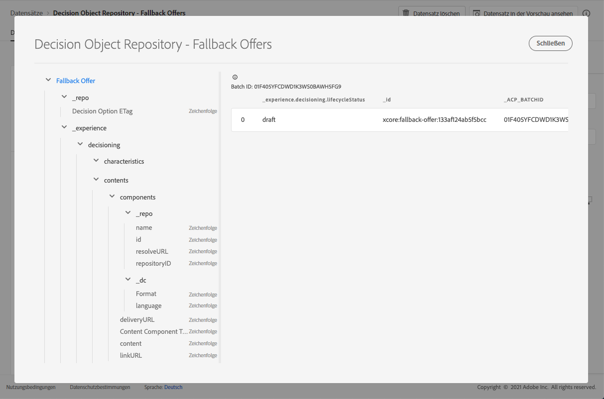

# Datensatz für Fallback-Angebote {#fallback-dataset}

Jedes Mal, wenn ein Angebot geändert wird, wird der automatisch erstellte Datensatz für Fallback-Angebote aktualisiert.

Der zuletzt erfolgreiche Batch im Datensatz wird rechts angezeigt. Die hierarchische Ansicht des Schemas für den Datensatz wird im linken Bereich angezeigt.

>[!NOTE]
>
>In [diesem Abschnitt](../export-catalog/access-dataset.md) erfahren Sie, wie Sie für die einzelnen Objekte Ihrer Angebotsbibliothek auf die exportierten Datensätze zugreifen können.

Im Folgenden finden Sie eine Liste aller Felder, die im Datensatz **[!UICONTROL Entscheidungsobjekt-Repository – Fallback-Angebote]** verwendet werden können.

+++ Kennung

**Feld:** _id
**Titel:** Kennung
**Beschreibung:** Eindeutige Kennung des Eintrags.
**Typ:** Zeichenfolge

+++

+++ _experience

**Feld:** _experience 
**Typ:** Objekt

+++

+++ _experience > decisioning

**Feld:** decisioning
**Typ:** Objekt

+++

+++ _experience > decisioning > characteristics

**Feld:** characteristics
**Titel:** Merkmale der Entscheidungsoption 
**Beschreibung:** Zusätzliche Eigenschaften oder Attribute, die zu dieser bestimmten Entscheidungsoption gehören. Verschiedene Instanzen können unterschiedliche Merkmale aufweisen (Schlüssel in der Zuordnung). Bei den Merkmalen handelt es sich um Namen-Wert-Paare, mit denen eine Entscheidungsoption von anderen unterschieden wird. Merkmale dienen als Werte im Inhalt, der diese Entscheidungsoption darstellt, sowie als Funktionen zur Analyse und Optimierung der Leistung einer Option. Wenn jede Instanz dasselbe Attribut oder dieselbe Eigenschaft hat, sollte dieser Aspekt als Erweiterungsschema modelliert werden, das sich aus den Details der Entscheidungsoption ableitet.
**Typ:** Objekt

+++

<!--Field under Characteristics without title = additionalProperties? Desc = Value of the property. Type: string-->

+++ _experience > decisioning > contents

**Feld:** contents
**Titel** Inhaltsdetails 
**Beschreibung:** Inhaltselemente, die dazu dienen, das Entscheidungselement in verschiedenen Kontexten darzustellen. Eine Entscheidungsoption kann mehrere Inhaltsvarianten aufweisen. Inhalte sind Informationen, die an eine Audience gerichtet und zur Verwendung in einem (digitalen) Erlebnis eingesetzt werden. Inhalte werden über Kanäle in einer bestimmten Platzierung bereitgestellt.
**Typ:** Array

+++

+++_experience > decisioning > contents > components

**Feld:** components
**Beschreibung:** Die Komponenten des Inhalts, der die Entscheidungsoption darstellt, einschließlich aller zugehörigen Sprachvarianten. Spezifische Komponenten werden durch „dx:format“, „dc:subject“ und „dc:language“ oder eine Kombination daraus gefunden. Diese Metadaten werden verwendet, um den mit einem Angebot verknüpften Inhalt zu suchen oder darzustellen und ihn gemäß dem Platzierungsvertrag zu integrieren.
**Typ:** Array
**Erforderlich:** „_type“, „_dc“ <!--TBC?-->

* **_experience > decisioning > contents > components > Content Component Type**

  **Feld:** _type
  **Titel:** Inhaltskomponententyp
  **Beschreibung:** Ein Aufzählungssatz von URIs, bei dem jeder Wert einem der Inhaltskomponente gegebenen Typ zugeordnet ist. Einige Verbraucher der Inhaltsdarstellungen erwarten, dass der @type-Wert ein Verweis auf das Schema ist, das zusätzliche Eigenschaften der Inhaltskomponente beschreibt.
  **Typ:** Zeichenfolge

* **_experience > decisioning > contents > components > _dc**

  **Feld:** _dc
  **Typ:** Objekt
  **Erforderlich:** „format“

   * **Format**

     **Feld:** format
     **Titel:** Format
     **Beschreibung:** Die physische oder digitale Manifestation der Ressource. Normalerweise sollte das Format den Medientyp der Ressource enthalten. Das Format kann verwendet werden, um die Software, Hardware oder andere Geräte zu ermitteln, die zum Anzeigen oder Verwenden der Ressource erforderlich sind. Als Best Practice wird empfohlen, einen Wert aus einem kontrollierten Vokabular auszuwählen, z. B. aus der Liste von [Internet-Medientypen] (http://www.iana.org/ assignments/media-types/), die Computer-Medienformate definiert.
     **Typ:** Zeichenfolge
     **Beispiel:** &quot;application/vnd.adobe.photoshop&quot;

   * **Sprache**

     **Feld:** language
     **Titel:** Sprache
     **Beschreibung:** Die Sprache(n) der Ressource. \nLanguages werden im Sprachen-Code spezifiziert, wie in [IETF RFC 3066](https://www.ietf.org/rfc/rfc3066.txt) definiert, was Teil von BCP 47 ist, das an anderer Stelle in XDM verwendet wird.
     **Typ:** Array
     **Beispiele:** „\n“, „pt-BR“, „es-ES“

* **_experience > decisioning > contents > components > _repo**

  **Feld:** _repo
  **Typ:** Objekt

   * **id**

     **Feld:** id
     **Beschreibung:** Eine optionale eindeutige Kennung, die auf das Asset in einem Content-Repository verweist. Wenn Platform-APIs zum Abrufen der Darstellung verwendet werden, kann der Client erwarten, dass die zusätzliche Eigenschaft \&quot;repo:resolveUrl\&quot; das Asset abruft.
     **Typ:** Zeichenfolge
     **Beispiel:** &quot;urn:aaid:sc:US:6dc33479-13ca-4b19-b25d-c805eff8a69e&quot;

   * **name**

     **Feld:** name
     **Beschreibung:** Einige Hinweise dazu, wo das Repository zu finden ist, in dem das externe Asset von der \&quot;repo:id\&quot; gespeichert wird.
     **Typ:** Zeichenfolge

   * **repositoryID**

     **Feld:** repositoryID
     **Beschreibung:** Eine optionale eindeutige Kennung, die auf das Asset in einem Content-Repository verweist. Wenn Platform-APIs zum Abrufen der Darstellung verwendet werden, kann der Client erwarten, dass die zusätzliche Eigenschaft \&quot;repo:resolveUrl\&quot; das Asset abruft.
     **Typ:** Zeichenfolge
     **Beispiel:** &quot;C87932A55B06F7070A49412D@AdobeOrg&quot;

   * **resolveURL**

     **Feld:** resolveURL
     **Beschreibung:** Eine optionale URL zum Lesen des Assets in einem Content-Repository. So lässt sich das Asset einfacher abrufen, ohne dass der Client weiß, wo das Asset verwaltet wird und welche APIs aufgerufen werden müssen. Dies ähnelt einem HAL-Link, die Semantik ist jedoch einfacher und zweckmäßiger.
     **Typ:** Zeichenfolge
     **Beispiel:** &quot;https://plaftform.adobe.io/resolveByPath?path=&quot;/mycorp/content/projectx/fragment/prod/herobanners/banner14.html3&quot;&quot;

* **_experience > decisioning > contents > components > content**

  **Feld:** content
  **Beschreibung:** Ein optionales Feld für die direkte Speicherung von Inhalten. Anstatt auf Inhalte in einem Asset-Repository zu verweisen, kann die Komponente einfache Inhalte direkt speichern. Dieses Feld wird nicht für Assets mit zusammengesetzten, komplexen oder binären Inhalten verwendet.
  **Typ:** Zeichenfolge

* **_experience > decisioning > contents > components > deliveryURL**

  **Feld:** deliveryURL
  **Beschreibung:** Eine optionale URL, die das Asset aus einem Content Delivery Network (CDN) oder von einem Dienstendpunkt abruft. Diese URL wird verwendet, um von einem User Agent aus öffentlich auf das Asset zuzugreifen.
  **Typ:** Zeichenfolge
  **Beispiel:** &quot;https://cdn.adobe.io/content/projectx/fragment/prod/static/1232324wd32.jpeg&quot;

* **_experience > decisioning > contents > components > linkURL**

  **Feld:** linkURL
  **Beschreibung:** Eine optionale URL für Benutzerinteraktionen. Diese URL wird verwendet, um den Endbenutzer auf einen User Agent zu verweisen, und kann verfolgt werden.
  **Typ:** Zeichenfolge
  **Beispiel:** „https://cdn.adobe.io/tracker?code=23432&amp;redirect=/content/projectx/fragment/prod/static/1232324wd32.jpeg“

+++

+++ _experience > decisioning > contents > Placement

**Feld:** placement 
**Titel:** Platzierung 
**Beschreibung:** Platzierung, die einzuhalten ist. Der Wert ist der URI (@id) der Angebotsplatzierung, auf die verwiesen wird. Siehe Schema https://ns.adobe.com/experience/decisioning/placement.
**Typ:** Zeichenfolge

+++

+++ _experience > decisioning > Lifecycle Status

**Feld:** lifecycleStatus 
**Titel:** Lebenszyklusstatus 
**Beschreibung:** Der Lebenszyklusstatus ermöglicht die Ausführung von Workflows mit einem Objekt. Der Status kann sich auf die Sichtbarkeit oder Relevanz eines Objekts auswirken. Statusänderungen werden von den Clients oder Services gesteuert, die die Objekte verwenden.
**Typ:** Zeichenfolge 
**Mögliche Werte:** „Entwurf“ (Standard), „Genehmigt“, „Live“, „Abgeschlossen“, „Archiviert“

+++

+++ _experience > decisioning > Decision Option Name

**Feld:** name 
**Titel:** Name der Entscheidungsoption 
**Beschreibung:** Optionsname, der in verschiedenen Benutzeroberflächen angezeigt wird.
**Typ:** Zeichenfolge

+++

+++ _experience > decisioning > tags

**Feld:** Tags
**Titel:** Tags
**Beschreibung:** Die Gruppe von Sammlungsqualifizierern (ehemals als „Tags“ bezeichnet), die mit dieser Entität verknüpft sind. Die Sammlungskennzeichner werden in Filterausdrücken verwendet, um den Gesamtbestand auf eine Teilmenge (Kategorie) einzuschränken.
**Typ:** Array

+++

<!--Field without name under collection qualifiers: Description: An identifier of a collection qualifier object. The value is the @id of the collection qualifier that is referenced. See tag schema: https://ns.adobe.com/experience/decisioning/tag. Type: string-->

+++ _repo

**Feld:** _repo 
**Typ:** Objekt

+++

+++ _repo > Decision Option ETag

**Feld:** etag 
**Title:** Entscheidungsoption-E-Tag 
**Beschreibung:** Die Revision, in der sich das Entscheidungsoptionsobjekt zum Zeitpunkt des Speicherauszugs befand.
**Typ:** Zeichenfolge

+++
