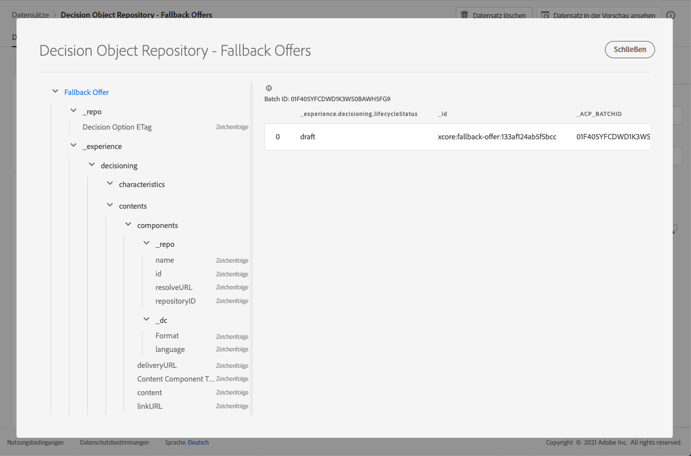

# Datensatz für Fallback-Angebote {#fallback-dataset}

>[!TIP]
>
>Die neue Entscheidungsfindungsfunktion in [!DNL Adobe Journey Optimizer] ist jetzt über den Code-basierten Erlebniskanal und den E-Mail-Kanal verfügbar. [Weitere Informationen](../../experience-decisioning/gs-experience-decisioning.md)

Jedes Mal, wenn ein Angebot geändert wird, wird der automatisch erstellte Datensatz für Fallback-Angebote aktualisiert.

Der letzte erfolgreiche Batch im Datensatz wird rechts angezeigt. Die hierarchische Ansicht des Schemas für den Datensatz wird im linken Bereich angezeigt.

>[!NOTE]
>
>Gelöschte Fallback-Angebote werden im Datensatz als archiviert markiert.

Im Folgenden finden Sie eine Liste aller Felder, die im Datensatz **[!UICONTROL Entscheidungsobjekt-Repository – Fallback-Angebote]** verwendet werden können.

+++ Kennung

**Feld:** _id
**title:** Kennung
**Beschreibung:** Eine eindeutige Kennung für den Datensatz.
**Type:** String

+++

+++ _experience

**Feld:** _experience
**Typ:** Objekt

+++

+++ _experience > decisioning

**Feld:** decisioning
**Typ:** Objekt

+++

+++ _experience > decisioning > characteristics

**Feld:** characteristics
**title:** Merkmale der Entscheidungsoption
**Beschreibung:** Zusätzliche Eigenschaften oder Attribute, die zu dieser bestimmten Entscheidungsoption gehören. Verschiedene Instanzen können unterschiedliche Merkmale aufweisen (Schlüssel in der Zuordnung). Bei den Merkmalen handelt es sich um Namenswertpaare, mit denen eine Entscheidungsoption von anderen unterschieden wird. Merkmale werden als Werte im Inhalt verwendet, der diese Entscheidungsoption darstellt, sowie als Funktionen zur Analyse und Optimierung der Leistung einer Option. Wenn jede Instanz dasselbe Attribut oder dieselbe Eigenschaft hat, sollte dieser Aspekt als Erweiterungsschema modelliert werden, das aus den Details der Entscheidungsoption abgeleitet wird.
**Typ:** Objekt

+++

<!--Field under Characteristics without title = additionalProperties? Desc = Value of the property. Type: string-->

+++ _experience > decisioning > contents

**Feld:** contents
**title:** Inhaltsdetails
**Beschreibung:** Inhaltselemente zum Rendern des Entscheidungselements in verschiedenen Kontexten. Eine einzelne Entscheidungsoption kann mehrere Inhaltsvarianten haben. Inhalte sind Informationen, die sich an eine Audience richten und in einem (digitalen) Erlebnis genutzt werden können. Inhalte werden über Kanäle in einer bestimmten Platzierung bereitgestellt.
**Typ:** Array

+++

+++_experience > decisioning > contents > components

**Feld:** components
**Beschreibung:** Die Komponenten des Inhalts, der die Entscheidungsoption einschließlich aller zugehörigen Sprachvarianten darstellt. Spezifische Komponenten werden durch „dx:format&quot;, „dc:subject&quot; und „dc:language&quot; oder eine Kombination daraus gefunden. Diese Metadaten werden verwendet, um den mit einem Angebot verknüpften Inhalt zu finden oder darzustellen und ihn gemäß dem Platzierungsvertrag zu integrieren.
**Typ:** Array
**Erforderlich:** „_type“, „_dc“ <!--TBC?-->

* **_experience > decisioning > contents > components > Content Component Type**

  **Feld:** _type
  **Titel:** Inhaltskomponententyp
  **Beschreibung:** Eine Auflistung von URIs, bei der jeder Wert einem Typ zugeordnet wird, der der Inhaltskomponente zugewiesen wurde. Einige Verbraucher der Inhaltsdarstellungen erwarten, dass der @type ein Verweis auf ein Schema ist, das zusätzliche Eigenschaften der Inhaltskomponente beschreibt.
  **Typ:** Zeichenfolge

* **_experience > decisioning > contents > components > _dc**

  **Feld:** _dc
  **Typ:** Objekt
  **Erforderlich:** „format“

   * **Format**

     **Feld:** format
     **Titel:** Format
     **Beschreibung:** Die physische oder digitale Manifestation der Ressource. Normalerweise sollte das Format den Medientyp der Ressource enthalten. Das Format kann verwendet werden, um die Software, Hardware oder andere Geräte zu bestimmen, die für die Anzeige oder den Betrieb der Ressource erforderlich sind. Es wird empfohlen, einen Wert aus einem kontrollierten Vokabular auszuwählen, z. B. aus der Liste von [Internet-Medientypen]&#x200B;(https://www.iana.org/ assignments/media-types/), die Computer-Medienformate definieren.
     **Typ:** Zeichenfolge
     **Beispiel:** &quot;application/vnd.adobe.photoshop&quot;

   * **Sprache**

     **Feld:** language
     **Titel:** Sprache
     **Beschreibung:** Die Sprache(n) der Ressource. \nSprachen werden im Sprach-Code angegeben, wie in [IETF RFC 3066](https://www.ietf.org/rfc/rfc3066.txt) definiert. Dieser Standard ist Teil von BCP 47, der an anderer Stelle in XDM verwendet wird.
     **Typ:** Array
     **Beispiele:** „\n“, „pt-BR“, „es-ES“

* **_experience > decisioning > contents > components > _repo**

  **Feld:** _repo
  **Typ:** Objekt

   * **id**

     **Feld:** id
     **Beschreibung:** Eine optionale eindeutige Kennung, die auf das Asset in einem Content-Repository verweist. Wenn Platform-APIs zum Abrufen der Darstellung verwendet werden, kann der Client erwarten, dass eine zusätzliche Eigenschaft \„repo:resolveUrl\&quot; das Asset abruft.
     **Typ:** String
     **Beispiel:** &quot;urn:aaid:sc:US:6dc33479-13ca-4b19-b25d-c805eff8a69e&quot;

   * **name**

     **Feld:** name
     **Beschreibung:** Einige Hinweise zum Speicherort des Repositorys, in dem das externe Asset durch „repo:id“ gespeichert wird.
     **Typ:** Zeichenfolge

   * **repositoryID**

     **Feld:** repositoryID
     **Beschreibung:** Eine optionale eindeutige Kennung, die auf das Asset in einem Content-Repository verweist. Wenn Platform-APIs zum Abrufen der Darstellung verwendet werden, kann der Client erwarten, dass eine zusätzliche Eigenschaft \„repo:resolveUrl\&quot; das Asset abruft.
     **Typ:** String
     **Beispiel:** &quot;C87932A55B06F7070A49412D@AdobeOrg&quot;

   * **resolveURL**

     **Feld:** resolveURL
     **Beschreibung:** Ein optionaler eindeutiger Ressourcen-Locator zum Lesen des Assets in einem Content-Repository. Dadurch wird es einfacher, das Asset abzurufen, ohne dass der Client weiß, wo das Asset verwaltet wird und welche APIs aufgerufen werden müssen. Dies ähnelt einem HAL-Link, die Semantik ist jedoch einfacher und zweckmäßiger.
     **Typ:** Zeichenfolge
     **Beispiel:** &quot;https://plaftform.adobe.io/resolveByPath?path=&quot;/mycorp/content/projectx/fragment/prod/herobanners/banner14.html3&quot;&quot;

* **_experience > decisioning > contents > components > content**

  **Feld:** content
  **Beschreibung:** Ein optionales Feld für die direkte Speicherung von Inhalten. Anstatt auf Inhalte in einem Asset-Repository zu verweisen, kann die Komponente einfache Inhalte direkt speichern. Dieses Feld wird nicht für Assets mit zusammengesetzten, komplexen oder binären Inhalten verwendet.
  **Typ:** Zeichenfolge

* **_experience > decisioning > contents > components > deliveryURL**

  **Feld:** deliveryURL
  **Beschreibung:** Ein optionaler eindeutiger Ressourcen-Locator, der das Asset über ein Content Delivery Network oder einen Service-Endpunkt abruft. Diese URL wird verwendet, um von einem Benutzeragenten öffentlich auf das Asset zuzugreifen.
  **Typ:** Zeichenfolge
  **Beispiel:** &quot;https://cdn.adobe.io/content/projectx/fragment/prod/static/1232324wd32.jpeg&quot;

* **_experience > decisioning > contents > components > linkURL**

  **Feld:** linkURL
  **Beschreibung:** Eine optionale URL für Benutzerinteraktionen. Diese URL wird verwendet, um den Endbenutzer auf einen User Agent zu verweisen, und kann verfolgt werden.
  **Typ:** Zeichenfolge
  **Beispiel:** „https://cdn.adobe.io/tracker?code=23432&redirect=/content/projectx/fragment/prod/static/1232324wd32.jpeg“

+++

+++ _experience > decisioning > contents > Placement

**Feld:** placement
**title:** Platzierung
**Beschreibung:** Platzierung einzuhalten. Der Wert ist die URI (@id) der Angebotsplatzierung, auf die verwiesen wird. Siehe Schema https://ns.adobe.com/experience/decisioning/placement.
**Type:** String

+++ 

+++ _experience > decisioning > Lifecycle Status

**Feld:** lifecycleStatus
**title:** Lebenszyklusstatus
**Beschreibung:** Lebenszyklusstatus ermöglicht die Ausführung von Workflows mit einem Objekt. Der Status kann sich auf die Sichtbarkeit oder Relevanz eines Objekts auswirken. Statusänderungen werden von den Clients oder Services gesteuert, die die Objekte verwenden.
**Type:** String
**Mögliche Werte:** „Entwurf“ (Standard), „Genehmigt“, „Live“, „Abgeschlossen“, „Archiviert“

+++

+++ _experience > decisioning > Decision Option Name

**Feld:** name
**title:** Name der Entscheidungsoption
**Beschreibung:** Optionsname, der in verschiedenen Benutzeroberflächen angezeigt wird.
**Type:** String

+++

+++ _experience > decisioning > tags

**Feld:** Tags
**title:** Tags
**Beschreibung:** Die Gruppe von Sammlungsqualifizierern (ehemals als „Tags“ bezeichnet), die mit dieser Entität verknüpft sind. Die Sammlungsqualifizierer werden in Filterausdrücken verwendet, um den Gesamtbestand auf eine Untergruppe (Kategorie) einzuschränken.
**Typ:** Array

+++

<!--Field without name under collection qualifiers: Description: An identifier of a collection qualifier object. The value is the @id of the collection qualifier that is referenced. See tag schema: https://ns.adobe.com/experience/decisioning/tag. Type: string-->

+++ _repo

**Feld:** _repo
**Typ:** Objekt

+++

+++ _repo > Decision Option ETag

**Feld:** eTag
**Titel:** E-Tag für Entscheidungsoption
**Beschreibung:** Die Überprüfung, bei der sich das Entscheidungsoptionsobjekt zum Zeitpunkt des Speicherauszugs befand.
**Type:** String

+++
