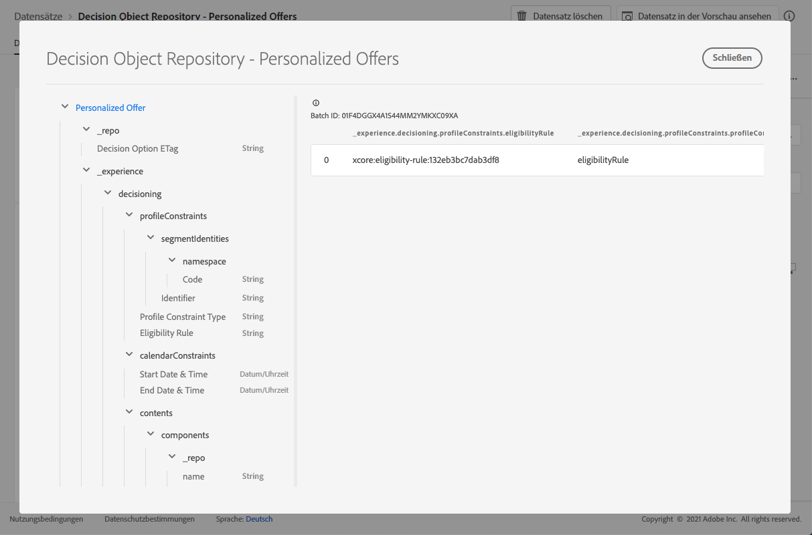

# Personalisierte Angebot-Dataset {#offers-dataset}

Jedes Mal, wenn ein Angebot geändert wird, wird der automatisch generierte Datensatz für personalisierte Content-Angebot aktualisiert.

Der letzte erfolgreiche Stapel im Datensatz wird rechts angezeigt. Die hierarchische Ansicht des Schemas für den Datensatz wird im linken Bereich angezeigt.

>[!NOTE]
>
>In [diesem Abschnitt ](../export-catalog/access-dataset.md) erfahren Sie, wie Sie auf die exportierten Datensätze für die einzelnen Objekte Ihrer Angebot-Bibliothek zugreifen.

Hier finden Sie die Liste aller Felder, die im Dataset **[!UICONTROL Decision Object Repository - Personalized Angebots]** verwendet werden können.

<!--Personalized offers form the set of choices for a decision. The objective for decisioning is to take a large inventory of items and apply numerous constraint rules to that inventory to narrow it down and then to rank the qualifying options according to a criteria. The resulting propositions assemble and personalize the experience for specific individuals.-->

## ID

**Feld:** _id 
**Title:** Identifier 
**Description:** Eine eindeutige Kennung für den Datensatz.
**Typ:** Zeichenfolge

## _Erlebnis

**Feld:** _experience 
**Type:** Objekt

### Entscheidungsfindung

**Feld:** Entscheidungstyp 
**:** Objekt

#### calendarConstraints

**Feld:** calendarConstraints 
**Title:** Calendar Constraint Details 
**Beschreibung:** Kalendereinschränkungen entscheiden, ob eine Entscheidungsoption für einen Datumsbereich gültig ist. Außerhalb dieses Datumsbereichs kann die Option nicht vorgeschlagen werden.
**Typ:** Objekt

* **Enddatum und -zeit**

   **Feld:** endDate
   **Titel:** Enddatum und -zeit
   **Beschreibung:** Das Enddatum einer Gültigkeit der Entscheidungsoptionen. Optionen, die ihr Enddatum überschritten haben, können nicht mehr im Entscheidungsprozess vorgeschlagen werden.
   **Typ:** Zeichenfolge

* **Beginn - Datum und Uhrzeit**

   **Feld:** startDate
   **Titel:** Beginn
   **Beschreibung:** Das Datum des Beginns einer Gültigkeit der Entscheidungsoptionen. Optionen, deren Beginn noch nicht erreicht wurde, können noch nicht im Entscheidungsprozess vorgeschlagen werden.
   **Typ:** Zeichenfolge

#### Merkmale

**Feld:** Merkmale 
**Titel:** Entscheidungsoptionenmerkmale 
**Beschreibung:** Weitere Eigenschaften oder Attribute, die zu dieser bestimmten Entscheidungsoption gehören. Verschiedene Instanzen können unterschiedliche Eigenschaften aufweisen (Schlüssel in der Zuordnung). Bei den Eigenschaften handelt es sich um Namenswertpaare, mit denen eine Entscheidungsoption von anderen unterschieden wird. Eigenschaften werden als Werte im Inhalt verwendet, der diese Entscheidungsoption darstellt, und als Funktionen zur Analyse und Optimierung der Leistung einer Option. Wenn jede Instanz dasselbe Attribut oder dieselbe Eigenschaft hat, sollte dieses als Erweiterungsschema modelliert werden, das sich aus den Details der Entscheidungsoptionen ableitet.
**Typ:** Objekt

#### Inhalt

**Feld:** Inhaltstitel 
**:** Inhaltsdetails 
**Beschreibung:** Inhaltselemente, um das Entscheidungselement in verschiedenen Kontexten wiederzugeben. Eine einzelne Entscheidungsoption kann mehrere Inhaltsvarianten haben. Der Inhalt ist eine Information, die auf eine Audience für den (digitalen) Verbrauch ausgerichtet ist. Die Inhalte werden über Kanal an eine bestimmte Stelle gesendet.
**Typ:** Array

* **Komponenten**

   **Feld:** Komponenten
   **Beschreibung:** Die Komponenten des Inhalts, die die Entscheidungsoption einschließlich aller zugehörigen Sprachvarianten darstellen. Spezifische Komponenten werden durch &quot;dx:format&quot;, &quot;dc:subject&quot;und &quot;dc:language&quot;oder eine Kombination daraus gefunden. Diese Metadaten werden verwendet, um die mit einem Angebot verknüpften Inhalte zu suchen oder darzustellen und sie gemäß dem Platzierungsvertrag zu integrieren.
   **Typ:** Array
   **Erforderlich:** &quot;_type&quot;, &quot;_dc&quot;  <!--TBC?-->

   * **Content Component Type**

      **Feld:** _type
      **Titel:** Inhaltskomponententyp
      **Beschreibung:** Ein aufgezählter Satz von URIs, bei dem jeder Wert einem Typ zugeordnet wird, der der Inhaltskomponente angegeben wurde. Einige Benutzer der Inhaltsdarstellungen erwarten, dass der Wert &quot;@type&quot;ein Verweis auf das Schema ist, das zusätzliche Eigenschaften der Inhaltskomponente beschreibt.
      **Typ:** Zeichenfolge

   * **_dc**

      **Feld:** _dc
      **Typ:** Objekt
      **Erforderlich:** &quot;format&quot;

      * **Format**

         **Feld:** Format
         **Titel:** Format
         **Beschreibung:** Die physische oder digitale Manifestation der Ressource. Normalerweise sollte Format den Medientyp der Ressource enthalten. Das Format kann verwendet werden, um die Software, Hardware oder andere Geräte zu ermitteln, die zum Anzeigen oder Verwenden der Ressource erforderlich sind. Es wird empfohlen, einen Wert aus einem kontrollierten Vokabular auszuwählen (z. B. die Liste von [Internet Media Types](http://www.iana.org/assignments/media-types/), die Computermedienformate definiert).
         **Typ:** Zeichenfolge
         **Beispiel:** &quot;application/vnd.adobe.photoshop&quot;

      * **Sprache**
         **Feld:** Sprache
         **Titel:** Sprache
         **Beschreibung:** Die Sprache oder Sprachen der Ressource. \nSprachen werden im Sprachcode wie in [IETF RFC 3066](https://www.ietf.org/rfc/rfc3066.txt) definiert, der Teil von BCP 47 ist, der an anderer Stelle in XDM verwendet wird.
         **Typ:** Array
         **Beispiele:** &quot;\n&quot;, &quot;pt-BR&quot;, &quot;es-ES&quot;
   * **_repo**

      **Feld:** _repo
      **Typ:** Objekt

      * **id**

         **Feld:** id
         **Beschreibung:** Eine optionale eindeutige Kennung, die auf das Asset in einem Inhalts-Repository verweist. Wenn Plattform-APIs zum Abrufen der Darstellung verwendet werden, kann der Client mit einer zusätzlichen Eigenschaft \&quot;repo:resolveUrl\&quot; rechnen, um das Asset abzurufen.
         **Typ:** Zeichenfolge
         **Beispiel:** &quot;urn:aaid:sc:US:6dc33479-13ca-4b19-b25d-c805eff8a69e&quot;

      * **name**

         **Feld:** Name
         **Beschreibung:** Einige Hinweise zum Speicherort des Repositorys, in dem das externe Asset durch \&quot;repo:id\&quot; gespeichert wird.
         **Typ:** Zeichenfolge

      * **repositoryID**

         **Feld:** repositoryID
         **Beschreibung:** Eine optionale eindeutige Kennung, die auf das Asset in einem Inhalts-Repository verweist. Wenn Plattform-APIs zum Abrufen der Darstellung verwendet werden, kann der Client mit einer zusätzlichen Eigenschaft \&quot;repo:resolveUrl\&quot; rechnen, um das Asset abzurufen.
         **Typ:** Zeichenfolge
         **Beispiel:** &quot;C87932A55B06F7070A49412D@AdobeOrg&quot;

      * **resolveURL**

         **Feld:** resolveURL
         **Beschreibung:** Ein optionaler eindeutiger Ressourcenstandort zum Lesen des Assets in einem Inhalts-Repository. Dadurch wird es einfacher, das Asset abzurufen, ohne dass der Client weiß, wo das Asset verwaltet wird und welche APIs aufgerufen werden müssen. Dies ist ähnlich wie ein HAL-Link, aber die Semantik ist einfacher und zweckmäßiger.
         **Typ:** Zeichenfolge
         **Beispiel:** &quot;https://plaftform.adobe.io/resolveByPath?path=&quot;/mycorp/content/projectx/fragment/prod/herobanners/banner14.html3&quot;
   * **content**

      **Feld:** Inhalt
      **Beschreibung:** Ein optionales Feld zum direkten Speichern von Inhalten. Anstatt auf Inhalte in einem Asset-Repository zu verweisen, kann die Komponente einfache Inhalte direkt aufnehmen. Dieses Feld wird nicht für Assets mit zusammengesetzten, komplexen und binären Inhalten verwendet.
      **Typ:** Zeichenfolge

   * **deliveryURL**

      **Feld:** deliveryURL
      **Beschreibung:** Ein optionaler eindeutiger Ressourcenstandort, der das Asset über einen Content Versand-Netzwerk- oder -Dienstendpunkt abruft. Diese URL wird von einem Benutzeragent verwendet, um auf das Asset öffentlich zuzugreifen.
      **Typ:** Zeichenfolge
      **Beispiel:** &quot;https://cdn.adobe.io/content/projectx/fragment/prod/static/1232324wd32.jpeg&quot;

   * **linkURL**

      **Feld:** linkURL
      **Beschreibung:** Ein optionaler eindeutiger Ressourcenstandort für Benutzerinteraktionen. Diese URL wird verwendet, um den Endbenutzer in einem Benutzeragent zu verweisen und kann verfolgt werden.
      **Typ:** Zeichenfolge
      **Beispiel:** &quot;https://cdn.adobe.io/tracker?code=23432&amp;redirect=/content/projectx/fragment/prod/static/1232324wd32.jpeg&quot;

* **Platzierung**

   **Feld:** Platzierung
   **Titel:** Platzierung
   **Beschreibung:** Platzierung, die einzuhalten ist. Der Wert ist der URI (@id) der Angebotsplatzierung, auf die verwiesen wird. Siehe Schema https://ns.adobe.com/experience/decisioning/placement.
   **Typ:** Zeichenfolge

#### Lebenszyklusstatus

**Feld:** Lebenszyklusstatus 
**Titel:** Lebenszyklusstatus 
**Beschreibung:** Lebenszyklusstatus ermöglicht die Workflows mit einem Objekt. Der Status kann sich auf die Sichtbarkeit oder Relevanz eines Objekts auswirken. Statusänderungen werden von den Clients oder Diensten gesteuert, die die Objekte verwenden.
**Typ:** Zeichenfolge 
**Mögliche Werte:** &quot;Entwurf&quot;, &quot;Genehmigt&quot;, &quot;Live&quot;, &quot;Abgeschlossen&quot;, &quot;Archiviert&quot;, 
**Standardwert:** &quot;Entwurf&quot;

#### Name der Entscheidungsoption

**Feld:** name 
**Title:** Decision Options Name 
**Description:** Optionsname, der in verschiedenen Benutzeroberflächen angezeigt wird.
**Typ:** Zeichenfolge

#### profileConstraints

**Feld:** profileConstraints 
**Title:** Profil Constraint Details 
**Beschreibung:** Die Profil-Einschränkungen entscheiden, ob eine Option in diesem Kontext für diese Profil-ID geeignet ist. Wenn die Profil-Beschränkung die Werte der einzelnen Optionen nicht berücksichtigen muss, d. h., sie ist von den Optionen aus der Optionsauswahl ungültig, wird die gesamte Optionsauswahl durch die Profil-Beschränkung, die als &quot;false&quot;ausgewertet wird, abgebrochen. Andererseits wird eine Profil-Beschränkungsregel, die eine Option als Parameter akzeptiert, für jede qualifizierte Option der Optionsauswahl ausgewertet.
**Typ:** Objekt

* **Beschreibung**

   **Feld:** Beschreibung
   **Titel:** Beschreibung
   **Beschreibung:Beschreibung der** Profil-Beschränkung. Es wird verwendet, um für Menschen verständliche Absichten darüber zu vermitteln, wie oder warum diese Profil-Beschränkung aufgebaut wurde und/oder welche Option von ihr ausgeschlossen oder ausgeschlossen wird.
   **Typ:** Zeichenfolge

* **Eignungsregel**

   **Feld:** Berechtigungsregel
   **Titel:** Eignungsregel
   **Beschreibung:** Ein Verweis auf eine Entscheidungsregel, die für ein bestimmtes Profil und/oder andere kontextuelle XDM-Objekte als &quot;true&quot;oder &quot;false&quot;ausgewertet wird. Die Regel wird verwendet, um zu entscheiden, ob die Option für ein bestimmtes Profil geeignet ist. Der Wert ist der URI (@id) der Entscheidungsregel, auf die verwiesen wird. Siehe Schema https://ns.adobe.com/experience/decisioning/rule.
   **Typ:** Zeichenfolge

* **Profil-Beschränkungstyp**

   **Feld:** profileConstraintType
   **Titel:** Profil-Constraint-Typ
   **Beschreibung:** Bestimmt, ob Einschränkungen aktuell festgelegt sind und wie die Kontraste ausgedrückt werden. Es könnte durch eine Regel oder durch eine oder mehrere Segmentmitgliedschaften erfolgen.
   **Typ:** Zeichenfolge
   **Mögliche Werte:**
   * &quot;Keine&quot;
   * &quot;permissionRule&quot;: &quot;Die Profil-Beschränkung wird als eine einzige Regel ausgedrückt, die als &quot;true&quot;ausgewertet werden muss, bevor die eingeschränkte Aktion zulässig ist.&quot;
   * &quot;anySegments&quot;: &quot;Die Profil-Beschränkung wird als ein oder mehrere Segmente ausgedrückt und das Profil muss Mitglied von mindestens einem von ihnen sein, bevor die eingeschränkte Aktion zulässig ist.&quot;
   * &quot;allSegments&quot;: &quot;Die Profil-Beschränkung wird als ein oder mehrere Segmente ausgedrückt und das Profil muss Mitglied aller Segmente sein, bevor die eingeschränkte Aktion zulässig ist.&quot;
   * &quot;Regeln&quot;: &quot;Die Beschränkung des Profils wird als eine Reihe unterschiedlicher Regeln ausgedrückt, z. B. Förderfähigkeit, Anwendbarkeit, Eignung, die alle als &quot;true&quot;bewertet werden müssen, bevor die eingeschränkte Aktion zulässig ist.&quot;
      **Standardwert:** &quot;none&quot;

* **Segmentkennung**

   **Feld:** segmentIdentities
   **Titel:** Segmentbezeichner
   **Beschreibung:** Bezeichner der Segmente
   **Typ:** Array

   * **ID**

      **Feld:** _id
      **Titel:** Bezeichner
      **Beschreibung:** Segmentkennung im zugehörigen Namensraum.
      **Typ:** Zeichenfolge

   * **Namespace**

      **Feld:** Namensraum
      **Titel:** Namensraum
      **Beschreibung:** Der mit dem  `xid` Attribut verknüpfte Namensraum.
      **Typ:** Objekt
      **Erforderlich:** &quot;Code&quot;

      * **Code**

         **Feld:** Code
         **Titel:** Code
         **Beschreibung:** Der Code ist eine für Menschen lesbare Kennung für den Namensraum und kann zum Anfordern der technischen Namensraum-ID verwendet werden, die für die Verarbeitung von Identitätsdiagrammen verwendet wird.
         **Typ:** Zeichenfolge
   * **Erlebnis-ID**

      **Feld:** xid
      **Titel:** Erlebnis-ID
      **Beschreibung:** Wenn dieser Wert vorhanden ist, stellt er eine Kennung für Namensraum dar, die für alle Namensraum-Scoped-Bezeichner in allen Namensräumen eindeutig ist.
      **Typ:** Zeichenfolge

#### Ranking

**Feld:** Ranking 
**Title:** Ranking Details 
**Description:** Rank (priority) Definiert, was angesichts des Kontexts des Entscheidungskriteriums als \&quot;beste Aktion\&quot; gilt. Unter allen ausgewählten Optionen, die die Förderungsbeschränkung erfüllen, entscheidet die Rangreihenfolge über die beste (oder Top-N) Option(en), die vorgeschlagen werden soll.
**Typ:** Objekt

* **Auftragsauswertung**

   **Feld:** Reihenfolge
   **Titel:** Auftragsauswertung
   **Beschreibung:** Bewertung einer relativen Reihenfolge einer oder mehrerer Entscheidungsoptionen. Optionen mit höheren Ordinalwerten werden über allen Optionen mit niedrigeren Ordinalwerten ausgewählt. Die durch diese Methode bestimmten Werte können bestellt werden, die Entfernungen zwischen ihnen können jedoch nicht gemessen werden und es können weder Summen noch Produkte berechnet werden. Der Median und der Modus sind die einzigen Messgrößen der zentralen Tendenz, die für Ordinaldaten verwendet werden können.
   **Typ:** Objekt

   * **Bewertungsfunktion**

      **Feld:** Funktion
      **Titel:** Bewertungsfunktion
      **Beschreibung:** Ein Verweis auf eine Funktion, die eine numerische Bewertung für diese Entscheidungsoption berechnet. Die Entscheidungsoptionen werden dann nach diesem Ergebnis geordnet (geordnet). Der Wert dieser Eigenschaft ist der URI (@id) der Funktion, die jeweils mit der Option &quot;on&quot;aufgerufen wird. Siehe Schema https://ns.adobe.com/experience/decisioning/function.
      **Typ:** Zeichenfolge

   * **Art der Auftragsauswertung**

      **Feld:** orderEvaluationType
      **Titel:** Bestellungsauswertungstyp
      **Beschreibung:** Gibt an, welcher Mechanismus zur Bewertung der Reihenfolge verwendet wird, welche statische Priorität der Entscheidungsoptionen verwendet wird, eine Bewertungsfunktion, die einen numerischen Wert für jede Option berechnet, oder eine Rangstrategie, die eine Liste zur Bestellung erhält.
      **Typ:** Zeichenfolge
      **Mögliche Werte:** &quot;static&quot;, &quot;scoringFunction&quot;, &quot;rankingStrategy&quot;

   * **Rangstrategie**

      **Feld:** Rangstrategie
      **Titel:** Rangstrategie
      **Beschreibung:** Ein Verweis auf eine Strategie, die eine Liste der Entscheidungsoption einstuft. Die Entscheidungsoptionen werden in einer bestellten Liste zurückgegeben. Der Wert dieser Eigenschaft ist der URI (@id) der Funktion, die jeweils mit der Option &quot;on&quot;aufgerufen wird. Siehe Schema https://ns.adobe.com/experience/decisioning/rankingStrategy.
      **Typ:** Zeichenfolge

* **Priorität**

   **Feld:** Priorität
   **Titel:** Priorität
   **Beschreibung:** Die Priorität einer einzelnen Entscheidungsoption im Verhältnis zu allen anderen Optionen. Optionen, für die keine Bestellfunktion angegeben wird, werden mit dieser Eigenschaft priorisiert. Optionen mit höheren Prioritätswerten werden vor den Optionen mit niedrigerer Priorität ausgewählt. Wenn zwei oder mehr qualifizierte Optionen den höchsten Prioritätswert aufweisen, wird eine nach dem gleichen Zufallsprinzip ausgewählt und für den Entscheidungsvorschlag verwendet.
   **Typ:** integer
   **Mindestwert:** 0
   **Standardwert:** 0

#### Tags

**Feld:** Tags 
**Titel:** Tags 
**Beschreibung:** Der Satz von Tags, die dieser Entität zugeordnet sind. Die Tags werden in Filter-Ausdrücken verwendet, um den Gesamtbestand auf eine Untergruppe (Kategorie) zu beschränken.
**Typ:** Array

<!--Field without name under tags: Description: An identifier of a tag object. The value is the @id of the tag that is referenced. See tag schema: https://ns.adobe.com/experience/decisioning/tag. Type: string-->

## _repo

**Feld:** _repo-
**Typ:** Objekt

### Entscheidungsoption ETag

**Feld:** Tag-
**Titel:** Entscheidungsoption ETag-
**Beschreibung:** Die Revision, bei der sich das Entscheidungsoptionsobjekt zum Zeitpunkt des Snapshots befand.
**Typ:** Zeichenfolge

