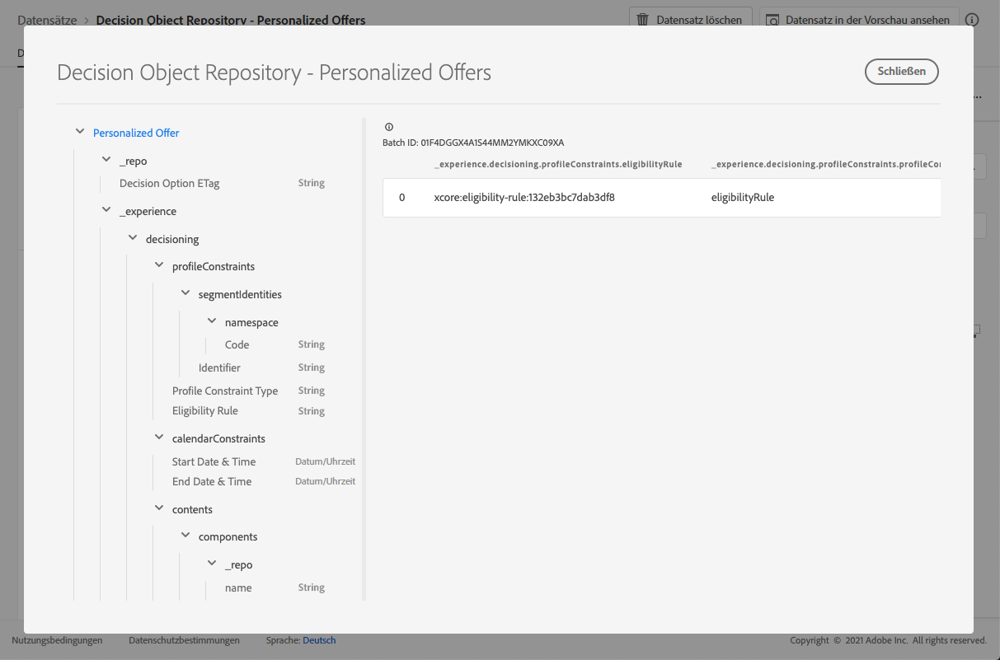

# Datensatz für personalisierte Angebote {#offers-dataset}

Bei jeder Änderung eines Angebots wird der automatisch erstellte Datensatz für personalisierte Inhaltsangebote aktualisiert.

Der letzte erfolgreiche Batch im Datensatz wird rechts angezeigt. Die hierarchische Ansicht des Schemas für den Datensatz wird im linken Bereich angezeigt.

>[!NOTE]
>
>In [diesem Abschnitt](../export-catalog/access-dataset.md) erfahren Sie, wie Sie für die einzelnen Objekte Ihrer Angebotsbibliothek auf die exportierten Datensätze zugreifen können.

Im Folgenden finden Sie eine Liste aller Felder, die im Datensatz **[!UICONTROL Entscheidungsobjekt-Repository – Personalisierte Angebote]** verwendet werden können.

<!--Personalized offers form the set of choices for a decision. The objective for decisioning is to take a large inventory of items and apply numerous constraint rules to that inventory to narrow it down and then to rank the qualifying options according to a criteria. The resulting propositions assemble and personalize the experience for specific individuals.-->

+++ Kennung

**Feld:** _id
**Titel:** Kennung
**Beschreibung:** Eindeutige Kennung des Eintrags.
**Typ:** Zeichenfolge

+++

+++ _experience  {#experience}

**Feld:** _experience 
**Typ:** Objekt

+++

+++ _experience > decisioning

**Feld:** decisioning
**Typ:** Objekt

+++

+++ _experience > decisioning > calendarConstraints

**Feld:** calendarConstraints 
**Titel:** Kalendereinschränkungsdetails 
**Beschreibung:** Durch Kalendereinschränkungen wird bestimmt, ob eine Entscheidungsoption für einen Datumsbereich gültig ist. Außerhalb dieses Datumsbereichs kann die Option nicht vorgeschlagen werden.
**Typ:** Objekt

* **Enddatum und -zeit**

  **Feld:** endDate
  **Titel:** Enddatum und -zeit
  **Beschreibung:** Das Enddatum der Gültigkeit einer Entscheidungsoption. Optionen, die ihr Enddatum überschritten haben, können im Entscheidungsprozess nicht mehr vorgeschlagen werden.
  **Typ:** Zeichenfolge

* **Startdatum und -zeit**

  **Feld:** startDate
  **Titel:** Startdatum und -zeit
  **Beschreibung:** Das Startdatum der Gültigkeit einer Entscheidungsoption. Optionen, deren Startdatum noch nicht erreicht ist, können im Entscheidungsprozess noch nicht vorgeschlagen werden.
  **Typ:** Zeichenfolge

+++

+++ _experience > decisioning > characteristics

**Feld:** characteristics
**Titel:** Merkmale der Entscheidungsoption 
**Beschreibung:** Zusätzliche Eigenschaften oder Attribute, die zu dieser bestimmten Entscheidungsoption gehören. Verschiedene Instanzen können unterschiedliche Merkmale aufweisen (Schlüssel in der Zuordnung). Bei den Merkmalen handelt es sich um Namen-Wert-Paare, mit denen eine Entscheidungsoption von anderen unterschieden wird. Merkmale dienen als Werte im Inhalt, der diese Entscheidungsoption darstellt, sowie als Funktionen zur Analyse und Optimierung der Leistung einer Option. Wenn jede Instanz dasselbe Attribut oder dieselbe Eigenschaft hat, sollte dieser Aspekt als Erweiterungsschema modelliert werden, das sich aus den Details der Entscheidungsoption ableitet.
**Typ:** Objekt

+++

+++ _experience > decisioning > contents

**Feld:** contents
**Titel** Inhaltsdetails 
**Beschreibung:** Inhaltselemente, die dazu dienen, das Entscheidungselement in verschiedenen Kontexten darzustellen. Eine Entscheidungsoption kann mehrere Inhaltsvarianten aufweisen. Inhalte sind Informationen, die an eine Audience gerichtet und zur Verwendung in einem (digitalen) Erlebnis eingesetzt werden. Inhalte werden über Kanäle in einer bestimmten Platzierung bereitgestellt.
**Typ:** Array

+++

+++_experience > decisioning > contents > components

**Feld:** components
**Beschreibung:** Die Komponenten des Inhalts, der die Entscheidungsoption darstellt, einschließlich aller zugehörigen Sprachvarianten. Spezifische Komponenten werden durch „dx:format“, „dc:subject“ und „dc:language“ oder eine Kombination daraus gefunden. Diese Metadaten werden verwendet, um den mit einem Angebot verknüpften Inhalt zu suchen oder darzustellen und ihn gemäß dem Platzierungsvertrag zu integrieren.
**Typ:** Array
**Erforderlich:** „_type“, „_dc“ <!--TBC?-->

* **_experience > decisioning > contents > components > Content Component Type**

  **Feld:** _type
  **Titel:** Inhaltskomponententyp
  **Beschreibung:** Ein Aufzählungssatz von URIs, bei dem jeder Wert einem der Inhaltskomponente gegebenen Typ zugeordnet ist. Manche Verbraucher der Inhaltsdarstellungen erwarten, dass der @type-Wert ein Verweis auf das Schema ist, das zusätzliche Eigenschaften der Inhaltskomponente beschreibt.
  **Typ:** Zeichenfolge

* **_experience > decisioning > contents > components > _dc**

  **Feld:** _dc
  **Typ:** Objekt
  **Erforderlich:** „format“

   * **Format**

     **Feld:** format
     **Titel:** Format
     **Beschreibung:** Die physische oder digitale Manifestation der Ressource. Normalerweise sollte das Format den Medientyp der Ressource enthalten. Das Format kann verwendet werden, um die Software, Hardware oder andere Geräte zu ermitteln, die zum Anzeigen oder Verwenden der Ressource erforderlich sind. Es wird empfohlen, einen Wert aus einem kontrollierten Vokabular auszuwählen (z. B. Liste mit [Internet-Medientypen](https://www.iana.org/assignments/media-types/), die Computer-Medienformate definieren).
     **Typ:** Zeichenfolge
     **Beispiel:** &quot;application/vnd.adobe.photoshop&quot;

   * **Sprache**
     **Feld:** language
     **Titel:** Sprache
     **Beschreibung:** Die Sprache(n) der Ressource. \nLanguages werden im Sprachen-Code spezifiziert, wie in [IETF RFC 3066](https://www.ietf.org/rfc/rfc3066.txt) definiert, was Teil von BCP 47 ist, das an anderer Stelle in XDM verwendet wird.
     **Typ:** Array
     **Beispiele:** „\n“, „pt-BR“, „es-ES“

* **_experience > decisioning > contents > components > _repo**

  **Feld:** _repo
  **Typ:** Objekt

   * **id**

     **Feld:** id
     **Beschreibung:** Eine optionale eindeutige Kennung, die auf das Asset in einem Content-Repository verweist. Wenn Platform-APIs zum Abrufen der Darstellung verwendet werden, kann der Client erwarten, dass die zusätzliche Eigenschaft \&quot;repo:resolveUrl\&quot; das Asset abruft.
     **Typ:** Zeichenfolge
     **Beispiel:** &quot;urn:aaid:sc:US:6dc33479-13ca-4b19-b25d-c805eff8a69e&quot;

   * **name**

     **Feld:** name
     **Beschreibung:** Einige Hinweise dazu, wo das Repository zu finden ist, in dem das externe Asset von der \&quot;repo:id\&quot; gespeichert wird.
     **Typ:** Zeichenfolge

   * **repositoryID**

     **Feld:** repositoryID
     **Beschreibung:** Eine optionale eindeutige Kennung, die auf das Asset in einem Content-Repository verweist. Wenn Platform-APIs zum Abrufen der Darstellung verwendet werden, kann der Client erwarten, dass die zusätzliche Eigenschaft \&quot;repo:resolveUrl\&quot; das Asset abruft.
     **Typ:** Zeichenfolge
     **Beispiel:** &quot;C87932A55B06F7070A49412D@AdobeOrg&quot;

   * **resolveURL**

     **Feld:** resolveURL
     **Beschreibung:** Eine optionale URL zum Lesen des Assets in einem Content-Repository. So lässt sich das Asset einfacher abrufen, ohne dass der Client weiß, wo das Asset verwaltet wird und welche APIs aufgerufen werden müssen. Dies ähnelt einem HAL-Link, die Semantik ist jedoch einfacher und zweckmäßiger.
     **Typ:** Zeichenfolge
     **Beispiel:** &quot;https://plaftform.adobe.io/resolveByPath?path=&quot;/mycorp/content/projectx/fragment/prod/herobanners/banner14.html3&quot;&quot;

* **_experience > decisioning > contents > components > content**

  **Feld:** content
  **Beschreibung:** Ein optionales Feld für die direkte Speicherung von Inhalten. Anstatt auf Inhalte in einem Asset-Repository zu verweisen, kann die Komponente einfache Inhalte direkt speichern. Dieses Feld wird nicht für Assets mit zusammengesetzten, komplexen oder binären Inhalten verwendet.
  **Typ:** Zeichenfolge

* **_experience > decisioning > contents > components > deliveryURL**

  **Feld:** deliveryURL
  **Beschreibung:** Eine optionale URL, die das Asset aus einem Content Delivery Network (CDN) oder von einem Dienstendpunkt abruft. Diese URL wird verwendet, um von einem User Agent aus öffentlich auf das Asset zuzugreifen.
  **Typ:** Zeichenfolge
  **Beispiel:** &quot;https://cdn.adobe.io/content/projectx/fragment/prod/static/1232324wd32.jpeg&quot;

* **_experience > decisioning > contents > components > linkURL**

  **Feld:** linkURL
  **Beschreibung:** Eine optionale URL für Benutzerinteraktionen. Diese URL wird verwendet, um den Endbenutzer auf einen User Agent zu verweisen, und kann verfolgt werden.
  **Typ:** Zeichenfolge
  **Beispiel:** „https://cdn.adobe.io/tracker?code=23432&amp;redirect=/content/projectx/fragment/prod/static/1232324wd32.jpeg“

+++_experience > decisioning > contents > Placement

**Feld:** placement 
**Titel:** Platzierung 
**Beschreibung:** Platzierung, die einzuhalten ist. Der Wert ist der URI (@id) der Angebotsplatzierung, auf die verwiesen wird. Siehe Schema https://ns.adobe.com/experience/decisioning/placement.
**Typ:** Zeichenfolge

+++

+++ _experience > decisioning > Lifecycle Status

**Feld:** lifecycleStatus 
**Titel:** Lebenszyklusstatus 
**Beschreibung:** Der Lebenszyklusstatus ermöglicht die Ausführung von Workflows mit einem Objekt. Der Status kann sich auf die Sichtbarkeit oder Relevanz eines Objekts auswirken. Statusänderungen werden von den Clients oder Services gesteuert, die die Objekte verwenden.
**Typ:** Zeichenfolge 
**Mögliche Werte:** „Entwurf“ (Standard), „Genehmigt“, „Live“, „Abgeschlossen“, „Archiviert“

+++

+++ _experience > decisioning > Decision Option Name

**Feld:** name 
**Titel:** Name der Entscheidungsoption 
**Beschreibung:** Optionsname, der in verschiedenen Benutzeroberflächen angezeigt wird.
**Typ:** Zeichenfolge

+++

+++ _experience > decisioning > profileConstraints

**Feld:** profileConstraints 
**Titel:** Profileinschränkungsdetails
**Beschreibung:** Anhand der Profileinschränkung wird entschieden, ob in einem bestimmten Moment und Kontext für die jeweilige Profilidentität eine Option geeignet ist. Wenn die Profileinschränkung die Werte der einzelnen Optionen nicht berücksichtigen muss, d. h. sie gegenüber den Optionen aus der Optionsauswahl invariant ist, hebt die als „false“ ausgewertete Profileinschränkung die gesamte Optionsauswahl auf. Dagegen wird eine Profileinschränkungsregel, die eine Option als Parameter akzeptiert, für jede qualifizierte Option der Optionsauswahl ausgewertet.
**Typ**: Objekt

+++

+++_experience > decisioning > profileConstraints > Description

**Feld:** description 
**Titel:** Beschreibung 
**Beschreibung:** Beschreibung der Profilbegrenzung. Die Beschreibung soll in für Menschen verständlicher Form vermitteln, wie oder warum diese Profilbegrenzung erstellt wurde und/oder welche Option ein- oder ausgeschlossen wird.
**Typ:** Zeichenfolge

+++

+++_experience > decisioning > profileConstraints > Eligibility Rule

**Feld:** eligibilityRule
**Titel:** Eignungsregel
**Beschreibung:** Ein Verweis auf eine Entscheidungsregel, die für ein bestimmtes Profil und/oder andere kontextuelle XDM-Objekte als „true“ oder „false“ ausgewertet wird. Die Regel wird verwendet, um zu entscheiden, ob die Option für ein bestimmtes Profil geeignet ist. Der Wert ist die URI (@id) der Entscheidungsregel, auf die verwiesen wird. Siehe Schema https://ns.adobe.com/experience/decisioning/rule.
**Typ:** Zeichenfolge

+++

+++_experience > decisioning > profileConstraints > Profile Constraint Type

**Feld:** profileConstraintType 
**Titel:** Profileinschränkungstyp 
**Beschreibung:** Bestimmt, ob aktuell Einschränkungen festgelegt sind und wie sie ausgedrückt werden. Dies kann durch eine Regel oder durch die Zugehörigkeit zu einer oder mehreren Zielgruppen erfolgen.
**Typ:** Zeichenfolge 
**Mögliche Werte:**
* „none“ (Standard)
* „eligibilityRule“: „Die Profileinschränkung wird als einzelne Regel ausgedrückt, die als „true“ ausgewertet werden muss, bevor die einschränkende Aktion zulässig ist.“
* „anySegments“: „Die Profileinschränkung wird als eine oder mehrere Zielgruppen ausgedrückt und das Profil muss mindestens einer dieser Zielgruppen angehören, damit die eingeschränkte Aktion zulässig ist.“
* „allSegments“: „Die Profileinschränkung wird als eine oder mehrere Zielgruppen ausgedrückt und das Profil muss allen Zielgruppen angehören, damit die eingeschränkte Aktion zulässig ist.“
* „rules“: „Die Profileinschränkung wird als eine Reihe verschiedener Regeln ausgedrückt, z. B. Gültigkeit, Anwendbarkeit, Eignung, die alle als „true“ ausgewertet werden müssen, bevor die eingeschränkte Aktion zulässig ist.“

+++

+++_experience > decisioning > profileConstraints > Segment Identifiers

**Feld:** segmentIdentities 
**Titel:** Segmentkennungen 
**Beschreibung:** Kennungen der Zielgruppen 
**Typ:** Array

* **ID**

  **Feld:** _id
  **Titel:** Kennung
  **Beschreibung:** Identität der Zielgruppen im betreffenden Namespace.
  **Typ:** Zeichenfolge

* **Namespace**

  **Feld:** namespace
  **Titel:** Namespace
  **Beschreibung**: Der mit dem Attribut `xid` verknüpfte Namespace.
  **Typ:** Objekt
  **Erforderlich:** „code“

   * **Code**

     **Feld:** code
     **Titel:** Code
     **Beschreibung:** Der Code ist eine von Menschen lesbare Kennung für den Namespace und kann verwendet werden, um die technische Namespace-ID anzufordern, die für die Verarbeitung von Identitätsdiagrammen verwendet wird.
     **Typ:** Zeichenfolge

* **Erlebnis-ID**

  **Feld:** xid
  **Titel:** Erlebnis-ID
  **Beschreibung:** Falls vorhanden, stellt dieser Wert eine Namespace-übergreifende Kennung dar, die unter allen Kennungen in allen Namespaces eindeutig ist.
  **Typ:** Zeichenfolge

+++

+++ _experience > decisioning > ranking

**Feld:** ranking 
**Titel:** Rangfolgedetails 
**Beschreibung:** Rang (Priorität). Definiert, was angesichts des Kontexts des Entscheidungskriteriums als \&quot;best action\&quot; gilt. Unter allen ausgewählten Optionen, die die Gültigkeitseinschränkung erfüllen, entscheidet die Rangfolge über die vorzuschlagenden Top-Optionen (oder Top-N).
**Typ:** Objekt

+++

+++_experience > decisioning > ranking > Order Evaluation

**Feld:** order 
**Titel:** Auswertung der Rangfolge 
**Beschreibung:** Auswertung einer relativen Reihenfolge einer oder mehrerer Entscheidungsoptionen. Optionen mit höheren Ordinalzahlen werden vor Optionen mit niedrigeren Ordinalzahlen ausgewählt. Die durch diese Methode ermittelten Werte können geordnet werden, die Entfernungen zwischen ihnen können jedoch nicht gemessen werden. Außerdem können weder Summen noch Produkte berechnet werden. Der Medianwert und der Modus sind als einzige Messgrößen der zentralen Tendenz für Ordinaldaten verfügbar.
**Typ:** Objekt

* **Scoring-Funktion**

  **Feld:** function
  **Titel:** Scoring-Funktion
  **Beschreibung:** Ein Verweis auf eine Funktion, die einen numerischen Wert für diese Entscheidungsoption berechnet. Entscheidungsoptionen werden dann nach diesem Wert sortiert (nach Rang geordnet). Der Wert dieser Eigenschaft ist die URI (@id) der Funktion, die jeweils mit einer Option aufgerufen werden soll. Siehe Schema https://ns.adobe.com/experience/decisioning/function.
  **Typ:** Zeichenfolge

* **Reihenfolgenauswertungstyp**

  **Feld:** orderEvaluationType
  **Titel:** Reihenfolgenauswertungstyp
  **Beschreibung:** Gibt an, welcher Mechanismus zur Auswertung der Reihenfolge verwendet wird: eine statische Priorität von Entscheidungsoptionen, eine Scoring-Funktion, die für jede Option einen numerischen Wert berechnet, oder ein KI-Modell, das eine Liste erhält, um eine Sortierung vorzunehmen.
  **Typ:** Zeichenfolge
  **Mögliche Werte:** „static“, „scoringFunction“, „rankingStrategy“

* **Rangfolgestrategie**

  **Feld:** rankingStrategy
  **Titel:** Rangfolgestrategie
  **Beschreibung:** Ein Verweis auf eine Strategie, die eine Liste von Entscheidungsoptionen in eine Reihenfolge bringt. Entscheidungsoptionen werden in einer geordneten Liste zurückgegeben. Der Wert dieser Eigenschaft ist die URI (@id) der Funktion, die jeweils mit einer Option aufgerufen werden soll. Siehe Schema https://ns.adobe.com/experience/decisioning/rankingStrategy.
  **Typ:** Zeichenfolge

+++

+++_experience > decisioning > ranking > Priority

**Feld:** priority 
**Titel:** Priorität 
**Beschreibung:** Die Priorität einer einzelnen Entscheidungsoption im Verhältnis zu allen anderen Optionen. Optionen, für die keine Reihenfolgefunktion angegeben ist, werden mithilfe dieser Eigenschaft priorisiert. Optionen mit höheren Prioritätswerten werden vor Optionen mit niedrigerer Priorität ausgewählt. Wenn zwei oder mehr qualifizierte Optionen den höchsten Prioritätswert aufweisen, wird eine Option nach demselben Zufallsprinzip ausgewählt und für den Entscheidungsvorschlag verwendet.
**Typ:** Ganzzahl
**Mindestwert:** 0 
**Standardwert:** 0

+++

+++ _experience > decisioning > tags

**Feld:** Tags
**Titel:** Tags
**Beschreibung:** Die Gruppe von Sammlungsqualifizierern (ehemals als „Tags“ bezeichnet), die mit dieser Entität verknüpft sind. Die Sammlungskennzeichner werden in Filterausdrücken verwendet, um den Gesamtbestand auf eine Teilmenge (Kategorie) einzuschränken.
**Typ:** Array

+++

<!--Field without name under tags: Description: An identifier of a collection qualifier object. The value is the @id of the collection qualifier that is referenced. See tag schema: https://ns.adobe.com/experience/decisioning/tag. Type: string-->

+++_repo

**Feld:** _repo 
**Typ:** Objekt

+++

+++ _repo > Decision Option ETag

**Feld:** etag 
**Title:** Entscheidungsoption-E-Tag 
**Beschreibung:** Die Revision, in der sich das Entscheidungsoptionsobjekt zum Zeitpunkt des Speicherauszugs befand.
**Typ:** Zeichenfolge

+++
