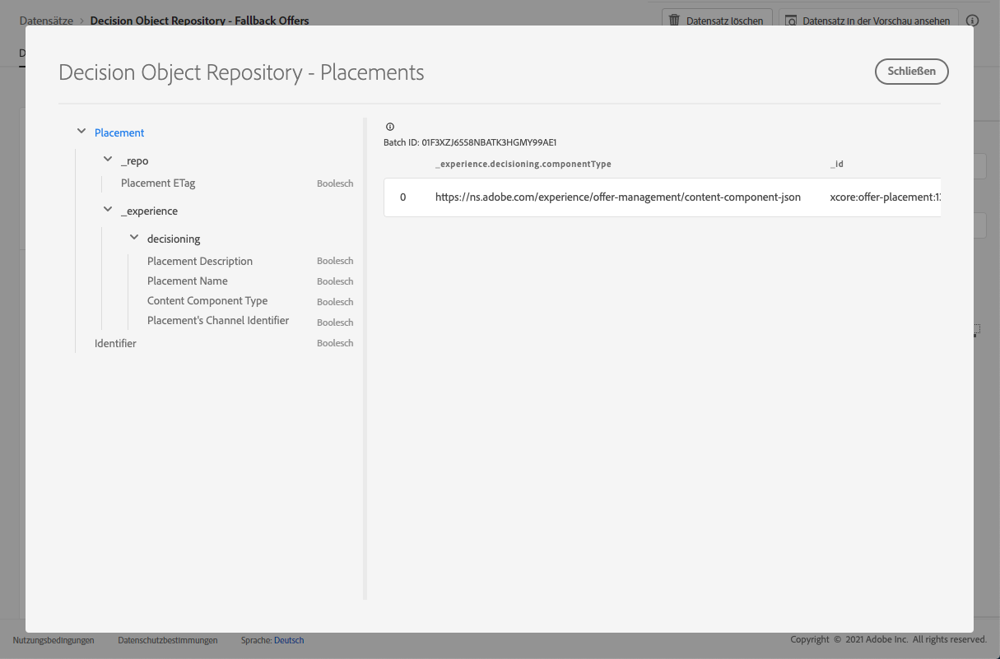

# Platzierungsdatensatz {#placements-dataset}

Jedes Mal, wenn ein Angebot geändert wird, wird der automatisch erstellte Datensatz für Platzierungen aktualisiert.

Der zuletzt erfolgreiche Batch im Datensatz wird rechts angezeigt. Die hierarchische Ansicht des Schemas für den Datensatz wird im linken Bereich angezeigt.

>[!NOTE]
>
>In [diesem Abschnitt](../export-catalog/access-dataset.md) erfahren Sie, wie Sie für die einzelnen Objekte Ihrer Angebotsbibliothek auf die exportierten Datensätze zugreifen können.

Im Folgenden finden Sie eine Liste aller Felder, die im Datensatz **[!UICONTROL Entscheidungsobjekt-Repository – Platzierungen]** verwendet werden können.

<!--A placement describes a location or place in a personalized message. It is used to set technical constraints for content that the personalization decision supplies. The placement also represents a request to produce certain types of metrics when an experience event is produced where this placement is involved. For instance, the placement facilitates a personalized clickable image inside an email shown to an end-user. The placement may for instance request from the assembled experience that the click on its image gets reported in an experience event with a metric https://ns.adobe.com/xdm/data/metrics/web/linkclicks and a reference to this placement.-->

+++ ID

**Feld:** _id
**Titel:** Kennung
**Beschreibung:** Eindeutige Kennung des Eintrags.
**Typ:** Zeichenfolge

+++

+++ _experience

**Feld:** _experience 
**Typ:** Objekt

+++

+++ _experience > decisioning

**Feld:** decisioning
**Typ:** Objekt

+++

+++ _experience > decisioning > Placement&#39;s Channel Identifier

**Feld:** channelID 
**Titel:** Die Kanalkennung der Platzierung 
**Beschreibung:** Der Kanal, in dem der Vorschlag gemacht wurde. Der Wert ist eine gültige Kanal-URI. Siehe https://ns.adobe.com/xdm/channels/channel.
**Typ:** Zeichenfolge

+++

+++ _experience > decisioning > Content Component Type

**Feld:** componentType 
**Titel:** Inhaltskomponententyp 
**Beschreibung:** Ein Auflistungssatz von URIs, wobei jeder Wert einem der Inhaltskomponente gegebenen Typ zugeordnet ist. Einige Verbraucher der Inhaltsdarstellungen erwarten, dass der @type-Wert ein Verweis auf das Schema ist, das zusätzliche Eigenschaften der Inhaltskomponente beschreibt.
**Typ:** Zeichenfolge

+++

+++ _experience > decisioning > contentTypes

**Feld:** contentTypes 
**Typ:** Array

+++

+++_experience > decisioning > contentTypes > MIME Media Type

**Titel:** MIME-Medientyp
**Beschreibung:** Eine Begrenzung für den Medientyp der Komponenten, der an dieser Platzierung erwartet wird. Für eine Komponente kann es mehr als einen Medientyp geben, z. B. verschiedene Bildformate.
**Typ:** Zeichenfolge

+++

+++ _experience > decisioning > Placement Description

**Feld:** description 
**Titel:** Platzierungsbeschreibung
**Beschreibung:** Hiermit werden für Menschen lesbare Absichten darüber vermittelt, wie dynamische Inhalte im allgemeinen Nachrichtenversand verwendet werden. Die Tatsache, dass ein bestimmter Bereich auf einer Website ein \&quot;Banner\&quot; ist, wird oft über die Beschreibung und nicht über eine formale Methode vermittelt.
**Typ:** Zeichenfolge

+++

+++ _experience > decisioning > Placement Name

**Feld:** name 
**Titel:** Platzierungsname 
**Beschreibung:** Ein zugewiesener Name für die Platzierung, auf den in menschlichen Interaktionen verwiesen werden kann.
**Typ:** Zeichenfolge

+++

+++ _repo

**Feld:** _repo 
**Typ:** Objekt

+++

+++ _repo > Placement ETag

**Feld:** etag 
**Titel:** E-Tag für Platzierungen
**Beschreibung:** Die Revision, in der sich das Entscheidungsoptionsobjekt zum Zeitpunkt des Speicherauszugs befand.
**Typ:** Zeichenfolge

+++
