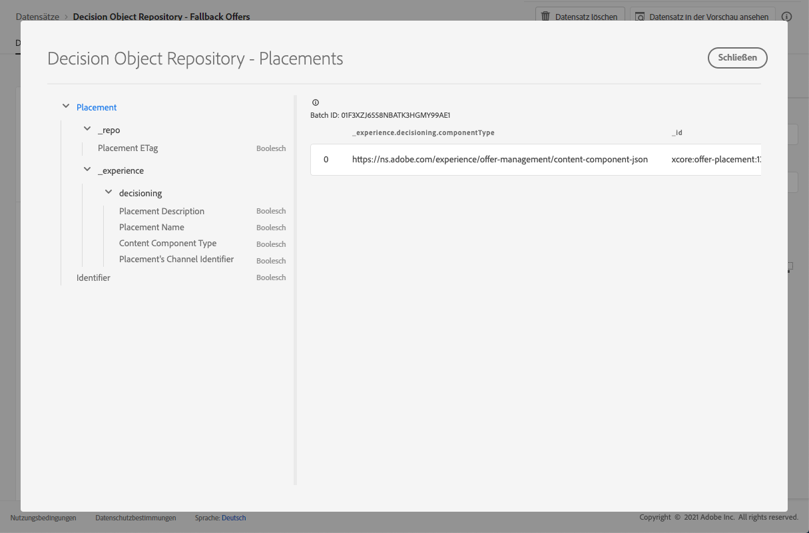

# Platzierungsdataset {#placements-dataset}

Bei jeder Änderung eines Angebots wird der automatisch generierte Datensatz für Platzierungen aktualisiert.

Der letzte erfolgreiche Stapel im Datensatz wird rechts angezeigt. Die hierarchische Ansicht des Schemas für den Datensatz wird im linken Bereich angezeigt.

>[!NOTE]
>
>In [diesem Abschnitt ](../export-catalog/access-dataset.md) erfahren Sie, wie Sie auf die exportierten Datensätze für die einzelnen Objekte Ihrer Angebot-Bibliothek zugreifen.

Hier finden Sie die Liste aller Felder, die im Dataset **[!UICONTROL Decision Object Repository - Placements]** verwendet werden können.

<!--A placement describes a location or place in a personalized message. It is used to set technical constraints for content that the personalization decision supplies. The placement also represents a request to produce certain types of metrics when an experience event is produced where this placement is involved. For instance, the placement facilitates a personalized clickable image inside an email shown to an end-user. The placement may for instance request from the assembled experience that the click on its image gets reported in an experience event with a metric https://ns.adobe.com/xdm/data/metrics/web/linkclicks and a reference to this placement.-->

## ID

**Feld:** _id 
**Title:** Identifier 
**Description:** Eine eindeutige Kennung für den Datensatz.
**Typ:** Zeichenfolge

## _Erlebnis

**Feld:** _experience 
**Type:** Objekt

### Entscheidungsfindung

**Feld:** Entscheidungstyp 
**:** Objekt

#### Kanal-ID der Platzierung

**Feld:** channelID 
**title:** Platzierungskennung für Kanal 
**Beschreibung:** Der Kanal, in dem der Vorschlag gemacht wurde. Der Wert ist ein gültiger Kanal-URI. Siehe https://ns.adobe.com/xdm/channels/channel.
**Typ:** Zeichenfolge

#### Content Component Type

**Feld:** componentType 
**Title:** Content Component Type 
**Description:** Ein aufgezählter Satz von URIs, bei dem jeder Wert einem Typ zugeordnet wird, der der Inhaltskomponente angegeben wurde. Einige Benutzer der Inhaltsdarstellungen erwarten, dass der Wert &quot;@type&quot;ein Verweis auf Schema ist, in dem zusätzliche Eigenschaften der Inhaltskomponente beschrieben werden.
**Typ:** Zeichenfolge

#### contentTypes

**Feld:** contentTypes 
**Type:** array

* **MIME-Medientyp**

   **Titel:** MIME-Medientyp
   **Beschreibung:** Eine Beschränkung für den Medientyp der Komponenten, die an dieser Platzierung erwartet werden. Es kann mehr als einen Medientyp für eine Komponente wie z. B. ein anderes Bildformat geben.
   **Typ:** Zeichenfolge

#### Platzierungsbeschreibung

**Feld:** description 
**title:** Platzierungsbeschreibung 
**Beschreibung:** Es wird verwendet, um für Menschen lesbare Absichten darüber zu vermitteln, wie dynamischer Inhalt im Versand der Nachricht insgesamt verwendet wird. Dass ein bestimmter Bereich ein \&quot;Banner\&quot; in einer Webseite ist, wird oft über die Beschreibung und nicht durch eine formale Methode übertragen.
**Typ:** Zeichenfolge

#### Platzierungsname

**Feld:** name 
**Title:** Platzierungsname 
**Beschreibung:** Ein zugewiesener Name für die Platzierung, der in menschlichen Interaktionen darauf verweist.
**Typ:** Zeichenfolge

## _repo

**Feld:** _repo-
**Typ:** Objekt

### Platzierung ETag

**Feld:** Tag-
**Titel:** Platzierung ETag-
**Beschreibung:** Die Revision, bei der sich das Entscheidungsoptionsobjekt zum Zeitpunkt des Snapshots befand.
**Typ:** Zeichenfolge
