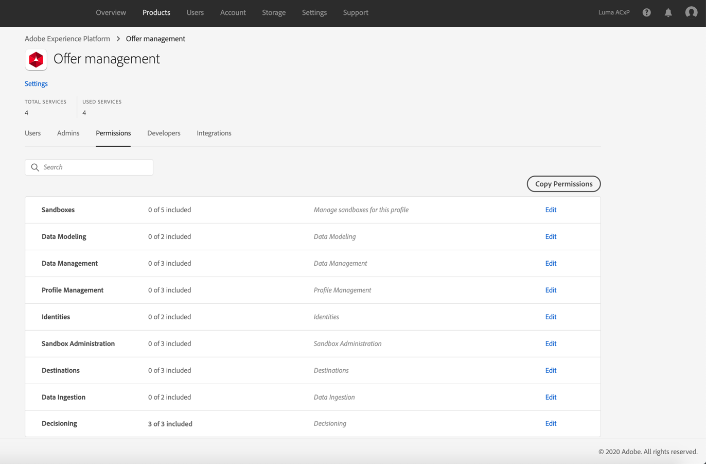

# Zugriff auf die Entscheidungsverwaltung gewähren {#granting-acess-to-decision-management}

Die Zugriffsberechtigungen und die Verwendung der offer decisioning-Funktionen werden mithilfe von [Adobe Admin Console](https://helpx.adobe.com/de/enterprise/managing/user-guide.html){target=&quot;_blank&quot;} verwaltet.

Um Zugriff auf die Entscheidungsverwaltungsfunktionen zu gewähren, müssen Sie ein **[!UICONTROL Produktprofil]** erstellen und den Benutzern die entsprechenden Berechtigungen zuweisen. Weitere Informationen zur Verwaltung von [!DNL Journey Optimizer] Benutzern und Berechtigungen finden Sie in [diesem Abschnitt](../../administration/permissions.md).

Die spezifischen Berechtigungen für die Entscheidungsverwaltung sind in [diesem Abschnitt](../../administration/high-low-permissions.md#manage-decisioning) aufgeführt.

<!--If you are a [!DNL Journey Optimizer] user leveraging the **Decision Management** functionality, you need to have the [Decision management permissions](../../administration/high-low-permissions.md#decisions-permissions) enabled to acces all related capabilities. Learn more on managing [!DNL Journey Optimizer] users and permissions in [this section](../../administration/permissions.md).

If you are an [Adobe Experience Platform](https://experienceleague.adobe.com/docs/experience-platform/landing/home.html){target="_blank"} user leveraging the **Offer Decisioning** application service, follow the steps [below](#granting-acess-to-offer-decisioning) to grant access to [!DNL Offer Decisioning].

Grant access to Offer Decisioning

The steps below only apply to **Experience Platform users** leveraging the [!DNL Offer Decisioning] service.-->

1. Öffnen Sie die [Admin Console](https://helpx.adobe.com/enterprise/managing/user-guide.html) und wählen Sie **[!UICONTROL Adobe Experience Platform]** aus.

   <!---->

1. Die Produktprofile für den Dienst werden angezeigt. Um ein neues Profil zu erstellen, klicken Sie auf die Schaltfläche **[!UICONTROL Neues Profil]**.

   

   >[!NOTE]
   >
   >Sie können so viele Profile wie gewünscht nutzen, die den verschiedenen Rollen entsprechen, die Sie für Ihr Unternehmen einrichten möchten.

1. Geben Sie den Namen und die Beschreibung des Produktprofils an und klicken Sie dann auf **[!UICONTROL Weiter]**.

   

   <!--To access the product profile’s permissions, select the **[!UICONTROL Permissions]** line.-->

1. Wählen Sie die Dienste aus, die für das Produktprofil aktiviert werden sollen. Standardmäßig sind alle Dienste ausgewählt. Dies wird empfohlen, um sicherzustellen, dass alle Experience Platform-Funktionen verfügbar sind.

   

1. Klicken Sie im Abschnitt **[!UICONTROL Entscheidungsverwaltung]** auf die Schaltfläche **+** , um dem Produktprofil Berechtigungen zuzuweisen, und klicken Sie dann auf **[!UICONTROL Speichern]**.

   

   Verfügbare Berechtigungen sind:

   **[!UICONTROL Entscheidungsaktivitäten verwalten]**:

   * Angebote lesen, schreiben, löschen
   * Entscheidungen (früher als Angebotsaktivitäten bezeichnet) lesen, schreiben, löschen
   * Platzierungen lesen, schreiben, löschen

   **[!UICONTROL Entscheidungsaktivitäten ausführen]**:

   * Angebote lesen
   * Entscheidungen lesen
   * Platzierungen lesen

   **[!UICONTROL Entscheidungsoptionen verwalten]**:

   * Angebote lesen, schreiben, löschen
   * Entscheidungen lesen
   * Platzierungen lesen, schreiben, löschen

1. Eine Zusammenfassung der Berechtigungen für das Produktprofil wird angezeigt. Sie können dem Produktprofil jetzt Benutzer zuweisen, damit sie auf diese Berechtigungen zugreifen können.

   

>[!NOTE]
>
>Weitere Informationen zum Verwalten von Benutzerberechtigungen finden Sie in der [Admin Console-Dokumentation](https://helpx.adobe.com/enterprise/managing/user-guide.html){target=&quot;_blank&quot;}.

