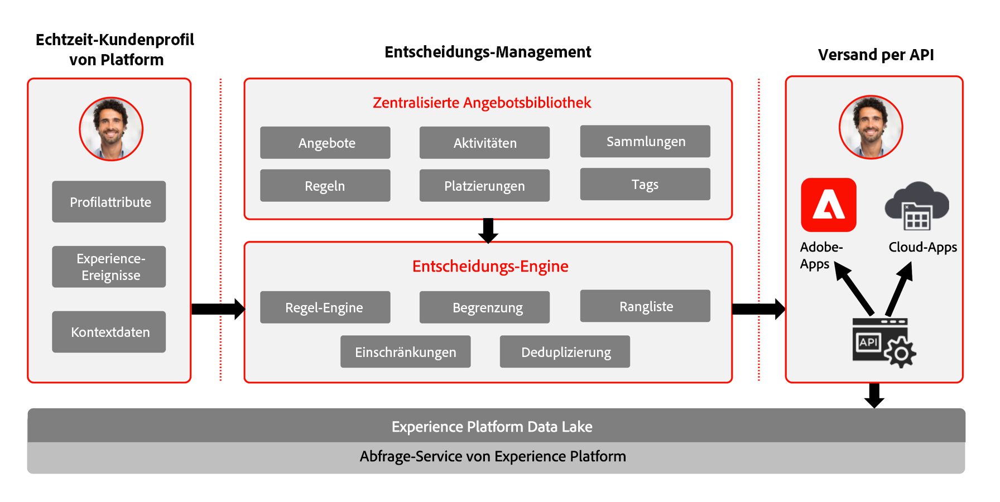
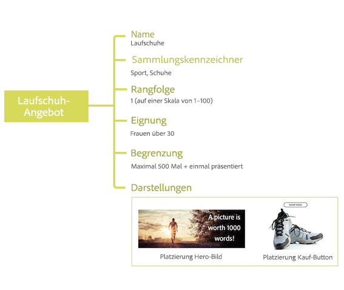

# Über das Entscheidungs-Management  {#about-decision-management}

Verwenden Sie [!DNL Journey Optimizer], um Ihren Kunden über alle Berührungspunkte hinweg zur richtigen Zeit das beste Angebot und Erlebnis zu bieten. Nach der Erstellung können Sie personalisierte Angebote an Ihre Audiences senden.

Entscheidungs-Management erleichtert die Personalisierung durch eine zentrale Bibliothek mit Marketing-Angeboten und eine Entscheidungs-Engine. Dabei werden Regeln und Einschränkungen auf die von Adobe Experience Platform erstellten Echtzeitprofile angewendet, sodass Sie Ihren Kundinnen und Kunden zum richtigen Zeitpunkt das richtige Angebot senden können.

Entscheidungs-Management besteht aus zwei Hauptkomponenten:

* Die **zentrale Angebotsbibliothek** ist die Oberfläche, über die Sie die verschiedenen Elemente erstellen und verwalten können, aus denen Ihre Angebote bestehen. Außerdem können Sie hier entsprechende Regeln und Begrenzungen definieren.
* Die **Offer Decisioning-Engine** nutzt Adobe Experience Platform-Daten und Echtzeit-Kundenprofile sowie die Angebotsbibliothek, um die richtigen Zeitpunkte, Kunden und Kanäle für das Unterbreiten von Angeboten auszuwählen.

Zu den Vorteilen zählen:

* Verbesserte Kampagnenleistung durch Unterbreitung personalisierter Angebote über verschiedene Kanäle hinweg.
* Verbesserte Workflows: Anstatt mehrere Sendungen oder Kampagnen erstellen zu müssen, können Marketing-Teams Workflows optimieren, indem sie einen einzelnen Versand erstellen und die Angebote in verschiedenen Teilen der Vorlage variieren.
* Kontrolle darüber, wie häufig ein Angebot in Kampagnen den einzelnen Kunden unterbreitet wird.

➡️ [Weitere Informationen zum Entscheidungs-Management finden Sie in diesen Videos](#video)

>[!NOTE]
>
>Wenn Sie [Adobe Experience Platform](https://experienceleague.adobe.com/docs/experience-platform/landing/home.html?lang=de){target="_blank"} Benutzer nutzen die **offer decisioning** Anwendungsdienst, gelten auch alle in diesem Abschnitt beschriebenen Funktionen zur Entscheidungsverwaltung für Sie.

## Über Angebote und Entscheidungen {#about-offers-and-decisions}

Ein **Angebot** besteht aus Inhalten, Eignungsregeln und Einschränkungen, die die Bedingungen festlegen, unter denen das Angebot Kunden unterbreitet wird.

Es wird mithilfe der **Angebotsbibliothek** erstellt. Diese bietet einen zentralen Angebotskatalog, in dem Sie Eignungsregeln und Einschränkungen mit unterschiedlichen Inhaltselementen verknüpfen können, um Angebote zu erstellen und zu veröffentlichen (siehe [Benutzeroberfläche der Angebotsbibliothek](../get-started/user-interface.md)).

Sobald die Angebotsbibliothek um Angebote erweitert wurde, können Sie diese in **Entscheidungen** integrieren.

Entscheidungen sind Container für Ihre Angebote, die die Offer Decisioning-Engine nutzen, um das beste Angebot auszuwählen, das je nach Zielgruppe des Versandes unterbreitet werden kann.

## Häufige Anwendungsfälle {#common-use-cases}

Dank der Entscheidungs-Management-Funktionen und der Integration mit Adobe Experience Platform können Sie zahlreiche Anwendungsfälle abdecken, um die Interaktion und Konversion von Kunden zu verbessern.

* Zeigen Sie auf der Startseite Ihrer Website Angebote an, die basierend auf Daten aus Adobe Experience Platform den Interessengebieten des Besuchers entsprechen.

  

* Wenn Kunden an einem Ihrer Geschäfte vorbeigehen, senden Sie ihnen Push-Benachrichtigungen, um sie je nach ihren Attributen (Treuestufe, Geschlecht, frühere Käufe usw.) an verfügbare Angebote zu erinnern.

  

* Zudem hilft Ihnen Entscheidungs-Management dabei, das Kundenerlebnis zu verbessern, wenn sich Kunden an Ihr Supportteam wenden. Mit Entscheidungs-Management-APIs können Sie im Portal Ihrer Callcenter-Agenten Informationen über die eingelösten und nächstbesten Angebote anzeigen.

  

## Zugriff auf das Entscheidungs-Management gewähren {#granting-acess-to-decision-management}

Berechtigungen für den Zugriff auf und die Verwendung von Entscheidungsfunktionen werden mithilfe des [Adobe Admin Console](https://helpx.adobe.com/de/enterprise/managing/user-guide.html){target="_blank"}.

Um Zugriff auf die Funktionen des Entscheidungs-Managements zu gewähren, müssen Sie ein **[!UICONTROL Produktprofil]** erstellen und den Benutzern die entsprechenden Berechtigungen zuweisen. Weitere Informationen zur Verwaltung von [!DNL Journey Optimizer]-Benutzern und -Berechtigungen finden Sie in [diesem Abschnitt](../../administration/permissions.md).

Die für das Entscheidungs-Management spezifischen Berechtigungen sind in [diesem Abschnitt](../../administration/high-low-permissions.md#decisions-permissions) aufgeführt.

## Glossar {#glossary}

Unten finden Sie eine Liste der wichtigsten Konzepte bei der Verwendung des Entscheidungs-Managements.

* **Begrenzung** oder **Frequenzlimitierung**: Per Begrenzung wird festgelegt, wie oft ein Angebot angezeigt wird. Es gibt zwei Arten von Begrenzungen: wie oft ein Angebot der kombinierten Ziel-Audience vorgeschlagen werden kann (auch als „Gesamtobergrenzen“ bezeichnet) und wie oft ein Angebot demselben Endbenutzer unterbreitet werden kann (auch als „Profilbegrenzung“ bezeichnet).

* **Sammlungen**: Sammlungen sind Untergruppen von Angeboten, die auf von einem Marketing-Experten vordefinierten Bedingungen basieren, z. B. der Kategorie des Angebots.

* **Entscheidung**: Eine Entscheidung enthält die Logik, die die Auswahl eines Angebots bestimmt.

* **Entscheidungsregel**: Entscheidungsregeln sind Einschränkungen, die einem personalisierten Angebot hinzugefügt und auf ein Profil angewendet werden, um die Eignung zu ermitteln.

* **Geeignetes Angebot**: Ein geeignetes Angebot erfüllt zuvor definierte Bedingungen und kann einem Profil somit auf kohärente Weise unterbreitet werden.

* **Entscheidungs-Management**: Ermöglicht die Erstellung und Bereitstellung personalisierter Angebotserlebnisse für Endbenutzer über verschiedene Kanäle und Anwendungen mithilfe von Business-Logik und Entscheidungsregeln.

* **Fallback-Angebot**: Ein Fallback-Angebot ist das Standardangebot, das angezeigt wird, wenn ein Endbenutzer für keines der personalisierten Angebote in der Sammlung geeignet ist.

* **Angebot**: Ein Angebot ist eine Marketing-Botschaft, der ggf. Regeln zugeordnet sind, die angeben, wer sich zum Anzeigen des Angebots eignet.

* **Angebotsbibliothek**: Die Angebotsbibliothek ist eine zentrale Bibliothek, die zum Verwalten von personalisierten Angeboten sowie Fallback-Angeboten, Entscheidungsregeln und Entscheidungen dient.

* **Personalisierte Angebote**: Ein personalisiertes Angebot ist eine anpassbare Marketing-Botschaft, die auf Eignungsregeln und Einschränkungen basiert.

* **Platzierung**: Eine Platzierung ist der Ort und/oder Kontext, in dem ein Angebot für einen Endnutzer erscheint.

* **Priorität**: Die Priorität dient zur Einstufung von Angeboten, die alle Einschränkungen wie Eignung, Termine und Begrenzungen erfüllen.

* **Darstellungen**: Eine Darstellung besteht aus Informationen, die von einem Kanal verwendet werden (z. B. Ort oder Sprache), um ein Angebot zu unterbreiten.

## Anleitungsvideos{#video}

>[!NOTE]
>
>Diese Videos erläutern den auf Adobe Experience Platform aufbauenden Offer Decisioning-Anwendungs-Service und beziehen sich nicht ausschließlich auf [!DNL Adobe Journey Optimizer]. Sie bieten aber allgemeine Informationen über die Verwendung des Entscheidungs-Managements mit [!DNL Journey Optimizer].

### Was ist Entscheidungs-Management? {#what-is-offer-decisioning}

Das folgende Video bietet eine Einführung in die wichtigsten Funktionen, Architekturmerkmale und Anwendungsfälle des Entscheidungs-Managements:

>[!VIDEO](https://video.tv.adobe.com/v/326961?quality=12&learn=on)

### Angebote definieren und verwalten {#use-offer-decisioning}

Das folgende Video zeigt, wie Sie mit dem Entscheidungs-Management Angebote definieren und verwalten sowie Echtzeit-Kundendaten nutzen können.

>[!VIDEO](https://video.tv.adobe.com/v/326841?quality=12&learn=on)

