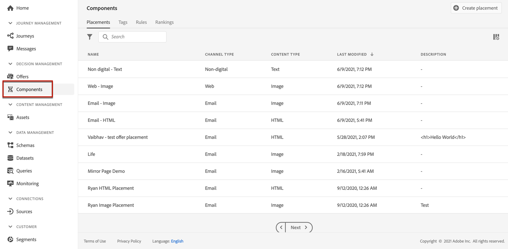
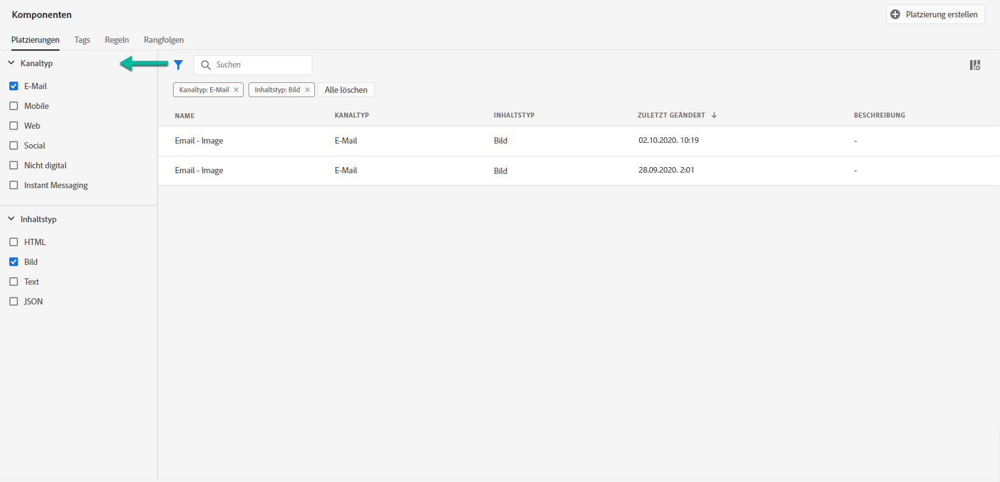
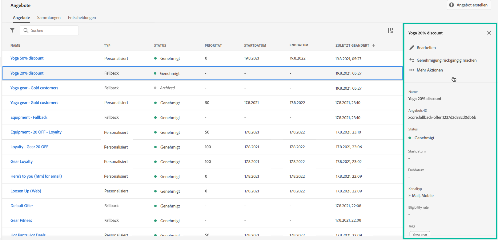
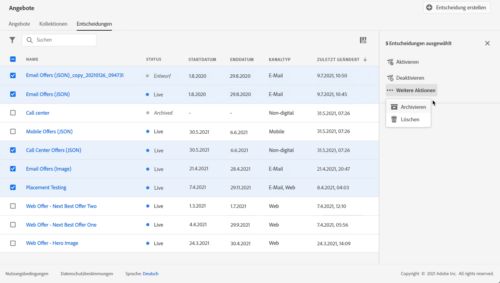
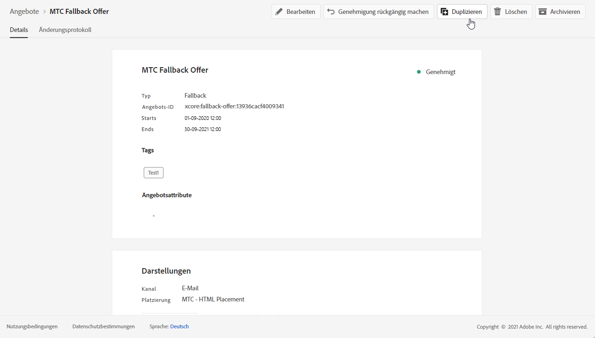
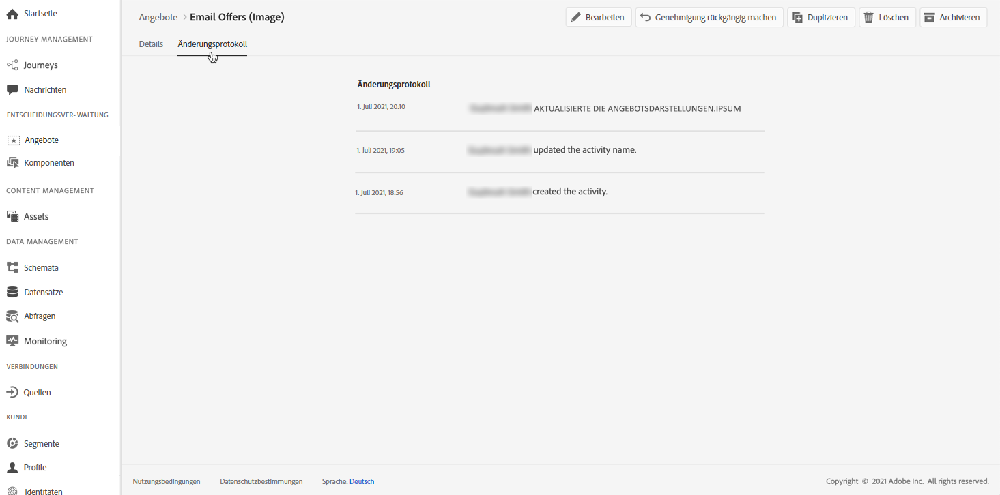

# Benutzeroberfläche {#user-interface}

Mit der Angebotsbibliothek können Sie Platzierungen und Angebote zentral erstellen und verwalten sowie auf alle erstellten Entscheidungen (früher als „Angebotsaktivitäten“ bezeichnet) zugreifen.

Verwenden Sie das Menü **[!UICONTROL Angebote]**, um personalisierte und Fallback-Angebote zu verwalten, diese in Kollektionen zu organisieren und durch Erstellen von Entscheidungen bereitzustellen:

* **[!UICONTROL Angebote]**: Greifen Sie auf Ihre personalisierten Angebote und Fallback-Angebote zu oder erstellen Sie neue Angebote. Siehe [Erstellen eines Angebots](../offer-library/creating-personalized-offers.md) und [Erstellen eines Fallback-Angebots](../offer-library/creating-fallback-offers.md).

* **[!UICONTROL Kollektionen]**: Erstellen und verwalten Sie statische und dynamische Angebotskollektionen. Siehe [Info zu Angebotskollektionen](../offer-library/creating-collections.md).

* **[!UICONTROL Entscheidungen]**: Erstellen und verwalten Sie Entscheidungen zur Bereitstellung Ihrer Angebote. Siehe [Entscheidungen erstellen](../offer-activities/create-offer-activities.md).

Verwenden Sie das Menü **[!UICONTROL Komponenten]**, um die zum Erstellen von Angeboten erforderlichen Komponenten zu verwalten:

* **[!UICONTROL Platzierungen]**: Erstellen und verwalten Sie Platzierungen, an denen Ihre Angebote angezeigt werden. Siehe [Erstellen von Platzierungen](../offer-library/creating-placements.md).

* **[!UICONTROL Tags]**: Erstellen und verwalten Sie Tags, um Ihre Angebote zu organisieren und zu filtern. Siehe [Erstellen von Tags](../offer-library/creating-tags.md).

* **[!UICONTROL Regeln]**: Verwalten Sie die Bedingungen, unter denen Ihre Angebote unterbreitet werden. Näheres dazu finden Sie unter [Erstellen einer Entscheidungsregel](../offer-library/creating-decision-rules.md).

* **[!UICONTROL Rankings]**: Erstellen und verwalten Sie Formeln für Rankings, um zu bestimmen, welches Angebot für eine bestimmte Platzierung zuerst angezeigt werden soll. Siehe [Formeln für Rankings erstellen](../offer-library/create-ranking-formulas.md).

## Informationen suchen und filtern

Verwenden Sie die **Suchleiste**, um ein bestimmtes Element zu suchen.

Sie können auch auf **Filter** zugreifen, indem Sie auf das Filtersymbol links oben in der Liste klicken. Damit können Sie die angezeigten Elemente anhand unterschiedlicher Kriterien filtern. Sie können beispielsweise Platzierungen filtern, die für den E-Mail-Kommunikationskanal und Inhalte vom Typ Bild erstellt wurden.

## Angezeigte Informationen anpassen

Listen aus Menüs zum Entscheidung-Management können mithilfe der Konfigurations-Schaltfläche oben rechts neben den Listen personalisiert werden.

So können Sie je nach Bedarf die Informationen auswählen, die angezeigt werden sollen.

Beachten Sie, dass die Spaltenanpassung für jeden Benutzer gespeichert wird.

## Informationsbereich

Wählen Sie in den verschiedenen Listen ein Element aus, um einen Informationsbereich anzuzeigen, in dem Sie Informationen abrufen und grundlegende Aktionen für das Element ausführen können.

Mit den Listen für Angebote und Entscheidungen können Sie auch Massenaktionen für mehrere Elemente durchführen. Wählen Sie dazu die gewünschten Angebote oder Entscheidungen aus und wählen Sie dann im Informationsbereich die gewünschte Aktion aus.

Beachten Sie, dass Sie auch ein vorhandenes Angebot oder eine Entscheidung duplizieren können, um eine Kopie mit dem Status **[!UICONTROL Entwurf]** zu erstellen. Dies kann entweder über den Informationsbereich oder über die Detailansicht eines Angebots oder einer Entscheidung erfolgen.

## Änderungsprotokolle zu Angeboten und Entscheidungen {#changes-logs}

In der Angebotsbibliothek können Sie sich alle Änderungen anzeigen lassen, die an einem Angebot oder einer Entscheidung vorgenommen wurden. Öffnen Sie dazu das Angebot oder die Entscheidung, indem Sie in der Liste auf den jeweiligen Namen klicken, und wählen Sie dann die Registerkarte **[!UICONTROL Änderungsprotokoll]** aus.

In diesem Bildschirm werden alle vorgenommenen Änderungen sowie der Name des Benutzers angezeigt, der die Änderungen vorgenommen hat.

