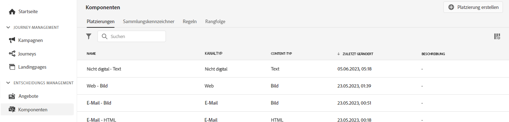

# Benutzeroberfläche {#user-interface}

Mit der Angebot-Bibliothek können Sie Ihre Platzierungen und Angebot an einem Ort erstellen und verwalten sowie auf alle erstellten Entscheidungen zugreifen (früher als Angebot-Aktivitäten bekannt).

Verwenden Sie das Menü **[!UICONTROL Angebot]**, um personalisierte und Ausweichelemente zu verwalten, diese in Sammlungen zu organisieren und durch Erstellen von Entscheidungen bereitzustellen:

* **[!UICONTROL Angebote]**: Greifen Sie auf Ihre personalisierten und Fallback-Angebot zu oder erstellen Sie neue. Siehe [Erstellen eines Angebots](../offer-library/creating-personalized-offers.md) und [Erstellen eines Fallback-Angebots](../offer-library/creating-fallback-offers.md).

* **[!UICONTROL Sammlungen]**: Erstellen und verwalten Sie statische Sammlungen und dynamische Angebote. Siehe [Info zu Angebotskollektionen](../offer-library/creating-collections.md).

* **[!UICONTROL Beschlüsse]**: Erstellen und verwalten Sie Entscheidungen zur Bereitstellung Ihrer Angebot. Siehe [Entscheidungen erstellen](../offer-activities/create-offer-activities.md).

Verwenden Sie das Menü **[!UICONTROL Komponenten]**, um die zum Erstellen von Angeboten erforderlichen Komponenten zu verwalten:

* **[!UICONTROL Platzierungen]**: Erstellen und verwalten Sie Platzierungen, an denen Ihre Angebot angezeigt werden. Siehe [Erstellen von Platzierungen](../offer-library/creating-placements.md).

* **[!UICONTROL Tags]**: Erstellen und verwalten Sie Tags, um Ihre Angebot zu organisieren und zu filtern. Siehe [Erstellen von Tags](../offer-library/creating-tags.md).

* **[!UICONTROL Regeln]**: Verwalten Sie die Bedingungen, unter denen Ihre Angebot präsentiert werden. Näheres dazu finden Sie unter [Erstellen einer Entscheidungsregel](../offer-library/creating-decision-rules.md).

* **[!UICONTROL Rangfolgen]**: Erstellen und verwalten Sie Ranking-Formeln, um zu bestimmen, welches Angebot für eine bestimmte Platzierung zuerst angezeigt werden soll. Siehe [Ranking Formeln](../offer-library/create-ranking-formulas.md) erstellen.

## Informationen suchen und filtern

Verwenden Sie die **Suchleiste**, um ein bestimmtes Element zu suchen.

Sie können auch auf **Filter** zugreifen, indem Sie auf das Filtersymbol links oben in der Liste klicken. Damit können Sie die angezeigten Elemente anhand unterschiedlicher Kriterien filtern. Sie können beispielsweise Platzierungen filtern, die für den E-Mail-Kommunikationskanal und Inhalte vom Typ Bild erstellt wurden.

## Angezeigte Informationen anpassen

Listen aus den Entscheidungsmenüs können mithilfe der Konfigurationsschaltfläche oben rechts in den Listen personalisiert werden.

So können Sie je nach Bedarf die Informationen auswählen, die angezeigt werden sollen.

Beachten Sie, dass die Spaltenanpassung für jeden Benutzer gespeichert wird.

## Informationsbereich

Wählen Sie in den verschiedenen Listen ein Element aus, um einen Informationsbereich anzuzeigen, in dem Sie Informationen abrufen und grundlegende Aktionen für das Element ausführen können.

Die Listen für Angebot und Entscheidungen ermöglichen es Ihnen auch, Massenaktionen für mehrere Elemente durchzuführen. Wählen Sie dazu die gewünschten Angebot oder Entscheidungen aus und wählen Sie dann im Informationsbereich die gewünschte Aktion aus.

Beachten Sie, dass Sie auch ein vorhandenes Angebot oder eine vorhandene Entscheidungskopie mit dem Status **[!UICONTROL Entwurf]** Duplikat erstellen können. Dies kann entweder über den Informationsbereich oder über ein Angebot oder die detaillierte Ansicht einer Entscheidung erfolgen.

## Änderungsprotokolle zu Angeboten und Entscheidungen {#changes-logs}

Mit der Angebot-Bibliothek können Sie alle Änderungen anzeigen, die an einem Angebot oder einer Entscheidung vorgenommen wurden. Öffnen Sie dazu das Angebot oder die Entscheidung, indem Sie in der Liste auf ihren Namen klicken und dann auf die Registerkarte **[!UICONTROL Änderungsprotokoll]** klicken.

In diesem Bildschirm werden alle vorgenommenen Änderungen sowie der Name des Benutzers angezeigt, der die Änderungen vorgenommen hat.

