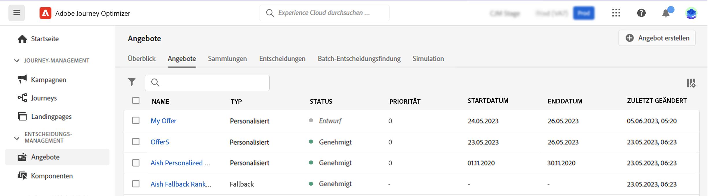

# Benutzeroberfläche {#user-interface}

Die **[!UICONTROL Entscheidungsmanagement]** bietet in der linken Leiste zwei Menüs, die Ihnen Zugriff auf Entscheidungsverwaltungsfunktionen bieten:

Verwenden Sie die **[!UICONTROL Angebote]** Menü zur Verwaltung und Bereitstellung Ihrer Angebote:

* **[!UICONTROL Übersicht]**: Neu bei [!DNL decision management]? Führen Sie die Schritte auf dem Bildschirm aus, um mit dem Einrichten von Platzierungen, Angeboten und Sammlungen zu beginnen. Wenn Sie bereits mit [!DNL decision management] vertraut sind, verschaffen Sie sich einen Überblick über Ihre neuesten Angebote, Sammlungen und Entscheidungen. [Weitere Informationen](#overview)
* **[!UICONTROL Angebote]**: Erstellen und greifen Sie auf Ihre personalisierten Angebote und Fallback-Angebote zu. Erfahren Sie, wie Sie [Angebote](../offer-library/creating-personalized-offers.md) und [Fallback-Angebote](../offer-library/creating-fallback-offers.md)
* **[!UICONTROL Sammlungen]**: Organisieren Sie Ihre Angebote in statischen und dynamischen Sammlungen. [Weitere Informationen](../offer-library/creating-collections.md)
* **[!UICONTROL Entscheidungen]**: Erstellen und verwalten Sie Entscheidungen zur Bereitstellung Ihrer Angebote. [Weitere Informationen](../offer-activities/create-offer-activities.md)
* **[!UICONTROL Batch-Entscheidungsfindung]**: Stellen Sie Angebotsentscheidungen für alle Profile in einem bestimmten Adobe Experience Platform-Segment bereit. [Weitere Informationen](../batch-delivery.md)
* **[!UICONTROL Simulation]**: Validieren Sie Ihre Entscheidungslogik, indem Sie simulieren, welche Angebote für eine bestimmte Platzierung an ein Testprofil gesendet werden. [Weitere Informationen](../offer-activities/simulation.md)

Verwenden Sie die **[!UICONTROL Komponenten]** -Menü zum Erstellen und Verwalten von Komponenten, die zum Erstellen von Angeboten und Entscheidungen erforderlich sind:

* **[!UICONTROL Platzierungen]**: Erstellen und verwalten Sie Platzierungen, in denen Ihre Angebote angezeigt werden. [Weitere Informationen](../offer-library/creating-placements.md)
* **[!UICONTROL Sammlungsqualifizierer]**: Erstellen und verwalten Sie Sammlungsqualifizierer (ehemals als „Tags“ bezeichnet), um Ihre Angebote zu organisieren und zu filtern. [Weitere Informationen](../offer-library/creating-tags.md)
* **[!UICONTROL Regeln]**: Verwalten Sie die Bedingungen, unter denen Ihre Angebote unterbreitet werden. [Weitere Informationen](../offer-library/creating-decision-rules.md)
* **[!UICONTROL Ranking]**: Erstellen und verwalten Sie Ranking-Formeln, um zu bestimmen, welches Angebot für eine bestimmte Platzierung zuerst unterbreitet werden soll. [Weitere Informationen](../ranking/create-ranking-formulas.md)

>[!NOTE]
>
>Wenn Probleme beim Zugriff auf die Entscheidungsverwaltung oder einige ihrer Funktionen auftreten, wenden Sie sich an einen Administrator, um zu erfahren, dass Ihnen die erforderlichen Rechte gewährt wurden. Siehe [Gewähren des Zugriffs auf das Entscheidungs-Management](starting-offer-decisioning.md#granting-acess-to-decision-management).

## Übersicht {#overview}

Wenn Sie mit [!DNL decision management] noch nicht vertraut sind, führt Sie die Registerkarte **[!UICONTROL Übersicht]** durch die wichtigsten Schritte, die zum Erstellen Ihrer ersten Angebotsentscheidung erforderlich sind. Führen Sie die Schritte auf dem Bildschirm aus, um mit der Erstellung von Platzierungen, Angeboten und Sammlungen zu beginnen. Sobald Sie diese ersten Schritte ausgeführt haben, werden Sie dazu aufgefordert, Angebotsentscheidungen zu erstellen.

>[!NOTE]
>
>Die wichtigsten Schritte zum Erstellen und Verwenden von Angeboten in einer Entscheidung werden in [diesem Abschnitt](../offer-library/key-steps.md) beschrieben.

Wenn Sie mit [!DNL decision management] besser vertraut sind und bereits mindestens eine Angebotsentscheidung erstellt haben, zeigt die Registerkarte **[!UICONTROL Übersicht]** Ihre neuesten Angebote, Sammlungen und Entscheidungen an.

Klicken Sie auf ein Angebot oder eine Entscheidung, um direkt auf die Details des ausgewählten Elements zuzugreifen.

Klicken Sie auf die Schaltfläche **[!UICONTROL Alle anzeigen]**, um auf die Angebots-, Sammlungs- oder Entscheidungslisten zuzugreifen.

## Informationen suchen und filtern {#search-and-filter-information}

Verwenden Sie die **Suchleiste**, um ein bestimmtes Element zu suchen.

Sie können auch auf **Filter** zugreifen, indem Sie auf das Filtersymbol links oben in der Liste klicken. Damit können Sie die angezeigten Elemente anhand unterschiedlicher Kriterien filtern. Sie können beispielsweise Platzierungen filtern, die für den E-Mail-Kommunikationskanal und Inhalte vom Typ Bild erstellt wurden.

## Angezeigte Informationen anpassen {#customize-displayed-information}

Listen aus Menüs zum Entscheidungs-Management können mithilfe der Konfigurations-Schaltfläche oben rechts neben den Listen personalisiert werden.

So können Sie je nach Bedarf die Informationen auswählen, die angezeigt werden sollen.

Beachten Sie, dass die Spaltenanpassung für jeden Benutzer gespeichert wird.

## Informationsbereich {#information-pane}

Wählen Sie in den verschiedenen Listen ein Element aus, um einen Informationsbereich anzuzeigen, in dem Sie Informationen abrufen und grundlegende Aktionen für das Element ausführen können.

Mit den Listen für Angebote und Entscheidungen können Sie außerdem Massenaktionen für mehrere Elemente durchführen. Wählen Sie dazu die gewünschten Angebote oder Entscheidungen aus und wählen Sie dann im Informationsbereich die gewünschte Aktion aus.

Beachten Sie, dass Sie auch ein vorhandenes Angebot oder eine Entscheidung duplizieren können, um eine Kopie mit dem Status **[!UICONTROL Entwurf]** zu erstellen. Dies kann entweder über den Informationsbereich oder über die Detailansicht eines Angebots oder einer Entscheidung erfolgen.

## Änderungsprotokolle für Angebote und Entscheidungen {#changes-logs}

In der Angebotsbibliothek können Sie sich alle Änderungen anzeigen lassen, die an einem Angebot oder einer Entscheidung vorgenommen wurden. Öffnen Sie dazu das Angebot oder die Entscheidung, indem Sie in der Liste auf den entsprechenden Namen klicken, und wählen Sie dann die Registerkarte **[!UICONTROL Änderungsprotokoll]** aus.

In diesem Bildschirm werden alle vorgenommenen Änderungen sowie der Name des Benutzers angezeigt, der die Änderungen vorgenommen hat.

