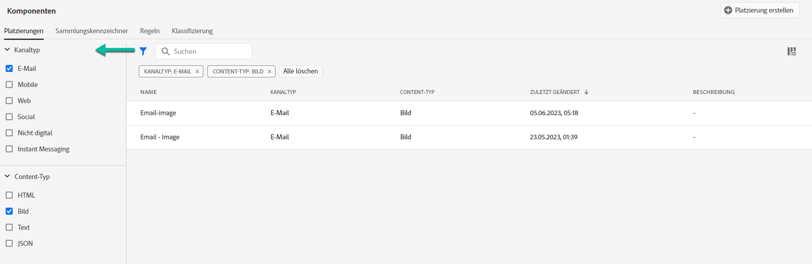
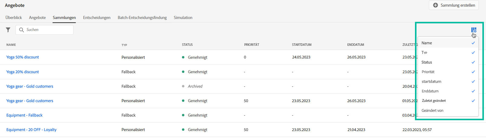

# Benutzeroberfläche {#user-interface}

Mit der Angebotsbibliothek können Sie Ihre Platzierungen und Angebote an einem zentralen Ort erstellen und verwalten sowie auf alle erstellten Entscheidungen zugreifen.

>[!NOTE]
>
>Wenn beim Zugriff auf die Angebotsbibliothek oder einige seiner Funktionen Probleme auftreten, wenden Sie sich an einen Administrator, um sicherzustellen, dass Ihnen die erforderlichen Rechte gewährt wurden. Siehe [Zugriff auf die Entscheidungsverwaltung gewähren](starting-offer-decisioning.md#granting-acess-to-decision-management).

Verwenden Sie die  **[!UICONTROL Offers]** -Menü, um personalisierte und Fallback-Angebote zu verwalten, sie in Sammlungen zu organisieren und sie durch Erstellen von Entscheidungen bereitzustellen:

* **[!UICONTROL Overview]**: Neu in [!DNL decision management]? Führen Sie die Schritte auf dem Bildschirm aus, um mit dem Einrichten von Platzierungen, Angeboten und Sammlungen zu beginnen. Wenn Sie bereits mit [!DNL decision management], erhalten Sie einen Überblick über Ihre neuesten Angebote, Kollektionen und Entscheidungen. Siehe [Übersicht](#overview).

* **[!UICONTROL Offers]**: Greifen Sie auf Ihre personalisierten Angebote und Fallback-Angebote zu oder erstellen Sie neue Angebote. Siehe [Erstellung eines Angebots](../offer-library/creating-personalized-offers.md) und [Fallback-Angebot erstellen](../offer-library/creating-fallback-offers.md).

* **[!UICONTROL Collections]**: Erstellen und verwalten Sie statische und dynamische Angebotskollektionen. Siehe [Über Angebotskollektionen](../offer-library/creating-collections.md).

* **[!UICONTROL Decisions]**: Erstellen und verwalten Sie Entscheidungen zur Bereitstellung Ihrer Angebote. Siehe [Entscheidungen erstellen](../offer-activities/create-offer-activities.md).

Verwenden Sie die  **[!UICONTROL Components]** Menü zum Verwalten der Komponenten, die zum Erstellen von Angeboten erforderlich sind:

* **[!UICONTROL Placements]**: Erstellen und verwalten Sie Platzierungen, in denen Ihre Angebote angezeigt werden. Siehe [Erstellen von Platzierungen](../offer-library/creating-placements.md).

* **[!UICONTROL Tags]**: Erstellen und verwalten Sie Tags, um Ihre Angebote zu organisieren und zu filtern. Siehe [Tags erstellen](../offer-library/creating-tags.md).

* **[!UICONTROL Rules]**: Verwalten Sie die Bedingungen, unter denen Ihre Angebote unterbreitet werden. Siehe [Entscheidungsregel erstellen](../offer-library/creating-decision-rules.md).

* **[!UICONTROL Rankings]**: Erstellen und verwalten Sie Ranking-Formeln, um zu bestimmen, welches Angebot für eine bestimmte Platzierung zuerst unterbreitet werden soll. Siehe [Erstellen von Ranking-Formeln](../ranking/create-ranking-formulas.md).

## Übersicht {#overview}

Wenn Sie neu bei [!DNL decision management], die **[!UICONTROL Overview]** -Tab führt Sie durch die wichtigsten Schritte, die zum Erstellen Ihrer ersten Angebotsentscheidung erforderlich sind.

Führen Sie die Schritte auf dem Bildschirm aus, um mit der Erstellung von Platzierungen, Angeboten und Sammlungen zu beginnen.

Wenn Sie diese ersten Schritte ausgeführt haben, werden Sie aufgefordert, Angebotsentscheidungen zu erstellen.

>[!NOTE]
>
>Die wichtigsten Schritte zum Erstellen und Verwenden von Angeboten in einer Entscheidung werden im Abschnitt [diesem Abschnitt](../offer-library/key-steps.md).

Wenn Sie mit [!DNL decision management] und Sie bereits mindestens eine Angebotsentscheidung erstellt haben, wird die **[!UICONTROL Overview]** zeigt Ihre neuesten Angebote, Sammlungen und Entscheidungen an.

Klicken Sie auf ein Angebot oder eine Entscheidung, um direkt auf die Details des ausgewählten Elements zuzugreifen.

Klicken Sie auf **[!UICONTROL View all]** -Schaltfläche, um auf die Angebots-, Sammlungs- oder Entscheidungslisten zuzugreifen.

## Informationen suchen und filtern {#search-and-filter-information}

Verwenden Sie die **Suchleiste** um ein bestimmtes Element zu finden.

**Filter** Sie können auch auf das Filtersymbol links oben in der Liste zugreifen. Damit können Sie die angezeigten Elemente nach unterschiedlichen Kriterien filtern. Sie können beispielsweise die Platzierungen filtern, die für den E-Mail-Kommunikationskanal und den Inhalt vom Typ Bild erstellt wurden.

## Angezeigte Informationen anpassen {#customize-displayed-information}

Listen aus Entscheidungsmenüs können mithilfe der Konfigurationsschaltfläche oben rechts in den Listen personalisiert werden.

Auf diese Weise können Sie die Informationen auswählen, die je nach Bedarf angezeigt werden sollen.

Beachten Sie, dass die Spaltenanpassung für jeden Benutzer gespeichert wird.

## Informationsbereich {#information-pane}

Wählen Sie in den verschiedenen Listen ein Element aus, um einen Informationsbereich anzuzeigen, in dem Sie Informationen abrufen und grundlegende Aktionen für das Element durchführen können.

In den Angebots- und Entscheidungslisten können Sie auch Massenaktionen für mehrere Elemente durchführen. Wählen Sie dazu die gewünschten Angebote oder Entscheidungen aus und wählen Sie dann im Informationsbereich die gewünschte Aktion aus.

Beachten Sie, dass Sie auch ein vorhandenes Angebot oder vorhandene Entscheidungen duplizieren können, um eine Kopie mit der **[!UICONTROL Draft]** Status. Dies kann entweder über den Informationsbereich, über ein Angebot oder über die Detailansicht einer Entscheidung erfolgen.

## Änderungsprotokolle zu Angeboten und Entscheidungen {#changes-logs}

Mit der Angebotsbibliothek können Sie alle Änderungen an einem Angebot oder einer Entscheidung visualisieren. Öffnen Sie dazu das Angebot oder die Entscheidung, indem Sie in der Liste auf den Namen klicken und dann die **[!UICONTROL Change log]** Registerkarte.

Alle Änderungen, die vorgenommen wurden, werden in diesem Bildschirm angezeigt, sowie der Name des Benutzers, der die Änderungen vorgenommen hat.

