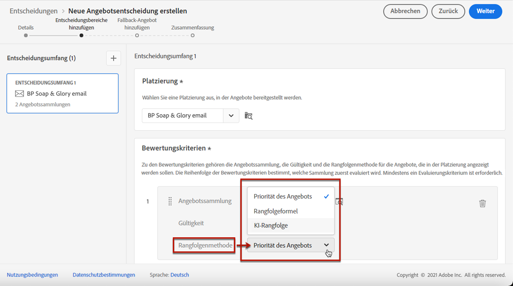
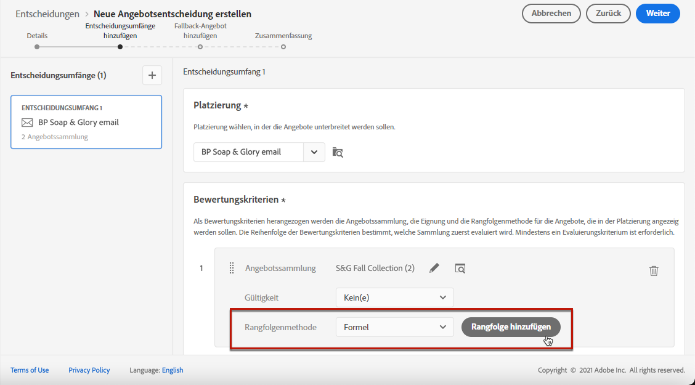
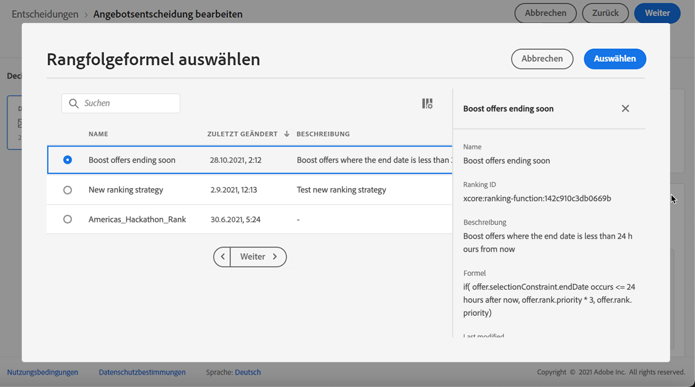
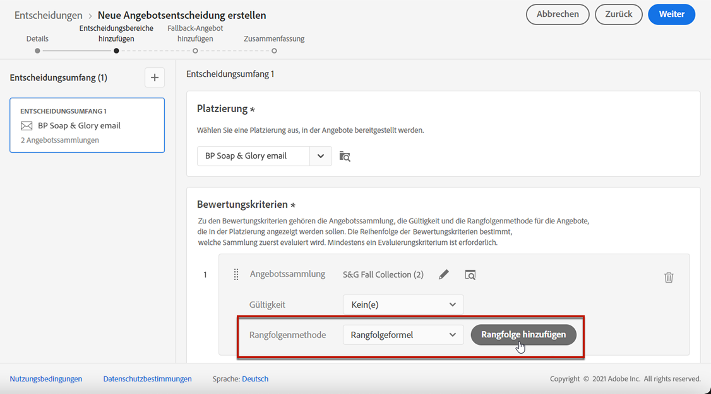
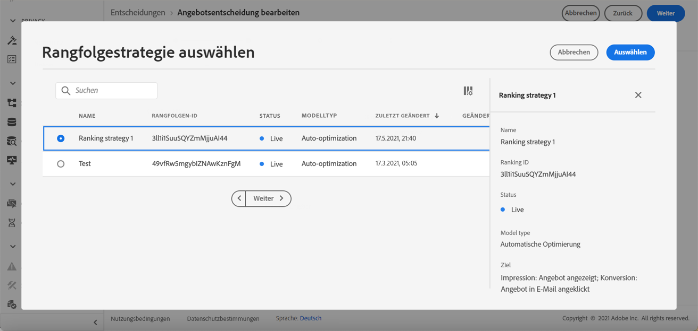

# Konfigurieren der Auswahl von Angeboten in Entscheidungen {#offers-selection-in-decisions}

Wenn mehrere Angebote für eine bestimmte Platzierung in Frage kommen, können Sie bei der Konfiguration einer Entscheidung die Methode wählen, die für jedes Profil das beste Angebot auswählt. Sie können Angebote nach folgenden Kriterien sortieren:
* Angebotspriorität
* Rangfolgenformel
* [KI-Rangfolge](#use-ranking-strategy)

## Angebotspriorität {#offer-priority}

Wenn mehrere Angebote für eine bestimmte Platzierung in einer Entscheidung in Frage kommen, werden standardmäßig die Angebote mit der höchsten **Priorität** zuerst an die Kunden gesendet.

Die Prioritätswerte der Angebote werden bei der Erstellung eines Angebots zugewiesen. Näheres dazu, wie Sie ein personalisiertes Angebot erstellen, finden Sie in [diesem Abschnitt](../offer-library/creating-personalized-offers.md).

## Rangfolgenformel {#assign-ranking-formula}

Zusätzlich zur Angebotspriorität können Sie mit Journey Optimizer **Rangfolgenformeln** erstellen. Dabei handelt es sich um Formeln, die bestimmen, welches Angebot für eine bestimmte Platzierung zuerst präsentiert werden soll, anstatt die Prioritätswerte der Angebote zu berücksichtigen.

Sie können beispielsweise die Priorität aller Angebote erhöhen, deren Enddatum weniger als 24 Stunden entfernt ist, oder die Priorität von Angeboten aus der Kategorie „Laufen“ erhöhen, wenn das Interesse eines Profils „Laufen“ ist.

Näheres dazu, wie Sie eine Rangfolgenformel erstellen, finden Sie in [diesem Abschnitt](../ranking/create-ranking-formulas.md).

Nachdem Sie eine Formel erstellt haben, können Sie sie einer Platzierung in einer Entscheidung zuweisen. Gehen Sie dazu wie folgt vor:

1. Erstellen Sie eine Entscheidung oder bearbeiten Sie eine bestehende. Siehe [Erstellen von Entscheidungen](../offer-activities/create-offer-activities.md).

1. Fügen Sie die Platzierungen hinzu, die Ihre Angebote enthalten werden. Siehe [Erstellen von Platzierungen](../offer-library/creating-placements.md).

1. Fügen Sie für jede Platzierung eine Sammlung hinzu. Siehe [Erstellen von Sammlungen](../offer-library/creating-collections.md).

1. Wählen Sie **[!UICONTROL Formel]** als die Rangfolgenmethode aus und klicken Sie anschließend auf **[!UICONTROL Rangfolge hinzufügen]**.

   

1. Wählen Sie die gewünschte Formel aus und klicken Sie dann auf **[!UICONTROL Auswählen]**.

   

Die Rangfolgenformel ist nun mit der Platzierung verknüpft.

Wenn mehrere Angebote für diese Platzierung infrage kommen, verwendet die Entscheidung die ausgewählte Formel, um zu berechnen, welches Angebot zuerst bereitgestellt werden soll.

## KI-Rangfolge {#use-ranking-strategy}

<!--If you are an [Adobe Experience Platform](https://experienceleague.adobe.com/docs/experience-platform/landing/home.html){target="_blank"} user leveraging the **Offer Decisioning** application service,-->

Sie können auch ein System mit trainierten Modellen verwenden, das automatisch eine Rangfolge der Angebote erstellt, die für ein bestimmtes Profil angezeigt werden sollen, indem Sie ein KI-Modell auswählen. In [diesem Abschnitt](../ranking/create-ranking-strategies.md) erfahren Sie, wie Sie ein KI-Modell erstellen.

Sobald ein KI-Modell erstellt wurde, können Sie dieses einer Platzierung in einer Entscheidung zuweisen. Gehen Sie dazu wie folgt vor:

1. Erstellen Sie eine Entscheidung oder bearbeiten Sie eine bestehende. Siehe [Erstellen von Entscheidungen](../offer-activities/create-offer-activities.md).

1. Fügen Sie die Platzierungen hinzu, die Ihre Angebote enthalten werden. Siehe [Erstellen von Platzierungen](../offer-library/creating-placements.md).

1. Fügen Sie für jede Platzierung eine Sammlung hinzu. Siehe [Erstellen von Sammlungen](../offer-library/creating-collections.md).

1. Wählen Sie aus der Dropdown-Liste die Option zum Sortieren der Angebote nach **[!UICONTROL KI-Rangfolge]** und klicken Sie dann auf **[!UICONTROL Rangfolge hinzufügen]**.

   

1. Wählen Sie das von Ihnen erstellte KI-Modell aus. Alle Details des Modells werden angezeigt.

   

1. Klicken Sie auf **[!UICONTROL Auswählen]**. Das KI-Modell ist jetzt mit der Platzierung verknüpft.

Wenn mehrere Angebote geeignet sind, bestimmt das System mit trainierten Modellen, welches Angebot für eine bestimmte Platzierung zuerst gezeigt werden soll.

