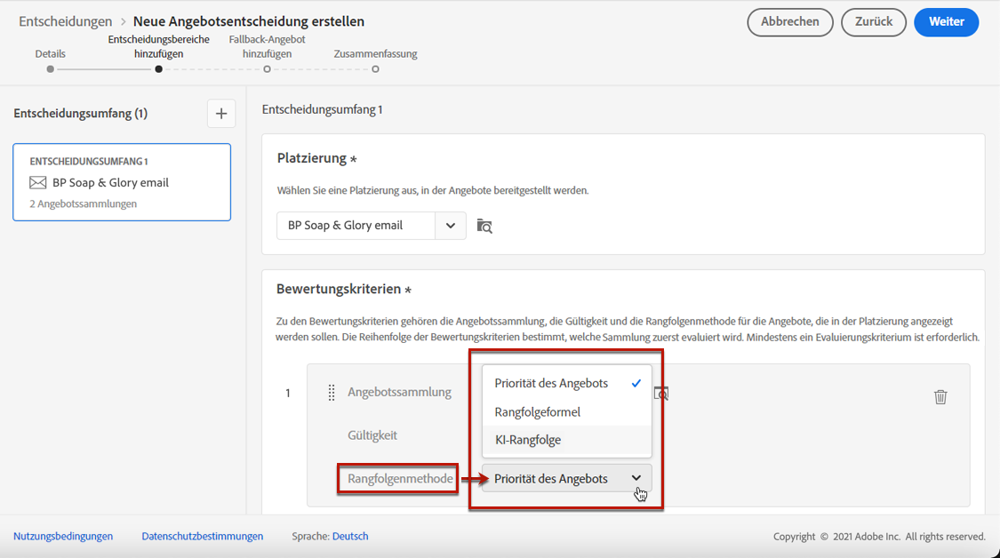
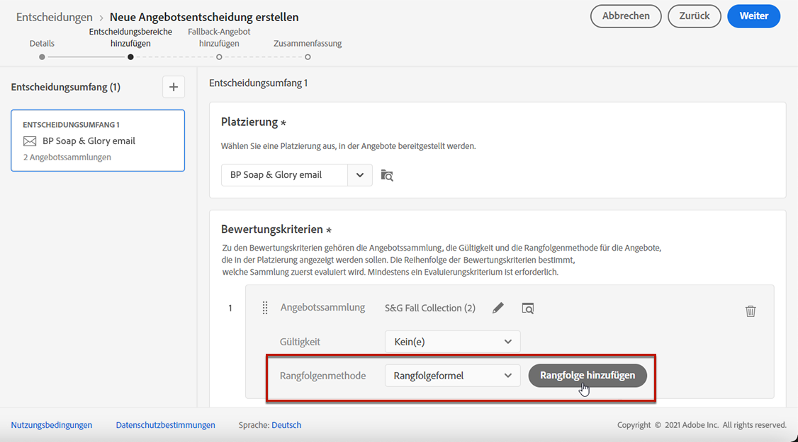
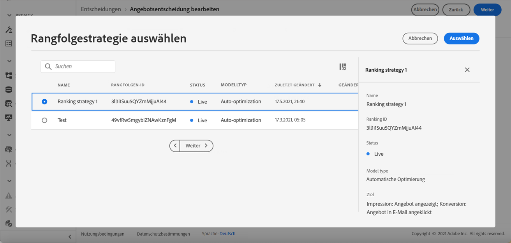

# Konfigurieren der Auswahl von Angeboten für Entscheidungen {#offers-selection-in-decisions}

Wenn mehrere Angebote für eine bestimmte Platzierung infrage kommen, können Sie bei der Konfiguration einer Entscheidung für jedes Profil die Methode auswählen, die das beste Angebot auswählt. Sie können Angebote nach folgenden Kriterien sortieren:
* Angebotspriorität
* Rangfolgenformel
* [KI-Rangfolge](#use-ranking-strategy) (derzeit nur für ausgewählte Benutzer)

## Angebotspriorität {#offer-priority}

Wenn mehrere Angebote für eine bestimmte Platzierung in einer Entscheidung infrage kommen, weisen die Angebote mit der höchsten **priority** werden zuerst an die Kunden geliefert.

Die Prioritätswerte der Angebote werden bei der Erstellung eines Angebots zugewiesen. Näheres dazu, wie Sie ein personalisiertes Angebot erstellen, finden Sie in [diesem Abschnitt](../offer-library/creating-personalized-offers.md).

## Rangfolgenformel {#assign-ranking-formula}

Zusätzlich zur Angebotspriorität können Sie mit Journey Optimizer **Rangfolgenformeln** erstellen. Dabei handelt es sich um Formeln, die bestimmen, welches Angebot für eine bestimmte Platzierung zuerst präsentiert werden soll, anstatt die Prioritätswerte der Angebote zu berücksichtigen.

Sie können beispielsweise die Priorität aller Angebote erhöhen, deren Enddatum weniger als 24 Stunden entfernt ist, oder die Priorität von Angeboten aus der Kategorie „Laufen“ erhöhen, wenn das Interesse eines Profils „Laufen“ ist.

Näheres dazu, wie Sie eine Rangfolgenformel erstellen, finden Sie in [diesem Abschnitt](../offer-library/create-ranking-formulas.md).

Nachdem eine Rangfolgenformel erstellt wurde, können Sie sie einer Platzierung in einer Entscheidung zuweisen. Gehen Sie dazu wie folgt vor:

1. Erstellen Sie eine Entscheidung oder bearbeiten Sie eine bestehende. Siehe [Erstellen von Entscheidungen](../offer-activities/create-offer-activities.md).

1. Fügen Sie die Platzierungen hinzu, die Ihre Angebote enthalten werden. Siehe [Erstellen von Platzierungen](../offer-library/creating-placements.md).

1. Fügen Sie für jede Platzierung eine Kollektion hinzu. Siehe [Erstellen von Kollektionen](../offer-library/creating-collections.md).

1. Wählen Sie **[!UICONTROL Rangfolgenformel]** als Rangfolgenmethode aus und klicken Sie anschließend auf **[!UICONTROL Rangfolge hinzufügen]**.

   

1. Wählen Sie die gewünschte Rangfolgenformel aus und klicken Sie dann auf **[!UICONTROL Auswählen]**.

   

Die Rangfolgenformel ist nun mit der Platzierung verknüpft.

Wenn mehrere Angebote für diese Platzierung geeignet sind, verwendet die Entscheidung die Rangfolgenformel, um zu berechnen, welches Angebot zuerst bereitgestellt werden soll.

## KI-Rangfolge {#use-ranking-strategy}

<!--If you are an [Adobe Experience Platform](https://experienceleague.adobe.com/docs/experience-platform/landing/home.html){target="_blank"} user leveraging the **Offer Decisioning** application service,-->

Sie können auch ein trainiertes Modellsystem verwenden, das Angebote, die für ein bestimmtes Profil angezeigt werden sollen, automatisch nach Rang geordnet, indem Sie eine Rangstrategie auswählen. In [diesem Abschnitt](../offer-library/create-ranking-strategies.md) erfahren Sie, wie Sie eine Rangfolgestrategie erstellen.

>[!CAUTION]
>
>Die Verwendung der KI-Rangfolge ist derzeit nur für ausgewählte Benutzer verfügbar.

Nachdem eine Rangstrategie erstellt wurde, können Sie sie einer Platzierung in einer Entscheidung zuweisen. Gehen Sie dazu wie folgt vor:

1. Erstellen Sie eine Entscheidung oder bearbeiten Sie eine bestehende. Siehe [Erstellen von Entscheidungen](../offer-activities/create-offer-activities.md).

1. Fügen Sie die Platzierungen hinzu, die Ihre Angebote enthalten werden. Siehe [Erstellen von Platzierungen](../offer-library/creating-placements.md).

1. Fügen Sie für jede Platzierung eine Kollektion hinzu. Siehe [Erstellen von Kollektionen](../offer-library/creating-collections.md).

1. Wählen Sie aus der Dropdown-Liste die Option zum Sortieren der Angebote nach **[!UICONTROL KI-Rangfolge]** und klicken Sie dann auf **[!UICONTROL Rangfolge hinzufügen]**.

   

1. Wählen Sie die von Ihnen erstellte Rangfolgestrategie aus. Alle Details der Rangfolgestrategie werden angezeigt.

   

1. Klicken Sie auf **[!UICONTROL Auswählen]**. Die Rangfolgestrategie ist nun mit der Platzierung verknüpft.

Wenn mehrere Angebote geeignet sind, bestimmt das System mit trainierten Modellen, welches Angebot zuerst für eine bestimmte Platzierung gezeigt werden soll.

