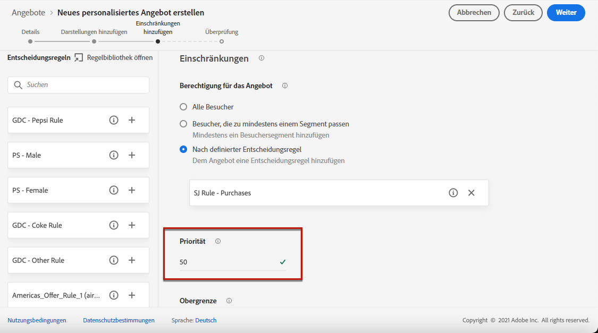
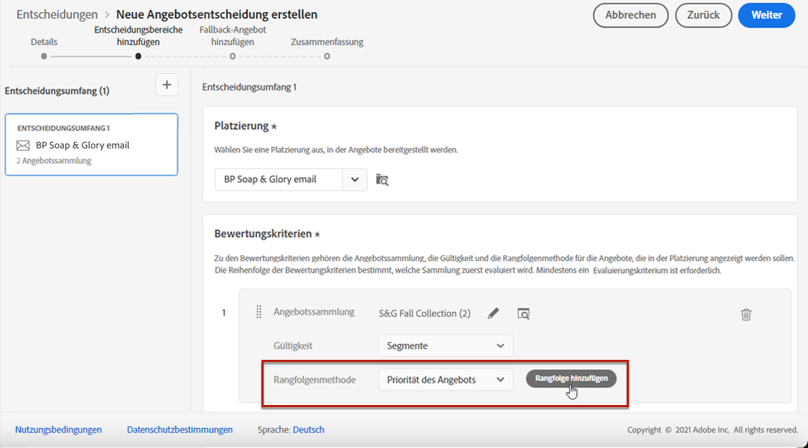
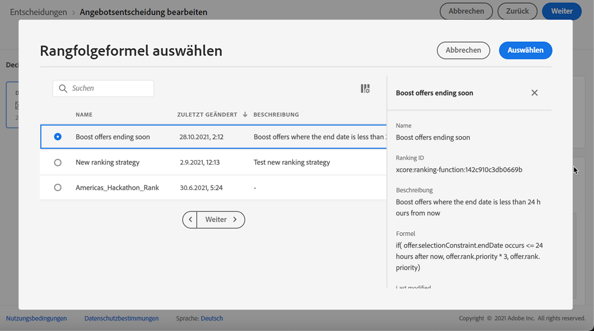

# Auswahl von Angeboten in Entscheidungen konfigurieren {#offers-selection-in-activities}

Wenn mehrere Angebote für eine bestimmte Platzierung infrage kommen, können Sie bei der Konfiguration einer Entscheidung (zuvor als Angebotsaktivität bezeichnet) die Methode auswählen, die das beste Angebot für jedes Profil auswählt. Sie können Angebote nach folgenden Kriterien sortieren:
* Angebotspriorität
* Rangfolgenformel

## Angebotspriorität {#about-offers-priority}

Wenn in einer Entscheidung (früher als „Angebotsaktivität“ bezeichnet) mehrere Angebote für eine bestimmte Platzierung geeignet sind, werden standardmäßig zuerst die Angebote mit der höchsten **Priorität** an die Kunden gesendet.

Die Prioritätswerte der Angebote werden bei der Erstellung eines Angebots zugewiesen. Näheres dazu, wie Sie ein personalisiertes Angebot erstellen, finden Sie in [diesem Abschnitt](../offer-library/creating-personalized-offers.md).

## Rangfolgenformel {#assign-ranking-formula}

Zusätzlich zur Angebotspriorität können Sie mit Journey Optimizer **Rangfolgenformeln** erstellen. Dabei handelt es sich um Formeln, die bestimmen, welches Angebot für eine bestimmte Platzierung zuerst präsentiert werden soll, anstatt die Prioritätswerte der Angebote zu berücksichtigen.

Sie können beispielsweise die Priorität aller Angebote erhöhen, deren Enddatum weniger als 24 Stunden entfernt ist, oder die Priorität von Angeboten aus der Kategorie „Laufen“ erhöhen, wenn das Interesse eines Profils „Laufen“ ist.

Näheres dazu, wie Sie eine Rangfolgenformel erstellen, finden Sie in [diesem Abschnitt](../offer-library/create-ranking-formulas.md).

Nachdem eine Rangfolgenformel erstellt wurde, können Sie sie einer Platzierung in einer Entscheidung (früher als Angebotsaktivität bezeichnet) zuweisen. Gehen Sie dazu wie folgt vor:

1. Erstellen Sie eine Entscheidung oder bearbeiten Sie eine bestehende. Siehe [Erstellen von Entscheidungen](../offer-activities/create-offer-activities.md).

1. Fügen Sie die Platzierungen hinzu, die Ihre Angebote enthalten werden. Siehe [Erstellen von Platzierungen](../offer-library/creating-placements.md).

1. Fügen Sie für jede Platzierung eine Kollektion hinzu. Siehe [Erstellen von Kollektionen](../offer-library/creating-collections.md).

1. Wählen Sie aus der Dropdown-Liste die Option, Angebote nach **[!UICONTROL Rangfolge]** zu sortieren, und klicken Sie dann auf **[!UICONTROL Rangfolge hinzufügen]**.

   

1. Wählen Sie die gewünschte Rangfolgenformel aus und klicken Sie dann auf **[!UICONTROL Auswählen]**.

   

Die Rangfolgenformel ist nun mit der Platzierung verknüpft.

Wenn mehrere Angebote für diese Platzierung geeignet sind, verwendet die Entscheidung die Rangfolgenformel, um zu berechnen, welches Angebot zuerst bereitgestellt werden soll.
