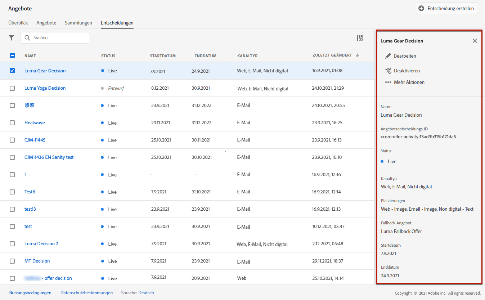
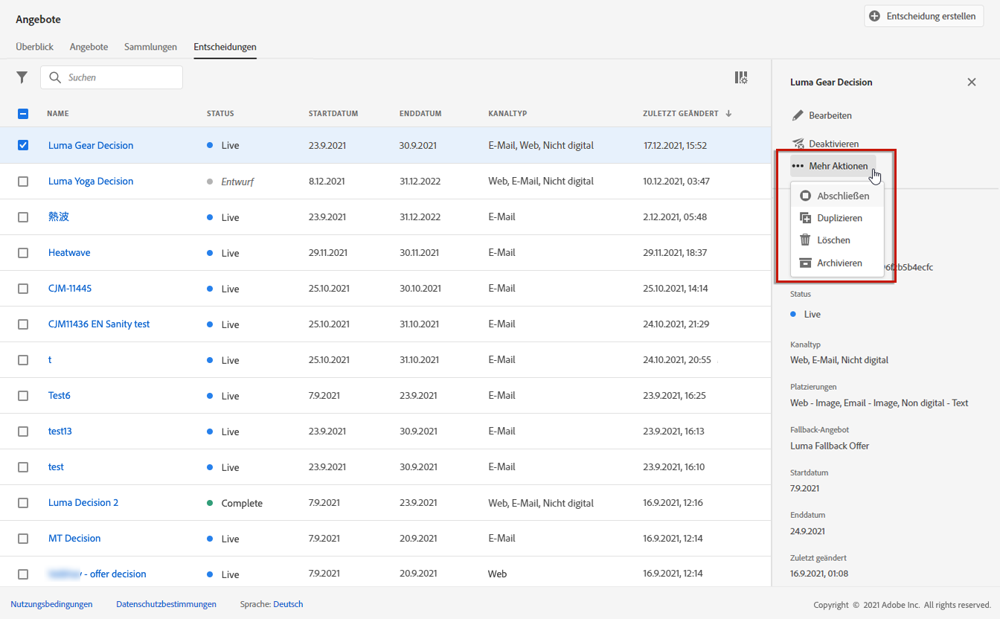
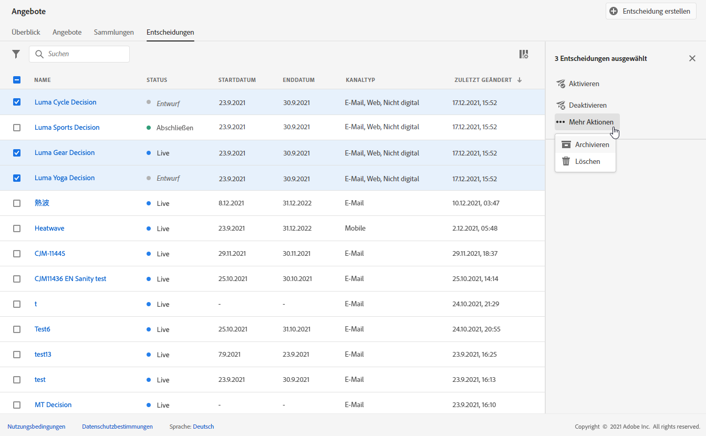
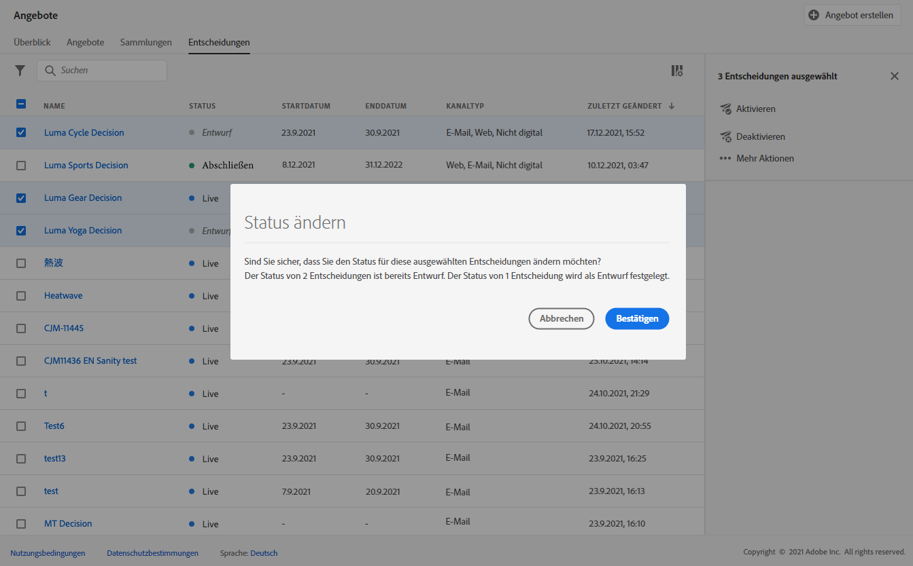
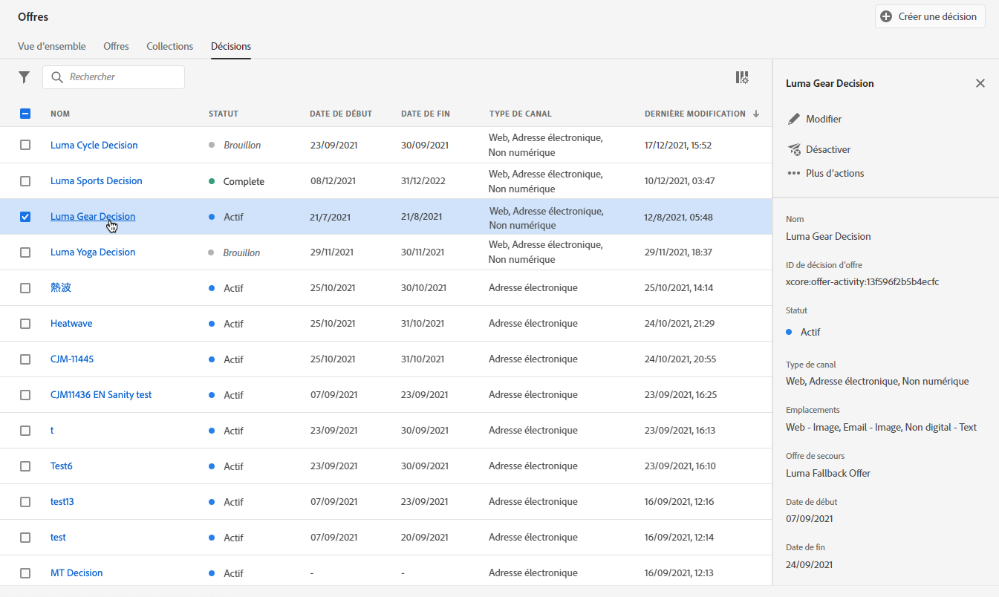
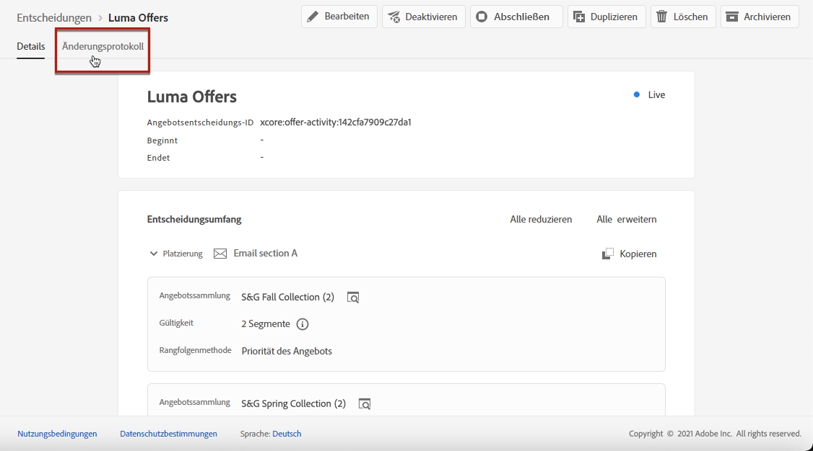

# Entscheidungen erstellen {#create-offer-activities}

Entscheidungen (früher als Angebotsaktivitäten bezeichnet) sind Container für Ihre Angebote, die die Offer Decisioning-Engine nutzen, um das beste Angebot auszuwählen, das je nach Zielgruppe des Versands unterbreitet werden kann.

➡️ [Entdecken Sie diese Funktion im Video](#video).

Die Liste der Entscheidungen ist im Menü **[!UICONTROL Angebote]** auf der Registerkarte **[!UICONTROL Entscheidungen]** verfügbar. Es gibt Filter, mit denen Sie Entscheidungen anhand von Status oder Anfangs- und Enddatum abrufen können.

Bevor Sie eine Entscheidung erstellen, prüfen Sie, ob die folgenden Komponenten in der Angebotsbibliothek erstellt wurden:

* [Platzierungen](../offer-library/creating-placements.md)
* [Kollektionen](../offer-library/creating-collections.md)
* [Personalisierte Angebote](../offer-library/creating-personalized-offers.md)
* [Fallback-Angebote](../offer-library/creating-fallback-offers.md)

## Erstellen einer Entscheidung {#create-activity}

1. Rufen Sie die Entscheidungsliste auf und klicken Sie dann auf **[!UICONTROL Entscheidung erstellen]**.

1. Geben Sie den Namen der Entscheidung an.

1. Legen Sie ein Start- und Enddatum sowie eine Uhrzeit fest und klicken Sie dann auf **[!UICONTROL Weiter]**.

   

## Entscheidungsbereiche hinzufügen {#add-decision-scopes}

1. Ziehen Sie eine Platzierung per Drag-and-drop aus der Liste, fügen Sie sie der Entscheidung hinzu und klicken Sie dann auf **[!UICONTROL Kollektion hinzufügen]**.

   

   >[!NOTE]
   >
   >Dieselbe Platzierung kann mehrmals für eine Entscheidung ausgewählt werden.

1. Wählen Sie die Kollektion aus, die die zu berücksichtigenden Angebote enthält, und klicken Sie auf **[!UICONTROL Hinzufügen]**.

   

1. Die ausgewählten Angebote werden der Platzierung hinzugefügt.

   In diesem Beispiel haben wir zwei Angebote ausgewählt, die in einer JSON-Platzierung angezeigt werden, um Angebote in einer Callcenter-Lösung zu präsentieren.

   

1. Wenn mehrere Angebote für diese Platzierung geeignet sind, werden für den Kunden standardmäßig die Angebote mit der höchsten Priorität bereitgestellt.

   Wenn Sie mit einer bestimmten Formel oder einer Rangfolgestrategie festlegen möchten, welches Angebot bereitgestellt werden soll, wählen Sie eine Rangfolgeformel aus der Dropdown-Liste **[!UICONTROL Angebote sortieren nach]** aus. Weiterführende Informationen hierzu finden Sie in [diesem Abschnitt](../offer-activities/configure-offer-selection.md).

1. Das Feld **[!UICONTROL Begrenzung]** schränkt die Auswahl der Angebote für diese Platzierung ein. Diese Einschränkung kann mithilfe einer **Entscheidungsregel** oder eines oder mehrerer **Adobe Experience Platform-Segmente** angewendet werden. Beide werden in [diesem Abschnitt](#segments-vs-decision-rules) genauer beschrieben.

   * Um die Auswahl der Angebote auf die Mitglieder eines Adobe Experience Platform-Segments zu beschränken, wählen Sie **[!UICONTROL Segmente]** aus und klicken Sie dann auf **[!UICONTROL Segmente hinzufügen]**.

      

      Fügen Sie eines oder mehrere Segmente aus dem linken Bereich hinzu, kombinieren Sie sie mit den logischen Operatoren **[!UICONTROL Und]** / **[!UICONTROL Oder]** und klicken Sie dann zur Bestätigung auf **[!UICONTROL Auswählen]**.

      

      Weitere Informationen zum Arbeiten mit Segmenten finden Sie in [diesem Abschnitt](../../segment/about-segments.md).

   * Wenn Sie eine Auswahleinschränkung für diese Platzierung mithilfe einer Entscheidungsregel hinzufügen möchten, wählen Sie die Option **[!UICONTROL Entscheidungsregel]** aus und ziehen Sie die gewünschte Regel dann aus dem linken Bereich in den Bereich **[!UICONTROL Entscheidungsregel]**.

      

      Weiterführende Informationen zum Erstellen einer Entscheidungsregel finden Sie in [diesem Abschnitt](../offer-library/creating-decision-rules.md).

### Verwenden von Segmenten vs. Entscheidungsregeln {#segments-vs-decision-rules}

<!--to move to create-offers?-->

Um eine Einschränkung anzuwenden, können Sie die Auswahl von Angeboten auf ein oder mehrere **Adobe Experience Platform-Segmente** beschränken oder eine **Entscheidungsregel** verwenden. Diese beiden Lösungen werden in unterschiedlichen Fällen angewendet.

Grundsätzlich besteht ein Segment aus einer Liste von Profilen, während eine Entscheidungsregel eine Funktion ist, die während des Entscheidungsprozesses bei Bedarf für ein einzelnes Profil ausgeführt wird. Der Unterschied zwischen diesen beiden Anwendungen wird im Folgenden beschrieben.

* **Segmente**

   Segmente sind Adobe Experience Platform-Profile, die basierend auf Profilattributen und Erlebnisereignissen einer bestimmten Logik entsprechen. Doch beim Offer Decisioning-Prozess wird das Segment nicht neu berechnet, weshalb es zum Zeitpunkt der Angebotsunterbreitung möglicherweise nicht aktuell ist.

   Weitere Informationen zu Segmenten finden Sie in [diesem Abschnitt](../../segment/about-segments.md).

* **Entscheidungsregeln**

   Dagegen basiert eine Entscheidungsregel auf in Adobe Experience Platform verfügbaren Daten und bestimmt, wem ein Angebot angezeigt werden kann. Nachdem die Entscheidungsregel in einem Angebot oder einer Entscheidung für eine bestimmte Platzierung ausgewählt wurde, wird sie bei jedem Entscheidungsvorgang erneut ausgeführt. Dadurch wird jedem Profil immer ein aktuelles, optimales Angebot angezeigt.

   Weitere Informationen zu Entscheidungsregeln finden Sie in [diesem Abschnitt](../offer-library/creating-decision-rules.md).

## Hinzufügen eines Fallback-Angebots {#add-fallback}

Wählen Sie das Fallback-Angebot aus, das Kunden, die nicht den Regeln der Angebotsbedingung und den Einschränkungen entsprechen, letztlich angezeigt wird, und klicken Sie dann auf **[!UICONTROL Weiter]**.

## Entscheidung überprüfen und speichern {#review}

Wenn alles ordnungsgemäß konfiguriert ist, wird eine Zusammenfassung der Entscheidungseigenschaften angezeigt.

1. Stellen Sie sicher, dass die Entscheidung für die Präsentation von Angeboten für Kunden bereit ist.
1. Klicken Sie auf **[!UICONTROL Fertigstellen]**.
1. Wählen Sie dann **[!UICONTROL Speichern und aktivieren]**.

   

   Sie können die Entscheidung auch als Entwurf speichern, um sie später zu bearbeiten und zu aktivieren.

Die Entscheidung wird in der Liste mit dem Status **[!UICONTROL Live]** oder **[!UICONTROL Entwurf]** angezeigt, je nachdem, ob Sie sie im vorherigen Schritt aktiviert haben oder nicht.

Sie ist jetzt bereit, für das Senden von Angeboten an Kunden genutzt zu werden.

## Entscheidungsliste {#decision-list}

In der Entscheidungsliste können Sie die Entscheidung auswählen, deren Eigenschaften angezeigt werden sollen. Dort können Sie sie auch bearbeiten, ihren Status ändern (**Entwurf**, **Live**, **Abgeschlossen**, **Archiviert**), die Entscheidung duplizieren oder löschen.

Wählen Sie die Schaltfläche **[!UICONTROL Bearbeiten]** aus, um zum Entscheidungsbearbeitungsmodus zurückzukehren. Dort können Sie die [Details](#create-activity), [Entscheidungsumfänge](#add-decision-scopes) und das [Fallback-Angebot](#add-fallback) der Entscheidung ändern.

Wählen Sie eine Live-Entscheidung aus und klicken Sie auf **[!UICONTROL Deaktivieren]**, um den Entscheidungsstatus wieder auf **[!UICONTROL Entwurf]** zu setzen.

Um den Status erneut auf **[!UICONTROL Live]** zu setzen, wählen Sie die Schaltfläche **[!UICONTROL Aktivieren]** aus, die jetzt angezeigt wird.

Die Schaltfläche **[!UICONTROL Weitere Aktionen]** aktiviert die unten beschriebenen Aktionen.

* **[!UICONTROL Abschließen]**: setzt den Status der Entscheidung auf **[!UICONTROL Abgeschlossen]**, was bedeutet, dass die Entscheidung nicht mehr aufgerufen werden kann. Diese Aktion steht nur für aktivierte Entscheidungen zur Verfügung. Die Entscheidung ist weiterhin in der Liste verfügbar, Sie können ihren Status jedoch nicht auf **[!UICONTROL Entwurf]** oder **[!UICONTROL Genehmigt]** zurücksetzen. Sie können sie nur duplizieren, löschen oder archivieren.

* **[!UICONTROL Duplizieren]**: erstellt eine Entscheidung mit denselben Eigenschaften, Entscheidungsumfängen und Fallback-Angebot. Standardmäßig hat die neue Entscheidung den Status **[!UICONTROL Entwurf]**.

* **[!UICONTROL Löschen]**: entfernt die Entscheidung aus der Liste.

   >[!CAUTION]
   >
   >Die Entscheidung und ihr Inhalt sind nicht mehr zugänglich. Diese Aktion kann nicht rückgängig gemacht werden.
   >
   >Wenn die Entscheidung in einem anderen Objekt verwendet wird, kann sie nicht gelöscht werden.

* **[!UICONTROL Archivieren]**: setzt den Entscheidungsstatus auf **[!UICONTROL Archiviert]**. Die Entscheidung ist weiterhin in der Liste verfügbar, Sie können ihren Status jedoch nicht auf **[!UICONTROL Entwurf]** oder **[!UICONTROL Genehmigt]** zurücksetzen. Sie können es nur duplizieren oder löschen.

Sie können auch den Status mehrerer Entscheidungen gleichzeitig löschen oder ändern, indem Sie die entsprechenden Checkboxen auswählen.

Wenn Sie den Status mehrerer Entscheidungen mit unterschiedlichen Status ändern möchten, werden nur die relevanten Status geändert.

Nachdem eine Entscheidung erstellt wurde, können Sie in der Liste auf ihren Namen klicken.

Dadurch können Sie auf detaillierte Informationen zu dieser Entscheidung zugreifen. Wählen Sie die Registerkarte **[!UICONTROL Protokoll ändern]**, um [alle Änderungen zu überwachen](../get-started/user-interface.md#changes-log), die an der Entscheidung vorgenommen wurden.

## Anleitungsvideo {#video}

>[!NOTE]
>
>Dieses Video bezieht sich auf den auf Adobe Experience Platform aufbauenden Anwendungsdienst Offer Decisioning. Es enthält allgemeine Leitlinien für die Verwendung von Angeboten im Kontext von Journey Optimizer.

>[!VIDEO](https://video.tv.adobe.com/v/329606?quality=12)
