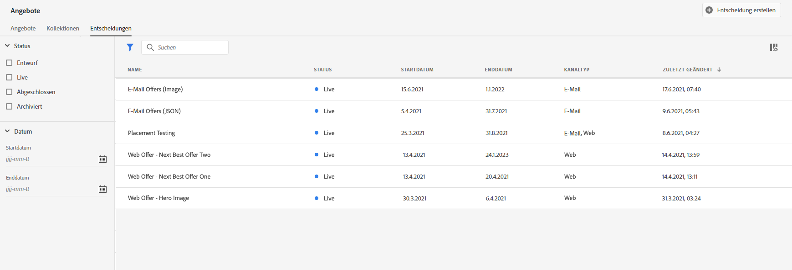
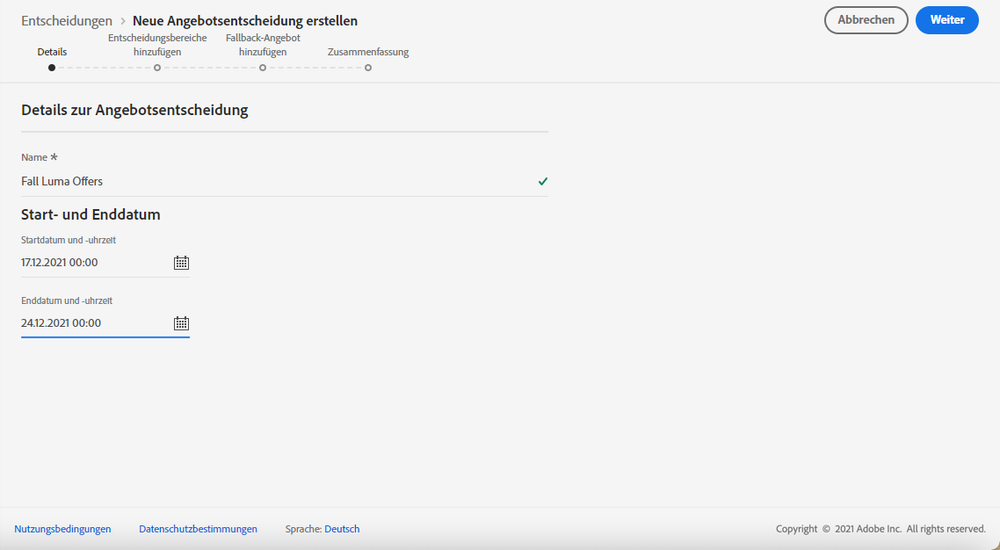
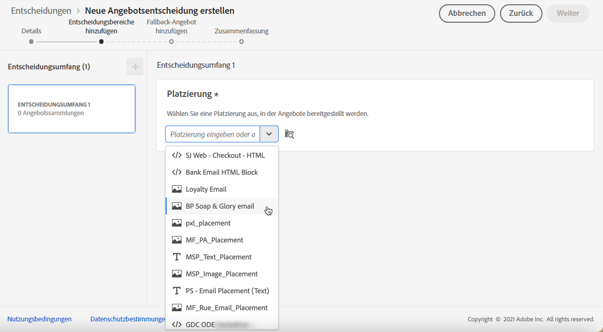
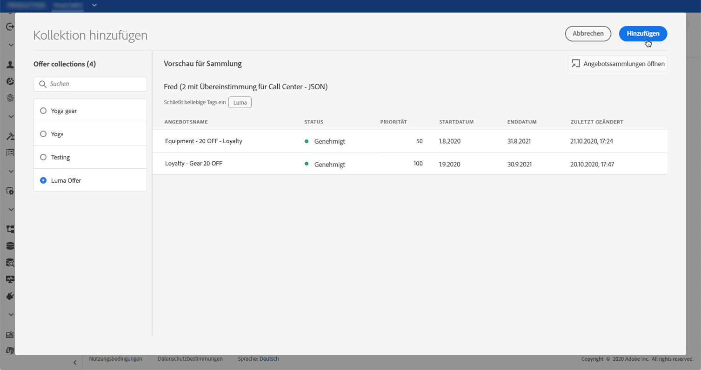
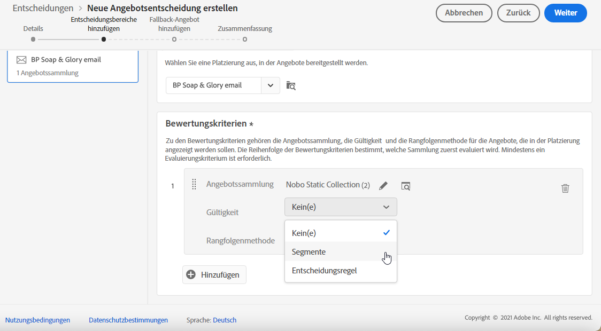
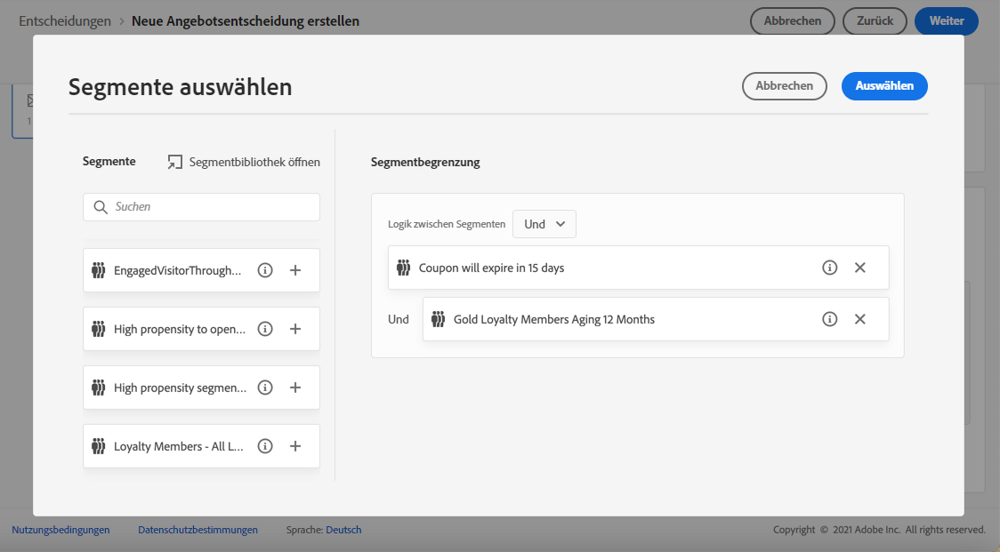
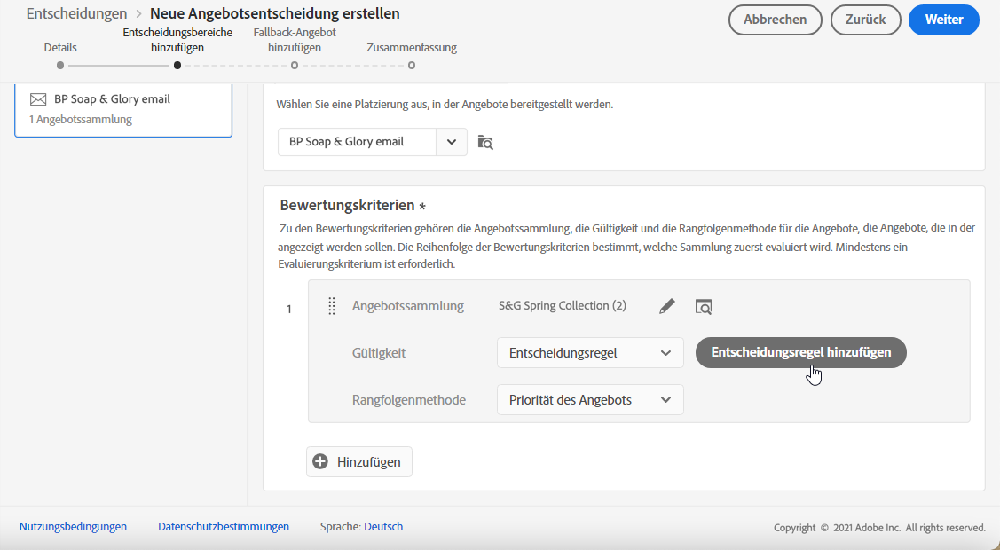
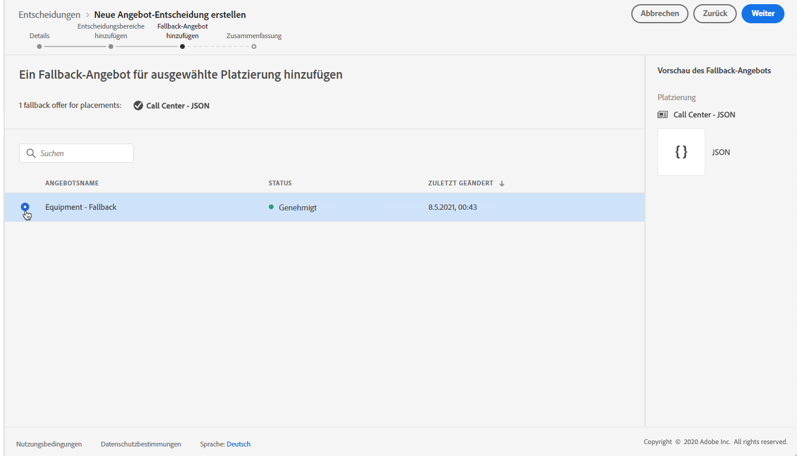
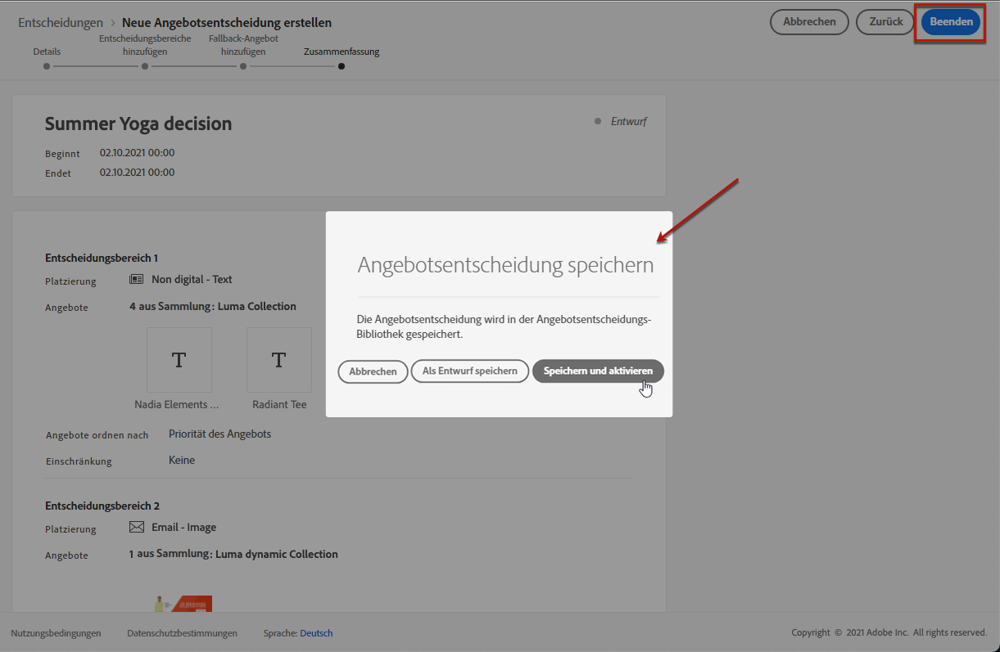
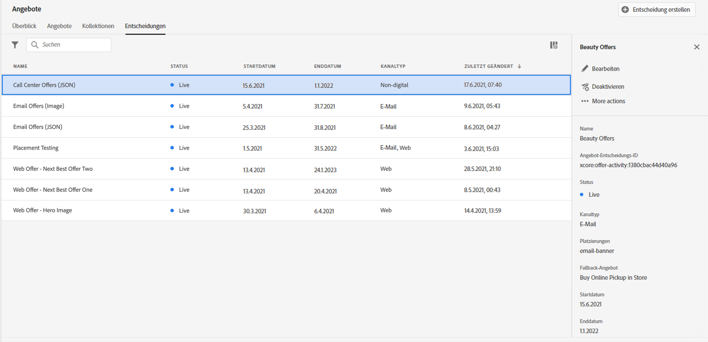

# Entscheidungen erstellen {#create-offer-activities}

Entscheidungen (früher als Angebotsaktivitäten bezeichnet) sind Container für Ihre Angebote, die die Offer Decisioning-Engine nutzen, um das beste Angebot auszuwählen, das je nach Zielgruppe des Versands unterbreitet werden kann.

➡️ [Entdecken Sie diese Funktion im Video](#video)

Die Liste der Entscheidungen ist im Menü **[!UICONTROL Angebote]** auf der Registerkarte **[!UICONTROL Entscheidungen]** verfügbar. Es gibt Filter, mit denen Sie Entscheidungen anhand von Status oder Anfangs- und Enddatum abrufen können.

Bevor Sie eine Entscheidung erstellen, prüfen Sie, ob die folgenden Komponenten in der Angebotsbibliothek erstellt wurden:

* [Platzierungen](../offer-library/creating-placements.md)
* [Kollektionen](../offer-library/creating-collections.md)
* [Personalisierte Angebote](../offer-library/creating-personalized-offers.md)
* [Fallback-Angebote](../offer-library/creating-fallback-offers.md)

## Erstellen einer Entscheidung {#create-activity}

1. Rufen Sie die Entscheidungsliste auf und klicken Sie dann auf **[!UICONTROL Aktivität erstellen]**.

1. Geben Sie den Namen der Entscheidung sowie das Anfangs- und Enddatum mit Uhrzeit ein und klicken Sie auf **[!UICONTROL Weiter]**.

   

## Entscheidungsbereiche hinzufügen {#add-decision-scopes}

1. Ziehen Sie eine Platzierung per Drag-and-Drop aus der Liste, um sie der Entscheidung hinzuzufügen, und klicken Sie dann auf **[!UICONTROL Kollektion hinzufügen]**.

   

   >[!NOTE]
   >
   >Dieselbe Platzierung kann in der Entscheidung mehrmals ausgewählt werden.

1. Wählen Sie die Kollektion aus, die die zu berücksichtigenden Angebote enthält, und klicken Sie auf **[!UICONTROL Hinzufügen]**.

   

1. Die ausgewählten Angebote werden der Platzierung hinzugefügt. In diesem Beispiel haben wir zwei Angebote ausgewählt, die in einer JSON-Platzierung angezeigt werden, um Angebote in einer Callcenter-Lösung zu präsentieren.

   

1. Wenn mehrere Angebote für diese Platzierung geeignet sind, werden für den Kunden standardmäßig die Angebote mit der höchsten Priorität bereitgestellt.

   Wenn Sie mit einer bestimmten Formel festlegen möchten, welches geeignete Angebot bereitgestellt werden soll, wählen Sie eine Rangfolgenformel aus der Dropdown-Liste **[!UICONTROL Angebote sortieren nach]**. Weiterführende Informationen hierzu finden Sie in [diesem Abschnitt](../offer-activities/configure-offer-selection.md).

1. Das Feld **[!UICONTROL Begrenzung]** schränkt die Auswahl der Angebote für diese Platzierung ein. Diese Einschränkung kann mithilfe einer Entscheidungsregel oder eines oder mehrerer Adobe Experience Platform-Segmente angewendet werden.

   Um die Auswahl der Angebote auf die Mitglieder eines Adobe Experience Platform-Segments zu beschränken, wählen Sie **[!UICONTROL Segmente]** aus und klicken Sie dann auf **[!UICONTROL Segmente hinzufügen]**.

   

   Fügen Sie eines oder mehrere Segmente aus dem linken Bereich hinzu, kombinieren Sie sie mit den logischen Operatoren **[!UICONTROL Und]** / **[!UICONTROL Oder]** und klicken Sie dann zur Bestätigung auf **[!UICONTROL Auswählen]**.

   Weitere Informationen zum Arbeiten mit Segmenten finden Sie auf [dieser Seite](../../segment/about-segments.md).

   

   Wenn Sie eine Auswahleinschränkung für diese Platzierung mithilfe einer Entscheidungsregel hinzufügen möchten, wählen Sie die Option **[!UICONTROL Entscheidungsregel]** aus und ziehen Sie die gewünschte Regel dann aus dem linken Bereich in den Bereich **[!UICONTROL Entscheidungsregel]**. Weiterführende Informationen zur Verwendung einer Entscheidungsregel finden Sie in [diesem Abschnitt](../offer-library/creating-decision-rules.md).

   

## Hinzufügen eines Fallback-Angebots {#add-fallback}

Wählen Sie das Fallback-Angebot aus, das Kunden, die nicht den Regeln der Angebotsbedingung und den Einschränkungen entsprechen, letztlich angezeigt wird, und klicken Sie dann auf **[!UICONTROL Weiter]**.

## Entscheidung überprüfen und speichern {#review}

Wenn alles richtig konfiguriert und Ihre Entscheidung bereit für die Unterbreitung von Angeboten an Kunden ist, klicken Sie auf **[!UICONTROL Beenden]** und dann auf **[!UICONTROL Speichern und aktivieren]**.

Sie können die Entscheidung auch als Entwurf speichern, um sie später zu bearbeiten und zu aktivieren.

Die Entscheidung wird in der Liste mit dem Status **[!UICONTROL Live]** oder **[!UICONTROL Entwurf]** angezeigt, je nachdem, ob Sie sie im vorherigen Schritt aktiviert haben oder nicht.

Sie ist jetzt bereit, für das Senden von Angeboten an Kunden genutzt zu werden. Sie können das Angebot auswählen, um seine Eigenschaften anzuzeigen und um es zu bearbeiten oder zu unterdrücken.

Weitere Informationen zur Unterbreitung von Angeboten finden Sie in den folgenden Abschnitten:

* [Einfügen personalisierter Angebote in Nachrichten](../../deliver-personalized-offers.md)
* [Unterbreiten von Angeboten mithilfe von APIs](../api-reference/decisions-api/deliver-offers.md)

>[!NOTE]
>
>Nachdem eine Entscheidung erstellt wurde, können Sie in der Liste auf ihren Namen klicken, um auf detaillierte Informationen zuzugreifen und alle Änderungen, die daran vorgenommen wurden, über die Registerkarte **[!UICONTROL Änderungsprotokoll]** zu visualisieren. [Weitere Informationen](../get-started/user-interface.md#changes-log).

## Tutorial {#video}

>[!NOTE]
>
>Dieses Video bezieht sich auf den auf Adobe Experience Platform aufbauenden Programm-Service Offer Decisioning. Es enthält allgemeine Leitlinien für die Verwendung von Angeboten im Kontext von Journey Optimizer.

>[!VIDEO](https://video.tv.adobe.com/v/329606?quality=12)
