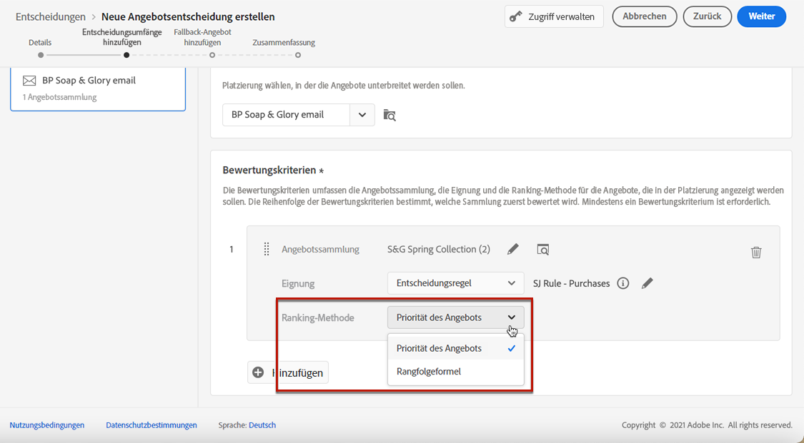
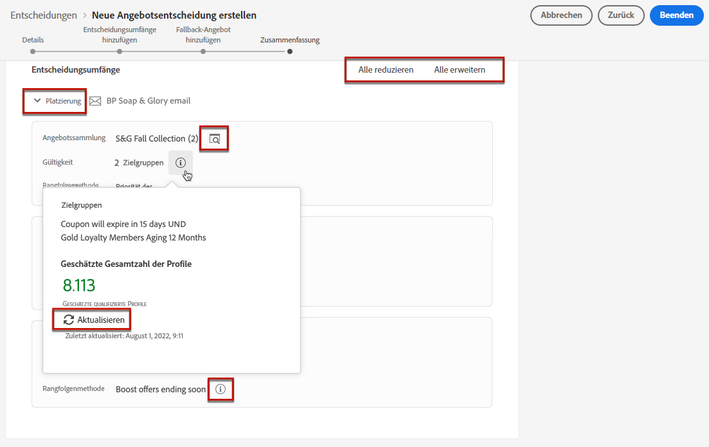

# Erstellen von Entscheidungen {#create-offer-activities}

Entscheidungen (früher als Angebotsaktivitäten bezeichnet) sind Container für Ihre Angebote, die die Offer Decisioning-Engine nutzen, um das beste Angebot auszuwählen, das je nach Zielgruppe des Versands unterbreitet werden kann.

➡️ [In diesem Video erfahren Sie, wie Sie Angebotsaktivitäten erstellen](#video)

Die Liste der Entscheidungen ist im Menü **[!UICONTROL Angebote]** auf der Registerkarte **[!UICONTROL Entscheidungen]** verfügbar. Es gibt Filter, mit denen Sie Entscheidungen anhand von Status oder Anfangs- und Enddatum abrufen können.

Bevor Sie eine Entscheidung erstellen, prüfen Sie, ob die folgenden Komponenten in der Angebotsbibliothek erstellt wurden:

* [Platzierungen](../offer-library/creating-placements.md)
* [Kollektionen](../offer-library/creating-collections.md)
* [Personalisierte Angebote](../offer-library/creating-personalized-offers.md)
* [Fallback-Angebote](../offer-library/creating-fallback-offers.md)

## Erstellen einer Entscheidung {#create-activity}

1. Rufen Sie die Entscheidungsliste auf und klicken Sie dann auf **[!UICONTROL Entscheidung erstellen]**.

1. Geben Sie den Namen der Entscheidung an.

1. Legen Sie gegebenenfalls ein Start- und Enddatum sowie eine Uhrzeit fest und klicken Sie dann auf **[!UICONTROL Weiter]**.

   

## Definieren von Entscheidungsumfängen {#add-decision-scopes}

1. Wählen Sie eine Platzierung aus der Dropdown-Liste aus. Sie wird zum ersten Entscheidungsumfang in Ihrer Entscheidung hinzugefügt.

   

1. Klicken Sie auf **[!UICONTROL Hinzufügen]**, um Bewertungskriterien für diese Platzierung auszuwählen.

   

   Jedes Kriterium besteht aus einer Angebotskollektion, die mit einer Eignungsbegrenzung verknüpft ist, und einer Ranking-Methode, mit der die in der Platzierung anzuzeigenden Angebote bestimmt werden.

   >[!NOTE]
   >
   >Es ist mindestens ein Bewertungskriterium erforderlich.

1. Wählen Sie die Angebotskollektion aus, die die zu berücksichtigenden Angebote enthält, und klicken Sie anschließend auf **[!UICONTROL Hinzufügen]**.

   

   >[!NOTE]
   >
   >Sie können auf den Link **[!UICONTROL Angebotskollektionen öffnen]** klicken, um die Liste der Sammlungen in einer neuen Registerkarte anzuzeigen, wo Sie die Sammlungen und die darin enthaltenen Angebote durchsuchen können.

   Die ausgewählte Kollektion wird den Kriterien hinzugefügt.

   

1. Verwenden Sie das Feld **[!UICONTROL Eignung]**, um die Auswahl der Angebote für diese Platzierung zu beschränken.

   Diese Einschränkung kann mithilfe einer **Entscheidungsregel** oder eines oder mehrerer **Adobe Experience Platform-Segmente** angewendet werden. Beide werden in [diesem Abschnitt](#segments-vs-decision-rules) genauer beschrieben.

   * Um die Auswahl der Angebote auf die Kontakte eines Experience Platform-Segments zu beschränken, wählen Sie **[!UICONTROL Segmente]** aus und klicken Sie dann auf **[!UICONTROL Segmente hinzufügen]**.

      

      Fügen Sie ein oder mehrere Segmente aus dem linken Bereich hinzu und kombinieren Sie diese mithilfe der logischen Operatoren **[!UICONTROL Und]**/**[!UICONTROL Oder]**.

      

      Weitere Informationen zum Arbeiten mit Segmenten finden Sie in [diesem Abschnitt](../../segment/about-segments.md).

   * Wenn Sie eine Auswahlbegrenzung mit einer Entscheidungsregel hinzufügen möchten, verwenden Sie die Option **[!UICONTROL Entscheidungsregel]** und wählen Sie die gewünschte Regel aus.

      

      Weiterführende Informationen zum Erstellen einer Entscheidungsregel finden Sie in [diesem Abschnitt](../offer-library/creating-decision-rules.md).

1. Definieren Sie die Ranking-Methode, die Sie zur Auswahl des besten Angebots für jedes Profil verwenden möchten.

   

   * Wenn mehrere Angebote für diese Platzierung geeignet sind, wird für den Kunden standardmäßig das Angebot mit der höchsten Priorität bereitgestellt.

   * Wenn Sie eine bestimmte Formel verwenden möchten, um das geeignete Angebot auszuwählen, wählen Sie die Option **[!UICONTROL Rangfolgenformel]** aus. In [diesem Abschnitt](../offer-activities/configure-offer-selection.md) erfahren Sie, wie Sie eine Rangfolge der Angebote erstellen.

1. Klicken Sie auf **[!UICONTROL Hinzufügen]**, um weitere Kriterien für dieselbe Platzierung zu definieren.

   

1. Wenn Sie mehrere Kriterien hinzufügen, werden diese in einer bestimmten Reihenfolge bewertet. Die erste Kollektion, die der Sequenz hinzugefügt wurde, wird zuerst ausgewertet usw.

   Um die Standardsequenz neu anzuordnen, können Sie die Kollektionen per Drag-and-drop nach Bedarf verschieben.

   

1. Sie können außerdem mehrere Kriterien gleichzeitig auswerten. Ziehen Sie dazu die Kollektion per Drag-and-drop auf eine andere Sammlung.

   

   Sie haben nun denselben Rang und werden daher gleichzeitig ausgewertet.

   

1. Um im Rahmen dieser Entscheidung eine weitere Platzierung für Ihre Angebote hinzuzufügen, verwenden Sie die Schaltfläche **[!UICONTROL Neuer Umfang]**. Wiederholen Sie für jeden Entscheidungsumfang die obigen Schritte.

   

### Verwenden von Segmenten vs. Entscheidungsregeln {#segments-vs-decision-rules}

<!--to move to create-offers?-->

Um eine Einschränkung anzuwenden, können Sie die Auswahl von Angeboten auf ein oder mehrere **Adobe Experience Platform-Segmente** beschränken oder eine **Entscheidungsregel** verwenden. Diese beiden Lösungen werden in unterschiedlichen Fällen angewendet.

Grundsätzlich besteht ein Segment aus einer Liste von Profilen, während eine Entscheidungsregel eine Funktion ist, die während des Entscheidungsprozesses bei Bedarf für ein einzelnes Profil ausgeführt wird. Der Unterschied zwischen diesen beiden Anwendungen wird im Folgenden beschrieben.

* **Segmente**

   Segmente sind Adobe Experience Platform-Profile, die basierend auf Profilattributen und Erlebnisereignissen einer bestimmten Logik entsprechen. Doch beim Offer Decisioning-Prozess wird das Segment nicht neu berechnet, weshalb es zum Zeitpunkt der Angebotsunterbreitung möglicherweise nicht aktuell ist.

   Weitere Informationen zu Segmenten finden Sie in [diesem Abschnitt](../../segment/about-segments.md).

* **Entscheidungsregeln**

   Dagegen basiert eine Entscheidungsregel auf in Adobe Experience Platform verfügbaren Daten und bestimmt, wem ein Angebot angezeigt werden kann. Nachdem die Entscheidungsregel in einem Angebot oder einer Entscheidung für eine bestimmte Platzierung ausgewählt wurde, wird sie bei jedem Entscheidungsvorgang erneut ausgeführt. Dadurch wird jedem Profil immer ein aktuelles, optimales Angebot angezeigt.

   Weitere Informationen zu Entscheidungsregeln finden Sie in [diesem Abschnitt](../offer-library/creating-decision-rules.md).

## Hinzufügen eines Fallback-Angebots {#add-fallback}

Nachdem Sie die Entscheidungsumfänge definiert haben, legen Sie das Fallback-Angebot fest, das Kunden, die nicht den Eignungsregeln und Einschränkungen des Angebots entsprechen, angezeigt wird.

Wählen Sie dazu das Fallback-Angebot aus der Liste der verfügbaren Fallback-Angebote für die in der Entscheidung definierten Platzierungen aus und klicken Sie dann auf **[!UICONTROL Weiter]**.

>[!NOTE]
>
>Sie können auf den Link **[!UICONTROL Angebotsbibliothek öffnen]** klicken, um die Liste der Angebote in einer neuen Registerkarte anzuzeigen.

## Entscheidung überprüfen und speichern {#review}

Wenn alles ordnungsgemäß konfiguriert ist, wird eine Zusammenfassung der Entscheidungseigenschaften angezeigt.

1. Überprüfen Sie, ob die Entscheidung für die Präsentation von Angeboten für Kunden bereit ist. Alle Entscheidungsumfänge und das darin enthaltene Fallback-Angebot werden angezeigt.

   

   Sie können jede Platzierung erweitern oder reduzieren. Sie können für jede Platzierung auch eine Vorschau der verfügbaren Angebote, der Eignung und der Ranking-Details anzeigen.

   

1. Klicken Sie auf **[!UICONTROL Fertigstellen]**.
1. Wählen Sie die Option **[!UICONTROL Speichern und aktivieren]** aus.

   

   Sie können die Entscheidung auch als Entwurf speichern, um sie später zu bearbeiten und zu aktivieren.

Die Entscheidung wird in der Liste mit dem Status **[!UICONTROL Live]** oder **[!UICONTROL Entwurf]** angezeigt, je nachdem, ob Sie sie im vorherigen Schritt aktiviert haben oder nicht.

Sie ist jetzt bereit, für das Senden von Angeboten an Kunden genutzt zu werden.

## Entscheidungsliste {#decision-list}

In der Entscheidungsliste können Sie die Entscheidung auswählen, deren Eigenschaften angezeigt werden sollen. Dort können Sie sie auch bearbeiten, ihren Status ändern (**Entwurf**, **Live**, **Abgeschlossen**, **Archiviert**), die Entscheidung duplizieren oder löschen.

Wählen Sie die Schaltfläche **[!UICONTROL Bearbeiten]** aus, um zum Entscheidungsbearbeitungsmodus zurückzukehren. Dort können Sie die [Details](#create-activity), [Entscheidungsumfänge](#add-decision-scopes) und das [Fallback-Angebot](#add-fallback) der Entscheidung ändern.

Wählen Sie eine Live-Entscheidung aus und klicken Sie auf **[!UICONTROL Deaktivieren]**, um den Entscheidungsstatus wieder auf **[!UICONTROL Entwurf]** zu setzen.

Um den Status erneut auf **[!UICONTROL Live]** zu setzen, wählen Sie die Schaltfläche **[!UICONTROL Aktivieren]** aus, die jetzt angezeigt wird.

Die Schaltfläche **[!UICONTROL Weitere Aktionen]** aktiviert die unten beschriebenen Aktionen.

* **[!UICONTROL Abschließen]**: setzt den Status der Entscheidung auf **[!UICONTROL Abgeschlossen]**, was bedeutet, dass die Entscheidung nicht mehr aufgerufen werden kann. Diese Aktion steht nur für aktivierte Entscheidungen zur Verfügung. Die Entscheidung ist weiterhin in der Liste verfügbar, Sie können ihren Status jedoch nicht auf **[!UICONTROL Entwurf]** oder **[!UICONTROL Genehmigt]** zurücksetzen. Sie können sie nur duplizieren, löschen oder archivieren.

* **[!UICONTROL Duplizieren]**: erstellt eine Entscheidung mit denselben Eigenschaften, Entscheidungsumfängen und Fallback-Angebot. Standardmäßig hat die neue Entscheidung den Status **[!UICONTROL Entwurf]**.

* **[!UICONTROL Löschen]**: entfernt die Entscheidung aus der Liste.

   >[!CAUTION]
   >
   >Die Entscheidung und ihr Inhalt sind nicht mehr zugänglich. Diese Aktion kann nicht rückgängig gemacht werden.
   >
   >Wenn die Entscheidung in einem anderen Objekt verwendet wird, kann sie nicht gelöscht werden.

* **[!UICONTROL Archivieren]**: setzt den Entscheidungsstatus auf **[!UICONTROL Archiviert]**. Die Entscheidung ist weiterhin in der Liste verfügbar, Sie können ihren Status jedoch nicht auf **[!UICONTROL Entwurf]** oder **[!UICONTROL Genehmigt]** zurücksetzen. Sie können es nur duplizieren oder löschen.

Sie können auch den Status mehrerer Entscheidungen gleichzeitig löschen oder ändern, indem Sie die entsprechenden Checkboxen auswählen.

Wenn Sie den Status mehrerer Entscheidungen mit unterschiedlichen Status ändern möchten, werden nur die relevanten Status geändert.

Nachdem eine Entscheidung erstellt wurde, können Sie in der Liste auf ihren Namen klicken.

Dadurch können Sie auf detaillierte Informationen zu dieser Entscheidung zugreifen. Wählen Sie die Registerkarte **[!UICONTROL Protokoll ändern]**, um [alle Änderungen zu überwachen](../get-started/user-interface.md#changes-log), die an der Entscheidung vorgenommen wurden.

## Anleitungsvideo{#video}

Erfahren Sie, wie Sie in Offer Decisioning Angebotsaktivitäten erstellen.

>[!VIDEO](https://video.tv.adobe.com/v/329606?quality=12)

