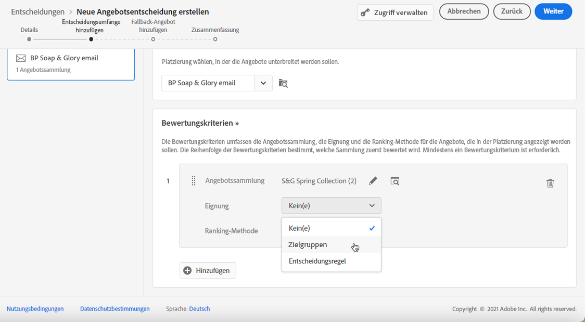
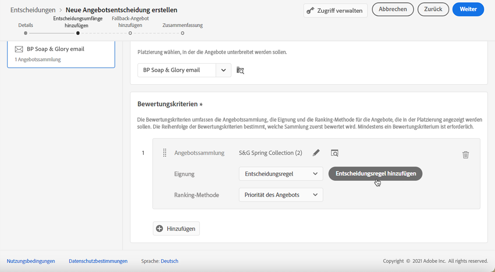
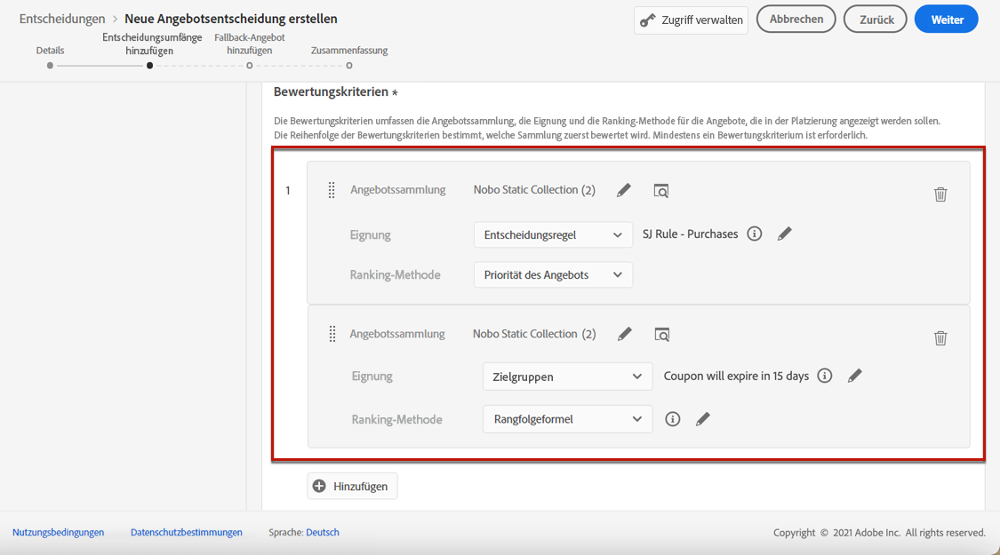

# Entscheidungen erstellen {#create-offer-activities}

Entscheidungen sind Container für Ihre Angebote, die die Offer Decisioning-Engine nutzen, um je nach Zielgruppe des Versands das beste Angebot auszuwählen, das bereitgestellt werden soll.

➡️ [In diesem Video erfahren Sie, wie Sie Angebotsaktivitäten erstellen.](#video)

Die Liste der Entscheidungen ist im **[!UICONTROL Offers]** Menü > **[!UICONTROL Decisions]** Registerkarte. Es stehen Filter zur Verfügung, mit denen Sie Entscheidungen anhand ihres Status oder des Start- und Enddatums abrufen können.

Bevor Sie eine Entscheidung erstellen, stellen Sie sicher, dass die folgenden Komponenten in der Angebotsbibliothek erstellt wurden:

* [Praktika](../offer-library/creating-placements.md)
* [Sammlungen](../offer-library/creating-collections.md)
* [Personalisierte Angebote](../offer-library/creating-personalized-offers.md)
* [Fallback-Angebote](../offer-library/creating-fallback-offers.md)

## Entscheidung erstellen {#create-activity}

1. Rufen Sie die Entscheidungsliste auf und klicken Sie auf **[!UICONTROL Create decision]**.

1. Geben Sie den Namen der Entscheidung an.

1. Definieren Sie bei Bedarf ein Start- und Enddatum und eine Endzeit und klicken Sie auf **[!UICONTROL Next]**.

   

1. Um der Entscheidung benutzerdefinierte oder Core-Datennutzungsbezeichnungen zuzuweisen, wählen Sie **[!UICONTROL Manage access]**. [Weitere Informationen zur Zugriffskontrolle auf Objektebene (OLAC)](../../administration/object-based-access.md)

## Definieren von Entscheidungsbereichen {#add-decision-scopes}

1. Wählen Sie eine Platzierung aus der Dropdownliste aus. Sie wird zum ersten Entscheidungsbereich in Ihrer Entscheidung hinzugefügt.

   

1. Klicken **[!UICONTROL Add]** , um Bewertungskriterien für diese Platzierung auszuwählen.

   

   Jedes Kriterium besteht aus einer Angebotskollektion, die mit einer Eignungsbegrenzung verknüpft ist, und einer Rangmethode zur Bestimmung der in der Platzierung anzuzeigenden Angebote.

   >[!NOTE]
   >
   >Es ist mindestens ein Bewertungskriterium erforderlich.

1. Wählen Sie die Angebotskollektion aus, die die zu berücksichtigenden Angebote enthält, und klicken Sie auf **[!UICONTROL Add]**.

   

   >[!NOTE]
   >
   >Sie können auf die **[!UICONTROL Open offer collections]** -Link, um die Liste der Kollektionen in einer neuen Registerkarte anzuzeigen, über die Sie die Sammlungen und die darin enthaltenen Angebote durchsuchen können.

   Die ausgewählte Sammlung wird den Kriterien hinzugefügt.

   

1. Verwenden Sie die **[!UICONTROL Eligibility]** -Feld, um die Auswahl der Angebote für diese Platzierung zu beschränken.

   Diese Einschränkung kann mithilfe eines **Entscheidungsregel** oder einer oder mehrerer **Adobe Experience Platform-Segmente**. Beide werden im Abschnitt [diesem Abschnitt](../offer-library/add-constraints.md#segments-vs-decision-rules).

   * Um die Auswahl der Angebote auf die Mitglieder eines Experience Platform-Segments zu beschränken, wählen Sie **[!UICONTROL Segments]** Klicken Sie auf **[!UICONTROL Add segments]**.

      

      Fügen Sie ein oder mehrere Segmente aus dem linken Bereich hinzu und kombinieren Sie sie mithilfe des **[!UICONTROL And]** / **[!UICONTROL Or]** logische Operatoren.

      

      Erfahren Sie, wie Sie mit Segmenten in [diesem Abschnitt](../../segment/about-segments.md).

   * Wenn Sie eine Auswahlbegrenzung mit einer Entscheidungsregel hinzufügen möchten, verwenden Sie die **[!UICONTROL Decision rule]** und wählen Sie die gewünschte Regel aus.

      

      Erfahren Sie, wie Sie eine Entscheidungsregel in erstellen [diesem Abschnitt](../offer-library/creating-decision-rules.md).

1. Wenn Sie Segmente oder Entscheidungsregeln auswählen, können Sie Informationen zu den geschätzten qualifizierten Profilen anzeigen. Klicken **[!UICONTROL Refresh]** , um Daten zu aktualisieren.

   >[!NOTE]
   >
   >Profilschätzungen sind nicht verfügbar, wenn Regelparameter Daten enthalten, die nicht im Profil enthalten sind, z. B. Kontextdaten. Beispielsweise eine Eignungsregel, für die das aktuelle Wetter ≥ 80 Grad sein muss.

   

1. Definieren Sie die Rangmethode, die Sie zur Auswahl des besten Angebots für jedes Profil verwenden möchten.

   

   * Wenn mehrere Angebote für diese Platzierung infrage kommen, wird das Angebot mit der höchsten Priorität standardmäßig an den Kunden gesendet.

   * Wenn Sie eine bestimmte Formel verwenden möchten, um das geeignete Angebot auszuwählen, wählen Sie **[!UICONTROL Ranking formula]**. Erfahren Sie, wie Sie Angebote in [diesem Abschnitt](../offer-activities/configure-offer-selection.md).

1. Klicken **[!UICONTROL Add]** , um weitere Kriterien für dieselbe Platzierung zu definieren.

   

1. Wenn Sie mehrere Kriterien hinzufügen, werden diese in einer bestimmten Reihenfolge bewertet. Die erste Sammlung, die der Sequenz hinzugefügt wurde, wird zuerst ausgewertet usw.

   Um die Standardsequenz zu ändern, können Sie die Sammlungen per Drag-and-Drop verschieben, um sie nach Bedarf neu anzuordnen.

   

1. Sie können mehrere Kriterien gleichzeitig auswerten. Ziehen Sie dazu die Sammlung auf eine andere Sammlung.

   

   Sie haben nun denselben Rang und werden daher gleichzeitig ausgewertet.

   

1. Um im Rahmen dieser Entscheidung eine weitere Platzierung für Ihre Angebote hinzuzufügen, verwenden Sie die **[!UICONTROL New scope]** Schaltfläche. Wiederholen Sie die obigen Schritte für jeden Entscheidungsbereich.

   

## Fallback-Angebot hinzufügen {#add-fallback}

Nachdem Sie die Entscheidungsbereiche definiert haben, definieren Sie das Fallback-Angebot, das Kunden, die nicht den Eignungsregeln und Einschränkungen für Angebote entsprechen, als letztes Mittel unterbreitet wird.

Wählen Sie sie dazu aus der Liste der verfügbaren Fallback-Angebote für die in der Entscheidung definierten Platzierungen aus und klicken Sie dann auf **[!UICONTROL Next]**.

>[!NOTE]
>
>Sie können auf die **[!UICONTROL Open offer library]** -Link, um die Liste der Angebote in einem neuen Tab anzuzeigen.

## Entscheidung überprüfen und speichern {#review}

Wenn alles ordnungsgemäß konfiguriert ist, wird eine Zusammenfassung der Entscheidungseigenschaften angezeigt.

1. Stellen Sie sicher, dass die Entscheidung zur Verwendung bereit ist, um Kunden Angebote zu unterbreiten. Alle Entscheidungsbereiche und das darin enthaltene Fallback-Angebot werden angezeigt.

   

1. Sie können jede Platzierung erweitern oder reduzieren. Sie können für jede Platzierung eine Vorschau der verfügbaren Angebote, der Eignung und der Rangdetails anzeigen. Sie können auch Informationen zu den geschätzten qualifizierten Profilen anzeigen. Klicken **[!UICONTROL Refresh]** , um Daten zu aktualisieren.

   

1. Klicken **[!UICONTROL Finish]**.
1. Auswählen **[!UICONTROL Save and activate]**.

   

   Sie können die Entscheidung auch als Entwurf speichern, um sie später zu bearbeiten und zu aktivieren.

Die Entscheidung wird in der Liste mit der **[!UICONTROL Live]** oder **[!UICONTROL Draft]** Status, je nachdem, ob Sie ihn im vorherigen Schritt aktiviert haben oder nicht.

Es kann jetzt verwendet werden, um Angebote an Kunden zu senden.

## Entscheidungsliste {#decision-list}

In der Entscheidungsliste können Sie die Entscheidung auswählen, deren Eigenschaften angezeigt werden sollen. Dort können Sie auch den Status ändern (**Entwurf**, **Live**, **Fertig**, **Archiviert**), duplizieren Sie die Entscheidung oder löschen Sie sie.

Wählen Sie die **[!UICONTROL Edit]** -Schaltfläche, um zum Modus zur Entscheidungsbearbeitung zurückzukehren, in dem Sie die [details](#create-activity), [Entscheidungsbereiche](#add-decision-scopes) und [Fallback-Angebot](#add-fallback).

Wählen Sie eine Live-Entscheidung aus und klicken Sie auf **[!UICONTROL Deactivate]** , um den Entscheidungsstatus auf **[!UICONTROL Draft]**.

So legen Sie den Status erneut auf **[!UICONTROL Live]**, wählen Sie die **[!UICONTROL Activate]** -Schaltfläche, die jetzt angezeigt wird.

Die **[!UICONTROL More actions]** -Schaltfläche aktiviert die unten beschriebenen Aktionen.

* **[!UICONTROL Complete]**: setzt den Status der Entscheidung auf **[!UICONTROL Complete]**, was bedeutet, dass die Entscheidung nicht mehr aufgerufen werden kann. Diese Aktion steht nur für aktivierte Entscheidungen zur Verfügung. Die Entscheidung ist weiterhin in der Liste verfügbar, Sie können ihren Status jedoch nicht auf **[!UICONTROL Draft]** oder **[!UICONTROL Approved]**. Sie können sie nur duplizieren, löschen oder archivieren.

* **[!UICONTROL Duplicate]**: erstellt eine Entscheidung mit denselben Eigenschaften, Entscheidungsbereichen und Fallback-Angeboten. Standardmäßig verfügt die neue Entscheidung über die **[!UICONTROL Draft]** Status.

* **[!UICONTROL Delete]**: entfernt die Entscheidung aus der Liste.

   >[!CAUTION]
   >
   >Die Entscheidung und ihr Inhalt werden nicht mehr zugänglich sein. Diese Aktion kann nicht rückgängig gemacht werden.
   >
   >Wenn die Entscheidung in einem anderen Objekt verwendet wird, kann sie nicht gelöscht werden.

* **[!UICONTROL Archive]**: legt den Entscheidungsstatus auf **[!UICONTROL Archived]**. Die Entscheidung ist weiterhin in der Liste verfügbar, Sie können ihren Status jedoch nicht auf **[!UICONTROL Draft]** oder **[!UICONTROL Approved]**. Sie können sie nur duplizieren oder löschen.

Sie können auch den Status mehrerer Entscheidungen gleichzeitig löschen oder ändern, indem Sie die entsprechenden Kontrollkästchen aktivieren.

Wenn Sie den Status mehrerer Entscheidungen mit unterschiedlichen Status ändern möchten, werden nur die relevanten Status geändert.

Nachdem eine Entscheidung erstellt wurde, können Sie in der Liste auf ihren Namen klicken.

Dadurch können Sie auf detaillierte Informationen zu dieser Entscheidung zugreifen. Wählen Sie die **[!UICONTROL Change log]** Registerkarte zu [alle Änderungen überwachen](../get-started/user-interface.md#changes-log) die an der Entscheidung vorgenommen wurden.

## Anleitungsvideo{#video}

Erfahren Sie, wie Sie Angebotsaktivitäten im Entscheidungs-Management erstellen.

>[!VIDEO](https://video.tv.adobe.com/v/329606?quality=12)

