# Erstellen von Simulationen

## Über die Simulation

Zur Validierung Ihrer Entscheidungslogik können Sie simulieren, welche Angebote für eine bestimmte Platzierung an ein Testprofil gesendet werden.

<!--Simulation allows you to view the results of offer decisions as a selected profile.-->

Dadurch können Sie verschiedene Versionen Ihrer Angebote testen und anpassen, ohne dass dies Auswirkungen auf die ausgewählten Empfänger hat.

>[!NOTE]
>
>Diese Funktion simuliert eine einzelne Anfrage an die [!DNL Decisions]-API. Weitere Informationen finden Sie unter [Unterbreiten von Angeboten mithilfe der Decisions-API](../api-reference/decisions-api/deliver-offers.md).

Um auf diese Funktion zuzugreifen, wählen Sie die Registerkarte **[!UICONTROL Simulation]** aus dem Menü **[!UICONTROL Entscheidungs-Management]** > **[!UICONTROL Angebote]**.

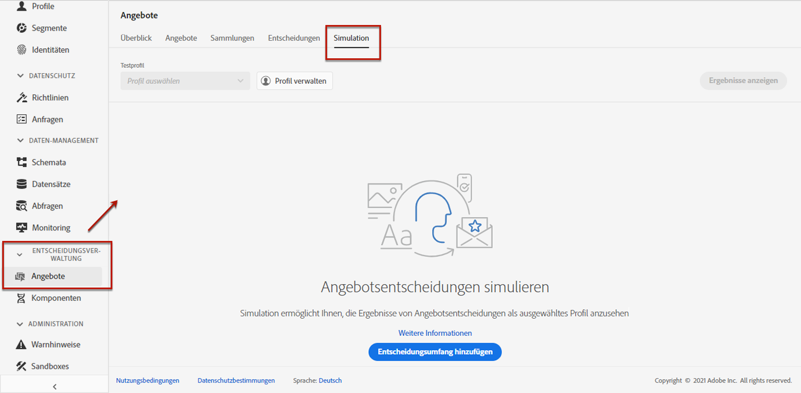

<!--
➡️ [Discover this feature in video](#video)
-->

## Auswählen der Testprofile

Zunächst müssen Sie die Testprofile auswählen, die Sie für die Simulation verwenden möchten.

1. Klicken Sie auf **[!UICONTROL Profil verwalten]**.

   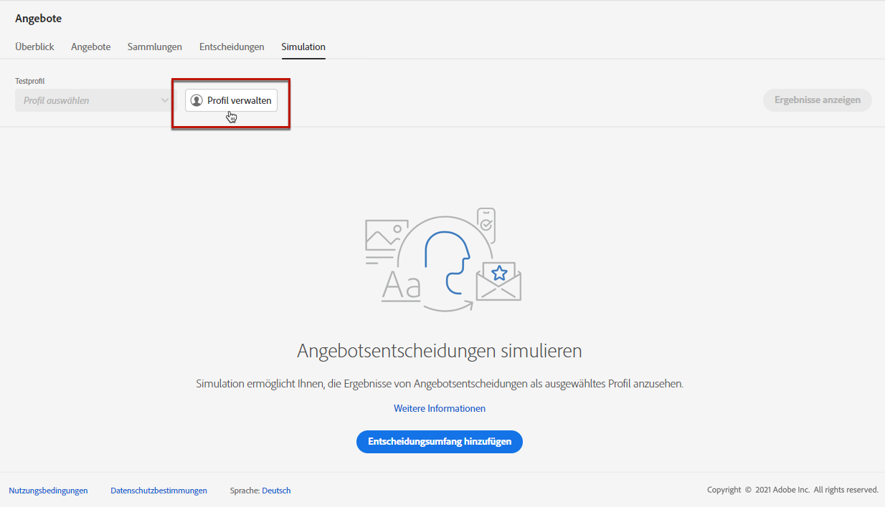

1. Wählen Sie den Identity-Namespace aus, den Sie zur Identifizierung von Testprofilen verwenden möchten. In diesem Beispiel verwenden wir den Namespace **E-Mail**.

   >[!NOTE]
   >
   >Ein Identity-Namespace definiert den Kontext einer Kennung wie eine E-Mail-Adresse oder eine CRM-ID. Weitere Informationen zu Identity-Namespaces von Adobe Experience Platform finden Sie [in diesem Abschnitt](../../get-started-identity.md){target=&quot;_blank&quot;}.

1. Geben Sie den Identitätswert ein und klicken Sie auf **[!UICONTROL Ansicht]**, um die verfügbaren Profile aufzulisten.

   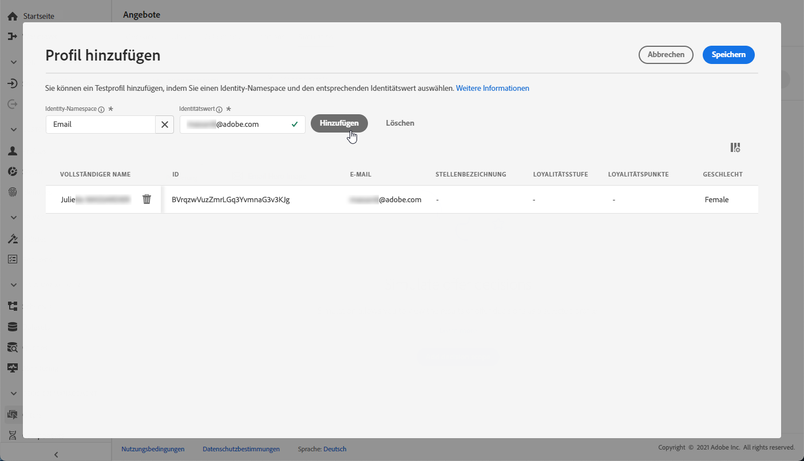

1. Fügen Sie weitere Profile hinzu, wenn Sie verschiedene Profildaten testen möchten, und speichern Sie Ihre Auswahl.

   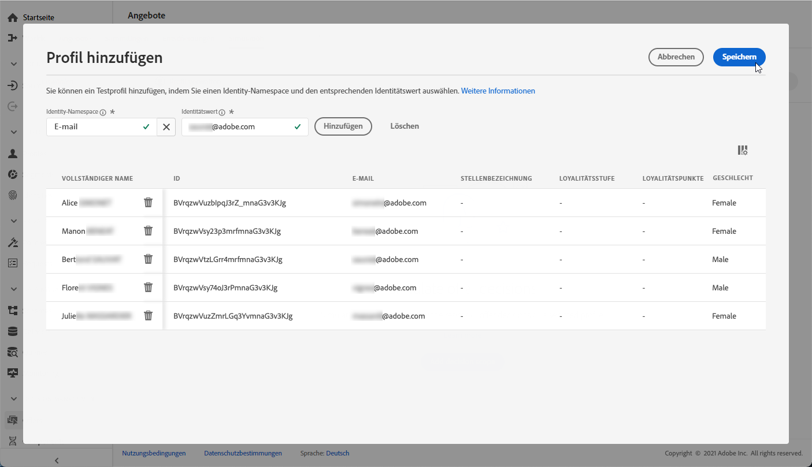

1. Nach dem Hinzufügen werden alle Profile in der Dropdown-Liste unter **[!UICONTROL Testprofil]** aufgelistet. Sie können zwischen den gespeicherten Testprofilen wechseln, um die Ergebnisse für jedes ausgewählte Profil anzuzeigen.

   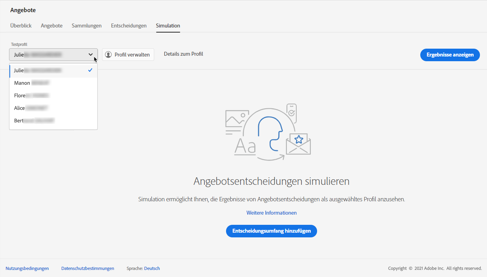

1. Sie können auf den Link **[!UICONTROL Profildetails]** klicken, um die ausgewählten Profildaten anzuzeigen.

<!--Learn more on [selecting test profiles](preview.md#select-test-profiles)-->

## Hinzufügen von Entscheidungsumfängen

Wählen Sie nun die Angebotsentscheidungen aus, die Sie für Ihre Testprofile simulieren möchten.

1. Wählen Sie **[!UICONTROL Entscheidungsumfang hinzufügen]** aus.

   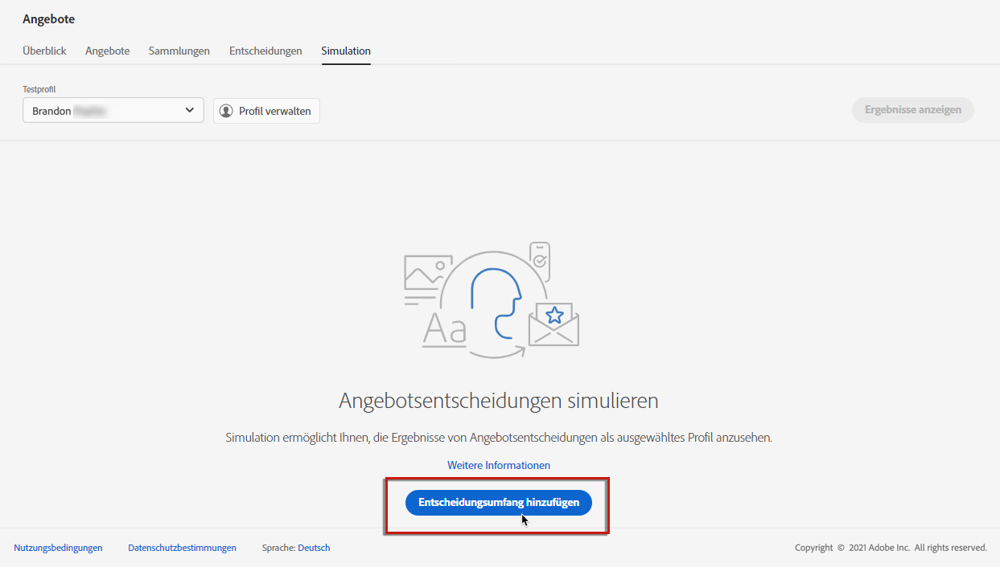

1. Wählen Sie eine Platzierung aus der Liste aus.

   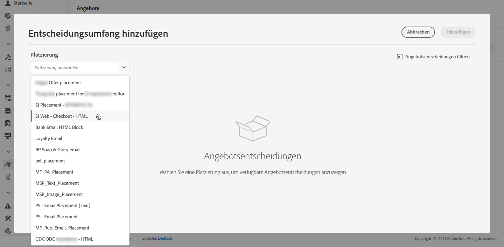

1. Die verfügbaren Entscheidungen werden angezeigt.

   * Sie können das Suchfeld verwenden, um die Auswahl zu verfeinern.
   * Sie können auf den Link **[!UICONTROL Angebotsentscheidungen öffnen]** klicken, um die von Ihnen erstellte Liste aller Entscheidungen zu öffnen. Weitere Informationen finden Sie unter [Entscheidungen](create-offer-activities.md).

   Wählen Sie die gewünschte Entscheidung aus und klicken Sie auf **[!UICONTROL Hinzufügen]**.

   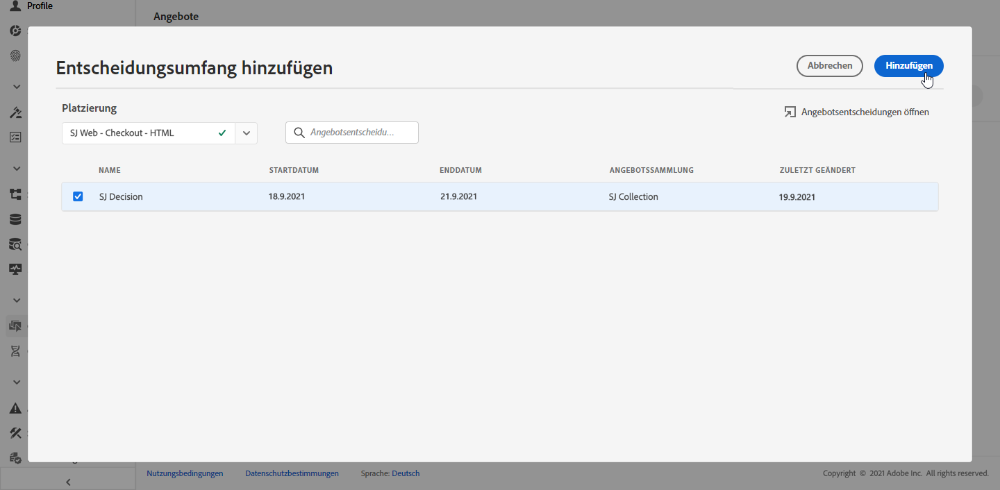

1. Der soeben definierte Entscheidungsumfang wird im Hauptarbeitsbereich angezeigt.

   Sie können einstellen, wie viele Angebote angefordert werden sollen. Wenn Sie beispielsweise „2“ auswählen, werden für diesen Entscheidungsumfang die besten zwei Angebote angezeigt.

   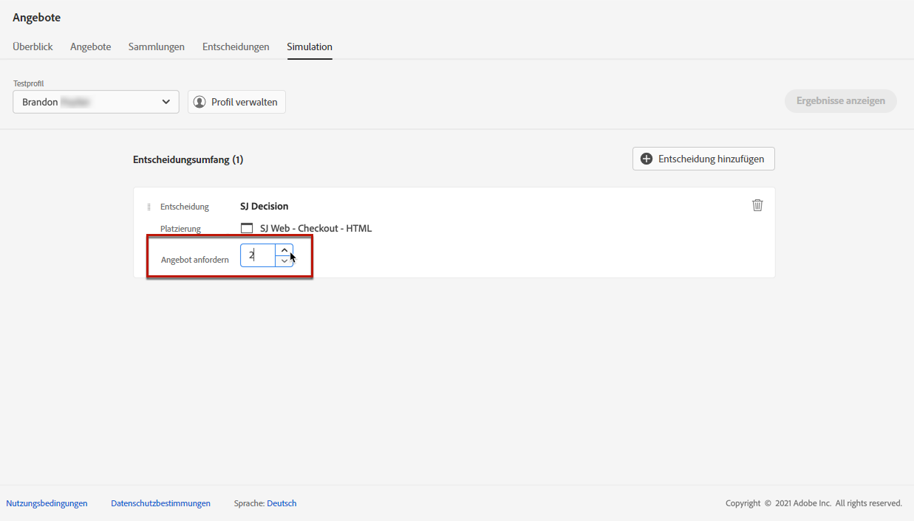

   >[!NOTE]
   >
   >Sie können bis zu 30 Angebote anfordern.

1. Wiederholen Sie die obigen Schritte, um so viele Entscheidungen wie nötig hinzuzufügen.

   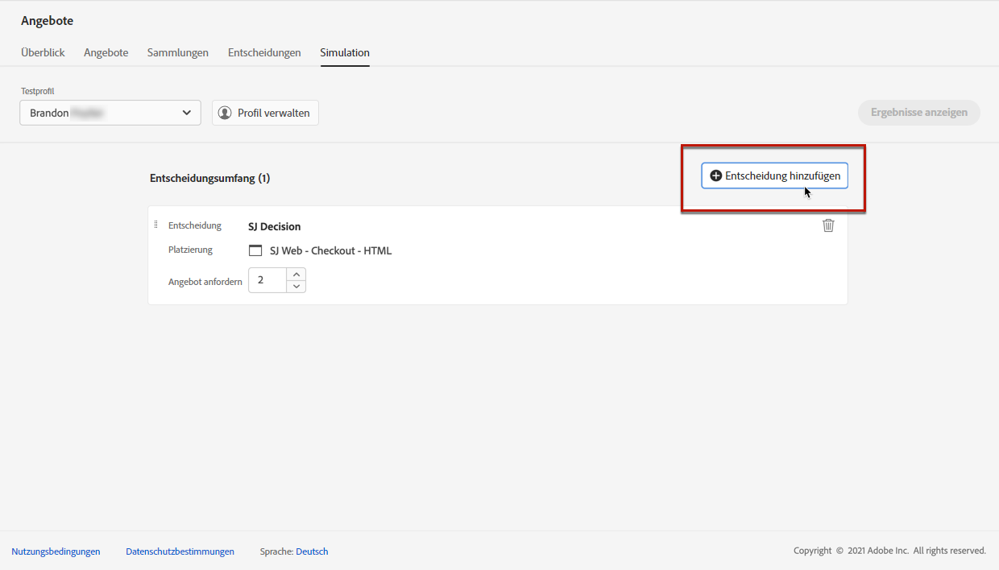

   >[!NOTE]
   >
   >Selbst wenn Sie mehrere Entscheidungsumfänge definieren, wird nur eine API-Anfrage simuliert.
   >
   >Alle Deduplizierungs-Flags sind für die Simulation standardmäßig aktiviert, d. h. die Entscheidungs-Engine ermöglicht Duplikate und kann somit für mehrere Entscheidungen denselben Vorschlag unterbreiten. Weitere Informationen zu den Eigenschaften von [!DNL Decisions]-API-Anfragen finden Sie in [diesem Abschnitt](../api-reference/decisions-api/deliver-offers.md).

## Anzeigen von Simulationsergebnissen

Nachdem Sie einen Entscheidungsumfang hinzugefügt und ein Testprofil ausgewählt haben, können Sie die Ergebnisse anzeigen.

1. Klicken Sie auf **[!UICONTROL Ergebnisse anzeigen]**.

   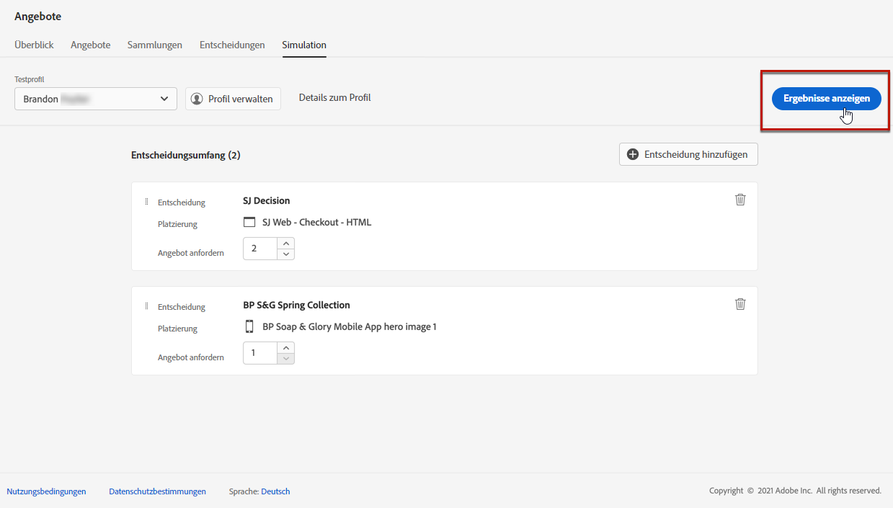

1. Die besten verfügbaren Angebote werden entsprechend dem ausgewählten Profil für jede Entscheidung angezeigt.

   Wählen Sie ein Angebot aus, um dessen Details anzuzeigen.

   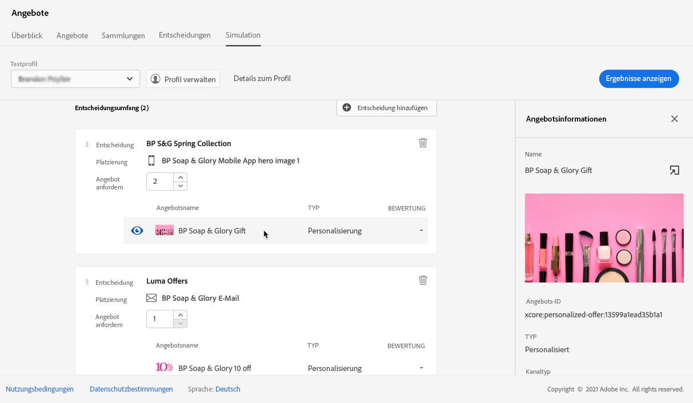

1. Wählen Sie ein anderes Profil aus der Liste aus, um die Ergebnisse der Angebotsentscheidungen für ein anderes Testprofil anzuzeigen.

1. Sie können die Entscheidungsumfänge beliebig oft hinzufügen, entfernen oder aktualisieren.

>[!NOTE]
>
>Jedes Mal, wenn Sie Profile ändern oder Entscheidungsumfänge aktualisieren, müssen Sie die Ergebnisse mit der Schaltfläche **[!UICONTROL Ergebnisse anzeigen]** aktualisieren.

<!--Questions

* Is it recommended to first select profiles or first add decision scopes?
* What does Request offer changes?
* Nothing displays when I click View results? Can't see any score...
* What's the typical example? i.e. how many decisions do you select, and how do you compare scores?
* What do you learn from simulation? i.e. if I selected 2 decisions and I compare the scores, which one is better or should I use for my customers?
* Is there a way to create relevant test profiles?
* Error on Profile details link.
* Is there a tutorial planned to be released?
* Why still a big red frame when no profile is found?

## Tutorial video {#video}

>[!NOTE]
>
>This video applies to the Offer Decisioning application service built on Adobe Experience Platform. However, it provides generic guidance to use Offer in the context of Journey Optimizer.

>[!VIDEO](https://video.tv.adobe.com/v/329606?quality=12)
-->
