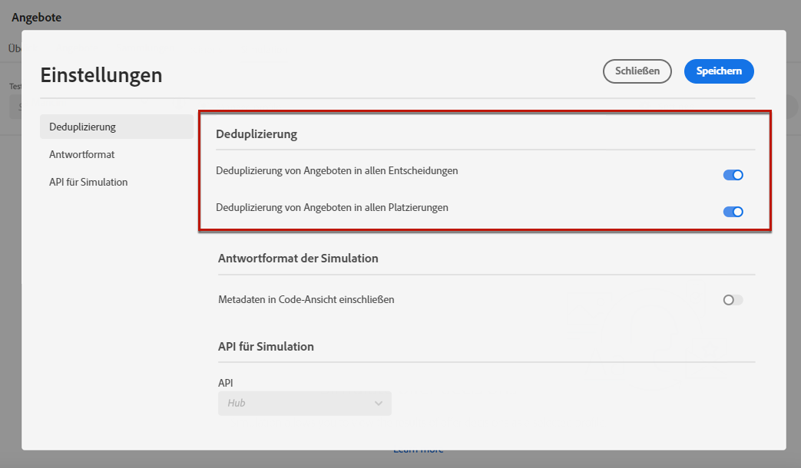

# Erstellen von Simulationen {#create-simulations}

## Über die Simulation {#about-simulation}

Zur Validierung Ihrer Entscheidungslogik können Sie simulieren, welche Angebote für eine bestimmte Platzierung an ein Testprofil gesendet werden.

<!--Simulation allows you to view the results of offer decisions as a selected profile.-->

Dadurch können Sie verschiedene Versionen Ihrer Angebote testen und anpassen, ohne dass dies Auswirkungen auf die ausgewählten Empfänger hat.

>[!NOTE]
>
>Diese Funktion simuliert eine einzelne Anfrage an die [!DNL Decisioning]-API. Weitere Informationen finden Sie unter [Unterbreiten von Angeboten mithilfe der Decisioning-API](../api-reference/offer-delivery-api/decisioning-api.md).

Um auf diese Funktion zuzugreifen, wählen Sie die Registerkarte **[!UICONTROL Simulation]** aus dem Menü **[!UICONTROL Entscheidungs-Management]** > **[!UICONTROL Angebote]**.

>[!NOTE]
>
>Da die Simulation kein Entscheidungsereignis generiert, ist der [Begrenzungswert](../offer-library/creating-personalized-offers.md#capping) nicht betroffen.

<!--
➡️ [Discover this feature in video](#video)
-->

## Auswählen der Testprofile {#select-test-profiles}

>[!CONTEXTUALHELP]
>id="ajo_decisioning_simulation_test_profile"
>title="Hinzufügen von Testprofilen"
>abstract="Sie können ein Testprofil hinzufügen, indem Sie einen Identity-Namespace und die entsprechenden Identitätswerte auswählen. Sie müssen bereits über Testprofile verfügen, um diese für die Simulation verwenden zu können."
>additional-url="https://experienceleague.adobe.com/docs/journey-optimizer/using/segment/profiles/creating-test-profiles.html?lang=de" text="Erstellen von Testprofilen"

Zunächst müssen Sie die Testprofile auswählen, die Sie für die Simulation verwenden möchten.

>[!CAUTION]
>
>Sie müssen über Testprofile verfügen, um simulieren zu können, welche Angebote an sie gesendet werden. Hier erfahren Sie, wie Sie [Testprofile erstellen](../../segment/creating-test-profiles.md).

1. Klicken Sie auf **[!UICONTROL Profil verwalten]**.

   

1. Wählen Sie den Identity-Namespace aus, den Sie zur Identifizierung von Testprofilen verwenden möchten. In diesem Beispiel verwenden wir den Namespace **E-Mail**.

   >[!NOTE]
   >
   >Ein Identity-Namespace definiert den Kontext einer Kennung wie eine E-Mail-Adresse oder eine CRM-ID. Weitere Informationen zu Identity-Namespaces von Adobe Experience Platform finden Sie [in diesem Abschnitt](../../segment/get-started-identity.md){target=&quot;_blank&quot;}.

1. Geben Sie den Identitätswert ein und klicken Sie auf **[!UICONTROL Ansicht]**, um die verfügbaren Profile aufzulisten.

   

1. Fügen Sie weitere Profile hinzu, wenn Sie verschiedene Profildaten testen möchten, und speichern Sie Ihre Auswahl.

   

1. Nach dem Hinzufügen werden alle Profile in der Dropdown-Liste unter **[!UICONTROL Testprofil]** aufgelistet. Sie können zwischen den gespeicherten Testprofilen wechseln, um die Ergebnisse für jedes ausgewählte Profil anzuzeigen.

   

   >[!NOTE]
   >
   >Die ausgewählten Profile verbleiben von Sitzung zu Sitzung als Testprofile in der Registerkarte **[!UICONTROL Simulation]**, bis sie mithilfe von **[!UICONTROL Profil verwalten]** entfernt werden.

1. Sie können auf den Link **[!UICONTROL Profildetails]** klicken, um die ausgewählten Profildaten anzuzeigen.

<!--Learn more on [selecting test profiles](messages/preview.md#select-test-profiles)-->

## Hinzufügen von Entscheidungsumfängen {#add-decision-scopes}

Wählen Sie nun die Angebotsentscheidungen aus, die Sie für Ihre Testprofile simulieren möchten.

1. Wählen Sie **[!UICONTROL Entscheidungsumfang hinzufügen]** aus.

   

1. Wählen Sie eine Platzierung aus der Liste aus.

   

1. Die verfügbaren Entscheidungen werden angezeigt.

   * Sie können das Suchfeld verwenden, um die Auswahl zu verfeinern.
   * Sie können auf den Link **[!UICONTROL Angebotsentscheidungen öffnen]** klicken, um die von Ihnen erstellte Liste aller Entscheidungen zu öffnen. Weitere Informationen finden Sie unter [Entscheidungen](create-offer-activities.md).

   Wählen Sie die gewünschte Entscheidung aus und klicken Sie auf **[!UICONTROL Hinzufügen]**.

   

1. Der soeben definierte Entscheidungsumfang wird im Hauptarbeitsbereich angezeigt.

   Sie können einstellen, wie viele Angebote angefordert werden sollen. Wenn Sie beispielsweise „2“ auswählen, werden für diesen Entscheidungsumfang die besten zwei Angebote angezeigt.

   

   >[!NOTE]
   >
   >Sie können bis zu 30 Angebote anfordern.

1. Wiederholen Sie die obigen Schritte, um so viele Entscheidungen wie nötig hinzuzufügen.

   

   >[!NOTE]
   >
   >Selbst wenn Sie mehrere Entscheidungsumfänge definieren, wird nur eine API-Anfrage simuliert.

## Definieren von Simulationseinstellungen {#define-simulation-settings}

Gehen Sie wie folgt vor, um die Standardeinstellungen für Ihre Simulationen zu bearbeiten.

1. Klicken Sie auf **[!UICONTROL Einstellungen]**.

   

1. Im Bereich **[!UICONTROL Deduplizierung]** können Sie festlegen, dass Angebote für alle Entscheidungen und/oder Platzierungen dupliziert werden können. Dies bedeutet, dass mehreren Entscheidungen/Platzierungen möglicherweise dasselbe Angebot zugewiesen wird.

   

   >[!NOTE]
   >
   >Alle Deduplizierungs-Flags sind standardmäßig für die Simulation aktiviert, was bedeutet, dass das Entscheidungsmodul Duplikate zulässt und somit denselben Vorschlag für mehrere Entscheidungen/Platzierungen machen kann. Weitere Informationen zu den Eigenschaften von [!DNL Decisioning] API-Anfragen finden Sie in [diesem Abschnitt](../api-reference/offer-delivery-api/decisioning-api.md).

1. Im Bereich **[!UICONTROL Antwortformat]** können Sie wählen, ob Metadaten in die Code-Ansicht aufgenommen werden sollen. Aktivieren Sie die entsprechende Option und wählen Sie die gewünschten Metadaten aus. Sie werden in den Anfrage- und Antwort-Payloads angezeigt, wenn Sie **[!UICONTROL Code anzeigen]** auswählen. Weitere Informationen finden Sie im Abschnitt [Anzeigen von Simulationsergebnissen](#simulation-results).

   

   >[!NOTE]
   >
   >Beim Aktivieren der Option werden standardmäßig alle Elemente ausgewählt.

1. Klicken Sie auf **[!UICONTROL Speichern]**.

>[!NOTE]
>
>Für Simulationsdaten können Sie derzeit nur die **[!UICONTROL Hub]**-API verwenden.

<!--
In the **[!UICONTROL API for simulation]** section, select the API you want to use: **[!UICONTROL Hub]** or **[!UICONTROL Edge]**.
Hub and Edge are two different end points for simulation data.

In the **[!UICONTROL Context data]** section, you can add as many elements as needed.

    >[!NOTE]
    >
    >This section is hidden if you select Edge API in the section above. Hub allows the use of Context data, Edge does not.

Context data allows the user to add contextual data that could affect the simulation score.
For instance, let's say the customer has an offer for a discount on ice cream. In the rules for that offer, it can have logic that would rank it higher when the temperature is above 80 degrees. In simulation, the user could add context data: temperature=65 and that offer would rank lower, of they could add temperature=95 and that would rank higher.
-->

## Anzeigen von Simulationsergebnissen {#simulation-results}

Nachdem Sie einen Entscheidungsumfang hinzugefügt und ein Testprofil ausgewählt haben, können Sie die Ergebnisse anzeigen.

1. Klicken Sie auf **[!UICONTROL Ergebnisse anzeigen]**.

   

1. Die besten verfügbaren Angebote werden entsprechend dem ausgewählten Profil für jede Entscheidung angezeigt.

   Wählen Sie ein Angebot aus, um dessen Details anzuzeigen.

   

1. Klicken Sie auf **[!UICONTROL Code anzeigen]**, um die Anfrage- und Antwort-Payloads anzuzeigen. [Weitere Informationen](#view-code)

1. Wählen Sie ein anderes Profil aus der Liste aus, um die Ergebnisse der Angebotsentscheidungen für ein anderes Testprofil anzuzeigen.

1. Sie können die Entscheidungsumfänge beliebig oft hinzufügen, entfernen oder aktualisieren.

>[!NOTE]
>
>Jedes Mal, wenn Sie Profile ändern oder Entscheidungsumfänge aktualisieren, müssen Sie die Ergebnisse mit der Schaltfläche **[!UICONTROL Ergebnisse anzeigen]** aktualisieren.

## Code anzeigen {#view-code}

1. Verwenden Sie die Schaltfläche **[!UICONTROL Code anzeigen]**, um die Anfrage- und Antwort-Payloads anzuzeigen.

   

   Die Code-Ansicht zeigt die Entwicklerinformationen für den aktuellen Benutzer an. Standardmäßig wird die **[!UICONTROL Antwort-Payload]** angezeigt.

   

1. Klicken Sie auf **[!UICONTROL Antwort-Payload]** oder **[!UICONTROL Anfrage-Payload]**, um zwischen den beiden Registerkarten zu wechseln.

   

1. So verwenden Sie die Anfrage-Payload außerhalb von [!DNL Journey Optimizer] - Zur Fehlerbehebung kopieren Sie diese beispielsweise unter Verwendung des Buttons **[!UICONTROL In die Zwischenablage kopieren]**, der sich oberhalb der Code-Ansicht befindet.

   

   <!--You cannot copy the response payload. ACTUALLY YES YOU CAN > to confirm with PM/dev? -->

   >[!NOTE]
   >
   >Wenn Sie die Anfrage- oder Antwort-Payload in Ihren eigenen Code kopieren, ersetzen Sie {USER_TOKEN} und {API_KEY} durch gültige Werte. In der {target=&quot;_blank&quot;} Dokumentation zu [Adobe Experience Platform-APIs](https://experienceleague.adobe.com/docs/experience-platform/landing/platform-apis/api-authentication.html?lang=de) erfahren Sie, wie Sie diese Werte abrufen können.

