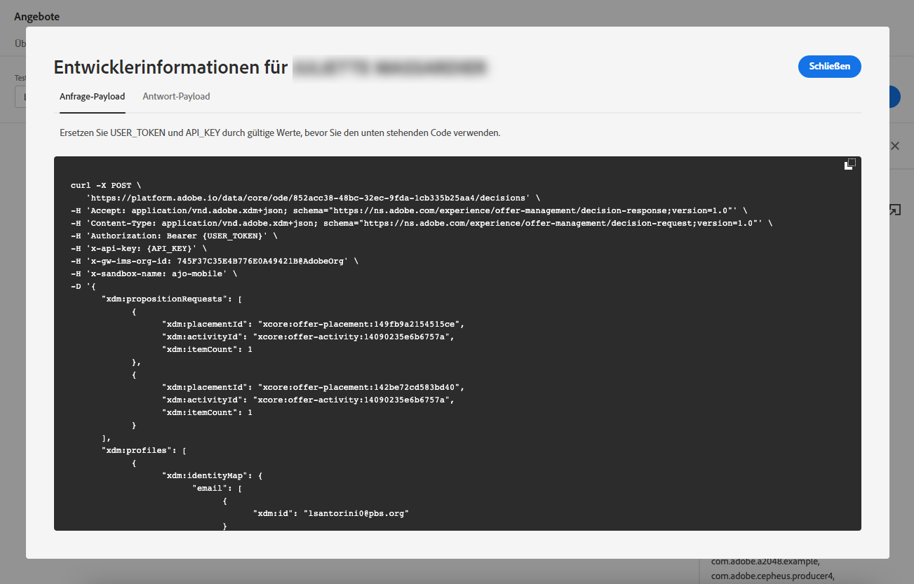

# Simulationen erstellen {#create-simulations}

## Über die Simulation {#about-simulation}

Zur Validierung Ihrer Entscheidungslogik können Sie simulieren, welche Angebote für eine bestimmte Platzierung an ein Testprofil gesendet werden.

<!--Simulation allows you to view the results of offer decisions as a selected profile.-->

Dadurch können Sie verschiedene Versionen Ihrer Angebote testen und verfeinern, ohne dass dies Auswirkungen auf die Zielgruppenempfänger hat.

>[!NOTE]
>
>Diese Funktion simuliert eine einzelne Anforderung an die [!DNL Decisioning] API. Weitere Informationen finden Sie unter [Angebote mithilfe der Decisioning API bereitstellen](../api-reference/offer-delivery-api/decisioning-api.md).

Um auf diese Funktion zuzugreifen, wählen Sie die **[!UICONTROL Simulation]** Registerkarte aus **[!UICONTROL Decision management]** > **[!UICONTROL Offers]** Menü.

>[!NOTE]
>
>Da die Simulation kein Entscheidungsereignis generiert, wird die [capping](../offer-library/creating-personalized-offers.md#capping) Die Anzahl ist nicht betroffen.

<!--
➡️ [Discover this feature in video](#video)
-->

## Testprofile auswählen {#select-test-profiles}

>[!CONTEXTUALHELP]
>id="ajo_decisioning_simulation_test_profile"
>title="Hinzufügen von Testprofilen"
>abstract="Sie können ein Testprofil hinzufügen, indem Sie einen Identitäts-Namespace und einen entsprechenden Identitätswert auswählen. Sie müssen bereits über Testprofile verfügen, um diese für die Simulation verwenden zu können."
>additional-url="https://experienceleague.adobe.com/docs/journey-optimizer/using/segment/profiles/creating-test-profiles.html" text="Testprofile erstellen"

Zunächst müssen Sie die Testprofile auswählen, die Sie für die Simulation verwenden möchten.

>[!CAUTION]
>
>Sie müssen über Testprofile verfügen, um zu simulieren, welche Angebote an sie gesendet werden. Erfahren Sie, wie Sie [Testprofile erstellen](../../segment/creating-test-profiles.md).

1. Klicken **[!UICONTROL Manage profile]**.

   

1. Wählen Sie den Identitäts-Namespace aus, den Sie zur Identifizierung von Testprofilen verwenden möchten. In diesem Beispiel verwenden wir die **Email** Namespace.

   >[!NOTE]
   >
   >Ein Identitäts-Namespace definiert den Kontext einer Kennung wie eine E-Mail-Adresse oder eine CRM-ID. Weitere Informationen zu Adobe Experience Platform-Identitäts-Namespaces [in diesem Abschnitt](../../segment/get-started-identity.md){target=&quot;_blank&quot;}.

1. Geben Sie den Identitätswert ein und klicken Sie auf **[!UICONTROL View]** , um die verfügbaren Profile aufzulisten.

   

1. Fügen Sie weitere Profile hinzu, wenn Sie verschiedene Profildaten testen möchten, und speichern Sie Ihre Auswahl.

   

1. Nach dem Hinzufügen werden alle Profile in der Dropdown-Liste unter **[!UICONTROL Test profile]**. Sie können zwischen den gespeicherten Testprofilen wechseln, um die Ergebnisse für jedes ausgewählte Profil anzuzeigen.

   

   >[!NOTE]
   >
   >Die ausgewählten Profile werden weiterhin als Testprofile im **[!UICONTROL Simulation]** von Sitzung zu Sitzung wechseln, bis sie mithilfe von **[!UICONTROL Manage profile]**.

1. Sie können auf die **[!UICONTROL Profile details]** -Link, um die ausgewählten Profildaten anzuzeigen.

<!--Learn more on [selecting test profiles](messages/preview.md#select-test-profiles)-->

## Entscheidungsbereiche hinzufügen {#add-decision-scopes}

Wählen Sie nun die Angebotsentscheidungen aus, die Sie für Ihre Testprofile simulieren möchten.

1. Auswählen **[!UICONTROL Add decision scope]**.

   

1. Wählen Sie eine Platzierung aus der Liste aus.

   

1. Die verfügbaren Entscheidungen werden angezeigt.

   * Sie können das Suchfeld verwenden, um die Auswahl zu verfeinern.
   * Sie können auf die **[!UICONTROL Open offer decisions]** -Link, um die Liste aller von Ihnen erstellten Entscheidungen zu öffnen. Weitere Informationen finden Sie unter [Entscheidungen](create-offer-activities.md).

   Wählen Sie die Entscheidung Ihrer Wahl aus und klicken Sie auf **[!UICONTROL Add]**.

   

1. Der soeben definierte Entscheidungsbereich wird im Hauptarbeitsbereich angezeigt.

   Sie können die Anzahl der Angebote anpassen, die Sie anfordern möchten. Wenn Sie beispielsweise 2 auswählen, werden für diesen Entscheidungsbereich die besten 2 Angebote angezeigt.

   

   >[!NOTE]
   >
   >Sie können bis zu 30 Angebote anfordern.

1. Wiederholen Sie die obigen Schritte, um so viele Entscheidungen wie nötig hinzuzufügen.

   

   >[!NOTE]
   >
   >Selbst wenn Sie mehrere Entscheidungsbereiche definieren, wird nur eine API-Anfrage simuliert.

## Simulationseinstellungen definieren {#define-simulation-settings}

Gehen Sie wie folgt vor, um die Standardeinstellungen für Ihre Simulationen zu bearbeiten.

1. Klicken **[!UICONTROL Settings]**.

   

1. Im **[!UICONTROL Deduplication]** können Sie festlegen, dass Angebote für alle Entscheidungen und/oder Platzierungen dupliziert werden. Dies bedeutet, dass mehreren Entscheidungen/Platzierungen möglicherweise dasselbe Angebot zugewiesen wird.

   

   >[!NOTE]
   >
   >Standardmäßig sind alle Deduplizierungsflags für die Simulation aktiviert. Das bedeutet, dass die Entscheidungs-Engine Duplikate zulässt und somit denselben Vorschlag über mehrere Entscheidungen/Platzierungen hinweg unterbreiten kann. Weitere Informationen finden Sie unter [!DNL Decisioning] Eigenschaften von API-Anfragen in [diesem Abschnitt](../api-reference/offer-delivery-api/decisioning-api.md).

1. Im **[!UICONTROL Response format]** -Abschnitt können Sie wählen, ob Metadaten in die Codeansicht aufgenommen werden sollen. Aktivieren Sie die entsprechende Option und wählen Sie die Metadaten Ihrer Wahl aus. Sie werden bei der Auswahl in den Payloads für Anfragen und Antworten angezeigt **[!UICONTROL View code]**. Weitere Informationen finden Sie unter [Anzeigen von Simulationsergebnissen](#simulation-results) Abschnitt.

   

   >[!NOTE]
   >
   >Beim Aktivieren der Option werden standardmäßig alle Elemente ausgewählt.

1. Klicken **[!UICONTROL Save]**.

>[!NOTE]
>
>Für Simulationsdaten können Sie derzeit nur die Variable **[!UICONTROL Hub]** API.

<!--
In the **[!UICONTROL API for simulation]** section, select the API you want to use: **[!UICONTROL Hub]** or **[!UICONTROL Edge]**.
Hub and Edge are two different end points for simulation data.

In the **[!UICONTROL Context data]** section, you can add as many elements as needed.

    >[!NOTE]
    >
    >This section is hidden if you select Edge API in the section above. Hub allows the use of Context data, Edge does not.

Context data allows the user to add contextual data that could affect the simulation score.
For instance, let's say the customer has an offer for a discount on ice cream. In the rules for that offer, it can have logic that would rank it higher when the temperature is above 80 degrees. In simulation, the user could add context data: temperature=65 and that offer would rank lower, of they could add temperature=95 and that would rank higher.
-->

## Anzeigen von Simulationsergebnissen {#simulation-results}

Nachdem Sie einen Entscheidungsbereich hinzugefügt und ein Testprofil ausgewählt haben, können Sie die Ergebnisse anzeigen.

1. Klicken **[!UICONTROL View results]**.

   

1. Die besten verfügbaren Angebote werden entsprechend dem ausgewählten Profil für jede Entscheidung angezeigt.

   Wählen Sie ein Angebot aus, um dessen Details anzuzeigen.

   

1. Klicken **[!UICONTROL View code]** , um die Anfrage- und Antwort-Payloads anzuzeigen. [Weitere Infos](#view-code)

1. Wählen Sie ein anderes Profil aus der Liste aus, um die Ergebnisse der Angebotsentscheidungen für ein anderes Testprofil anzuzeigen.

1. Sie können die Entscheidungsbereiche beliebig oft hinzufügen, entfernen oder aktualisieren.

>[!NOTE]
>
>Jedes Mal, wenn Sie Profile ändern oder Entscheidungsbereiche aktualisieren, müssen Sie die Ergebnisse mit dem **[!UICONTROL View results]** Schaltfläche.

## Code anzeigen {#view-code}

1. Verwenden Sie die **[!UICONTROL View code]** -Schaltfläche zum Anzeigen der Anfrage- und Antwort-Payloads.

   

   Die Codeansicht zeigt die Entwicklerinformationen für den aktuellen Benutzer an. Standardmäßig wird die **[!UICONTROL Response payload]** angezeigt.

   

1. Klicken **[!UICONTROL Response payload]** oder **[!UICONTROL Request payload]** um zwischen den beiden Registerkarten zu navigieren.

   

1. So verwenden Sie die Anfrage-Payload außerhalb von [!DNL Journey Optimizer] - zur Fehlerbehebung, z. B. kopieren Sie sie mithilfe der **[!UICONTROL Copy to clipboard]** oberhalb der Codeansicht.

   

   <!--You cannot copy the response payload. ACTUALLY YES YOU CAN > to confirm with PM/dev? -->

   >[!NOTE]
   >
   >Stellen Sie beim Kopieren der Anfrage- oder Antwort-Payloads in Ihren eigenen Code sicher, dass Sie {USER_TOKEN} und {API_KEY} durch gültige Werte ersetzen. Erfahren Sie, wie Sie diese Werte in der [Adobe Experience Platform-APIs](https://experienceleague.adobe.com/docs/experience-platform/landing/platform-apis/api-authentication.html)Dokumentation zu {target=&quot;_blank&quot;}.

