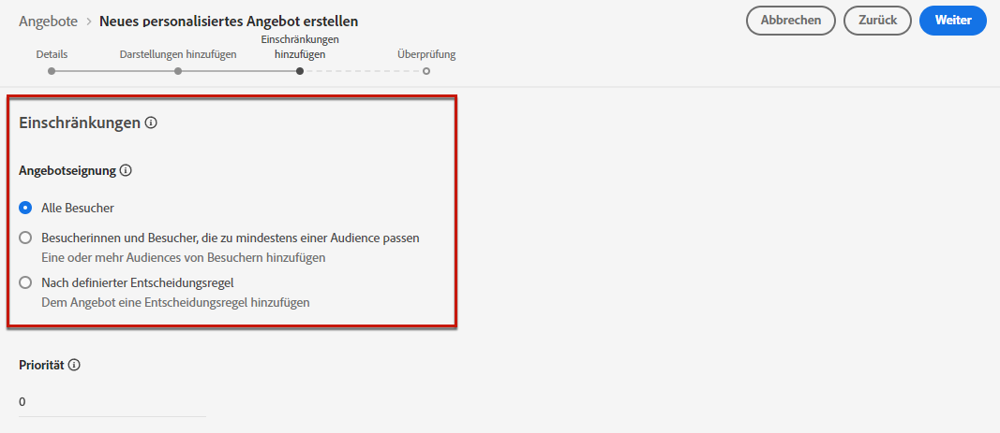
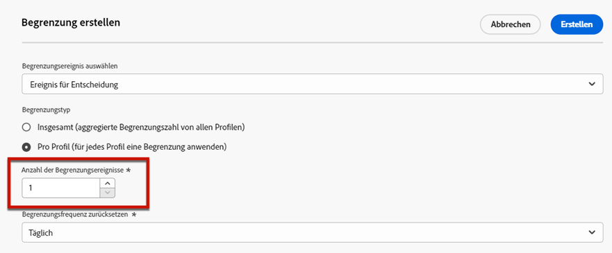
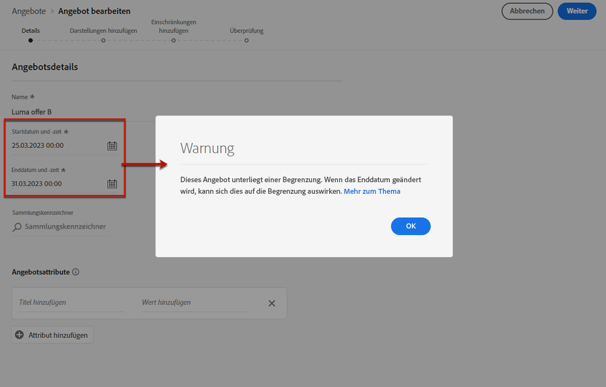

# Hinzufügen von Einschränkungen zu Angeboten {#add-constraints}

>[!CONTEXTUALHELP]
>id="od_offer_constraints"
>title="Informationen zu Angebotseinschränkungen"
>abstract="Mit Einschränkungen können Sie angeben, wie das Angebot priorisiert und dem Benutzer im Vergleich zu anderen Angeboten angezeigt wird."

>[!CONTEXTUALHELP]
>id="od_offer_priority"
>title="Informationen zur Angebotspriorität "
>abstract="In diesem Feld können Sie die Prioritätseinstellungen für das Angebot festlegen. Die Priorität ist eine Zahl, die verwendet wird, um Angebote, die alle Einschränkungen wie Berechtigung, Datum und Begrenzungen erfüllen, in eine Rangfolge zu bringen."

Mit Einschränkungen können Sie die Bedingungen definieren, unter denen ein Angebot angezeigt werden soll.

1. Konfigurieren Sie die **[!UICONTROL Angebotseignung]**. [Weitere Informationen](#eligibility)

   

1. Definieren Sie die **[!UICONTROL Priorität]** des Angebots gegenüber anderen, wenn der Benutzer für mehr als ein Angebot geeignet ist. Je höher die Priorität eines Angebots ist, desto höher ist seine Priorität gegenüber anderen Angeboten.

   

1. Geben Sie die **[!UICONTROL Begrenzung]**, d. h. wie oft das Angebot unterbreitet wird. [Weitere Informationen](#capping)

   

1. Klicken **[!UICONTROL Nächste]** um alle definierten Begrenzungen zu bestätigen.

Wenn Sie beispielsweise die folgenden Einschränkungen festlegen:

* Das Angebot wird nur bei Benutzern berücksichtigt, die die Entscheidungsregel „Gold-Treuekunden“ erfüllen.
* Die Priorität des Angebots ist mit „50“ festgelegt, d. h. das Angebot wird vor Angeboten mit einer Priorität zwischen 1 und 49 und nach Angeboten mit einer Priorität von mindestens 51 unterbreitet.
* Das Angebot wird nur einmal pro Benutzer für alle Platzierungen angezeigt.

## Förderfähigkeit {#eligibility}

>[!CONTEXTUALHELP]
>id="od_offer_eligibility"
>title="Informationen zur Eignung von Angeboten"
>abstract="In diesem Abschnitt können Sie mithilfe von Entscheidungsregeln bestimmen, welche Benutzer für das Angebot geeignet sind."
>additional-url="https://video.tv.adobe.com/v/329373?captions=ger" text="Demovideo ansehen"

Die **[!UICONTROL Angebotseignung]** können Sie das Angebot auf bestimmte Profile beschränken, die Sie mithilfe von Segmenten oder Entscheidungsregeln definieren.

>[!NOTE]
>
>Weitere Informationen zur Verwendung von **Segmente** versus **Entscheidungsregeln** in [diesem Abschnitt](#segments-vs-decision-rules).

* Standardmäßig wird die **[!UICONTROL Alle Besucher]** ausgewählt ist, d. h. jedes Profil kann für die Angebotsunterbreitung ausgewählt werden.

   

* Sie können die Präsentation des Angebots auch auf die Mitglieder eines oder mehrerer [Adobe Experience Platform-Segmente](../../segment/about-segments.md).

   Aktivieren Sie dazu die Option **[!UICONTROL Besucher, die zu mindestens einem Segment passen]**, fügen Sie dann ein oder mehrere Segmente aus dem linken Bereich hinzu und kombinieren Sie sie mit den logischen Operatoren **[!UICONTROL Und]** / **[!UICONTROL Oder]**.

   

* Wenn Sie eine bestimmte [Entscheidungsregel](../offer-library/creating-decision-rules.md) mit dem Angebot verknüpfen möchten, wählen Sie **[!UICONTROL Nach definierter Entscheidungsregel]** aus und ziehen Sie die gewünschte Regel dann aus dem linken Bereich in den Bereich **[!UICONTROL Entscheidungsregel]**.

   

   >[!CAUTION]
   >
   >Ereignisbasierte Angebote werden derzeit in [!DNL Journey Optimizer] nicht unterstützt. Wenn Sie eine Entscheidungsregel basierend auf einem [Ereignis](https://experienceleague.adobe.com/docs/experience-platform/segmentation/ui/segment-builder.html?lang=de#events){target=&quot;_blank&quot;} erstellen, können Sie sie in einem Angebot nicht nutzen.

### Verwenden von Segmenten vs. Entscheidungsregeln {#segments-vs-decision-rules}

Um eine Einschränkung anzuwenden, können Sie die Auswahl von Angeboten auf ein oder mehrere **Adobe Experience Platform-Segmente** beschränken oder eine **Entscheidungsregel** verwenden. Diese beiden Lösungen werden in unterschiedlichen Fällen angewendet.

Grundsätzlich besteht ein Segment aus einer Liste von Profilen, während eine Entscheidungsregel eine Funktion ist, die während des Entscheidungsprozesses bei Bedarf für ein einzelnes Profil ausgeführt wird. Der Unterschied zwischen diesen beiden Anwendungen wird im Folgenden beschrieben.

* **Segmente**

   Segmente sind Adobe Experience Platform-Profile, die basierend auf Profilattributen und Erlebnisereignissen einer bestimmten Logik entsprechen. Doch beim Offer Decisioning-Prozess wird das Segment nicht neu berechnet, weshalb es zum Zeitpunkt der Angebotsunterbreitung möglicherweise nicht aktuell ist.

   Weitere Informationen zu Segmenten finden Sie in [diesem Abschnitt](../../segment/about-segments.md).

* **Entscheidungsregeln**

   Dagegen basiert eine Entscheidungsregel auf in Adobe Experience Platform verfügbaren Daten und bestimmt, wem ein Angebot angezeigt werden kann. Nachdem die Entscheidungsregel in einem Angebot oder einer Entscheidung für eine bestimmte Platzierung ausgewählt wurde, wird sie bei jedem Entscheidungsvorgang erneut ausgeführt. Dadurch wird jedem Profil immer ein aktuelles, optimales Angebot angezeigt.

   Weitere Informationen zu Entscheidungsregeln finden Sie in [diesem Abschnitt](creating-decision-rules.md).

## Frequenzlimitierung {#capping}

>[!CONTEXTUALHELP]
>id="od_offer_globalcap"
>title="Informationen zur Begrenzung von Angeboten"
>abstract="In diesem Feld können Sie angeben, wie oft das Angebot unterbreitet werden kann."

>[!CONTEXTUALHELP]
>id="ajo_decisioning_capping"
>title="Informationen zur Begrenzung von Angeboten"
>abstract="In diesem Feld können Sie angeben, wie oft das Angebot unterbreitet werden kann."

Begrenzungen dienen dazu, die maximale Anzahl von Angeboten festzulegen.

Durch die Begrenzung der Anzahl der Besucherangebote auf bestimmte Angebote können Sie vermeiden, dass Ihre Kunden überfordert werden, und so jeden Touchpoint mit dem besten Angebot optimieren.

Gehen Sie wie folgt vor, um Begrenzungen festzulegen.

1. Definieren Sie, wie oft das Angebot unterbreitet werden kann.

   

   >[!NOTE]
   >
   >Die Zahl muss größer als 0 sein.

1. Geben Sie an, ob die Begrenzung für alle Benutzer oder für ein bestimmtes Profil gelten soll:

   

   * Auswählen **[!UICONTROL Insgesamt]** , um festzulegen, wie oft ein Angebot für die kombinierte Zielgruppe vorgeschlagen werden kann, d. h. für alle Benutzer.

      Wenn Sie z. B. ein Elektronikhändler sind, der über einen &quot;TV-Türbrecher-Deal&quot;verfügt, soll das Angebot nur 200-mal für alle Profile zurückgegeben werden.

   * Auswählen **[!UICONTROL Pro Profil]** , um festzulegen, wie oft ein Angebot demselben Benutzer vorgeschlagen werden kann.

      Wenn Sie z. B. eine Bank mit dem Angebot &quot;Platin-Kreditkarte&quot;sind, soll dieses Angebot nicht öfter als fünfmal pro Profil angezeigt werden. Sie glauben sogar, dass der Benutzer, der das Angebot fünfmal gesehen und nicht darauf reagiert hat, eine höhere Chance hat, das nächste beste Angebot zu nutzen.

1. Wenn Sie mehrere [Darstellungen](#representations) Geben Sie für Ihr Angebot an, ob Sie eine Begrenzung auf **[!UICONTROL Alle Platzierungen]** oder **[!UICONTROL Pro Platzierung]**.

   

   * **[!UICONTROL Alle Platzierungen]**: Begrenzungszahlen führen zu allen Entscheidungen über alle Platzierungen hinweg, die mit dem Angebot verbunden sind.

      Wenn beispielsweise ein Angebot über eine **Email** Platzierung und **Web** Platzierung, und Sie legen die Begrenzung auf **2 pro Profil für alle Platzierungen** festgelegt ist, kann jedes Profil unabhängig vom Platzierungsmix das Angebot insgesamt bis zu zweimal erhalten.

   * **[!UICONTROL Pro Platzierung]**: Begrenzungszahlen wenden die Entscheidungszählungen für jede Platzierung separat an.

      Wenn beispielsweise ein Angebot über eine **Email** Platzierung und **Web** Platzierung, und Sie legen die Begrenzung auf **2 pro Profil für jede Platzierung** festgelegt ist, kann jedes Profil das Angebot bis zu zwei Mal für die E-Mail-Platzierung und ein zweites Mal für die Webplatzierung erhalten.

1. Sobald das Angebot gespeichert und validiert wurde und die Anzahl der in diesem Feld angegebenen Male den von Ihnen definierten Kriterien entspricht, wird die Bereitstellung des Angebots gestoppt.

Die Häufigkeit, mit der ein Angebot vorgeschlagen wird, wird zum Zeitpunkt der E-Mail-Vorbereitung berechnet. Wenn Sie z. B. eine E-Mail mit mehreren Angeboten vorbereiten, wird diese Anzahl dem Begrenzungswert angerechnet, unabhängig davon, ob die E-Mail gesendet wird oder nicht.

<!--If an email delivery is deleted or if the preparation is done again before being sent, the capping value for the offer is automatically updated.-->

>[!NOTE]
>
>Begrenzungszähler werden zurückgesetzt, wenn das Angebot abläuft oder 2 Jahre nach dem Startdatum des Angebots, je nachdem, was zuerst eintritt. Erfahren Sie, wie Sie das Datum eines Angebots in [diesem Abschnitt](creating-personalized-offers.md#create-offer).

### Auswirkungen von Datumsänderungen auf die Begrenzung {#capping-change-date}

>[!CONTEXTUALHELP]
>id="ajo_decisioning_offer_change_date"
>title="Das Ändern des Datums kann sich auf die Begrenzung auswirken"
>abstract="Wenn auf dieses Angebot eine Begrenzung angewendet wird, kann dies bei einer Änderung des Start- oder Enddatums Auswirkungen haben."

Sie müssen beim Ändern des Datums eines Angebots mit Vorsicht vorgehen, da dies Auswirkungen auf die Begrenzung haben kann, wenn die folgenden Bedingungen erfüllt sind:

* Das Angebot lautet [genehmigt](#review).
* [Begrenzung](#capping) bereits auf das Angebot angewendet wurde.
* Die Begrenzung wird pro Profil definiert.

>[!NOTE]
>
>Erfahren Sie, wie Sie das Datum eines Angebots in [diesem Abschnitt](creating-personalized-offers.md#create-offer).

Die Frequenzlimitierung pro Profil speichert die Begrenzungszahlen für jedes Profil. Wenn Sie das Start- und Enddatum eines genehmigten Angebots ändern, kann sich die Begrenzungsanzahl für einige Profile entsprechend den unten beschriebenen Szenarien auswirken.

Im Folgenden finden Sie mögliche Szenarien für **Ändern des Anfangsdatums eines Angebots**:

| Szenario: Wenn ... | Was geschieht: dann... | Mögliche Auswirkungen auf die Begrenzungsanzahl |
|--- |--- |--- |
| ... das Anfangsdatum des Angebots vor Beginn des ursprünglichen Angebotsstartdatums aktualisiert wird, | ... beginnt die Begrenzungsanzahl am neuen Startdatum. | Nein |
| ... das neue Startdatum vor dem aktuellen Enddatum liegt, | ... die Begrenzung wird mit einem neuen Startdatum fortgesetzt und die vorherige Begrenzung für jedes Profil wird fortgesetzt. | Nein |
| ... das neue Startdatum nach dem aktuellen Enddatum liegt, | ... läuft die aktuelle Begrenzung ab und die neue Begrenzungsanzahl beginnt für alle Profile am neuen Startdatum erneut bei 0. | Ja |

Im Folgenden finden Sie mögliche Szenarien für **Erweiterung des Enddatums eines Angebots**:

| Szenario: Wenn ... | Was geschieht: dann... | Mögliche Auswirkungen auf die Begrenzungsanzahl |
|--- |--- |--- |
| ... eine Entscheidungsanfrage vor dem Enddatum des ursprünglichen Angebots erfolgt, | ... wird die Begrenzungsanzahl aktualisiert und die vorherige Begrenzungsanzahl für jedes Profil wird fortgesetzt. | Nein |
| ... keine Entscheidungsanfrage vor dem ursprünglichen Enddatum erfolgt, | ... wird die Begrenzungsanzahl auf das ursprüngliche Enddatum für jedes Profil zurückgesetzt. Die neue Begrenzungsanzahl beginnt dann bei allen neuen Entscheidungsanfragen, die nach dem ursprünglichen Enddatum auftreten, erneut von 0. | Ja |

**Beispiel**

Angenommen, Sie haben ein Angebot mit einem ursprünglichen Startdatum auf **1. Januar**, die am **31. Januar**.

1. Die Profile X, Y und Z werden im Angebot vorgestellt.
1. on **10. Januar** festgelegt wurde, wird das Enddatum des Angebots in **15. Februar**.
1. **Vom 11. Januar bis 31. Januar**, wird das Angebot nur dem Profil Z angezeigt.

   * Da vor dem ursprünglichen Enddatum eine Entscheidungsanfrage aufgetreten ist **für Profil Z**, kann das Enddatum des Angebots auf **15. Februar**.
   * Da jedoch keine Aktivität vor dem ursprünglichen Enddatum für **Profile X und Y**, laufen ihre Zähler ab und ihre Begrenzungszahlen werden auf 0 zurückgesetzt **31. Januar**.

