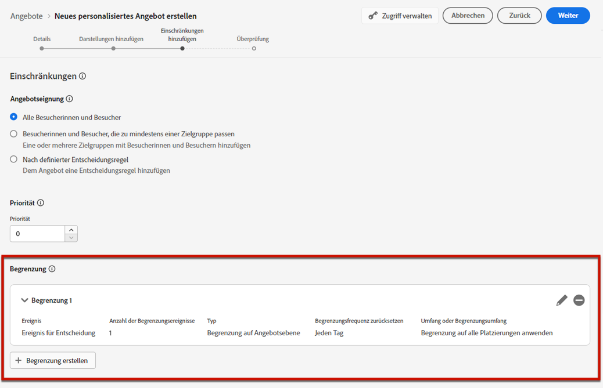
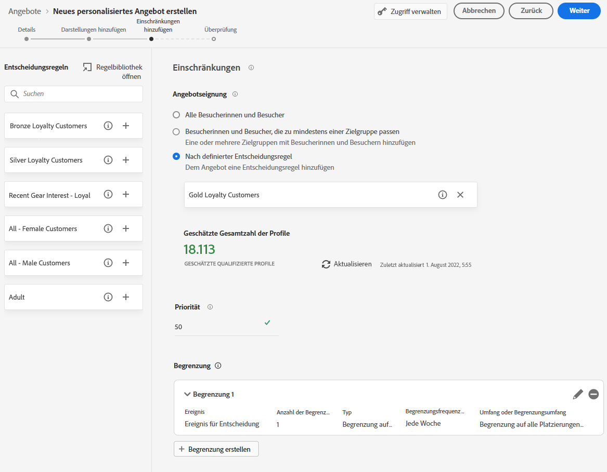
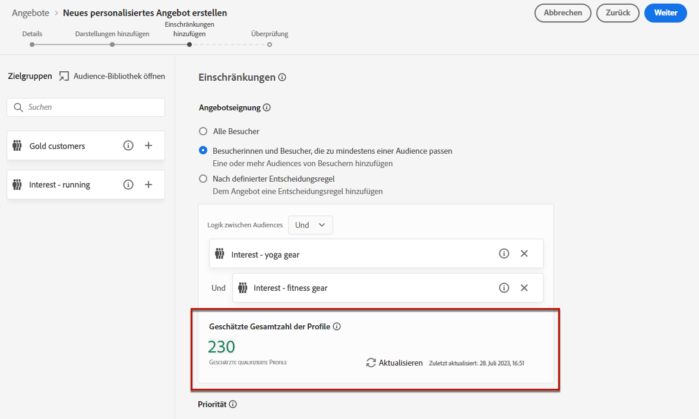
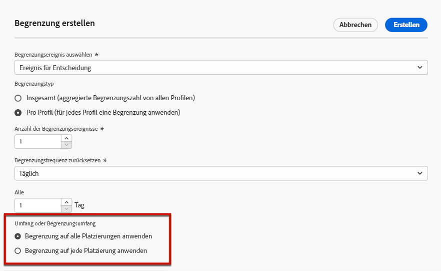

# Hinzufügen von Einschränkungen zu Angeboten {#add-constraints}

>[!CONTEXTUALHELP]
>id="od_offer_constraints"
>title="Informationen zu Angebotseinschränkungen"
>abstract="Mit Einschränkungen können Sie angeben, wie das Angebot priorisiert und dem Benutzer im Vergleich zu anderen Angeboten angezeigt wird."

>[!CONTEXTUALHELP]
>id="ajo_decisioning_constraints"
>title="Informationen zu Angebotseinschränkungen"
>abstract="Mit Einschränkungen können Sie angeben, wie das Angebot priorisiert und dem Benutzer im Vergleich zu anderen Angeboten angezeigt wird."

>[!CONTEXTUALHELP]
>id="od_offer_priority"
>title="Informationen zur Angebotspriorität"
>abstract="In diesem Feld können Sie die Prioritätseinstellungen für das Angebot festlegen. Die Priorität ist eine Zahl, die verwendet wird, um Angebote, die alle Einschränkungen wie Berechtigung, Datum und Begrenzungen erfüllen, in eine Rangfolge zu bringen."

>[!CONTEXTUALHELP]
>id="ajo_decisioning_priority"
>title="Festlegen der Priorität"
>abstract="Mit der Priorität können Sie den Rang eines Angebots gegenüber anderen definieren, wenn der Benutzer für mehrere Angebote infrage kommt. Je höher die Priorität eines Angebots ist, desto höher ist seine Priorität gegenüber anderen Angeboten."

Mit Einschränkungen können Sie festlegen, unter welchen Bedingungen ein Angebot angezeigt werden soll.

1. Konfigurieren Sie die **[!UICONTROL Angebotseignung]**. [Weitere Informationen](#eligibility)

   

1. Definieren Sie die **[!UICONTROL Priorität]** des Angebots gegenüber anderen, wenn der Benutzer für mehr als ein Angebot geeignet ist. Je höher die Priorität eines Angebots ist, desto höher ist seine Priorität gegenüber anderen Angeboten.

   

   >[!NOTE]
   >
   >Die Angebotspriorität muss ein ganzzahliger Wert sein (ohne Dezimalstellen).

1. Geben Sie die **[!UICONTROL Begrenzung]** des Angebots an, d. h. wie häufig das Angebot unterbreitet werden soll. [Weitere Informationen](#capping)

   

1. Klicken Sie auf **[!UICONTROL Weiter]**, um alle definierten Einschränkungen zu bestätigen.

Angenommen, Sie legen die folgenden Einschränkungen fest:

* Das Angebot wird nur bei Benutzern berücksichtigt, die die Entscheidungsregel „Gold-Treuekunden“ erfüllen.
* Die Priorität des Angebots ist mit „50“ festgelegt, d. h. das Angebot wird vor Angeboten mit einer Priorität zwischen 1 und 49 und nach Angeboten mit einer Priorität von mindestens 51 unterbreitet.
* Das Angebot wird für alle Platzierungen nur einmal monatlich pro Benutzerin bzw. Benutzer angezeigt.

## Eignung {#eligibility}

>[!CONTEXTUALHELP]
>id="ajo_decisioning_eligibility"
>title="Definieren der Qualifikation"
>abstract="Standardmäßig kann das Angebot jedem Profil unterbreitet werden, Sie können jedoch Zielgruppen oder Entscheidungsregeln verwenden, um das Angebot auf bestimmte Profile zu beschränken."

>[!CONTEXTUALHELP]
>id="od_offer_eligibility"
>title="Informationen zur Eignung von Angeboten"
>abstract="In diesem Abschnitt können Sie mithilfe von Entscheidungsregeln bestimmen, welche Benutzer für das Angebot geeignet sind."

<!--additional-url="https://video.tv.adobe.com/v/341369?captions=ger" text="Watch demo video"-->

>[!CONTEXTUALHELP]
>id="ajo_decisioning_total_profile_estimate"
>title="Gesamtprofilschätzung"
>abstract="Wenn Sie Zielgruppen oder Entscheidungsregeln auswählen, können Sie Informationen zur geschätzten Anzahl der qualifizierten Profile sehen."

Im Abschnitt **[!UICONTROL Angebotseignung]** können Sie das Angebot auf bestimmte Profile beschränken, die Sie mithilfe von Zielgruppen oder Entscheidungsregeln definieren.

>[!NOTE]
>
>Weitere Informationen zum Verwenden von **Zielgruppen** und **Entscheidungsregeln** finden Sie in [diesem Abschnitt](#segments-vs-decision-rules).

* Standardmäßig ist die Option **[!UICONTROL Alle Besucher]** aktiviert, d. h. das Angebot kann jedem Profil unterbreitet werden.

  

* Sie können die Präsentation eines Angebots auch auf die Mitglieder einer oder mehrerer [Adobe Experience Platform-Zielgruppen](../../audience/about-audiences.md) beschränken.

  Aktivieren Sie dazu die Option **[!UICONTROL Besucherinnen und Besucher, die zu mindestens einer Zielgruppe passen]**, fügen Sie dann eine oder mehrere Zielgruppen aus dem linken Bereich hinzu und kombinieren Sie sie mit den logischen Operatoren **[!UICONTROL Und]**/**[!UICONTROL Oder]**.

  

* Wenn Sie eine bestimmte [Entscheidungsregel](../offer-library/creating-decision-rules.md) mit dem Angebot verknüpfen möchten, wählen Sie **[!UICONTROL Nach definierter Entscheidungsregel]** aus und ziehen Sie die gewünschte Regel dann aus dem linken Bereich in den Bereich **[!UICONTROL Entscheidungsregel]**.

  

  >[!CAUTION]
  >
  >Ereignisbasierte Angebote werden derzeit in [!DNL Journey Optimizer] nicht unterstützt. Wenn Sie eine Entscheidungsregel basierend auf einem [Ereignis](https://experienceleague.adobe.com/docs/experience-platform/segmentation/ui/segment-builder.html?lang=de#events){target="_blank"} erstellen, können Sie sie nicht in einem Angebot nutzen.

Wenn Sie Zielgruppen oder Entscheidungsregeln auswählen, können Sie Informationen zur geschätzten Anzahl der qualifizierten Profile sehen. Klicken Sie auf **[!UICONTROL Aktualisieren]**, um diese Daten zu aktualisieren.

>[!NOTE]
>
>Profilschätzungen sind nicht verfügbar, wenn Regelparameter Daten enthalten, die nicht im Profil enthalten sind, z. B. Kontextdaten. Beispielsweise eine Eignungsregel, für die die aktuelle Temperatur höher als 25 °C sein muss.

### Verwenden von Zielgruppen im Vergleich zu Entscheidungsregeln {#segments-vs-decision-rules}

Um eine Einschränkung anzuwenden, können Sie die Auswahl von Angeboten auf Mitglieder einer oder mehrerer **Adobe Experience Platform-Zielgruppen** beschränken oder eine **Entscheidungsregel** verwenden. Diese beiden Lösungen werden in unterschiedlichen Fällen angewendet.

Grundsätzlich liefert eine Zielgruppe eine Liste von Profilen, während es sich bei einer Entscheidungsregel um eine Funktion handelt, die während des Entscheidungsprozesses bei Bedarf für ein einzelnes Profil ausgeführt wird. Der Unterschied zwischen diesen beiden Verwendungen wird im Folgenden beschrieben.

* **Zielgruppen**

  Zielgruppen sind Adobe Experience Platform-Profile, die basierend auf Profilattributen und Erlebnisereignissen einer bestimmten Logik entsprechen. Jedoch wird bei der Angebotsverwaltung die Zielgruppe nicht neu berechnet, weshalb sie zum Zeitpunkt der Angebotsunterbreitung möglicherweise nicht aktuell ist.

  Weitere Informationen zu Zielgruppen finden Sie in [diesem Abschnitt](../../audience/about-audiences.md).

* **Entscheidungsregeln**

  Dagegen basiert eine Entscheidungsregel auf in Adobe Experience Platform verfügbaren Daten und bestimmt, wem ein Angebot angezeigt werden kann. Nachdem die Entscheidungsregel in einem Angebot oder einer Entscheidung für eine bestimmte Platzierung ausgewählt wurde, wird sie bei jedem Entscheidungsvorgang erneut ausgeführt. Dadurch wird jedem Profil immer ein aktuelles, optimales Angebot angezeigt.

  Weitere Informationen zu Entscheidungsregeln finden Sie in [diesem Abschnitt](creating-decision-rules.md).

## Begrenzung {#capping}

>[!CONTEXTUALHELP]
>id="od_offer_globalcap"
>title="Informationen zur Begrenzung von Angeboten"
>abstract="In diesem Feld können Sie angeben, wie oft das Angebot angezeigt werden kann."

>[!CONTEXTUALHELP]
>id="ajo_decisioning_capping"
>title="Verwenden der Begrenzung"
>abstract="Um zu vermeiden, dass Ihre Kundinnen und Kunden übermäßig oft kontaktiert werden, legen Sie mithilfe von Begrenzungen fest, wie oft ein Angebot maximal unterbreitet werden kann. Sie können bis zu 10 Begrenzungsregeln für ein bestimmtes Angebot erstellen."
>additional-url="https://experienceleague.adobe.com/de/docs/journey-optimizer/using/decisioning/offer-decisioning/managing-offers-in-the-offer-library/configure-offers/add-constraints#capping" text="Das Ändern von Datumsangaben kann sich auf die Begrenzung auswirken"

Mit Begrenzungen wird definiert, wie oft ein Angebot maximal angezeigt werden kann. Durch die begrenzte Anzahl der Anzeige von Angeboten vermeiden Sie, dass Ihre Kundinnen und Kunden übermäßig oft kontaktiert werden, und können jeden Touchpoint mit dem besten Angebot optimieren.

Sie können bis zu 10 Begrenzungsregeln für ein bestimmtes Angebot hinzufügen. Um eine Begrenzungsregel festzulegen, klicken Sie auf die Schaltfläche **[!UICONTROL Begrenzung erstellen]** und gehen Sie dann wie folgt vor.

1. Legen Sie fest, welches **[!UICONTROL Begrenzungsereignis]** für die Erhöhung des Zählers berücksichtigt wird. [Weitere Informationen](#capping-event)

1. Geben Sie an, ob die Begrenzung für alle Benutzenden oder nur für ein bestimmtes Profil gelten soll. [Weitere Informationen](#capping-type)

1. Legen Sie fest, wie oft das Angebot unterbreitet werden kann. [Weitere Informationen](#capping-count)

1. Legen Sie die **[!UICONTROL Häufigkeit]** fest, um festzulegen, wie oft die Begrenzungsanzahl zurückgesetzt wird. [Weitere Informationen](#frequency-capping)

1. Wenn Sie mehrere [Darstellungen](add-representations.md) für Ihr Angebot definiert haben, geben Sie an, ob Sie die Begrenzung **über alle Platzierungen hinweg** oder **auf jede einzelne Platzierung** anwenden wollen. [Weitere Informationen](#placements)

1. Wenn das Angebot nach dem Speichern und der Genehmigung entsprechend den von Ihnen festgelegten Kriterien und dem Zeitrahmen so oft präsentiert wurde, wie Sie in diesem Feld angegeben haben, wird es nicht mehr bereitgestellt.

Die Häufigkeit, mit der ein Angebot vorgeschlagen wird, wird zum Zeitpunkt der E-Mail-Vorbereitung berechnet. Wenn Sie z. B. eine E-Mail mit mehreren Angeboten vorbereiten, wird diese Anzahl dem Begrenzungswert angerechnet, unabhängig davon, ob die E-Mail gesendet wird oder nicht.

<!--If an email delivery is deleted or if the preparation is done again before being sent, the capping value for the offer is automatically updated.-->

>[!NOTE]
>
>Die Begrenzungszähler werden zurückgesetzt, wenn das Angebot abgelaufen ist, oder 2 Jahre nach dem Startdatum des Angebots, je nachdem, was zuerst eintritt. In [diesem Abschnitt](creating-personalized-offers.md#create-offer) erfahren Sie, wie Sie das Datum eines Angebots definieren.

### Begrenzungsereignis {#capping-event}

>[!CONTEXTUALHELP]
>id="ajo_decisioning_frequency_capping_impression"
>title="Impression"
>abstract="Die Verwendung von Impressions als Begrenzungsereignisse ist nur für eingehende Kanäle verfügbar."

Mit dem Feld **[!UICONTROL Begrenzungsereignis auswählen]** können Sie festlegen, welches Ereignis bei der Erhöhung des Zählers berücksichtigt werden soll:

* **[!UICONTROL Entscheidungsereignis]** (Standardwert): Die maximale Häufigkeit, mit der ein Angebot unterbreitet werden kann.
* **[!UICONTROL Klicks]**: Die maximale Anzahl der Klicks auf das Angebot durch eine Benutzerin bzw. einen Benutzer.
* **[!UICONTROL Impression]**: Die maximale Häufigkeit, mit der das Angebot einer Benutzerin bzw. einem Benutzer angezeigt werden kann.

  >[!NOTE]
  >
  >Die Verwendung von Impressions als Begrenzungsereignisse ist nur für **eingehende Kanäle** verfügbar.

* **[!UICONTROL Benutzerspezifisches Ereignis]**: Sie können ein benutzerspezifisches Ereignis festlegen, mit dem die Anzahl der gesendeten Angebote begrenzt wird. Sie können beispielsweise die Anzahl der Einlösungen auf 10.000 begrenzen, oder bis ein bestimmtes Profil 1 Mal eine Einlösung vorgenommen hat. Verwenden Sie dazu [Adobe Experience Platform-XDM](https://experienceleague.adobe.com/docs/experience-platform/xdm/home.html?lang=de){target="_blank"}-Schemata, um eine Regel für ein benutzerspezifische Ereignis zu erstellen.

  <!--For example, you can cap on the number of redemptions so that the offer can be shown until redemptions equal 10,000. You can only select XDM ExperienceEvents. -->

  Im folgenden Beispiel möchten Sie die Anzahl der Checkouts begrenzen.

   1. Wählen Sie **[!UICONTROL Benutzerspezifisches Ereignis]** aus der Liste aus und verwenden Sie die Schaltfläche **[!UICONTROL Benutzerspezifisches Ereignis hinzufügen]**.

   1. Verwenden Sie den Builder **[!UICONTROL Benutzerdefinierte Ereignisregeln erstellen]**, um das jeweilige Ereignis auszuwählen. Sie können eine beliebige Benutzeraktion auswählen, für die Sie Angebote begrenzen möchten.

      Wählen Sie hier **[!UICONTROL Commerce]** > **[!UICONTROL Checkouts]** > **[!UICONTROL Wert]** aus und klicken Sie in der Dropdown-Liste auf **[!UICONTROL existiert]**.

      

   1. Nachdem die Regel erstellt wurde, wird sie im Feld **[!UICONTROL Benutzerdefinierte Ereignisabfrage]** angezeigt.

      

>[!CAUTION]
>
>Bei allen Begrenzungsereignissen außer Entscheidungsereignissen wird das Feedback zum Entscheidungs-Management möglicherweise nicht automatisch erfasst, was dazu führen könnte, dass der Begrenzungszähler nicht korrekt inkrementiert wird. [Weitere Informationen](../data-collection/data-collection.md)
>
>Damit jedes Begrenzungsereignis verfolgt und im Begrenzungszähler berücksichtigt wird, stellen Sie sicher, dass das Schema, das zur Erfassung von Erlebnisereignissen verwendet wird, die richtige Feldergruppe für dieses Ereignis enthält. [Weitere Informationen](../data-collection/schema-requirement.md)

### Begrenzungstyp {#capping-type}

Sie können festlegen, ob die Begrenzung auf alle Benutzerinnen und Benutzer oder auf ein bestimmtes Profil angewendet werden soll:

* Wählen Sie **[!UICONTROL Insgesamt]** aus, um festzulegen, wie oft ein Angebot für die gesamte Zielgruppe vorgeschlagen werden kann, d. h. für alle Benutzer.

  Wenn Sie z. B. ein Elektronikhändler sind, der einen Fernseher im Angebot hat, möchten Sie, dass das Angebot allen Profilen nur 200-mal angezeigt wird.

* Wählen Sie **[!UICONTROL Pro Profil]** aus, um festzulegen, wie oft ein Angebot demselben Benutzer vorgeschlagen werden kann.

  Ein Beispiel: Sie sind eine Bank, die eine Platin-Kreditkarte anbietet, und dieses Angebot nicht öfter als fünfmal pro Profil angezeigt werden. Es wird angenommen, dass Benutzende, die das Angebot fünfmal gesehen und nicht darauf reagiert haben, eher das nächste beste Angebot nutzen.

### Begrenzungsanzahl {#capping-count}

Mit dem Feld **[!UICONTROL Limit der Begrenzungsanzahl]** können Sie angeben, wie oft das Angebot unterbreitet werden kann.

>[!NOTE]
>
>Der Wert muss eine Ganzzahl größer 0 sein.

Sie haben beispielsweise festgelegt, dass ein benutzerdefiniertes Begrenzungsereignis wie etwa die Anzahl von Checkouts berücksichtigt wird. Wenn Sie im Feld **[!UICONTROL Limit der Begrenzungsanzahl]** 10 eingeben, werden nach 10 Checkouts keine Angebote mehr gesendet.

### Frequenzbegrenzung {#frequency-capping}

>[!CONTEXTUALHELP]
>id="ajo_decisioning_frequency_capping"
>title="Festlegen der Begrenzungsfrequenz"
>abstract="Sie können den Angebotsbegrenzungszähler auf täglicher, wöchentlicher oder monatlicher Basis zurücksetzen. Beachten Sie, dass Sie nach der Veröffentlichung des Angebots mit aktivierter Frequenzbegrenzung die festgelegte Frequenz nicht mehr ändern können."

Im Feld **[!UICONTROL Begrenzungsfrequenz zurücksetzen]** können Sie festlegen, wie oft die Begrenzungsanzahl zurückgesetzt werden soll. Legen Sie dazu den Zeitraum für die Zählung (täglich, wöchentlich oder monatlich) fest und geben Sie die gewünschte Anzahl der Tage/Wochen/Monate ein. Wenn Sie beispielsweise möchten, dass die Begrenzungsanzahl alle 2 Wochen zurückgesetzt wird, wählen Sie aus der entsprechenden Dropdown-Liste die Option **[!UICONTROL Wöchentlich]** aus und geben Sie in das andere Feld den Wert **2** ein.

* Der Frequenzbegrenzungszähler wird um **12 Uhr UTC** an dem von Ihnen festgelegten Tag oder gegebenenfalls am ersten Tag der Woche bzw. des Monats zurückgesetzt. Der erste Tag der Woche ist der **Sonntag**. Die von Ihnen gewählte Dauer darf **2 Jahre** (d. h. die entsprechende Anzahl von Monaten, Wochen oder Tagen) nicht überschreiten.

* Nach Veröffentlichung Ihres Angebots können Sie den Zeitraum (monatlich, wöchentlich oder täglich), den Sie für die Häufigkeit ausgewählt haben, nicht mehr ändern. Sie können die Frequenzbegrenzung auch dann bearbeiten, wenn das Angebot den Status **[!UICONTROL Entwurf]** hat und noch nie mit aktivierter Frequenzbegrenzung veröffentlicht wurde.

* Es kann eine Pufferzeit von bis zu 15 Minuten geben, bevor Ereignisse den Frequenzbegrenzungswerten angerechnet werden, entweder beim Genehmigen des Angebots oder beim Erstellen der Begrenzung – je nachdem, was zuletzt eintritt.

+++ **Wichtige Informationen: Frequenzbegrenzung und Entscheidungs-Management-APIs**

Der Frequenzbegrenzungszähler wird in weniger als 3 Sekunden aktualisiert und in einer Entscheidung des [Edge Decisioning-APIs](../api-reference/offer-delivery-api/start-offer-delivery-apis.md#edge) zur Verfügung gestellt.

Jede Hub-Region ist mit einer oder mehreren Edge-Regionen verbunden. Frequenzbegrenzungsregeln werden in jeder Hub-Region generiert und von dort aus in die zugehörigen Edge-Regionen exportiert. Immer wenn eine Entscheidung mithilfe der Edge Decisioning-API getroffen wird, setzt das System die Regeln durch, die in derselben Edge-Region verfügbar sind:

* Wenn es eine passende Regel gibt, wird der Frequenzbegrenzungszähler des Profils erhöht.
* Andernfalls wird kein Zähler für das Profil erstellt und die Frequenzbegrenzungsregel gilt nicht. Folglich erhält das Profil auch dann weiterhin personalisierte Angebote, wenn die Begrenzungsschwelle überschritten wird.

Nehmen wir beispielsweise an, die Hub-Region Ihres Unternehmens ist *NLD2* und Sie senden eine Entscheidungsanfrage aus Europa (Edge-Region *IRL1*). In diesem Szenario erhöht die Entscheidungsanfrage den Zähler des Profils, da die Regeln in der Region *IRL1* (Irland) verfügbar sind. Wenn die Entscheidungsanfrage jedoch aus einer Region wie Japan (*JPN3*) stammt, bei der es sich nicht um eine an die Hub-Region *NLD2* (Niederlande) gebundene Edge-Region handelt, wird kein Zähler erstellt und die Frequenzbegrenzungsregeln werden nicht durchgesetzt.

>[!NOTE]
>
>Wenn Zähler von Edge- zu Hub- oder von Hub- zu Edge-Regionen übertragen werden, kann eine Verzögerung von bis zu 30 Minuten auftreten.

Weitere Informationen darüber, welche Hub- und Edge-Regionen mit Ihrem Unternehmen verbunden sind, erhalten Sie vom Adobe-Support.

Bei den anderen APIs wird der Frequenzbegrenzungszähler wie folgt aktualisiert:

* Bei einer Entscheidung des [Decisioning-APIs](../api-reference/offer-delivery-api/start-offer-delivery-apis.md#decisioning) wird der Frequenzbegrenzungszähler je nach Traffic ggf. mit einer Verzögerung von einigen Minuten aktualisiert.

* Bei einer Entscheidung des [Batch Decisioning-APIs](../api-reference/offer-delivery-api/batch-decisioning-api.md) werden Momentaufnahmen verwendet, bei denen der Frequenzbegrenzungszähler nicht aktualisiert wird. Solange derselbe Schnappschuss verwendet wird, bleibt der Zähler unverändert.

+++

### Begrenzung und Platzierungen {#placements}

Wenn Sie mehrere [Darstellungen](add-representations.md) für Ihr Angebot haben, geben Sie an, ob Sie eine Begrenzung auf alle Platzierungen oder auf eine einzelne Platzierung anwenden möchten.

* **[!UICONTROL Begrenzung auf alle Platzierungen anwenden]**: Die Begrenzungswerte beziehen sich auf alle Entscheidungen in allen Platzierungen, die mit dem Angebot verbunden sind.

  Wenn beispielsweise ein Angebot eine **E-Mail**-Platzierung und eine **Web**-Platzierung hat und Sie die Begrenzung mit **2 pro Profil für alle Platzierungen** festlegen, kann jedes Profil unabhängig vom Platzierungs-Mix das Angebot insgesamt bis zu zweimal erhalten.

* **[!UICONTROL Begrenzung auf jede Platzierung anwenden]**: Die Begrenzungszahlen wenden die Entscheidungszahlen für jede Platzierung separat an.

  Wenn beispielsweise ein Angebot eine **E-Mail**-Platzierung und eine **Web**-Platzierung hat und Sie die Begrenzung auf **2 pro Profil für jede Platzierung** festlegen, kann jedes Profil das Angebot bis zu zweimal für die E-Mail-Platzierung und zusätzlich zweimal für die Web-Platzierung erhalten.

### Auswirkungen von Datumsänderungen auf die Begrenzung {#capping-change-date}

>[!CONTEXTUALHELP]
>id="ajo_decisioning_offer_change_date"
>title="Das Ändern von Datumsangaben kann sich auf die Begrenzung auswirken"
>abstract="Wenn auf ein Angebot eine Begrenzung angewendet wird, kann sich die Änderung des Anfangs- oder Enddatums auf das Angebot auswirken."

Sie müssen beim Ändern des Datums eines Angebots mit Vorsicht vorgehen, da dies Auswirkungen auf die Begrenzung haben kann, wenn die folgenden Voraussetzungen gegeben sind:

* Das Angebot wurde [genehmigt](#review).
* Auf das Angebot wurde eine [Begrenzung](#capping) angewendet.
* Die Begrenzung ist für einzelne Profile definiert.

>[!NOTE]
>
>In [diesem Abschnitt](creating-personalized-offers.md#create-offer) erfahren Sie, wie Sie das Datum eines Angebots definieren.

Wenn die Begrenzung für einzelne Profile festgelegt ist, wird für jedes Profil die Anzahl der Nachrichten erfasst. Wenn Sie das Anfangs- und Enddatum eines genehmigten Angebots ändern, kann sich der Begrenzungswert für einige Profile entsprechend den unten beschriebenen Szenarien auswirken.

Im Folgenden finden Sie die möglichen Szenarien für **das Ändern des Startdatums eines Angebots**:

| Szenario: Wenn ... | Was geschieht: dann ... | Mögliche Auswirkungen auf den Begrenzungswert |
|--- |--- |--- |
| ... das Anfangsdatum des Angebots vor Beginn des ursprünglichen Angebotsstartdatums geändert wird, | ... beginnt der Begrenzungswert am neuen Startdatum. | Nein |
| ... das neue Startdatum vor dem aktuellen Enddatum liegt, | ... wird die Begrenzung mit dem neuen Startdatum fortgesetzt und der vorherige Begrenzungswert wird für jedes Profil übernommen. | Nein |
| ... das neue Startdatum hinter dem aktuellen Enddatum liegt, | ... läuft die aktuelle Begrenzung ab und der neue Begrenzungswert beginnt für alle Profile am neuen Startdatum wieder bei 0. | Ja |

Im Folgenden finden Sie mögliche Szenarien für **die Verlängerung des Enddatums eines Angebots**:

| Szenario: Wenn ... | Was geschieht: dann ... | Mögliche Auswirkungen auf den Begrenzungswert |
|--- |--- |--- |
| ... eine Entscheidungsanfrage vor dem ursprünglichen Enddatum eines Angebots erfolgt, | ... wird der Begrenzungswert aktualisiert und der vorherige Begrenzungswert wird für jedes Profil übernommen. | Nein |
| ... keine Entscheidungsanfrage vor dem ursprünglichen Enddatum erfolgt, | ... wird der Begrenzungswert am ursprünglichen Enddatum für jedes Profil zurückgesetzt. Der neue Begrenzungswert beginnt dann für alle neuen Entscheidungsanfragen, die nach dem ursprünglichen Enddatum erfolgen, wieder bei 0. | Ja |

**Beispiel**

Angenommen, Sie haben ein Angebot mit dem ursprünglichen Startdatum **1. Januar**, das am **31. Januar** abläuft.

1. Den Profilen X, Y und Z wird das Angebot gezeigt.
1. Am **10. Januar** wird das Enddatum des Angebots in **15. Februar** geändert.
1. **Vom 11. bis zum 31. Januar** wird das Angebot nur Profil Z gezeigt.

   * Da eine Entscheidungsanfrage vor dem ursprünglichen Enddatum erfolgt ist, kann **für Profil Z** das Enddatum des Angebots auf **15. Februar** verlängert werden.
   * Da jedoch für **Profil X und Y** keine Aktivität vor dem ursprünglichen Enddatum stattfand, laufen ihre Zähler ab und ihre Begrenzungswerte werden am **31. Januar** auf 0 zurückgesetzt.

