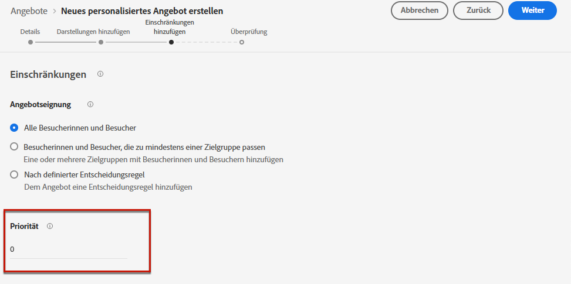
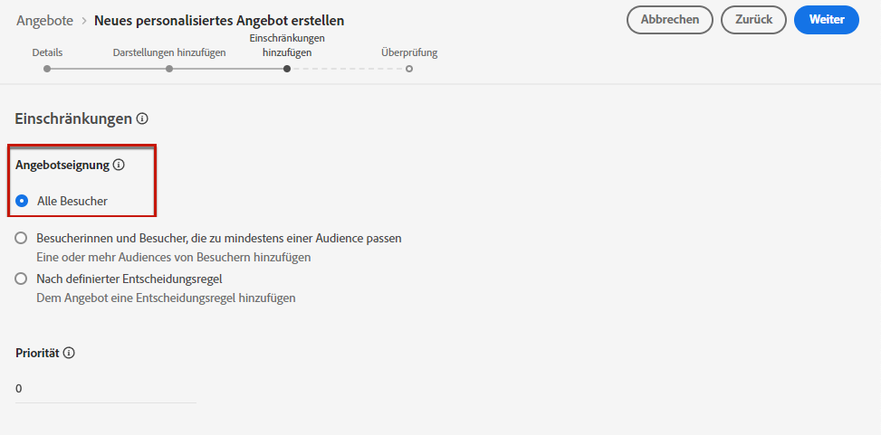
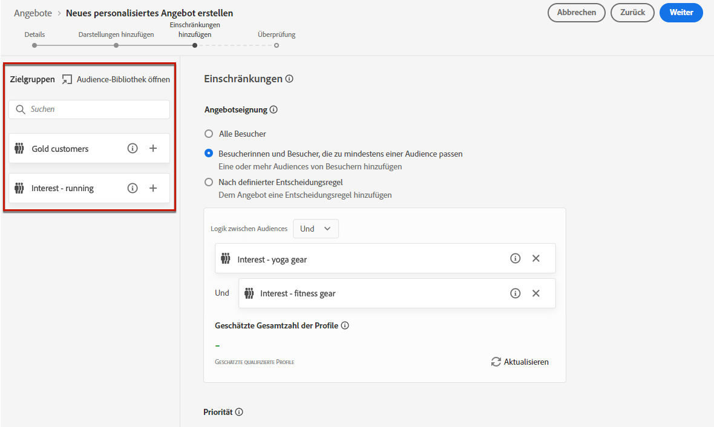
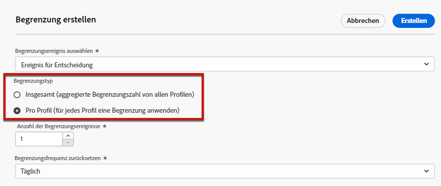
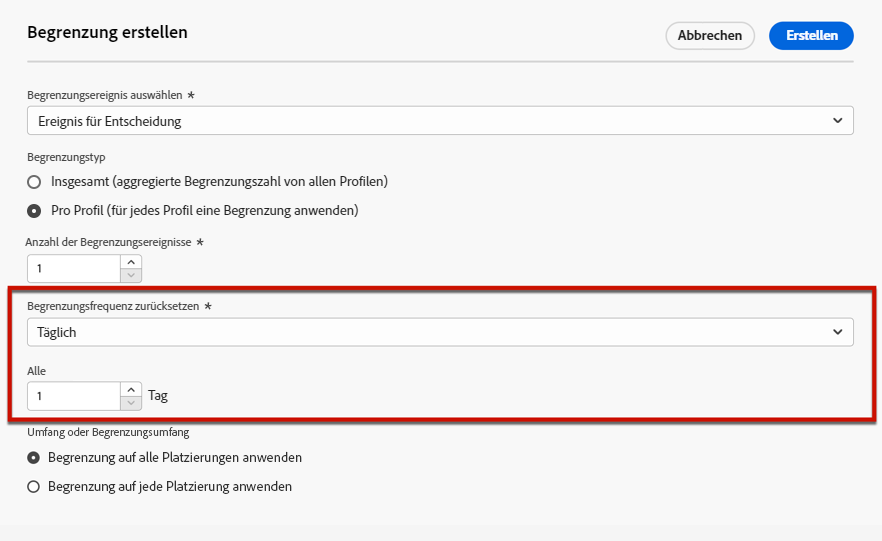
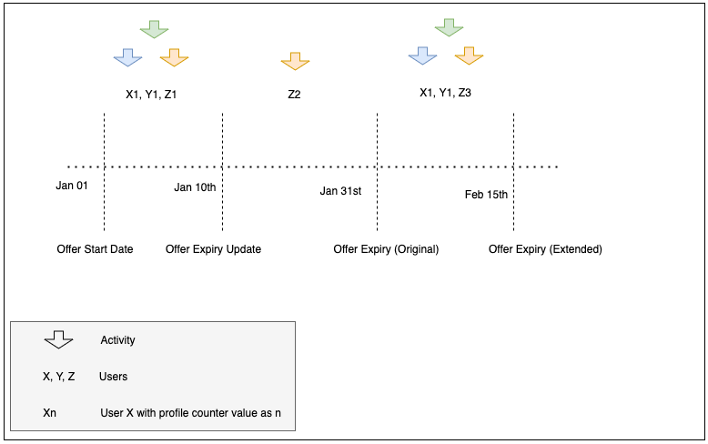

# Hinzufügen von Einschränkungen zu Angeboten {#add-constraints}

>[!CONTEXTUALHELP]
>id="od_offer_constraints"
>title="Über Angebotsbeschränkungen"
>abstract="Mit Einschränkungen können Sie festlegen, wie das Angebot priorisiert und dem Benutzer im Vergleich zu anderen Angeboten unterbreitet wird."

>[!CONTEXTUALHELP]
>id="ajo_decisioning_constraints"
>title="Über Angebotsbeschränkungen"
>abstract="Mit Einschränkungen können Sie festlegen, wie das Angebot priorisiert und dem Benutzer im Vergleich zu anderen Angeboten unterbreitet wird."

>[!CONTEXTUALHELP]
>id="od_offer_priority"
>title="Über die Angebotspriorität"
>abstract="In diesem Feld können Sie die Prioritätseinstellungen für das Angebot festlegen. &quot;Priorität&quot;ist eine Zahl, die zum Rang von Angeboten verwendet wird, die alle Einschränkungen wie Eignung, Datum und Begrenzung erfüllen."

>[!CONTEXTUALHELP]
>id="ajo_decisioning_priority"
>title="Priorität festlegen"
>abstract="Mit der Priorität wird die Priorität des Angebots im Vergleich zu anderen definiert, wenn der Benutzer sich für mehr als ein Angebot qualifiziert. Je höher die Priorität eines Angebots sein wird, desto höher wird seine Priorität im Vergleich zu anderen Angeboten sein."

Mit Einschränkungen können Sie die Bedingungen definieren, unter denen ein Angebot angezeigt werden soll.

1. Konfigurieren Sie die **[!UICONTROL Offer eligibility]**. [Weitere Infos](#eligibility)

   

1. Definieren Sie die **[!UICONTROL Priority]** des Angebots im Vergleich zu anderen Angeboten, wenn sich der Benutzer für mehr als ein Angebot qualifiziert. Je höher die Priorität eines Angebots sein wird, desto höher wird seine Priorität im Vergleich zu anderen Angeboten sein.

   

1. Geben Sie die **[!UICONTROL Capping]**, d. h. wie oft das Angebot unterbreitet wird. [Weitere Infos](#capping)

   

1. Klicken **[!UICONTROL Next]** um alle definierten Begrenzungen zu bestätigen.

Wenn Sie beispielsweise die folgenden Einschränkungen festlegen:

* Das Angebot wird nur für Benutzer berücksichtigt, die der Entscheidungsregel &quot;Gold Loyalty Customers&quot;entsprechen.
* Die Priorität des Angebots wird auf &quot;50&quot;gesetzt, d. h. das Angebot wird vor Angeboten mit einer Priorität zwischen 1 und 49 und nach Angeboten mit einer Priorität von mindestens 51 unterbreitet.
* Das Angebot wird nur einmal pro Benutzer für alle Platzierungen angezeigt.

## Förderfähigkeit {#eligibility}

>[!CONTEXTUALHELP]
>id="ajo_decisioning_eligibility"
>title="Berechtigung definieren"
>abstract="Standardmäßig ist jedes Profil berechtigt, das Angebot zu unterbreiten. Sie können jedoch Segmente oder Entscheidungsregeln verwenden, um das Angebot auf bestimmte Profile zu beschränken."

>[!CONTEXTUALHELP]
>id="od_offer_eligibility"
>title="Über die Angebotseignung"
>abstract="In diesem Abschnitt können Sie mithilfe von Entscheidungsregeln bestimmen, welche Benutzer für das Angebot geeignet sind."
>additional-url="https://video.tv.adobe.com/v/329373" text="Demovideo ansehen"

>[!CONTEXTUALHELP]
>id="ajo_decisioning_total_profile_estimate"
>title="Gesamtprofilschätzung"
>abstract="Wenn Sie Segmente oder Entscheidungsregeln auswählen, können Sie Informationen zu den geschätzten qualifizierten Profilen anzeigen."

Die **[!UICONTROL Offer eligibility]** können Sie das Angebot auf bestimmte Profile beschränken, die Sie mithilfe von Segmenten oder Entscheidungsregeln definieren.

>[!NOTE]
>
>Weitere Informationen zur Verwendung von **Segmente** versus **Entscheidungsregeln** in [diesem Abschnitt](#segments-vs-decision-rules).

* Standardmäßig wird die **[!UICONTROL All visitors]** ausgewählt ist, d. h. jedes Profil kann für die Angebotsunterbreitung ausgewählt werden.

   

* Sie können die Präsentation des Angebots auch auf die Mitglieder eines oder mehrerer [Adobe Experience Platform-Segmente](../../segment/about-segments.md).

   Aktivieren Sie dazu die **[!UICONTROL Visitors who fall into one or multiple segments]** -Option, fügen Sie dann ein oder mehrere Segmente aus dem linken Bereich hinzu und kombinieren Sie sie mithilfe der **[!UICONTROL And]** / **[!UICONTROL Or]** logische Operatoren.

   

* Wenn Sie eine bestimmte [Entscheidungsregel](../offer-library/creating-decision-rules.md) zum Angebot hinzufügen, wählen Sie **[!UICONTROL By defined decision rule]** und ziehen Sie dann die gewünschte Regel aus dem linken Bereich in den **[!UICONTROL Decision rule]** Bereich.

   

   >[!CAUTION]
   >
   >Ereignisbasierte Angebote werden derzeit nicht unterstützt in [!DNL Journey Optimizer]. Wenn Sie eine Entscheidungsregel erstellen, die auf einer [event](https://experienceleague.adobe.com/docs/experience-platform/segmentation/ui/segment-builder.html?lang=en#events){target=&quot;_blank&quot;}, können Sie es in einem Angebot nicht nutzen.

Wenn Sie Segmente oder Entscheidungsregeln auswählen, können Sie Informationen zu den geschätzten qualifizierten Profilen anzeigen. Klicken **[!UICONTROL Refresh]** , um Daten zu aktualisieren.

>[!NOTE]
>
>Profilschätzungen sind nicht verfügbar, wenn Regelparameter Daten enthalten, die nicht im Profil enthalten sind, z. B. Kontextdaten. Beispielsweise eine Eignungsregel, für die das aktuelle Wetter ≥ 80 Grad sein muss.

### Verwenden von Segmenten vs. Entscheidungsregeln {#segments-vs-decision-rules}

Um eine Einschränkung anzuwenden, können Sie die Auswahl von Angeboten auf die Mitglieder eines oder mehrerer **Adobe Experience Platform-Segmente** oder Sie können eine **Entscheidungsregel**- beide Lösungen, die unterschiedlichen Verwendungen entsprechen.

Grundsätzlich ist die Ausgabe eines Segments eine Liste von Profilen, während eine Entscheidungsregel eine Funktion ist, die bei Bedarf während des Entscheidungsprozesses für ein einzelnes Profil ausgeführt wird. Der Unterschied zwischen diesen beiden Anwendungen wird im Folgenden beschrieben.

* **Segmente**

   Einerseits sind Segmente eine Gruppe von Adobe Experience Platform-Profilen, die basierend auf Profilattributen und Erlebnisereignissen einer bestimmten Logik entsprechen. Das Angebotsmanagement berechnet das Segment jedoch nicht neu, was bei der Angebotsunterbreitung möglicherweise nicht aktuell ist.

   Erfahren Sie mehr über Segmente in [diesem Abschnitt](../../segment/about-segments.md).

* **Entscheidungsregeln**

   Andererseits basiert eine Entscheidungsregel auf in Adobe Experience Platform verfügbaren Daten und bestimmt, wem ein Angebot angezeigt werden kann. Nach Auswahl in einem Angebot oder einer Entscheidung für eine bestimmte Platzierung wird die Regel jedes Mal ausgeführt, wenn eine Entscheidung getroffen wird. Dadurch wird sichergestellt, dass jedes Profil das neueste und das beste Angebot erhält.

   Weitere Informationen zu Entscheidungsregeln finden Sie unter [diesem Abschnitt](creating-decision-rules.md).

## Begrenzung {#capping}

>[!CONTEXTUALHELP]
>id="od_offer_globalcap"
>title="Über die Angebotsbegrenzung"
>abstract="In diesem Feld können Sie angeben, wie oft das Angebot unterbreitet werden kann."

>[!CONTEXTUALHELP]
>id="ajo_decisioning_capping"
>title="Nutzungsbegrenzung"
>abstract="Um zu vermeiden, dass Ihre Kunden übermäßig angesprochen werden, legen Sie mithilfe der Begrenzungen fest, wie oft ein Angebot maximal unterbreitet werden kann."

>[!CONTEXTUALHELP]
>id="ajo_decisioning_frequency_capping"
>title="Begrenzungsfrequenz festlegen"
>abstract="Sie können den Angebotsbegrenzungszähler auf täglicher, wöchentlicher oder monatlicher Basis zurücksetzen."

Begrenzungen dienen dazu, die maximale Anzahl von Angeboten festzulegen.

Durch die Begrenzung der Anzahl der Besucherangebote auf bestimmte Angebote können Sie vermeiden, dass Ihre Kunden überfordert werden, und so jeden Touchpoint mit dem besten Angebot optimieren.

Gehen Sie wie folgt vor, um Begrenzungen festzulegen.

1. Definieren Sie, wie oft das Angebot unterbreitet werden kann.

   

   >[!NOTE]
   >
   >Die Zahl muss eine Ganzzahl größer 0 sein.

1. Geben Sie an, ob die Begrenzung für alle Benutzer oder für ein bestimmtes Profil gelten soll:

   

   * Auswählen **[!UICONTROL In total]** , um festzulegen, wie oft ein Angebot für die kombinierte Zielgruppe vorgeschlagen werden kann, d. h. für alle Benutzer.

      Wenn Sie z. B. ein Elektronikhändler sind, der über einen &quot;TV-Türbrecher-Deal&quot;verfügt, soll das Angebot nur 200-mal für alle Profile zurückgegeben werden.

   * Auswählen **[!UICONTROL Per profile]** , um festzulegen, wie oft ein Angebot demselben Benutzer vorgeschlagen werden kann.

      Wenn Sie z. B. eine Bank mit dem Angebot &quot;Platin-Kreditkarte&quot;sind, soll dieses Angebot nicht öfter als fünfmal pro Profil angezeigt werden. Sie glauben sogar, dass der Benutzer, der das Angebot fünfmal gesehen und nicht darauf reagiert hat, eine höhere Chance hat, das nächste beste Angebot zu nutzen.
   <!--
    Set the **[!UICONTROL Frequency]** to define how often the capping count is reset. To do so, define the time period for the counting (daily, weekly or monthly) and enter the number of days/weeks/months of your choice.
    
    >[!NOTE]
    >
    >The reset happens at 12am UTC, on the day that you defined or on the first day of the week/month when applicable. The week start day is Sunday.
    
    For example, if you want the capping count to be reset every 2 weeks, select **[!UICONTROL Weekly]** from the **[!UICONTROL Repeat]** drop-down list and type **2** in the other field. The reset will happen every other Sunday at 12pm UTC.
    -->

1. Wenn Sie mehrere [Darstellungen](add-representations.md) Geben Sie für Ihr Angebot an, ob Sie eine Begrenzung anwenden möchten. **[!UICONTROL Across all placements]** oder **[!UICONTROL For each placement]**.

   

   * **[!UICONTROL Across all placements]**: Begrenzungszahlen führen zu allen Entscheidungen über alle Platzierungen hinweg, die mit dem Angebot verbunden sind.

      Wenn beispielsweise ein Angebot über eine **Email** Platzierung und **Web** Platzierung, und Sie legen die Begrenzung auf **2 pro Profil für alle Platzierungen** festgelegt ist, kann jedes Profil unabhängig vom Platzierungsmix das Angebot insgesamt bis zu zweimal erhalten.

   * **[!UICONTROL For each placement]**: Begrenzungszahlen wenden die Entscheidungszählungen für jede Platzierung separat an.

      Wenn beispielsweise ein Angebot über eine **Email** Platzierung und **Web** Platzierung, und Sie legen die Begrenzung auf **2 pro Profil für jede Platzierung** festgelegt ist, kann jedes Profil das Angebot bis zu zwei Mal für die E-Mail-Platzierung und ein zweites Mal für die Webplatzierung erhalten.

1. Sobald das Angebot gespeichert und validiert wurde und die Anzahl der in diesem Feld angegebenen Male in Übereinstimmung mit den Kriterien und dem von Ihnen definierten Zeitraum angezeigt wurde, stoppt die Bereitstellung.

Die Häufigkeit, mit der ein Angebot vorgeschlagen wird, wird zum Zeitpunkt der E-Mail-Vorbereitung berechnet. Wenn Sie beispielsweise eine E-Mail mit einer Reihe von Angeboten vorbereiten, werden diese Zahlen auf Ihre maximale Obergrenze angerechnet, unabhängig davon, ob die E-Mail gesendet wird oder nicht.

<!--If an email delivery is deleted or if the preparation is done again before being sent, the capping value for the offer is automatically updated.-->

>[!NOTE]
>
>Begrenzungszähler werden zurückgesetzt, wenn das Angebot abläuft oder 2 Jahre nach dem Startdatum des Angebots, je nachdem, was zuerst eintritt. Erfahren Sie, wie Sie das Datum eines Angebots in [diesem Abschnitt](creating-personalized-offers.md#create-offer).

### Auswirkungen von Datumsänderungen auf die Begrenzung {#capping-change-date}

>[!CONTEXTUALHELP]
>id="ajo_decisioning_offer_change_date"
>title="Das Ändern von Datumsangaben kann sich auf die Begrenzung auswirken"
>abstract="Wenn auf dieses Angebot eine Begrenzung angewendet wird, kann dies bei einer Änderung des Start- oder Enddatums Auswirkungen haben."

Sie müssen beim Ändern des Datums eines Angebots mit Vorsicht vorgehen, da dies Auswirkungen auf die Begrenzung haben kann, wenn die folgenden Bedingungen erfüllt sind:

* Das Angebot lautet [genehmigt](#review).
* [Begrenzung](#capping) bereits auf das Angebot angewendet wurde.
* Die Begrenzung wird pro Profil definiert.

>[!NOTE]
>
>Erfahren Sie, wie Sie das Datum eines Angebots in [diesem Abschnitt](creating-personalized-offers.md#create-offer).

Die Begrenzung pro Profil speichert die Begrenzungszahlen für jedes Profil. Wenn Sie das Start- und Enddatum eines genehmigten Angebots ändern, kann sich die Begrenzungsanzahl für einige Profile entsprechend den unten beschriebenen Szenarien auswirken.

Im Folgenden finden Sie mögliche Szenarien für **Ändern des Anfangsdatums eines Angebots**:

| Szenario: Wenn ... | Was geschieht: dann... | Mögliche Auswirkungen auf die Begrenzungsanzahl |
|--- |--- |--- |
| ... das Anfangsdatum des Angebots vor Beginn des ursprünglichen Angebotsstartdatums aktualisiert wird, | ... beginnt die Begrenzungsanzahl am neuen Startdatum. | Nein |
| ... das neue Startdatum vor dem aktuellen Enddatum liegt, | ... die Begrenzung wird mit einem neuen Startdatum fortgesetzt und die vorherige Begrenzung für jedes Profil wird fortgesetzt. | Nein |
| ... das neue Startdatum nach dem aktuellen Enddatum liegt, | ... läuft die aktuelle Begrenzung ab und die neue Begrenzungsanzahl beginnt für alle Profile am neuen Startdatum erneut bei 0. | Ja |

Im Folgenden finden Sie mögliche Szenarien für **Erweiterung des Enddatums eines Angebots**:

| Szenario: Wenn ... | Was geschieht: dann... | Mögliche Auswirkungen auf die Begrenzungsanzahl |
|--- |--- |--- |
| ... eine Entscheidungsanfrage vor dem Enddatum des ursprünglichen Angebots erfolgt, | ... wird die Begrenzungsanzahl aktualisiert und die vorherige Begrenzungsanzahl für jedes Profil wird fortgesetzt. | Nein |
| ... keine Entscheidungsanfrage vor dem ursprünglichen Enddatum erfolgt, | ... wird die Begrenzungsanzahl auf das ursprüngliche Enddatum für jedes Profil zurückgesetzt. Die neue Begrenzungsanzahl beginnt dann bei allen neuen Entscheidungsanfragen, die nach dem ursprünglichen Enddatum auftreten, erneut von 0. | Ja |

**Beispiel**

Angenommen, Sie haben ein Angebot mit einem ursprünglichen Startdatum auf **1. Januar**, die am **31. Januar**.

1. Die Profile X, Y und Z werden im Angebot vorgestellt.
1. on **10. Januar** festgelegt wurde, wird das Enddatum des Angebots in **15. Februar**.
1. **Vom 11. Januar bis 31. Januar**, wird das Angebot nur dem Profil Z angezeigt.

   * Da vor dem ursprünglichen Enddatum eine Entscheidungsanfrage aufgetreten ist **für Profil Z**, kann das Enddatum des Angebots auf **15. Februar**.
   * Da jedoch keine Aktivität vor dem ursprünglichen Enddatum für **Profile X und Y**, laufen ihre Zähler ab und ihre Begrenzungszahlen werden auf 0 zurückgesetzt **31. Januar**.

