# Hinzufügen von Darstellungen zu Angeboten {#add-representations}

>[!CONTEXTUALHELP]
>id="ajo_decisioning_representation"
>title="Darstellungen"
>abstract="Fügen Sie Darstellungen hinzu, um festzulegen, wo in einer Nachricht Ihr Angebot angezeigt werden soll. Je mehr Darstellungen ein Angebot hat, desto mehr Möglichkeiten gibt es, das Angebot in verschiedenen Platzierungskontexten zu verwenden."

Ein Angebot kann in einer Nachricht an verschiedenen Stellen angezeigt werden: in einem oberen Banner mit einem Bild, als Text in einem Absatz, als HTML-Block usw. Je mehr Darstellungen ein Angebot hat, desto mehr Möglichkeiten gibt es, das Angebot in verschiedenen Platzierungskontexten zu verwenden.

## Konfigurieren der Darstellungen des Angebots {#representations}

Gehen Sie wie folgt vor, um eine oder mehrere Darstellungen zu Ihrem Angebot hinzuzufügen und sie zu konfigurieren.

1. Wählen Sie für die erste Darstellung zunächst den zu verwendenden **[!UICONTROL Kanal]** aus.

   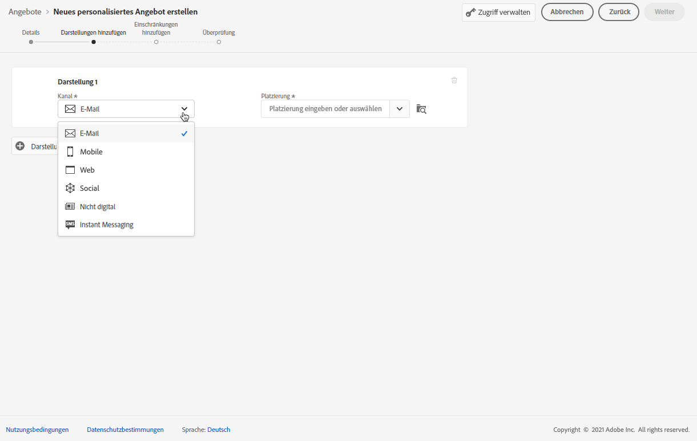

   >[!NOTE]
   >
   >Nur die verfügbaren Platzierungen für den ausgewählten Kanal werden in der Dropdown-Liste **[!UICONTROL Platzierung]** angezeigt.

1. Wählen Sie eine Platzierung aus der Liste aus.

   Sie können auch den Button neben der Dropdown-Liste **[!UICONTROL Platzierung]** verwenden, um alle Platzierungen zu durchsuchen.

   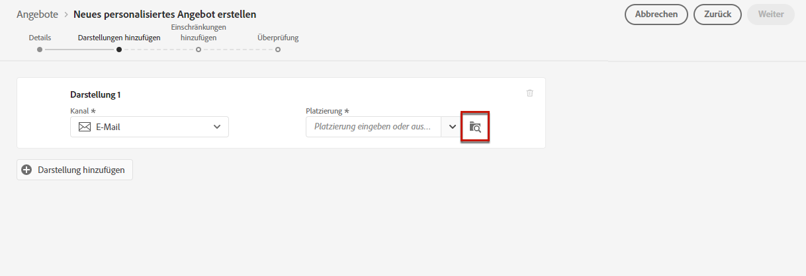

   Dort können Sie die Platzierungen nach Kanal und/oder Content-Typ filtern. Wählen Sie eine Platzierung aus und klicken Sie auf **[!UICONTROL Auswahl]**.

   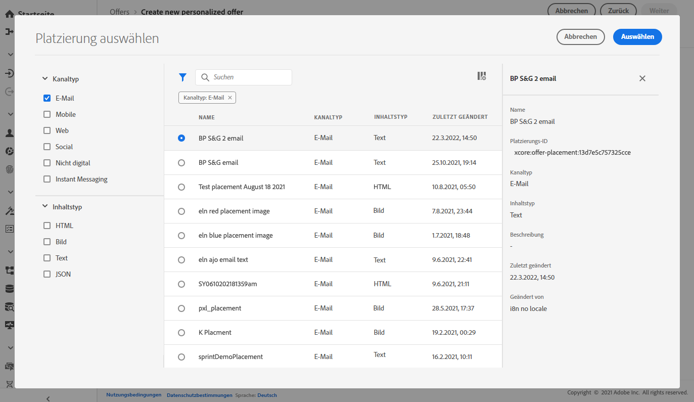

1. Fügen Sie für Ihre Darstellung Inhalte hinzu. Mehr dazu erfahren Sie in [diesem Abschnitt](#content).

1. Wenn Sie Inhalte wie ein Bild oder eine URL hinzufügen, können Sie einen **[!UICONTROL Ziel-Link]** angeben: Die Benutzer, die auf das Angebot klicken, werden zur entsprechenden Seite weitergeleitet.

   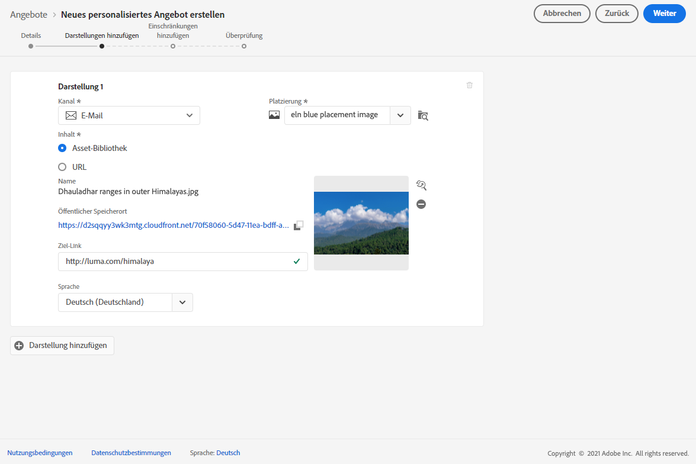

1. Wählen Sie abschließend eine Sprache, um zu bestimmen, welche Inhalte den Benutzern angezeigt werden sollen.

1. Um eine weitere Darstellung hinzuzufügen, verwenden Sie die Schaltfläche **[!UICONTROL Darstellung hinzufügen]** und fügen Sie beliebig viele Darstellungen hinzu.

   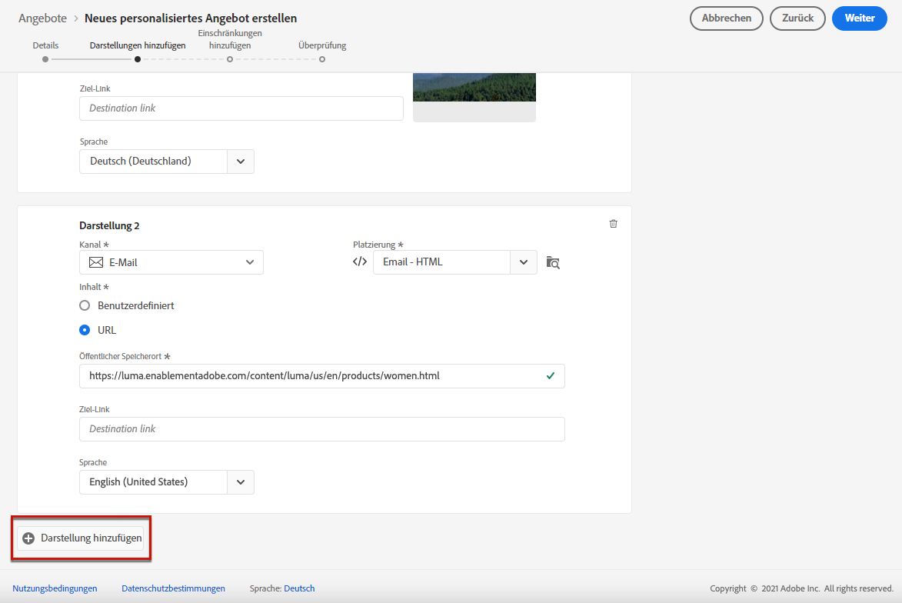

1. Nachdem Sie alle Darstellungen hinzugefügt haben, klicken Sie auf **[!UICONTROL Weiter]**.

## Inhalte für Ihre Darstellungen definieren {#content}

Sie können einer Darstellung verschiedene Inhaltstypen hinzufügen.

>[!NOTE]
>
>Es sind nur Inhalte verfügbar, die dem Content-Typ der Platzierung entsprechen.

### Bilder hinzufügen {#images}

Wenn es sich bei der ausgewählten Platzierung um einen Bildtyp handelt, können Sie Inhalte aus der **Adobe Experience Cloud Assets**-Bibliothek hinzufügen, einem zentralen Repository mit Assets, das von [!DNL Adobe Experience Manager Assets Essentials] bereitgestellt wird.

>[!NOTE]
>
> So arbeiten Sie mit [Adobe Experience Manager Assets Essentials](https://experienceleague.adobe.com/docs/experience-manager-assets-essentials/help/introduction.html?lang=de){target="_blank"}, you need to deploy [!DNL Assets Essentials] for your organization and make sure that users are a part of the **Assets Essentials Consumer Users** or/and **Assets Essentials Users** Product profiles. Learn more on [this page](https://experienceleague.adobe.com/docs/experience-manager-assets-essentials/help/get-started-admins/deploy-administer.html?lang=de){target="_blank"}.

1. Wählen Sie die Option **[!UICONTROL Assets-Bibliothek]** aus.

1. Klicken Sie auf **[!UICONTROL Durchsuchen]**.

   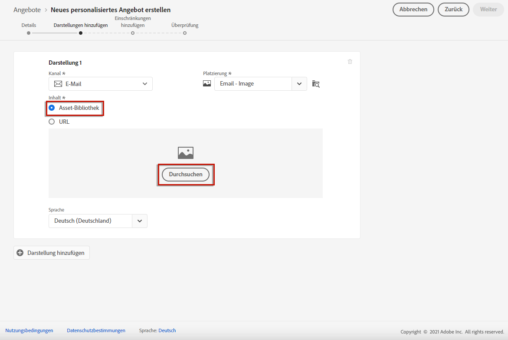

1. Durchsuchen Sie die Assets, um das Bild Ihrer Wahl auszuwählen.

1. Klicken Sie auf **[!UICONTROL Auswählen]**.

   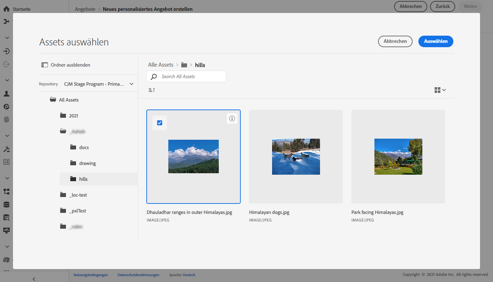

### Hinzufügen von HTML- oder JSON-Dateien {#html-json}

Wenn die ausgewählte Platzierung vom Typ HTML ist, können Sie auch HTML- oder JSON-Inhalte aus der [Adobe Experience Cloud Asset-Bibliothek](https://experienceleague.adobe.com/docs/experience-manager-assets-essentials/help/introduction.html?lang=de){target="_blank"}) hinzufügen.

Sie haben zum Beispiel eine HTML-E-Mail-Vorlage in [Adobe Experience Manager](https://experienceleague.adobe.com/docs/experience-manager.html?lang=de){target="_blank"} erstellt und möchten diese Datei für den Inhalt Ihres Angebots verwenden. Anstatt eine neue Datei zu erstellen, können Sie die Vorlage einfach in die **Asset-Bibliothek** hochladen, um sie für unterschiedliche Darstellungsvarianten Ihres Angebots wiederverwenden zu können.

Um Ihre Inhalte in einer Darstellung wiederzuverwenden, gehen Sie zur **Asset-Bibliothek**, wie in [diesem Abschnitt](#images) beschrieben, und wählen Sie die gewünschte HTML- oder JSON-Datei aus.

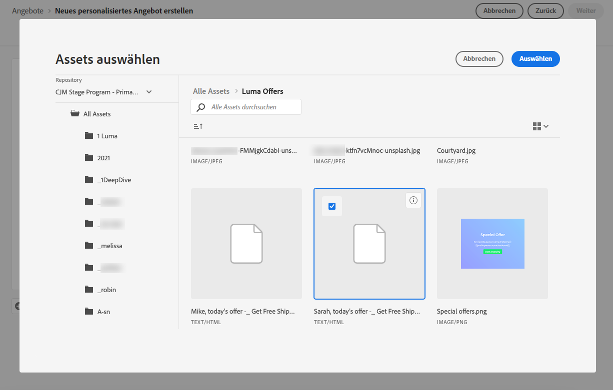

### URLs hinzufügen {#urls}

Um Inhalte von einem externen öffentlichen Speicherort hinzuzufügen, klicken Sie auf **[!UICONTROL URL]** und geben Sie dann die URL-Adresse des hinzuzufügenden Inhalts ein.

Sie können URLs mit dem Ausdruckseditor personalisieren. Erfahren Sie mehr zur [Personalisierung](../../personalization/personalize.md#use-expression-editor).

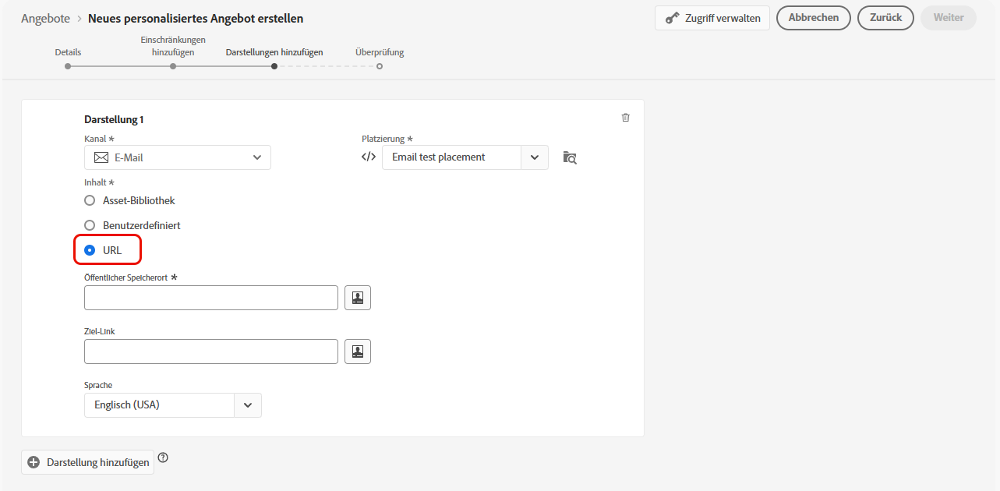

Sie möchten zum Beispiel das Bild, das als Angebot angezeigt wird, personalisieren. Sie möchten, dass Benutzende, die einen Stadturlaub bevorzugen, die Skyline von New York sehen und Benutzende, die einen Strandurlaub bevorzugen, die Nordküste von Hawaii sehen.

Verwenden Sie den Ausdruckseditor unter Verwendung von Vereinigungsschemata, um Profilattribute abzurufen, die in Adobe Experience Platform gespeichert sind. [Weitere Informationen](https://experienceleague.adobe.com/docs/experience-platform/profile/union-schemas/union-schemas-overview.html?lang=de){target="_blank"}

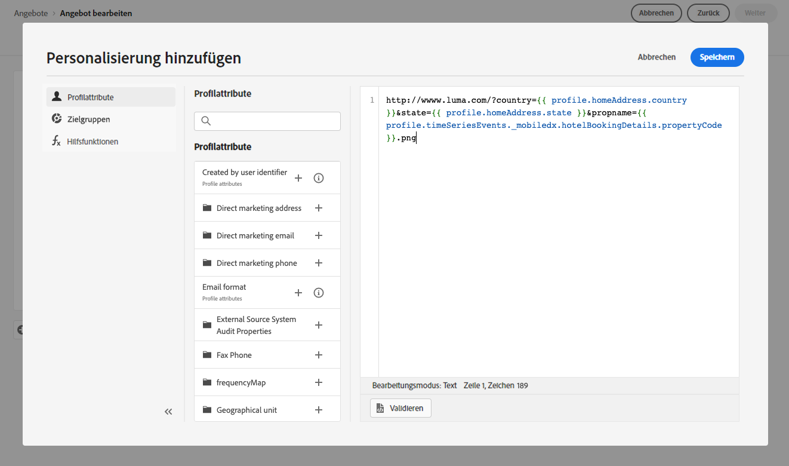

Wenn Sie einen **[!UICONTROL Ziel-Link]** angeben, können Sie auch die URL personalisieren, zu der die Benutzenden, die auf das Angebot klicken, geleitet werden.

### Hinzufügen von benutzerdefiniertem Text {#custom-text}

Sie können auch Textinhalte einfügen, wenn Sie eine kompatible Platzierung auswählen.

1. Wählen Sie die Option **[!UICONTROL Benutzerdefiniert]** aus und klicken Sie auf **[!UICONTROL Inhalt hinzufügen]**.

   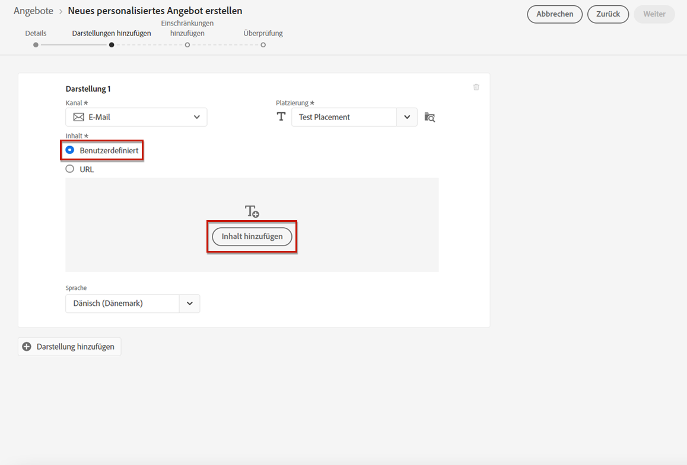

   >[!NOTE]
   >
   >Bei Platzierungen vom Typ „Bild“ ist diese Option nicht verfügbar.

1. Geben Sie den Text ein, der im Angebot angezeigt werden soll.

   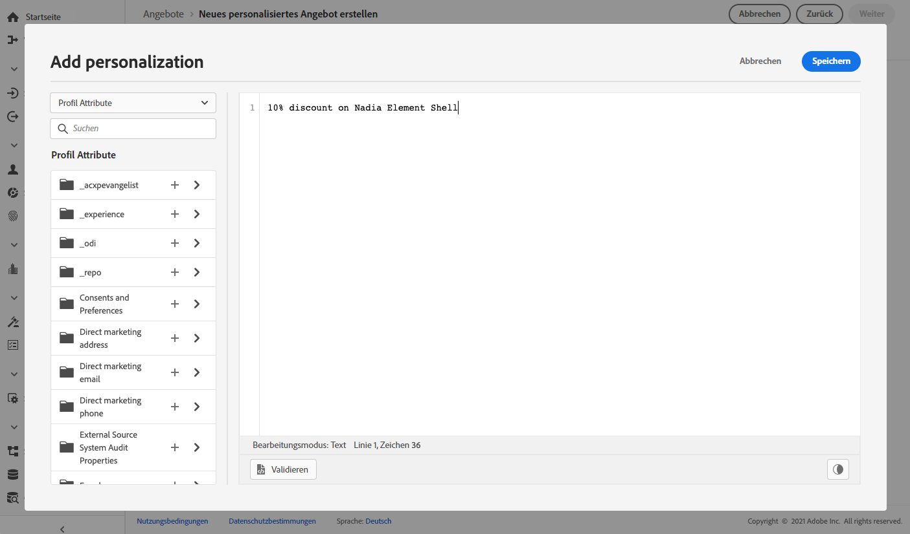

   Sie können Ihre Inhalte mit dem Ausdruckseditor personalisieren. Erfahren Sie mehr zur [Personalisierung](../../personalization/personalize.md#use-expression-editor).

   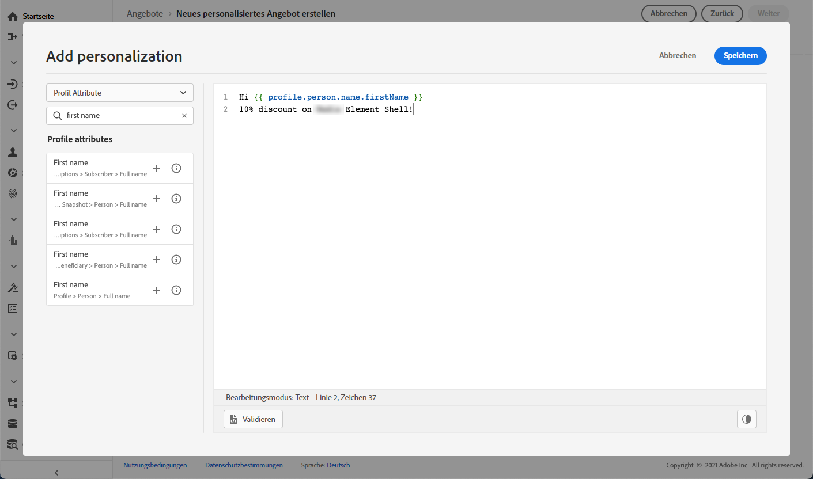

   >[!NOTE]
   >
   >Nur die Quellen **[!UICONTROL Profilattribute]**, **[!UICONTROL Zielgruppen]** und **[!UICONTROL Helper-Funktionen]** sind für das Entscheidungs-Management verfügbar.

